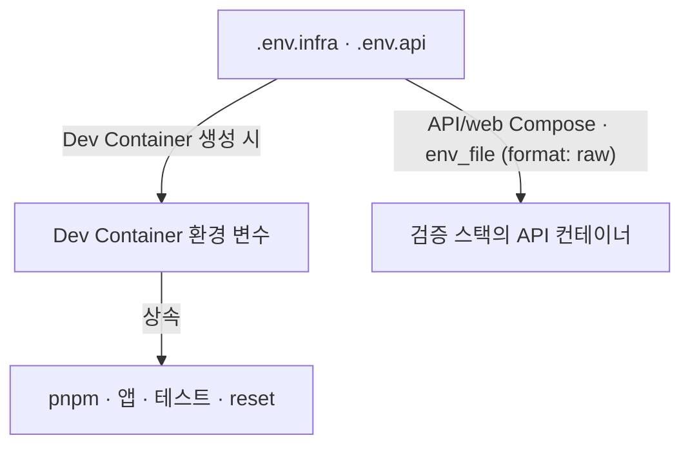
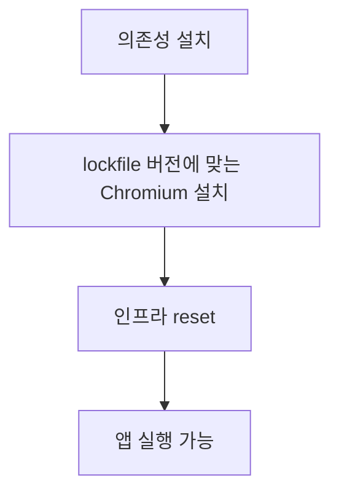

# .devcontainer/ — 개발 환경

앱·테스트·실행 도구가 같은 인프라 구성을 사용하도록 Dev Container만 공식 개발 환경으로 지원한다. 개발자마다 MongoDB Replica Set·Redis Cluster·S3·NATS·Restate의 버전과 설정이 달라지는 것을 막기 위해서다. Redis Cluster의 다중 키 제한처럼 standalone에서는 드러나지 않는 제약도 개발 중 확인한다.

Node는 네이티브 Temporal을 사용하는 26 계열을 유지한다. TypeScript 버전은 사용처별로 고정한다. legacy compiler API에 의존하는 앱·도구까지 일괄적으로 같은 major 버전으로 올리지 않기 위해서다.

## 1. 환경 변수 파일 변경 후 Dev Container 재생성

루트 [.env.infra](../.env.infra)에는 인프라 접속 정보·이미지·포트·개발 관리자 계정을, [.env.api](../.env.api)에는 인증·HTTP·업무 설정을 둔다.



루트 `.env.infra`나 `.env.api`를 수정한 뒤에는 VS Code의 **`Rebuild Container`로 Dev Container를 다시 만든다.** 환경 변수는 컨테이너를 만들 때 전달되므로 앱이나 컨테이너를 재시작하는 것만으로는 변경한 값이 반영되지 않는다. API와 reset·API 테스트 실행기는 루트 env 파일을 다시 읽지 않는다. API는 전달받은 환경 변수를 검증한다.

두 env 파일의 값은 변수 치환이나 따옴표 제거 없이 전달된다. `$`와 따옴표도 값에 포함되므로, 셸 명령을 쓸 때처럼 다른 변수를 참조하거나 값을 따옴표로 감싸지 않는다.

```dotenv
# 의도한 최종 값을 적는다.
API_URL=http://api:3000
PASSWORD=secret
```

`API_URL=http://${API_HOST}:3000`은 변수를 치환하지 않으며 `PASSWORD="secret"`은 따옴표까지 전달한다. Compose YAML의 `${...}` 변수 치환은 이 파일 전달 방식과 별개다. 두 프론트엔드의 `.env`는 Next.js가 읽고, `apps/api/api-docs/.env`는 문서 실행기가 읽는 셸 설정이다.

공통 env 파일에는 `NODE_ENV`를 고정하지 않는다. 개발 실행 명령·검증 스택·Next.js·Vitest가 각 실행 모드에 맞게 정한다.

`WORKSPACE_ROOT`는 저장소의 절대경로다. `COMPOSE_PROJECT_NAME`은 Docker 프로젝트 이름이며, `DEVCONTAINER_NETWORK`는 여러 Compose 프로젝트가 공유하는 네트워크 이름이다.

## 2. 호스트와 Dev Container에서 같은 경로 사용

컨테이너의 Docker CLI는 호스트의 Docker 소켓을 사용한다. bind mount할 경로를 찾는 쪽도 호스트이므로 workspace는 호스트와 Dev Container에서 **같은 절대경로**여야 한다.

```text
호스트 /home/me/project ↔ 컨테이너 /home/me/project       가능
호스트 /home/me/project ↔ 컨테이너 /workspaces/project   불가
```

두 번째 구성에서 Compose가 `/workspaces/project`를 마운트 경로로 넘기면 호스트 Docker도 호스트의 그 경로를 찾는다. 따라서 VS Code Remote SSH로 호스트 폴더를 연 뒤 `Reopen in Container`를 사용하는 방식만 지원한다. `Clone Repository in Container Volume`은 지원하지 않는다.

호스트의 `initializeCommand`가 네트워크를 먼저 만들고 Dev Container와 Compose가 이를 공유한다. 같은 사용자가 이름이 같은 저장소 폴더를 동시에 열면 컨테이너·네트워크 이름이 충돌하므로 폴더 이름을 다르게 둔다.

## 3. 시작 순서와 데이터 초기화

Dev Container는 다음 순서로 준비한다. [인프라 reset](../infra/README.md#2-인프라-시작과-데이터-초기화)까지 성공한 뒤 앱을 실행한다.



workspace를 bind mount하면 이미지의 같은 경로가 가려지므로 프로젝트 의존성은 이미지에 미리 설치하지 않는다.

브라우저 실행에 필요한 OS 패키지는 이미지 빌드에서 설치한다. Playwright 버전을 변경하면 Dev Container도 다시 빌드해 Chromium과 OS 패키지 버전을 맞춘다.

**`postStartCommand`는 Dev Container를 시작할 때마다 개발 데이터를 초기화한다.** DB·S3 객체뿐 아니라 Restate journal과 JetStream 기록도 지운다. 보존할 데이터나 진행 중인 작업이 있는 환경에는 이 시작 절차를 적용하지 않는다.

자동 포트 전달은 꺼져 있다. 브라우저에서 console·user-app을 열 때는 VS Code 포트 패널에서 프론트엔드 포트를 전달한다.

## 4. 호스트 파일과 Docker 소켓 공유

Codex의 세션·인덱스·SQLite 상태는 프로젝트별 홈에 두고 설정·인증·스킬만 호스트의 공용 홈에 있는 파일과 디렉터리로 링크한다. 설정·인증 파일은 저장할 때 교체되므로 개별 파일 대신 디렉터리를 마운트한다. 이 구성은 프로젝트별 상태를 나누며, 파일 접근을 차단하는 샌드박스는 아니다.

호스트의 Docker 소켓과 개발 도구 자격증명을 마운트하므로, 신뢰하지 않는 코드를 실행하기 전에는 `.devcontainer/`와 설치 스크립트·워크플로·셸 스크립트의 변경을 확인한다. 의존성 설치 스크립트의 허용 목록은 [pnpm-workspace.yaml](../pnpm-workspace.yaml)에서 관리한다. 의존성을 갱신할 때는 스크립트 내용과 lockfile의 integrity 값을 확인하고, 현재 OS에서 실행되지 않는다는 이유만으로 다른 OS용 항목을 지우지 않는다.
