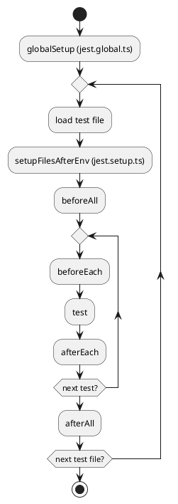

# 초보 개발자 온보딩 가이드

## 이 문서의 목적과 읽는 방법

이 문서는 NestJS가 익숙하지 않은 개발자가 이 저장소를 열었을 때 빠르게 길을 찾도록 돕기 위한 안내서입니다.
README가 "어떻게 실행하는가"에 집중했다면, 이 문서는 "왜 이렇게 구성되어 있는가"를 설명합니다.

- 먼저 `프로젝트 한눈에 보기`와 `레이어 구조 이해하기`를 읽으면 전체 구조가 잡힙니다.
- `.github`, `.husky`, `infra`, `tests`는 처음 보면 낯설 수 있어 별도 섹션에서 역할을 설명합니다.
- 명령어 예시는 복사해서 바로 실행할 수 있도록 간단하게 적었습니다.

## 프로젝트 한눈에 보기

이 프로젝트는 NestJS 11 기반의 모노레포입니다. 아래 4개 앱이 하나의 저장소에서 함께 관리됩니다.

- `gateway`: REST API의 진입점(컨트롤러)
- `applications`: 사용자 시나리오/유스케이스
- `cores`: 도메인 로직
- `infrastructures`: 외부 연동 (저장소, 메시징, 파일 등)

구조는 한 방향으로만 의존합니다.

```
client → gateway → applications → cores → infrastructures
```

즉, 상위 레이어가 하위 레이어만 참조하고 역방향 참조는 하지 않습니다.

## 레이어 구조 이해하기

### gateway

- 역할: HTTP 요청을 받아 응답을 반환하는 REST API의 진입점입니다.
- 여기에 넣는 코드: 컨트롤러, 요청/응답 DTO, 간단한 라우팅 로직.
- 피해야 할 것: 도메인 규칙이나 외부 시스템 연동을 직접 구현하는 것.

### applications

- 역할: 실제 "사용자 시나리오"를 수행하는 곳입니다.
- 여기에 넣는 코드: 여러 도메인/인프라 조합, 흐름 제어, 트랜잭션 경계.
- 피해야 할 것: 단일 도메인의 규칙을 직접 구현하는 것(cores로 내려보내기).

### cores

- 역할: 핵심 도메인 규칙과 비즈니스 로직을 담당합니다.
- 여기에 넣는 코드: 도메인 규칙, 모델, 서비스, 검증 로직.
- 피해야 할 것: 프레임워크 의존적인 입출력 로직.

### infrastructures

- 역할: 외부 시스템과의 연동을 담당합니다.
- 여기에 넣는 코드: DB, 메시지 브로커, 파일 스토리지, 결제 등 외부 자원 연동.
- 피해야 할 것: 애플리케이션 흐름을 정의하는 로직.

## 디렉터리와 설정 파일 맵

### .github

GitHub Actions 설정이 들어 있습니다.

- `ci.yaml`: PR/메인 브랜치에 대해 `lint`, `test`, `test:e2e`를 실행합니다.
- `repeat-tests.yaml`: 일정 주기로 테스트를 반복 실행해 안정성을 확인합니다.
- `scripts/repeat-run.sh`: 반복 실행 유틸리티 스크립트입니다.

### .husky

Git 커밋 시 자동으로 실행되는 훅(hook) 설정입니다.

- `pre-commit`: `lint-staged` 실행 (수정된 파일만 포맷/린트).
- `commit-msg`: `commitlint` 실행 (커밋 메시지 컨벤션 검사).

커밋이 막히면 메시지 형식(예: `feat: ...`)이나 lint 오류를 먼저 확인하세요.

### .vscode

VS Code에서 쓰기 편한 디버그/테스트 구성이 있습니다.

- `launch.json`: `Debug App` 실행 시 `TARGET_APP`을 선택할 수 있습니다.
- `tasks.json`: 단위 테스트, E2E 테스트, 반복 실행을 작업으로 제공합니다.

### .devcontainer

Dev Container 설정입니다. 로컬 환경과 무관하게 동일한 개발 환경을 만들 수 있습니다.

- Node 24 기반 이미지로 구성됩니다.
- 컨테이너 시작 시 `npm ci`, `npm run infra:reset`가 실행됩니다.
- E2E 실행에 별도의 `WORKSPACE_ROOT` 설정이 필요 없습니다.

### infra

로컬 인프라( MongoDB, Redis, NATS, MinIO )를 띄우는 Docker Compose 설정입니다.

- `infra/local/compose*.yml`: 인프라 서비스 정의
- `npm run infra:reset`: 인프라를 새로 올리고 상태를 초기화

`.env.infra`에 이미지 태그가 정의되어 있어 버전을 쉽게 바꿀 수 있습니다.

### tests

E2E 및 반복 실행 스크립트가 있습니다.

- `tests/e2e`: Bash 기반 E2E 스위트 (curl/jq 사용)
- `.github/scripts/repeat-run.sh`: 테스트 반복 실행 유틸리티

단위/통합 테스트는 `src/**/__tests__` 아래에 있으며 `npm test`로 실행됩니다.

### src

실제 애플리케이션 코드가 있는 곳입니다.

- `src/apps`: gateway/applications/cores/infrastructures/공용(shared)
- 각 앱은 `development.ts`, `production.ts`, `main.ts`로 실행 진입점을 분리합니다.

### libs

여러 앱에서 공통으로 쓰는 코드가 있습니다.

- `libs/common`: 공용 유틸/로거/헬스체크 등
- `libs/testlib`: 테스트 지원 코드

### \_output

빌드 산출물과 로그, 커버리지 결과가 쌓이는 폴더입니다.

- 예: `_output/dist`, `_output/coverage`, `_output/logs`
- 필요 시 삭제해도 되며, 실행 시 다시 생성됩니다.

## 실행과 디버깅 흐름

### 로컬 인프라 구동

인프라부터 올립니다.

```sh
npm run infra:reset
```

### 애플리케이션 구동

전체 앱을 도커로 실행합니다.

```sh
npm run apps:reset
```

혹은 특정 서비스만 빌드/실행할 수도 있습니다.

```sh
TARGET_APP=gateway npm run build
TARGET_APP=gateway npm run start
```

### 단일 서비스 디버깅

핫 리로드 디버깅은 다음과 같습니다.

```sh
TARGET_APP=gateway npm run debug
```

VS Code의 `Debug App` 구성을 사용하면 드롭다운으로 앱을 선택할 수 있습니다.

## 환경 변수와 런타임 설정

### .env

모든 앱이 공통으로 사용하는 런타임 설정입니다.
예: 포트, DB/NATS/MinIO 접속 정보, 로그 설정 등.

`host.docker.internal`을 기본값으로 사용하므로, 환경에 따라 IP를 바꿔야 할 수 있습니다.

### .env.infra

로컬 인프라 및 Testcontainers 이미지 태그를 정의합니다.

### TARGET_APP

어떤 앱을 실행할지 지정하는 변수입니다.
`gateway`, `applications`, `cores`, `infrastructures` 중 하나를 사용합니다.

### HTTP_PORT

E2E 호출 대상 포트를 지정합니다.
`npm run test:e2e` 실행 시 루트 `.env`를 자동으로 읽으며, 값이 없으면 기본 `3000`을 사용합니다.

### TEST_ROOT

`npm test`의 범위를 제한할 때 사용합니다.

```sh
TEST_ROOT=src/apps npm test
```

## 테스트 종류와 실행 방법

### 단위/통합 테스트

Jest + Testcontainers 기반입니다. Docker가 실행 중이어야 합니다.

```sh
npm test
```

테스트 커버리지 기준이 엄격하므로 실패 시 누락된 테스트를 먼저 확인하세요.

### E2E 테스트

Bash 스크립트로 API를 호출해 시나리오를 검증합니다.

```sh
npm run test:e2e
bash tests/e2e/run.sh
```

- `test:e2e`: 인프라/앱 reset + 스펙 실행을 수행하고, 스펙이 성공하면 앱을 down합니다.
- 스펙이 실패하면 앱 컨테이너를 유지하므로 로그 확인 후 `npm run apps:down`으로 정리합니다.
- `bash tests/e2e/run.sh`: 이미 실행 중인 HOST에 스펙만 실행합니다.
- `tests/e2e/run.sh`는 스펙 실행만 담당합니다.

### 테스트 반복 실행

불안정한 테스트를 잡기 위해 여러 번 반복 실행할 수 있습니다.

- 로컬: `bash .github/scripts/repeat-run.sh 100 npm test`
- VS Code: `Repeat Tests` 작업
- CI: `.github/workflows/repeat-tests.yaml`

## Jest 설정 자세히 보기

이 프로젝트는 Jest 설정을 여러 파일로 나눠서 관리합니다.

- `jest.config.ts`: Jest의 핵심 설정
- `jest.global.ts`: 테스트 실행 전 1회 수행되는 전역 준비 작업
- `jest.setup.ts`: 각 테스트 파일에서 실행되는 훅(before/after)
- `jest.utils.ts`: 공통 유틸리티 및 환경 변수 로더

### jest.config.ts

중요 포인트만 정리하면 다음과 같습니다.

- `globalSetup`: `jest.global.ts`가 먼저 실행됩니다.
- `setupFilesAfterEnv`: `jest.setup.ts`가 각 테스트 파일에서 실행됩니다.
- `testRegex`: `__tests__/.*\\.spec\\.(ts|js)` 형식만 테스트로 인식합니다.
- `resetModules`, `resetMocks`, `restoreMocks`: 테스트 간 상태가 섞이지 않도록 모듈/목/스파이를 정리합니다.
- `coverageThreshold`: 전역 커버리지 100%를 요구합니다.
- `coverageDirectory`: 결과는 `_output/coverage`에 저장됩니다.
- `coveragePathIgnorePatterns`: 엔트리 파일, 모듈 선언 파일 등은 커버리지에서 제외됩니다.
- `testTimeout`: 기본 60초입니다.
- `transformIgnorePatterns`: 현재 기본값을 사용하며, 설정 파일에는 ESM 대응 예시만 주석으로 남겨둡니다.

참고: `npm test`는 `TEST_ROOT`에 따라 `--roots`와 `--collectCoverageFrom`을 좁힙니다.  
즉, 일부만 실행해도 해당 범위에서 100% 커버리지가 요구됩니다.

### jest.global.ts (globalSetup)

테스트 런 전체에서 한 번만 실행됩니다.

- Testcontainers로 `NATS`, `MongoDB`, `Redis`, `MinIO`를 띄웁니다.
- 테스트가 사용할 접속 정보를 환경 변수로 저장합니다.
    - `TESTLIB_NATS_OPTIONS`, `TESTLIB_MONGO_URI`, `TESTLIB_REDIS_URL`, `TESTLIB_S3_ENDPOINT` 등
- `LOG_DIRECTORY`를 생성해 로그를 받을 준비를 합니다.
- MongoDB는 `directConnection=true`로 접속하여 DNS 관련 오류를 피합니다.

### jest.setup.ts (setupFilesAfterEnv)

각 테스트 파일에서 실행되며, 공통 훅을 등록합니다.

- `beforeAll`: Mongo/S3 클라이언트를 준비합니다.
- `beforeEach`: 테스트마다 고유한 `TEST_ID`를 생성하고 DB/버킷 이름을 분리합니다.
- `afterEach`: 생성한 테스트 DB를 정리합니다.
- `afterAll`: 모든 클라이언트를 종료합니다.

이 구조 덕분에 **테스트 간 데이터 충돌을 최소화**합니다.

### jest.utils.ts

테스트가 공통으로 쓰는 환경/유틸 기능입니다.

- `.env`, `.env.infra`를 로드하고 `NODE_ENV=test`로 고정합니다.
- `getEnv`: 값이 없으면 즉시 오류를 발생시켜 설정 누락을 빠르게 감지합니다.
- `setEnv`: 테스트에서 환경 변수를 조정할 때 사용합니다.
- `generateTestId`: 짧은 랜덤 테스트 ID 생성.

### 중요한 동작 방식과 주의사항

- **`resetModules: true`**  
  Jest는 각 테스트 후에 모듈 캐시를 비웁니다.  
  하지만 테스트 파일 상단의 정적 import는 재실행되지 않기 때문에,  
  **환경 변수 기반 초기화를 테스트하려면 동적 import를 사용**하는 것이 안전합니다.

- **`resetMocks` + `restoreMocks`**  
  `jest.spyOn`이나 `jest.fn()`을 사용했다면 각 테스트마다 다시 설정해야 합니다.

- **테스트마다 DB/버킷이 분리됨**  
  테스트에서 DB나 S3를 사용할 때는 반드시 `process.env`의 값을 사용하세요.

### 예제: 환경 변수 기반 로직 테스트

잘못된 예시 (정적 import로 값이 고정됨):

```ts
import { buildConfig } from 'apps/shared/config/build-config'

it('uses new flag', () => {
    process.env.FEATURE_FLAG = 'true'
    expect(buildConfig().featureFlag).toBe(true)
})
```

올바른 예시 (동적 import로 재평가):

```ts
it('uses new flag', async () => {
    process.env.FEATURE_FLAG = 'true'
    const { buildConfig } = await import('apps/shared/config/build-config')
    expect(buildConfig().featureFlag).toBe(true)
})
```

필요하다면 테스트 안에서 `jest.resetModules()`를 호출하는 방법도 있습니다.

### Jest 실행 흐름 (PlantUML)



## 자주 쓰는 스크립트 요약

- `npm ci`: 의존성 설치
- `npm run infra:reset`: 로컬 인프라 리셋
- `npm run apps:reset`: 앱 전체 리셋
- `TARGET_APP=... npm run debug`: 단일 앱 디버깅
- `npm test`: 단위/통합 테스트
- `npm run test:e2e`: E2E 테스트
- `npm run lint`: 타입 체크 + ESLint
- `npm run format`: ESLint 자동 수정

## 초보자가 자주 겪는 문제와 해결 팁

- Docker가 안 떠요: Docker Desktop(또는 daemon)이 실행 중인지 확인하세요.
- `host.docker.internal` 접속 실패: 로컬 네트워크 환경에 맞게 `.env`의 호스트 값을 수정하세요.
- E2E 실패 (포트 불일치): `.env`의 `HTTP_PORT`와 앱 포트가 같은지 확인하세요.
- 커밋이 막혀요: `pre-commit`(lint) 또는 `commit-msg`(커밋 메시지 형식) 실패일 수 있습니다.
- 테스트가 너무 느려요: `npm test -- --runInBand`로 단일 스레드 실행을 시도하세요.

## 다음에 읽으면 좋은 문서

- `README.md`: 빠른 시작과 기본 실행 가이드
- `SECURITY.md`: 보안 관련 정책
- `AGENTS.md`: 레포지토리 규칙과 실행 규약
