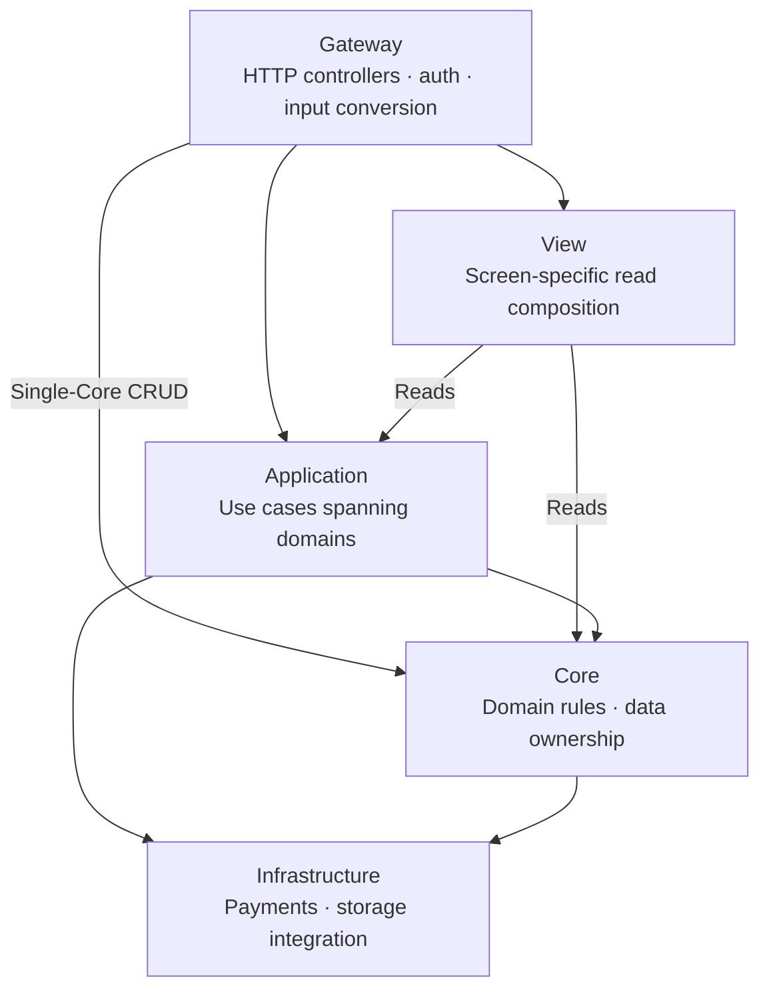

# nest-seed

[한국어](README.md)

[](https://github.com/mannercode/nest-seed/actions/workflows/test-atoz.yaml)
[](https://github.com/mannercode/nest-seed/actions/workflows/test-stability.yaml)
[](https://github.com/mannercode/nest-seed/actions/workflows/test-api-race.yaml)

_This is a translation of [README.md](README.md). The Korean original is authoritative._

A NestJS monorepo used as the starting point for production projects. Follow a familiar movie-booking flow to read and run examples of module boundaries, contention across replicas, duplicate requests, partial failure, and recovery. `apps/api` is the main application; `console` and `user-app` are minimal Next.js integration demos.

- **Module boundaries** — SoLA (Service-oriented Layered Architecture) composes peer modules in a higher layer to prevent cycles. Gateway calls Core directly for CRUD within one domain.
- **Distributed execution and recovery** — multiple replicas of the same API handle seat contention and duplicate requests. Purchases and showtime creation resume interrupted work through Restate workflows.
- **Verification against real infrastructure** — integration tests, race tests across replicas, and executable API docs use the Dev Container's real infrastructure. The 100% coverage gate exposes unexecuted branches.



Arrows show representative module dependency directions in SoLA. Any needed lower layer can be used directly; dependencies between distinct modules in the same layer are forbidden. View only composes reads.

See [apps](docs/apps.md) for layers and distributed boundaries and [design decisions](docs/reference/decisions.md) for reasoning and limitations.

## 1. Getting started

The Dev Container is the only supported development path. Open the repository on a Docker host through VS Code Remote SSH, then use the Dev Containers extension. The workspace must have the same absolute path on the host and inside the container ([development environment](docs/devcontainer.md#2-docker-outside-of-docker의-경로-계약)).

Starting the Dev Container resets the development infrastructure data. Run the commands below in the container terminal.

1. Open the repository in VS Code and run `Reopen in Container`. The first boot may take a while while images and development infrastructure are prepared.
2. Run `pnpm run test` for the basic checks. Use `pnpm run atoz` for the full regression, including an infrastructure reset.
3. Run `pnpm run dev`, then check the API with `curl http://localhost:3000/health`.
4. Forward `3100` and `3200` in the VS Code **Ports** panel and open the displayed addresses in your browser. Automatic port forwarding is disabled.
5. Sign in to the console (3100) with the development admin (`admin@nest-seed.local` / `DevPass1!`) and create movies and theaters. Infrastructure resets recreate this account.
6. Use the user app (3200) to explore sign-up, login, and the composed home view. The executable API docs run showtime, booking, and purchase APIs through an independent fixture flow.

`.env.api` and `.env.infra` contain committed development and verification values. Review project identifiers and credentials when forking, and inject production secrets outside the repository. After editing these files, [recreate the Dev Container](docs/devcontainer.md#1-환경-변수는-재생성해야-반영된다) to inject the new values.

Do not globally replace `nest-seed` or `mannercode` when forking. Distinguish project identifiers, author URLs, and the repositories targeted by CI. Changing the package scope also requires updating workspace manifests, dependencies, imports, aliases, and the lockfile together.

## 2. Main commands

| Command               | Purpose                                                         |
| --------------------- | --------------------------------------------------------------- |
| `pnpm run dev`        | Run the API and both frontends in watch mode                    |
| `pnpm run test`       | Run workspace unit, integration, and contract tests             |
| `pnpm run lint`       | Check types, code, formatting, shell, and documentation links   |
| `pnpm run atoz`       | Reset development infrastructure, then run the full regression  |
| `bash infra/reset.sh` | Recreate development infrastructure and the fixed admin fixture |
| `pnpm run api-docs`   | Check API docs across replicas                                  |
| `pnpm exec tunnel`    | Run Quick Tunnels for the console and user app                  |

`infra/reset.sh` deletes the volumes and then recreates the fixed admin fixture. Dev Container startup and the root `atoz` preparation step also run it. It deletes DB and S3 data, the Restate journal, and pending JetStream events, so it must not be used where data or executions need to survive. Test-specific commands and output locations are in the [Korean README](README.md#실행과-검증).

## 3. API reference

Instead of static Swagger/OpenAPI, `apps/api/api-docs/*.spec` sends real requests and serves as the HTTP contract for representative success and failure paths. This prevents documentation from silently drifting away from behavior.

```bash
bash apps/api/api-docs/run.sh
bash apps/api/api-docs/run.sh showtime-creation.spec
```

Each `TEST` detail log records the actual response body. The spec itself shows the request, while preparation-only `SETUP` calls are not documentation entries. Long-lived SSE and infrastructure failure paths are covered by integration tests. See [Executable API docs](docs/apps.md#통합-테스트와-실행-가능한-api-문서) for the detailed conventions.

## 4. Project structure

```text
.
├── apps/
│   ├── api/             # NestJS API
│   ├── console/         # Admin-facing Next.js application
│   └── user-app/        # User-facing Next.js application
├── libs/
│   ├── common/          # Shared runtime code used by applications
│   └── testing/         # Client and fixture helpers for test consumers
├── tests/
│   ├── api/             # Shared multi-replica stack, race, and benchmark
│   └── web/             # Browser E2E
├── infra/               # Development MongoDB, Redis, S3, NATS, Restate, and their tests
│   └── tests/           # Infrastructure recovery and consistency guarantees
├── tools/               # Development and test orchestration tools
└── docs/                # Human-oriented design and operations documentation
```

## 5. Technology choices

| Role                                     | Choice                                                 |
| ---------------------------------------- | ------------------------------------------------------ |
| API and frontends                        | NestJS, Next.js, Zod                                   |
| Primary data and atomicity               | MongoDB Replica Set, official Node.js driver           |
| Contention, messaging, durable execution | Redis Cluster, NATS/JetStream, Restate                 |
| Object storage                           | AWS SDK with the S3-compatible VersityGW               |
| Verification                             | Vitest, Testcontainers, Playwright, k6, Docker Compose |

These tools own different failure boundaries; they are not included merely as a technology showcase. [Design decisions](docs/reference/decisions.md) explains why this combination was chosen and why Kafka, BullMQ, Swagger, Nx, and others were not.

## 6. Domain tour

Start with the simple CRUD in `core/theaters`, then read the Core composition in `application/booking`, followed by the durable workflow in `application/showtime-creation`. Read each implementation beside its integration test of the same name.

| Area                                  | Concept demonstrated                                                                     |
| ------------------------------------- | ---------------------------------------------------------------------------------------- |
| `core/movies`, `core/theaters`        | Basic domain structure, publish state, file association                                  |
| `core/users`, `core/admins`           | Role-specific auth, token rotation, soft delete and unique indexes                       |
| `core/tickets`, `core/ticket-holding` | Atomic state transitions and Redis Lua seat holds                                        |
| `application/booking`                 | A user journey composed from several Core services                                       |
| `application/showtime-creation`       | 202, Restate workflow, status/SSE, transactions and CAS                                  |
| `application/purchase`                | Synchronous responses, Restate recovery and compensation, idempotent payments, JetStream |
| `application/recommendation`          | Watch-history recommendations and pure domain logic                                      |
| `view/user-app/home`                  | Screen-specific read-model composition                                                   |
| `infrastructure/assets`, `payments`   | S3 integration and payment creation/cancellation boundaries                              |

Payments are an example implementation that records payment state in MongoDB without calling an external payment provider. It verifies purchase idempotency and compensation flows; real provider communication is not included.

## 7. Authorization

**admin** manages content and operations targeting arbitrary users, while **user** operates on its own resources. See the [authorization rules](docs/apps.md#http와-인증-계약) for token and `/me` boundaries.

## 8. Production scope

`tests/api/compose.yml` exercises distributed behavior; it is not a production deployment. It does not provide TLS, secret management, backup/restore, an observability backend, a frontend edge, or zero-downtime revision rollout. Before production use, review the [BFF IP trust boundary](docs/apps.md#데모와-bff) and [Restate revision transition requirements](docs/reference/decisions.md#배포-revision).

## 9. Documentation

Korean is the source language for documentation and comments. Only this README is translated.

Each `docs/*.md` guide corresponds to a repository directory and explains its responsibilities and guarantees. Shared development conventions and design rationale belong in `docs/reference/`.

- [apps](docs/apps.md) — SoLA layers, distributed guarantees, API and test conventions
- [libs](docs/libs.md) — boundary between runtime shared code and test helpers
- [tests](docs/tests.md) — API test stack, scope and limits of external verification
- [infra](docs/infra.md) — development topology and the destructive reset boundary
- [tools](docs/tools.md) — test bootstrap, development commands, and container tools
- [devcontainer](docs/devcontainer.md) — the single development path, DooD constraints, and security
- [decisions](docs/reference/decisions.md) — choices, alternatives, and non-guarantees
- [development rules](docs/reference/conventions.md) — naming, DTOs, types, ESM, errors, and test-writing conventions

[Tasks and work plans](_todo/README.md) belong in `_todo/`. `docs/` contains project guides only; [historical guides](_todo/docsold/backup/README.md) are archived separately from the current development instructions.

For the design background of the movie-booking domain, see the blog series [Backend Service Analysis and Design 1](https://mannercode.com/2025/04/01/backend-design-1.html), [2](https://mannercode.com/2025/05/01/backend-design-2.html), and [3](https://mannercode.com/2025/06/01/backend-design-3.html).
