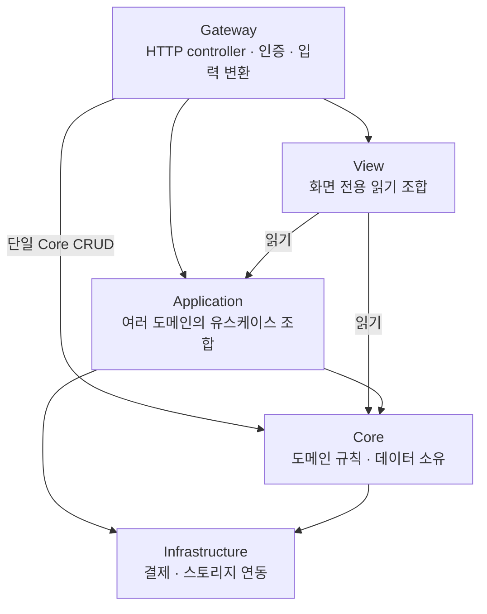

# nest-seed

[English](README.en.md)

[](https://github.com/mannercode/nest-seed/actions/workflows/test-atoz.yaml)
[](https://github.com/mannercode/nest-seed/actions/workflows/test-stability.yaml)
[](https://github.com/mannercode/nest-seed/actions/workflows/test-api-race.yaml)

실무 프로젝트의 출발점으로 사용하는 NestJS 모노레포다. 영화 예매라는 익숙한 흐름을 따라 모듈 경계부터 다중 복제본의 경합, 중복 요청, 부분 실패와 복구까지 읽고 실행할 수 있다. `apps/api`가 본체이고 `console`과 `user-app`은 Next.js 연결을 보여 주는 최소 데모다.

- **모듈 경계** — SoLA(Service-oriented Layered Architecture)는 같은 계층의 협력을 상위에서 조합해 순환 참조를 막는다. 단일 도메인의 CRUD는 Gateway가 Core를 직접 호출한다.
- **분산 실행과 복구** — 같은 API의 여러 복제본이 좌석 경쟁과 중복 요청을 처리한다. 구매의 상태 머신·lease 재조정과 상영 생성의 Restate workflow를 비교할 수 있다.
- **실제 환경에서 검증** — Dev Container의 실제 인프라를 사용해 통합 테스트·다중 복제본 race·실행 가능한 API 문서를 검증한다. 커버리지 100%는 실행되지 않은 분기를 드러내는 개발 제약이다.



화살표는 SoLA의 대표적인 모듈 참조 방향이다. 필요한 하위 계층을 직접 사용할 수 있으며, 같은 계층의 서로 다른 모듈 간 참조는 금지한다. View는 읽기 조합만 맡는다.

계층과 분산 경계는 [apps 문서](docs/apps.md), 선택 이유와 한계는 [설계 결정](docs/reference/decisions.md)에 있다.

## 1. 시작하기

공식 개발 경로는 Dev Container 하나다. Docker가 있는 호스트의 저장소를 VS Code Remote SSH로 열고 Dev Containers 확장을 사용한다. workspace는 호스트와 컨테이너에서 같은 절대경로여야 한다([개발 환경](docs/devcontainer.md#2-docker-outside-of-docker의-경로-계약)).

Dev Container는 시작할 때 개발 인프라의 데이터를 초기화한다. 아래 명령은 컨테이너 터미널에서 실행한다.

1. VS Code에서 저장소를 열고 `Reopen in Container`를 실행한다. 첫 부팅은 이미지와 개발 인프라를 준비하므로 시간이 걸릴 수 있다.
2. `pnpm run test`로 기본 검증을 실행한다. 인프라 초기화를 포함한 전체 회귀는 `pnpm run atoz`로 실행한다.
3. `pnpm run dev`를 실행하고 `curl http://localhost:3000/health`로 API를 확인한다.
4. VS Code의 **포트(Ports)** 패널에서 `3100`과 `3200`을 전달하고 표시된 주소를 브라우저로 연다. 자동 포트 전달은 꺼져 있다.
5. console(3100)에 개발용 admin(`admin@nest-seed.local` / `DevPass1!`)으로 로그인해 영화와 극장을 만든다. 이 계정은 인프라 초기화 때 다시 만든다.
6. user-app(3200)에서 가입·로그인과 홈 화면 조합을 확인한다. 실행 가능한 API 문서는 독립된 fixture 흐름으로 상영·예매·구매 API를 실행한다.

`.env.api`와 `.env.infra`는 커밋된 개발·검증 값이다. 포크할 때 프로젝트 식별자와 자격증명을 검토하고, 운영 secret은 저장소 밖에서 주입한다. 파일을 수정한 뒤에는 [Dev Container를 재생성](docs/devcontainer.md#1-환경-변수는-재생성해야-반영된다)해 새 값을 주입한다.

포크할 때 `nest-seed`·`mannercode`를 일괄 치환하지 않는다. 프로젝트 식별자, 저자 URL과 CI의 대상 저장소는 구분해서 변경한다. 패키지 scope를 바꾸면 workspace manifest·의존성·import·별칭·lockfile도 함께 맞춘다.

## 2. 주요 명령

| 명령                  | 용도                                      |
| --------------------- | ----------------------------------------- |
| `pnpm run dev`        | API와 두 frontend를 watch mode로 실행     |
| `pnpm run test`       | workspace의 단위·통합·계약 테스트         |
| `pnpm run lint`       | 타입, 코드, format, shell, 문서 링크 검사 |
| `pnpm run atoz`       | 개발 인프라 초기화 후 전체 회귀           |
| `bash infra/reset.sh` | 개발 인프라와 고정 admin fixture를 재생성 |
| `pnpm run api-docs`   | 다중 복제본의 API 문서 검증               |
| `pnpm exec tunnel`    | console과 user-app Quick Tunnel 실행      |

`infra/reset.sh`는 volume을 지운 뒤 고정 admin fixture까지 다시 만드는 개발용 복구 명령이다. Dev Container 시작과 루트 `atoz`의 준비 단계도 이를 실행한다. DB·S3 데이터, Restate journal과 JetStream의 미처리 이벤트를 지우므로 보존할 데이터나 실행이 있는 환경에서는 사용하지 않는다. 테스트별 명령과 결과 위치는 [테스트 실행 안내](docs/reference/test-execution.md)에 있다.

## 3. API 레퍼런스

정적 Swagger/OpenAPI 대신 실제 요청을 보내는 `apps/api/api-docs/*.spec`를 주요 성공·실패 흐름의 HTTP 계약으로 사용한다. 이 선택은 문서와 동작이 따로 낡는 것을 막기 위한 것이다.

```bash
bash apps/api/api-docs/run.sh                   # 실행 중인 개발 API 대상
bash apps/api/api-docs/run.sh showtime-creation.spec
```

각 `TEST`의 상세 로그에는 실제 응답 본문을 기록한다. 요청은 spec 자체가 보여 주며 준비용 `SETUP`은 문서 항목에 포함하지 않는다. 장기 SSE와 인프라 장애 조건은 통합 테스트가 검증한다. 자세한 규칙은 [실행 가능한 API 문서](docs/apps.md#5-실행-가능한-api-문서)에 있다.

## 4. 프로젝트 구조

```text
.
├── apps/
│   ├── api/             # NestJS API
│   ├── console/         # 관리자용 Next.js 앱
│   └── user-app/        # 사용자용 Next.js 앱
├── libs/
│   ├── common/          # 앱이 운영 중 사용하는 공유 런타임 코드
│   └── testing/         # 테스트 소비자용 client·fixture helper
├── tests/
│   ├── api/             # 공용 다중 복제본 스택, race와 benchmark
│   └── web/             # 브라우저 E2E
├── infra/               # 개발용 MongoDB·Redis·S3·NATS·Restate와 자체 테스트
│   └── tests/           # 인프라 자체의 복구·정합성 보장
├── tools/               # 개발·테스트 실행 도구
└── docs/                # 사람이 읽을 설계·운영 문서
```

## 5. 기술 선택

| 역할                          | 선택                                                   |
| ----------------------------- | ------------------------------------------------------ |
| API·frontend                  | NestJS, Next.js, Zod                                   |
| 주 데이터와 원자성            | MongoDB Replica Set, 공식 Node.js driver               |
| 경합·메시지·durable execution | Redis Cluster, NATS/JetStream, Restate                 |
| 객체 저장                     | AWS SDK와 S3 호환 VersityGW                            |
| 검증                          | Vitest, Testcontainers, Playwright, k6, Docker Compose |

도구는 학습용 나열이 아니라 서로 다른 실패 경계를 맡는다. 왜 이 조합을 골랐고 Kafka·BullMQ·Swagger·Nx 등을 넣지 않았는지는 [설계 결정](docs/reference/decisions.md)이 설명한다.

## 6. 도메인 둘러보기

처음에는 `core/theaters`의 단순한 CRUD, `application/booking`의 Core 조합, `application/showtime-creation`의 durable workflow 순서로 읽는다. 각 구현과 같은 이름의 통합 테스트를 나란히 보면 경계가 더 잘 드러난다.

| 영역                                  | 보여 주는 개념                                        |
| ------------------------------------- | ----------------------------------------------------- |
| `core/movies`, `core/theaters`        | 기본 도메인 구조, publish 상태, 파일 연결             |
| `core/users`, `core/admins`           | 역할별 인증, token 회전, soft delete와 unique index   |
| `core/tickets`, `core/ticket-holding` | 원자 상태 전이와 Redis Lua 기반 좌석 선점             |
| `application/booking`                 | 여러 Core를 조합하는 사용자 동선                      |
| `application/showtime-creation`       | 202, Restate workflow, 상태 조회·SSE, transaction·CAS |
| `application/purchase`                | 멱등 응답, durable 상태 머신, lease 재조정, outbox    |
| `application/recommendation`          | 관람 기록 기반 추천과 순수 도메인 로직                |
| `view/user-app/home`                  | 화면에 맞춘 읽기 응답 조합                            |
| `infrastructure/assets`, `payments`   | S3 연동과 결제 생성·취소의 경계                       |

결제는 외부 PG 호출 없이 MongoDB에 결제 상태를 기록하는 예제다. 구매의 멱등성·보상 흐름을 검증하며 실제 PG 통신은 포함하지 않는다.

## 7. 인가

**admin**은 콘텐츠 관리와 임의 사용자 대상 작업을, **user**는 본인 자원 작업을 수행한다. token과 `/me`의 경계는 [인가 규칙](docs/apps.md#335-본인-자원은-me로-다룬다)을 따른다.

## 8. 운영 적용 범위

`tests/api/compose.yml`은 분산 동작을 확인하는 테스트 스택이지 운영 배포본이 아니다. TLS, secret manager, backup/restore, 관측 backend, frontend edge, 무중단 revision 전환은 포함하지 않는다. 운영에 적용할 때는 [BFF의 IP 신뢰 경계](docs/apps.md#61-bff와-클라이언트-ip-경계)와 [Restate의 revision 전환](docs/reference/decisions.md#endpoint와-revision-전환) 조건을 함께 확인한다.

## 9. 문서

문서와 주석의 원본 언어는 한국어다. 영어는 이 README만 제공한다.

`docs/*.md`는 대응하는 폴더의 역할과 보장을 설명한다. 여러 폴더가 함께 따르는 개발 규칙과 설계 선택의 근거는 `docs/reference/`에 둔다.

- [apps](docs/apps.md) — SoLA 계층, 분산 보장, API·테스트 규칙
- [libs](docs/libs.md) — 런타임 공용 코드와 테스트 helper의 분리 기준
- [tests](docs/tests.md) — API 테스트 스택, 외부 검증의 범위와 한계
- [infra](docs/infra.md) — 개발 topology와 파괴적 reset의 범위
- [tools](docs/tools.md) — 테스트 부팅, 개발 명령과 Compose 도구의 경계
- [devcontainer](docs/devcontainer.md) — 단일 개발 경로, DooD 제약과 보안
- [decisions](docs/reference/decisions.md) — 선택 이유, 대안, 보장하지 않는 것
- [개발 규칙](docs/reference/conventions.md) — 이름·DTO·타입·ESM·오류·테스트 작성 규칙

[검토 메모](docs/review/README.md)에 미결 항목과 재검토 기준을, [과거 자료](docs/backup/README.md)에 축소 전 문서·삭제 이력에서 복구한 원문·이전 검토 기록을 모아 둔다. 이 자료들은 현재 개발 지침을 대신하지 않는다.

영화 예매 도메인의 설계 배경은 블로그 연재 [백엔드 서비스 분석과 설계 1](https://mannercode.com/2025/04/01/backend-design-1.html)·[2](https://mannercode.com/2025/05/01/backend-design-2.html)·[3](https://mannercode.com/2025/06/01/backend-design-3.html)에 있다.
