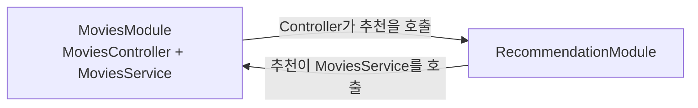

# 2026년 2월 삭제 문서 복구·검토

함수명에 전달인자를 쓰지 않는 규칙 외에도 복원할 가치가 있는 설명이 남아 있다. 우선순위는 **네이밍 원칙, 도메인 용어와 모델의 생략 범위, Controller 분리의 구체적인 이유**다. 오래된 API·도구 사용법과 설계 초안은 현재 계약으로 옮기지 않는다.

이 디렉터리는 검토용 원문 보관본이다. 현재 구현 지침은 [docs](../../docs/)가 소유한다. 아래 평가는 현재 문서와 코드를 대조한 결과이며, 실제 네이밍 변경이나 도메인 계약 변경은 포함하지 않는다.

## 1. 복구 범위와 출처

[옛 PR #77](https://github.com/mannercode/nest-seed/pull/77)에 남은 초기화 이전 이력에서 두 삭제 커밋의 직전 파일을 가져왔다. 당시 `docs/` 전체가 아니라 **이 두 커밋에서 삭제한 파일 전체**다.

| 삭제일     | 삭제 커밋                                  | 원문을 읽은 부모 커밋                      | 복구 내용                                         |
| ---------- | ------------------------------------------ | ------------------------------------------ | ------------------------------------------------- |
| 2026-02-25 | `b49aadfd578f97401a591a19a1107ce163603c01` | `29e29cba039b3c0059f43e9052afe4b371083525` | 문서 13개, 그림 2개, Kafka 예제 설정·스크립트 2개 |
| 2026-02-27 | `d91a63751cc8aea0e06057f0744d3f855ad8bd60` | `949a63b6b5deb7e446e345b325747df68693fffc` | `docs/old/`에 다시 보관됐다가 삭제된 가이드 2개   |

총 19개 파일을 원래 경로·내용·실행 권한 그대로 날짜별 디렉터리에 저장했다. [manifest.json](manifest.json)에 각 파일의 원래 경로, 출처 커밋, Git blob ID, 크기와 권한을 기록했다. 복구 파일 19개 모두 원본 blob ID와 일치한다.

2월 27일의 `implementation.guide.md`는 2월 25일 원문과 같은 blob이다. `naming-rules.md`는 표 정렬만 달라졌으며 규칙과 예시는 같다. 두 날짜의 가이드를 서로 다른 새 지침으로 세지 않는다. 원문 안의 링크·오타·옛 명령도 보존했으므로 현재 실행 방법은 이 보관본에서 찾지 않는다.

## 2. 먼저 복원할 내용

### 2.1. 조건은 함수명 대신 객체 인자로 표현한다

[naming-rules.md §1](2026-02-25/docs/ko/guides/naming-rules.md)에 명시적인 원칙과 예제가 있다.

```ts
// 원문에서 피하라고 한 형태
findTheatersForMovie(movieId)

// 원문에서 제시한 형태
findTheaters({ movieId })
```

현재 [conventions.md §1](../../docs/reference/conventions.md#1-서비스와-메서드-이름)에는 이 원칙이 없고, 이번 문서 복원에서 추가한 Repository의 `ById` 예외가 있다. 원래 원칙을 복원할 때 이 예외와 [앱 문서의 관련 설명](../../docs/apps.md#31-서비스-이름과-공개-경계)을 함께 정리해야 한다. 현재 [CrudRepository](../../libs/common/src/mongodb/crud.repository.ts)에도 `findById`·`getByIds` 등이 남아 있으므로 문구만 바꾸면 코드와 지침이 어긋난다.

권장 문안은 “함수명은 동작을 표현하고 조회 조건을 나열하지 않는다. 조건은 `find({ id })`, `find({ email })`처럼 객체 인자로 전달한다”다. 인자를 하나 받는 일반 유틸까지 모두 객체로 감싸는 규칙으로 확대하지 않는다. 원문 §2에도 `findSeed(seedId)` 같은 예제가 남아 있다. 객체 인자 사용과 MongoDB 필터의 자동 해석도 별개의 설계 문제다.

### 2.2. 서비스와 계산 클래스, 날짜와 시점을 구분하는 이름

[naming-rules.md §5~6](2026-02-25/docs/ko/guides/naming-rules.md)에는 다음 두 기준이 있다. 현재 컨벤션에는 명시되어 있지 않다.

- 필요한 데이터를 다른 서비스에서 직접 구해 작업하는 역할에는 `Service`를 붙이고, 전달받은 데이터로 계산하는 역할은 `Validator`, `Recommender`처럼 이름 짓는다. 현재 [RecommendationService](../../apps/api/src/services/application/recommendation/recommendation.service.ts)와 [MovieRecommender](../../apps/api/src/services/application/recommendation/domain/movie-recommender.ts)가 이 구분을 보여 준다. 이 사례와 목적을 컨벤션에 복원할 가치가 있다.
- `xxxDate`는 달력상의 날짜, `xxxAt`는 특정 시점을 표현한다. 현재 [Movie.releaseDate](../../apps/api/src/services/core/movies/models/movie.ts)는 `Temporal.PlainDate`다. 원문의 JavaScript `Date` 타입 예제를 그대로 옮기지 말고 현재 시간 타입에 맞춰 설명한다.

`is`·`has` 등의 긍정형 이름도 짧게 복원할 수 있다. 반면 `process/task/job`, `complete/finish`의 일반 사전식 설명은 현재 도메인에서 구분이 필요한 예시에만 붙이는 편이 낫다. 단어 목록 전체를 별도 규칙으로 늘릴 필요는 없다.

### 2.3. 도메인 용어와 일부러 생략한 모델

[glossary.md](2026-02-25/docs/glossary.md), [use-cases.md](2026-02-25/docs/ko/designs/use-cases.md), [entities.md](2026-02-25/docs/ko/designs/entities.md)는 코드 이름만으로 알기 어려운 차이를 설명한다.

| 보존할 의미                                                                  | 현재 코드·문서와의 대조                                                                                                                                                                                                                                                                                  | 넣을 곳                                |
| ---------------------------------------------------------------------------- | -------------------------------------------------------------------------------------------------------------------------------------------------------------------------------------------------------------------------------------------------------------------------------------------------------- | -------------------------------------- |
| 예매 동선 `Booking`, 구매 수행 `Purchase`, 처리 기록 `PurchaseRecord`의 구분 | 현재 이름도 이 구분을 유지한다. 다만 PurchaseRecord는 성공 영수증만이 아니라 pending·보상 상태도 저장하므로 옛 “구매 결과 기록” 정의를 보완해야 한다.                                                                                                                                                    | `reference/tutorial.md`의 도메인 설명  |
| 상영일 `Showdate`와 시작·종료 시각을 가진 회차 `Showtime`의 구분             | [BookingService](../../apps/api/src/services/application/booking/booking.service.ts)는 `showdate`를 UTC 하루 범위로 바꿔 회차를 조회한다. 일 단위 조회와 회차 엔티티를 같은 것으로 설명하지 않는다.                                                                                                      | `reference/tutorial.md`                |
| 극장 안의 여러 상영관과 좌석 등급을 예제에서 생략                            | 현재 [Theater](../../apps/api/src/services/core/theaters/models/theater.ts)에는 한 seatmap이 있고 [Seatmap](../../apps/api/src/services/core/theaters/models/seatmap.ts)에는 상영관·좌석 등급 모델이 없다. 현재 문서의 “좌석에 ID가 없다”는 설명만으로는 이 의도적인 생략을 알기 어렵다.                 | `apps.md`의 도메인 범위                |
| 티켓 판매 상태와 임시 선점은 서로 다른 상태                                  | 현재 [TicketStatus](../../apps/api/src/services/core/tickets/models/ticket.ts)는 available·sold이고 선점은 TicketHolding이 담당한다. “선점됐는데 왜 Ticket에 held가 없나”를 설명하는 원문의 주석은 유용하다.                                                                                             | `apps.md`의 예매·구매 설명             |
| 인프라 업로드 확정과 도메인 자산 연결의 구분                                 | 현재 [AssetsService](../../apps/api/src/services/infrastructure/assets/assets.service.ts)와 [MoviesService](../../apps/api/src/services/core/movies/movies.service.ts)의 역할은 구분된다. 다만 둘 다 `finalizeUpload`라는 이름을 쓰므로 옛 `attachUploadedAsset`를 현재 메서드명으로 소개해서는 안 된다. | 의미는 튜토리얼, 이름 변경은 별도 검토 |

현재 용어는 Customer가 아니라 User다. Foods, MovieDraft, 일반 환불 API 등을 옛 용어집에 있다는 이유로 구현 범위에 추가하지 않는다.

### 2.4. 서비스 호출이 단방향이어도 모듈 순환이 생기는 이유

[problems-with-feature-modules.md §1~2](2026-02-25/docs/ko/guides/problems-with-feature-modules.md)의 핵심은 단순히 “순환 참조 금지”라는 결론이 아니다. `MoviesController`와 `MoviesService`를 같은 모듈에 두면, Controller가 추천 서비스를 사용하는 순간 다음 모듈 의존이 생길 수 있다는 예시다.



서비스끼리는 Recommendation → Movies의 단방향인데, 모듈끼리는 순환한다. Controller를 Gateway로 옮기면 이 의존을 끊을 수 있다. 현재 [튜토리얼 §3](../../docs/reference/tutorial.md#3-협력하는-모듈을-배치한다)은 서비스 간 양방향 호출과 Gateway의 책임 분리는 설명하지만 이 차이를 보여 주는 예시는 없다.

이 사례를 현재 Gateway 구조에 맞게 복원할 것을 권한다. 모든 Nest Feature Module이 잘못됐다고 일반화하거나 Controller 이동만으로 MSA 전환이 끝난다고 설명하지 않는다. `forwardRef`는 프로젝트가 지키려는 의존 경계를 대신하는 설계 규칙으로 사용하지 않는다는 취지를 남긴다.

## 3. 짧은 예제로 보완할 내용

| 원문                                                                                | 유용한 내용                                                                                           | 현재 반영 상태와 제안                                                                                                                                                                                                                      |
| ----------------------------------------------------------------------------------- | ----------------------------------------------------------------------------------------------------- | ------------------------------------------------------------------------------------------------------------------------------------------------------------------------------------------------------------------------------------------ |
| [REST API 초안](2026-02-25/docs/archive/rest-api.guide.md)                          | 범용 `/movies`의 옵션에 추천·기간·그룹 조건을 계속 넣으면 조합의 의미와 변경 영향이 불명확해지는 사례 | namespace 원칙은 이미 [apps.md](../../docs/apps.md#33-rest-api-설계)에 있다. 쿼리 옵션이 충돌하는 짧은 사례만 튜토리얼에 보완한다. 옛 경로 목록은 현재 API로 복원하지 않는다.                                                              |
| [구현 가이드 §1](2026-02-25/docs/ko/guides/implementation.guide.md)                 | 독립적인 입력·출력 사례는 `it.each`로 나눠 실패한 입력을 각각 보여 준다는 목적                        | 현재 컨벤션은 테스트 문장과 결과 분리는 설명하지만 데이터 기반 사례 선택은 생략했다. 현재 Vitest의 [CrudRepository 테스트](../../libs/common/src/mongodb/__tests__/crud.repository.spec.ts)에도 쓰는 방식이므로 짧은 예시를 추가할 만하다. |
| [구매 설계의 일반화에 관한 메모](2026-02-25/docs/ko/designs/tickets-purchase.md)    | 티켓만 필요한 단계에서 여러 품목의 범용 구매 구조를 미리 만드는 비용                                  | 현재 [PurchaseItemType](../../apps/api/src/services/core/purchase-records/models/purchase-record.ts)도 Tickets만 지원한다. AGENTS의 최소 변경 원칙은 이미 있으므로, 튜토리얼에서 이 사례를 설명하는 정도가 적절하다.                       |
| [상영 생성·구매의 유스케이스 명세](2026-02-25/docs/ko/designs/showtime-creation.md) | 선행 조건·트리거·기본 흐름·대안 흐름·후행 조건으로 요구사항을 나누는 형식                             | 현재 튜토리얼에 사용자·결과 중심 접근은 남아 있다. 문서 양식을 강제하지 않고 실패 조건까지 빠뜨리지 않는 작은 예시로 보완한다.                                                                                                             |

테스트 가이드의 “모든 조건은 반드시 describe로 이동”은 현재 컨벤션의 단발 조건 예외와 맞지 않는다. 원문 내부에도 입력별 분리를 권한 뒤 여러 입력을 한 `it`에 모은 예시가 있으므로 전부 그대로 복원하지 않는다. 코드·테스트 언어는 현재 한국어 규칙을 따른다.

## 4. 이미 남아 있거나 현재 계약으로 옮기지 않을 내용

단방향 계층 참조, ID만 받는 조회·삭제의 복수형 API, 긴 검색 조건의 POST, 에러 code와 message의 역할, 타입·barrel import, 테스트와 런타임 의존성 구분, Conventional Commits는 현재 문서에 목적과 제약이 대체로 남아 있다. [설계 가이드](2026-02-25/docs/ko/guides/design.guide.md)와 [구현 가이드](2026-02-25/docs/ko/guides/implementation.guide.md)를 통째로 중복 배치할 이유는 없다.

다음 내용은 현재 계약과 다르거나 별도 확인이 필요한 설명이다.

| 원문 내용                                                                | 현재 대조 결과와 처리                                                                                                                                                                                                                                                                                                                                                    |
| ------------------------------------------------------------------------ | ------------------------------------------------------------------------------------------------------------------------------------------------------------------------------------------------------------------------------------------------------------------------------------------------------------------------------------------------------------------------ |
| `ensure`는 없으면 생성한다                                               | 현재 [common의 ensure](../../libs/common/src/utils/validator.ts)는 null·undefined이면 예외를 던지고 나머지는 그대로 반환한다. 옛 접두사 표를 현재 유틸 계약으로 복원하지 않는다.                                                                                                                                                                                         |
| 존재 조회 이름 `exists`·`existsAny`                                      | 원문 [glossary](2026-02-25/docs/glossary.md)에는 `allExist`도 등장한다. 현재 [CrudRepository](../../libs/common/src/mongodb/crud.repository.ts)는 `allExist`를 제공한다. 옛 문서끼리의 차이를 최신 확정 규칙처럼 합치지 않는다.                                                                                                                                          |
| TypeORM 데코레이터를 쓰지만 엔티티는 TypeORM에 의존하지 않는다는 설명    | 도메인 책임과 소스 의존성을 혼동하기 쉬운 문장이다. 현재는 TypeORM을 쓰지 않으며 앱·common 경계는 [libs.md](../../docs/libs.md)가 설명한다. 이 주장을 그대로 복원하지 않는다.                                                                                                                                                                                            |
| Jest resetModules·dynamic import, CommonJS·ESM 호환 설정, Webpack 진입점 | 현재는 Native ESM·Vitest·Rspack이다. 모듈 평가 시점에 env를 고정하면 안 된다는 원인은 [apps.md](../../docs/apps.md#41-테스트-자원은-소유자가-드러나야-한다)에 남아 있다. 옛 해결 코드는 이관하지 않는다.                                                                                                                                                                 |
| 10분 timeslot Set과 배치 순서로 상영 충돌 방지                           | 현재 [검증기](../../apps/api/src/services/application/showtime-creation/internal/showtime-bulk-validator.service.ts)는 실제 시간 구간의 겹침을 검사하고 [persistence](../../apps/api/src/services/application/showtime-creation/internal/showtime-creation-persistence.service.ts)는 극장 guard CAS·transaction을 사용한다. 옛 알고리즘을 현재 보장으로 소개하지 않는다. |
| Core끼리 직접 호출하거나 이벤트로 생성 완료를 이어 가는 옛 시퀀스        | 현재 SoLA 경계 및 상영·티켓·operation의 원자 생성 계약과 다르다. 설계 초안이 바뀐 이유를 설명하는 자료로만 쓴다.                                                                                                                                                                                                                                                         |
| 구매 후 이메일 발송, 여러 품목, 좌석 등급, MovieDraft, 환불 유스케이스   | 현재 기능 목록으로 옮기지 않는다. 특히 [구매 알림](../../apps/api/src/services/application/purchase/internal/purchase-notification.service.ts)은 실제 이메일 발송 구현이 아니다.                                                                                                                                                                                         |
| 10분 선점·최대 10장·상영 30분 전 마감                                    | 현재 [.env.api](../../.env.api)에도 같은 값이 있지만 [AppConfigService](../../apps/api/src/config/app-config.service.ts)가 읽는 설정이다. 바뀌지 않는 하드코딩 규칙으로 복원하지 않는다.                                                                                                                                                                                 |
| KafkaJS 유지보수 종료·Kafka 최소 구성에 관한 단정                        | 당시 작성자의 추정·운영 사례를 현재 외부 제품의 사실로 인용하지 않는다. 이번 검토는 최신 제품 상태를 재검증한 것이 아니다. 현재 NATS 선택 근거는 [decisions.md](../../docs/reference/decisions.md#2-컨테이너-사이-메시지-nats-pubsub)에 남아 있다.                                                                                                                       |
| HATEOAS가 문서를 대체하기 어렵다는 설명                                  | 현재 프로젝트에 필요하지 않은 기능을 넣지 않는 판단 사례다. HATEOAS와 Swagger를 같은 문제로 취급하거나 새로운 링크 응답 계약을 추가할 근거로 쓰지 않는다.                                                                                                                                                                                                                |

## 5. 원문 목록

아래는 2월 25일 삭제분 전체다. 현재 규칙으로 복원할 가치와 원문을 보존할 가치는 별개다.

| 복구 파일                                                                                      | 검토 결과                                                                                       |
| ---------------------------------------------------------------------------------------------- | ----------------------------------------------------------------------------------------------- |
| [naming-rules.md](2026-02-25/docs/ko/guides/naming-rules.md)                                   | 객체 인자, 역할·시간 이름은 우선 복원. 조회 계약·접두사 예외는 현재 코드와 조정 필요.           |
| [design.guide.md](2026-02-25/docs/ko/guides/design.guide.md)                                   | 계층·API·오류의 목적은 대부분 현재 문서에 있음. MSA 호출 구조와 도구 단정은 과거 자료.          |
| [implementation.guide.md](2026-02-25/docs/ko/guides/implementation.guide.md)                   | 데이터 기반 테스트 선택의 이유는 보완 후보. 나머지 상당수는 이관됐거나 옛 실행 환경에 해당.     |
| [problems-with-feature-modules.md](2026-02-25/docs/ko/guides/problems-with-feature-modules.md) | Controller와 Service를 묶었을 때 모듈 순환이 생기는 예시를 복원할 가치가 큼.                    |
| [glossary.md](2026-02-25/docs/glossary.md)                                                     | 용어의 구분을 복원하되 현재 User·구매 상태·자산 메서드에 맞게 다시 작성.                        |
| [entities.md](2026-02-25/docs/ko/designs/entities.md)                                          | Ticket 판매와 캐시 선점의 분리가 유용. ObjectId·MovieDraft를 포함한 전체 모델도는 현재와 다름.  |
| [use-cases.md](2026-02-25/docs/ko/designs/use-cases.md)                                        | 여러 상영관·좌석 등급을 생략한 이유를 보존. 다이어그램의 모든 기능이 구현돼 있다는 뜻은 아님.   |
| [showtime-creation.md](2026-02-25/docs/ko/designs/showtime-creation.md)                        | 명세 형식과 접수·완료 분리 이유는 유용. 현재 보장은 Restate·구간 비교·CAS·transaction으로 설명. |
| [tickets-purchase.md](2026-02-25/docs/ko/designs/tickets-purchase.md)                          | 구매 동선과 성급한 일반화의 비용은 유용. 여러 버전의 시퀀스와 미구현 요구는 설계 초안.          |
| [archive/rest-api.guide.md](2026-02-25/docs/archive/rest-api.guide.md)                         | 범용 쿼리 옵션이 늘 때의 문제와 booking namespace 선택 과정은 학습 예제로 유용.                 |
| [archive/showtimes-registration.md](2026-02-25/docs/archive/showtimes-registration.md)         | 이벤트·순차 배치·timeslot을 검토하던 초기안. 현재 보장으로 이관하지 않음.                       |
| [archive/tickets-purchase.md](2026-02-25/docs/archive/tickets-purchase.md)                     | 더 이른 Showing·Payment 중심 설계. 새 규칙보다는 이후 설계와의 비교 자료.                       |
| [archive/use-cases.md](2026-02-25/docs/archive/use-cases.md)                                   | 현재보다 넓은 환불·시설·상영관 관리 초안. 현재 제품 범위에 추가하지 않음.                       |
| [design-sample.png](2026-02-25/docs/images/design-sample.png)                                  | 영화 선택 뒤 극장 목록을 조합하는 옛 시퀀스. 흐름은 유용하지만 메서드명·latlong 표기는 옛 API.  |
| [jest-run-debug-button.png](2026-02-25/docs/images/jest-run-debug-button.png)                  | Jest Runner의 Run·Debug 버튼 화면. 현재 실행 안내로 복원할 이유가 없음.                         |
| [docker-compose.kafka.yml](2026-02-25/docs/archive/docker-compose.kafka.yml)                   | 당시 Kafka 3.9 개발 구성의 원본 자료. 현재 인프라 설정으로 실행하지 않음.                       |
| [kafka-topic.sh](2026-02-25/docs/archive/kafka-topic.sh)                                       | 당시 토픽 준비 예제. `common.cfg`·`messages.txt`에 기대므로 독립 실행 도구로 안내하지 않음.     |

2월 27일 재삭제분: [implementation.guide.md](2026-02-27/docs/old/implementation.guide.md), [naming-rules.md](2026-02-27/docs/old/naming-rules.md). 두 문서의 원칙은 위에서 함께 검토했다.

## 6. 현재 문서에 반영할 순서

1. `reference/conventions.md`의 객체 인자 원칙과 Repository `ById` 예외를 함께 정리한다. 코드의 메서드 변경 범위도 이때 결정한다.
2. 같은 문서에 역할·시간 이름과 데이터 기반 테스트의 선택 이유를 짧게 복원한다.
3. `apps.md`에 상영관·좌석 등급 생략과 판매·선점 상태의 구분을 보완한다.
4. `reference/tutorial.md`에 도메인 용어, 모듈 순환 사례, API 옵션의 조합 문제를 현재 코드에 맞춰 설명한다.

원문 파일을 현재 `docs/`에 그대로 덮어쓰면 폐기된 구현과 미구현 요구가 다시 지침처럼 보이게 된다. 원문은 이곳에서 보존하고, 합의한 원칙·근거·예외만 해당 내용을 소유하는 문서에 반영한다.
