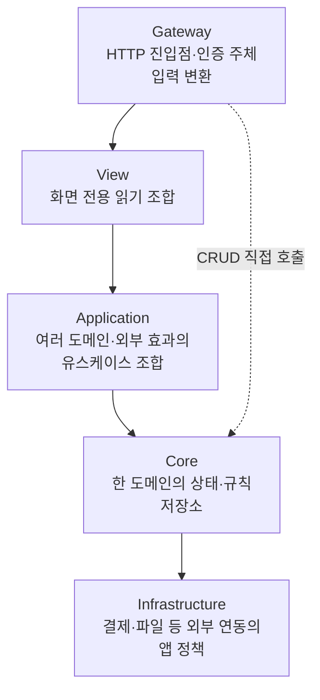
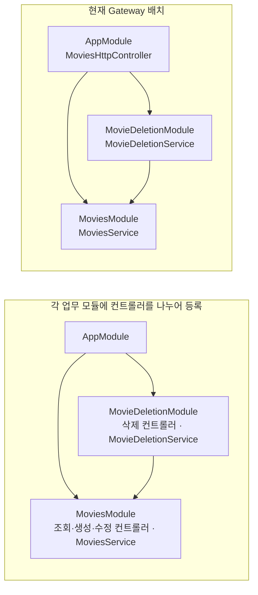

# API — 영화 예매 예제

NestJS로 구현한 영화 예매 API다. 실행 방법은 [루트 README](../../README.md#실행과-검증), API의 동작과 보장은 [앱 가이드](../README.md#데이터와-dto)를 따른다. 공통 코드로 옮길지는 [libs 기준](../../libs/README.md)으로 판단한다.

## SoLA의 모듈 의존 방향

이 API는 모듈을 역할별 계층으로 나누는 SoLA 구조를 사용한다. 하위 계층만 참조하고 같은 계층의 다른 모듈은 직접 참조하지 않아 모듈 간 순환 의존을 피한다. 여러 모듈을 조합하는 작업은 상위 계층에서 맡는다.

모듈 사이의 계층 구분은 모듈 내부의 Controller·Service·Repository 역할 구분과 다르다. 한 도메인의 규칙은 Core에, 여러 도메인을 조합하는 책임은 Application에 둔다. 각 도메인 모듈에는 필요한 Service·Repository·모델·DTO를 함께 둘 수 있다.

필요한 하위 계층은 직접 사용할 수 있다. 극장 도메인의 단순 생성·조회·수정은 Gateway → Core로 충분하다. 영화·극장 삭제는 각각 `MovieDeletionService`·`TheaterDeletionService`가 해당 도메인과 Showtimes를 조합해 상영이 있는지 확인한다. 계층 수를 맞추려고 호출을 전달하기만 하는 Application Service를 만들지 않는다.

View는 데이터를 읽어 화면에 반환할 DTO와 항목의 순서·개수를 결정한다. `UserHomeViewService`는 추천·영화·상영·극장 정보를 조합한다. 도메인 상태 변경과 transaction은 View에 두지 않는다. Application과 Core는 View에 의존하지 않으며, 화면 요구에 맞추기 위해 도메인 API의 목적을 바꾸지 않는다.

`internal/`과 `worker/`는 모듈 내부 구현을 나눈 폴더이며 별도 도메인 계층이 아니다. 모듈 공개 진입점과 이름은 [개발 규칙](../../docs/conventions.md)을 따른다. 계층 방향과 모듈 간 import는 lint가 검사한다. View가 상태를 바꾸지 않는지처럼 코드의 동작에 관한 규칙은 리뷰로 확인한다.

`config/`는 주입받은 env를 검증하고, `modules/`와 `app.module.ts`는 외부 연결과 Nest provider를 구성한다. 도메인 규칙은 이곳에 넣지 않는다. `ConfigModule`은 `ignoreEnvFile: true`로 실행 환경에 주입된 값을 사용한다. env 파일의 주입과 변경 반영 방법은 [Dev Container](../../.devcontainer/README.md)를 따른다.

## 컨트롤러의 배치와 등록

REST API 컨트롤러는 `services/gateway`에 두고 `AppModule`에 등록한다. `MoviesHttpController`는 영화 조회·생성·수정을 `MoviesService`에, 삭제를 `MovieDeletionService`에 맡긴다.

컨트롤러가 다른 모듈의 서비스를 주입받으려면 그 서비스가 export되어 있어야 한다. 컨트롤러를 등록한 모듈은 서비스를 제공하는 모듈을 import해야 한다.

컨트롤러를 각 업무 모듈에 두려면 영화 조회·생성·수정은 `MoviesModule`에, 삭제는 `MovieDeletionModule`에 나누어 등록한다. 이때 `/movies` 관련 API는 두 모듈에 나뉜다.

컨트롤러를 Gateway에 모으기로 한 이유는 [설계 결정](../../docs/decisions.md#nestjs와-모듈-경계)에 있다.

기존 `MoviesHttpController`를 나누지 않고 `MoviesModule`에 등록하면 `MovieDeletionModule`을 import하게 되어 SoLA의 방향을 위반한다. 이때는 Movies → MovieDeletion → Movies의 순환이 생긴다. 폴더만 옮기지 말고 컨트롤러 등록과 모듈 import도 함께 확인해야 한다. `forwardRef`로 주입을 가능하게 해도 잘못된 의존 방향은 남는다.

## 저장소와 DTO

앱의 Repository는 쿼리·인덱스를 정의하고 저장소 오류를 도메인 오류로 바꾼다. SDK 연결·실행은 common이 맡는다. `TransactionContext`를 사용해도 transaction의 의미와 원자성 설계는 사용하는 DB에 따라 달라진다.

데이터를 검사·변환하는 지점에는 Zod 스키마를 명시한다. 타입 인자만으로 런타임 변환 정보를 알 수 없기 때문이다. 구체적인 작성 방법은 [타입과 변환](../../docs/conventions.md#타입과-변환)을 따른다.
