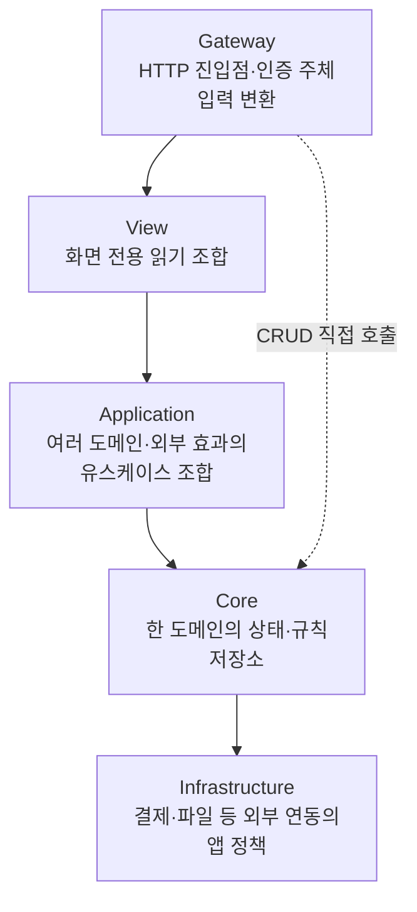
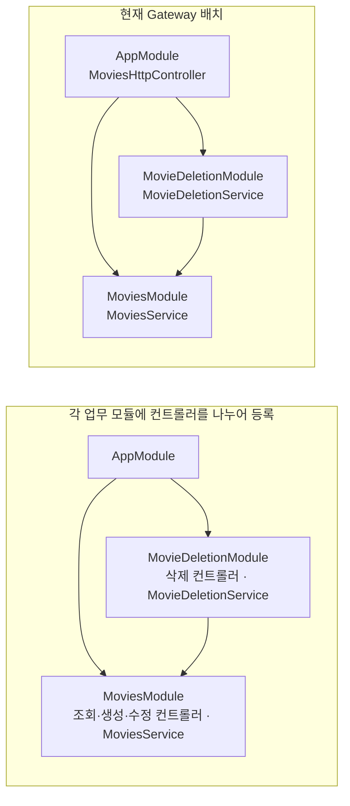

# API — 영화 예매 예제

NestJS로 구현한 영화 예매 API다. 실행 방법은 [루트 README](../../README.md#실행과-검증), API의 동작과 보장은 [앱 가이드](../README.md#데이터와-dto)를 따른다. 공통 코드로 옮길지는 [libs 기준](../../libs/README.md)으로 판단한다.

## SoLA의 모듈 의존 방향

이 API는 모듈을 역할별 계층으로 나누는 SoLA 구조를 사용한다. 하위 계층만 참조하고 같은 계층의 다른 모듈은 직접 참조하지 않아 모듈 간 순환 의존을 피한다. 여러 모듈을 조합하는 작업은 상위 계층에서 맡는다.

모듈 사이의 계층 구분은 모듈 내부의 Controller·Service·Repository 역할 구분과 다르다. 한 도메인의 규칙은 Core에, 여러 도메인을 조합하는 책임은 Application에 둔다. 각 도메인 모듈에는 필요한 Service·Repository·모델·DTO를 함께 둘 수 있다.



필요한 하위 계층은 직접 사용할 수 있다. 극장 도메인의 단순 생성·조회·수정은 Gateway → Core로 충분하다. 영화·극장 삭제는 각각 `MovieDeletionService`·`TheaterDeletionService`가 해당 도메인과 Showtimes를 조합해 상영이 있는지 확인한다. 계층 수를 맞추려고 호출을 전달하기만 하는 Application Service를 만들지 않는다.

View는 데이터를 읽어 화면에 반환할 DTO와 항목의 순서·개수를 결정한다. `UserHomeViewService`는 추천·영화·상영·극장 정보를 조합한다. 도메인 상태 변경과 transaction은 View에 두지 않는다. Application과 Core는 View에 의존하지 않으며, 화면 요구에 맞추기 위해 도메인 API의 목적을 바꾸지 않는다.

`internal/`과 `worker/`는 모듈 내부 구현을 나눈 폴더이며 별도 도메인 계층이 아니다. 계층 방향과 모듈 간 import는 lint가 검사한다. View가 상태를 바꾸지 않는지처럼 코드의 동작에 관한 규칙은 리뷰로 확인한다.

`config/`는 주입받은 env를 검증하고, `modules/`와 `app.module.ts`는 외부 연결과 Nest provider를 구성한다. 도메인 규칙은 이곳에 넣지 않는다. `ConfigModule`은 `ignoreEnvFile: true`로 실행 환경에 주입된 값을 사용한다. env 파일의 주입과 변경 반영 방법은 [Dev Container](../../.devcontainer/README.md)를 따른다.

## 컨트롤러의 배치와 등록

Gateway는 REST API 컨트롤러와 HTTP 전용 기능을 모아 둔 계층이다. 컨트롤러는 `services/gateway`에 두고 `AppModule`에 등록한다.

NestJS의 [기능 모듈 예시](https://docs.nestjs.com/modules#feature-modules)처럼 각 업무 모듈에 컨트롤러를 두면 API·서비스·테스트를 함께 관리하기 쉽다. 현재 `src/__tests__`에 있는 기능별 HTTP 테스트도 해당 모듈에 두고, `AppModule` 전체 대신 대상 모듈과 필요한 의존성·공통 HTTP 설정으로 구성할 수 있다.

다만 이 구조에서는 영화 조회·생성·수정 API는 `MoviesModule`에, 삭제 API는 `MovieDeletionModule`에 놓인다. `/movies`를 하나의 영화 API로 설계해도 내부 서비스가 나뉜다는 이유로 API 정의부터 두 모듈로 갈라진다.

이 프로젝트는 본질기반해석에 따라 영화 API를 먼저 정의하고 그 동작을 구현하는 책임을 나누는 탑다운 설계에 맞춰 Gateway 배치를 선택했다. `MoviesHttpController`에서 `/movies`의 URL·요청값 검사·인증 설정을 함께 관리하고, 조회·생성·수정은 `MoviesService`에, 삭제는 `MovieDeletionService`에 맡긴다. API를 한곳에서 이해한 뒤 서비스를 호출하는 단계에서 구현 책임이 나뉘므로 설계 순서대로 코드를 읽기 자연스럽다.

HTTP에서만 공유하는 인증 Guard·입력 변환 Pipe를 Gateway에 모으고, 도메인 서비스 모듈을 컨트롤러·URL·HTTP 인증 설정과 분리하는 것도 모듈화다. 추천 기능에서 `MoviesModule`을 import해도 `/movies` API가 함께 등록되지 않는다. 다만 서비스 구현을 따라갈 때는 Gateway와 업무 모듈의 폴더를 오가야 한다.



기존 `MoviesHttpController`를 나누지 않고 `MoviesModule`에 등록하면 삭제 서비스를 쓰기 위해 `MovieDeletionModule`을 import하게 되어 Movies → MovieDeletion → Movies의 순환이 생긴다. 위의 모듈별 배치가 성립하려면 컨트롤러도 각 모듈의 책임에 맞게 나누어야 한다.

## 이름은 동작과 계약을 설명한다

엔티티 집합을 관리하는 Core 서비스는 `UsersService`, `MoviesService`처럼 도메인의 복수형으로 이름 짓는다. 여러 도메인을 조합하는 Application 서비스는 `PurchaseService`, `ShowtimeCreationService`처럼 유스케이스를 나타내는 단수형 이름을 쓴다. 단수·복수는 한 요청이 처리하는 데이터 개수가 아니라 서비스의 역할에 따라 정한다.

데이터를 조회하고 다른 서비스를 조율하면 `RecommendationService`, 전달받은 데이터만 계산하면 `MovieRecommender`처럼 이름으로 역할을 구분한다.

이벤트 발행·구독을 담당하는 서비스도 `PurchaseEventService`처럼 `Service`로 끝내고 파일은 `purchase-event.service.ts`로 맞춘다. 이벤트 데이터인 `TicketPurchasedEvent`와 구분한다.

단순 조회의 조건은 객체 인자로 표현한다. 업무 목적이나 반환 정보로 다른 조회와 구분해야 하면 함수 이름에도 드러낸다.

```ts
find({ id })
find({ email })
findForAuthentication({ email })
findByPurchaseRecordId({ purchaseRecordId })
```

`existsByMovieIds`, `existsByTheaterIds`처럼 조건을 이름에 드러내도 된다. 이름을 줄이기 위해 두 함수를 합치고 `movieIds`와 `theaterIds`를 판별하는 분기를 추가하지 않는다. 단일 값 유틸까지 객체 인자로 바꿀 필요는 없다. 비슷한 타입의 인자가 많아 의미를 혼동하기 쉬우면 속성 이름이 있는 객체로 받는다.

| 이름                    | 기본 계약                                             |
| ----------------------- | ----------------------------------------------------- |
| `find` / `findMany`     | 단건은 없으면 null, 여러 건은 찾은 결과만 배열로 반환 |
| `get` / `getMany`       | 요청한 대상 중 하나라도 없으면 NotFoundException      |
| `search` / `searchPage` | 조건 검색 / 페이지 정보를 포함한 검색                 |

이 시드의 일반 서비스 조회·삭제는 `getMany`·`deleteMany`를 사용한다. 한 건을 처리하는 HTTP 핸들러도 ID를 `[id]`로 감싸 같은 메서드를 호출하고, 응답은 한 건만 반환한다. 이후 여러 건을 처리하는 호출을 추가해도 서비스 메서드의 입력·반환 방식을 바꾸지 않으려는 선택이다. 생성·수정과 업무상 특별한 조회까지 일괄 API로 바꾸지는 않는다.

요청 DTO는 `CreateTheaterDto`, `UpdateUserDto`, `SearchTheatersPageDto`처럼 동작과 대상을 이름에 드러낸다. `releaseDate` 같은 달력 날짜와 `createdAt` 같은 시점은 이름뿐 아니라 타입과 직렬화 형식에서도 구분한다.

## 다른 모듈을 import하는 방법

다른 모듈의 기능은 공개 `index.ts`를 통해 사용한다. `internal/`·`worker/`의 내부 구성은 공개하지 않고, 앱 조립에 필요한 workflow 정의 등만 명시적으로 공개한다. 모듈 내부나 부모 모듈을 참조할 때는 상대 import를 사용한다.

```ts
// core/users/internal/user-authentication.service.ts
import { UsersRepository } from '../users.repository.js'

// gateway/users.http-controller.ts
import { UsersService } from '#core'
```

하위 모듈이 자신을 다시 export하는 `index.ts`를 import하면 순환 참조가 생길 수 있다. 경로 별칭을 써도 같은 계층의 다른 모듈을 참조할 수는 없다. 테스트도 공개 기능은 실제 소비자가 쓰는 진입점으로 검증한다. 비공개 구현 자체를 검사해야 하는 경우에만 예외를 둔다.

ESM import의 확장자와 공통 타입 표기는 [TypeScript 작성 규칙](../../libs/README.md#7-typescript-작성-규칙)을 따른다. common의 peer dependency 설치와 SDK 호출 경계는 [공유 패키지](../../libs/README.md#2-sdk-연결과-호출은-common에서-구현한다)를 따른다.

## 저장소와 DTO

NestJS의 예외와 DI를 앱의 기본 도구로 사용한다. DB 교체나 다른 언어로의 재작성을 자동화하려는 추상화는 만들지 않는다.

앱의 Repository는 쿼리·인덱스를 정의하고 저장소 오류를 도메인 오류로 바꾼다. SDK 연결·실행은 common이 맡는다. `TransactionContext`를 사용해도 transaction의 의미와 원자성 설계는 사용하는 DB에 따라 달라진다.

DTO에는 Zod를 사용한다. 요청 검증과 응답·workflow·테스트의 JSON 복원에 같은 런타임 스키마를 재사용하기 위해서다. 클래스의 변환 데코레이터로도 구현할 수 있지만 이 프로젝트는 스키마를 선택했다.

데이터를 검사·변환하는 지점에는 Zod 스키마를 명시한다. 타입 인자만으로 런타임 변환 정보를 알 수 없기 때문이다.

HTTP 요청·응답과 JSON에서 복원할 데이터는 Zod 스키마로 정의하고 `z.infer`로 타입을 얻는다. 타입 이름은 `Dto`, 실행 시 검사·변환에 쓸 스키마 이름은 `Schema`로 끝낸다. [극장 생성 DTO](src/services/core/theaters/dtos/create-theater.dto.ts)가 그 예다.

```ts
export type CreateTheaterDto = z.infer<typeof CreateTheaterSchema>
```

요청 검사·변환에는 `CreateTheaterSchema`, 검증된 값을 받는 함수 인자에는 `CreateTheaterDto`를 사용한다. 같은 필드를 클래스와 스키마에 두 번 적지 않는다. JSON 경계를 통과하지 않는 내부 함수 인자까지 스키마를 새로 만들 필요는 없다.

JSON 본문의 숫자·불리언·문자열은 선언한 타입으로 받는다. 쿼리 숫자나 날짜처럼 변환이 필요한 필드만 명시적으로 변환한다. 수정 필드를 생략하면 기존 값을 유지하며, `null`은 실제 모델이 허용할 때만 받는다.

JSON 복원과 HTTP 테스트에서 스키마를 사용하는 방법은 [공유 패키지의 JSON과 DTO 복원](../../libs/README.md#4-json과-dto-복원)을 따른다.

## 오류와 불변식

NestJS `HttpException`과 하위 예외를 Core·Application에서도 사용한다. 예상한 실패는 해당 도메인의 `errors.ts`에 코드·메시지·문맥을 정의한다. 해당 조건을 판단한 코드가 이를 알맞은 예외에 담아 던지므로 Gateway에서 같은 의미의 오류로 다시 변환하지 않는다.

```ts
throw new ConflictException(MovieErrors.DeleteBlockedByShowtimes(movieId))
```

서비스는 업무 조건을 판단한다. Repository는 고유 키 충돌처럼 DB가 원자적으로 판정한 결과를 도메인 예외로 바꾼다. MongoDB 오류 번호·드라이버 세션은 서비스로 보내지 않는다. 클라이언트가 구분해야 할 4xx 오류에는 `code`를 두고, 5xx 오류의 내부 원인은 응답 본문 대신 서버 로그에 남긴다.

필수 환경 변수는 부팅 시 검증하고 필수 shell 변수는 `${VAR:?}`로 확인한다. 코드 내부의 필수 값은 `ensure`·`Require.defined`로 검사한다.

환경에 따라 달라지는 설정은 환경 변수로 주입한다. 화면 조회 개수처럼 배포 환경과 관계없이 유지할 정책은 관련 코드에 둔다.

## 테스트

API는 `src/__tests__`에서 실제 모듈과 인프라를 연결하는 통합 테스트를 기본으로 한다. 복잡한 계산이나 독립적인 변환 계약은 직접 검증할 수 있다. 단순 위임 함수마다 단위 테스트를 추가하지 않으며, 새 테스트 파일을 만들 때는 [저장소 작업 지침](../../AGENTS.md#5-요구사항만-최소한으로-수행한다)을 따른다.

API spec에서는 `createAppTestContext`와 공통 훅이 앱을 준비하고 정리하게 한다. spec에는 조건 준비, 동작 호출, 결과 단언이 드러나게 한다. 데이터 준비·외부 상태 조회·장애 주입을 돕는 함수는 대응하는 `*.utils.ts`에 둔다. 테스트 설명에는 기대 동작을 쓰고, 프로세스 수나 관측 방식에 따른 검증 한계는 필요한 본문 주석에 남긴다.

조건과 테스트 이름·단언·자원 정리는 [테스트 작성 규칙](../../tests/README.md#테스트는-한-행동의-결과를-검증한다)을 따른다.

## 로그

활성화된 API 로그는 한 줄의 ECS JSON으로 stdout/stderr에 출력한다. 컨테이너 안에 별도 로그 파일을 만들어 중복으로 회전시키지 않는다. 검증 스택은 Docker에서 로그 파일 크기를 제한하고 회전시킨다. 장기 저장·검색 시스템은 실제 배포 환경에 맞춰 선택한다. 실행 중 남기는 요청 로그에는 요청·응답 본문과 query를 포함하지 않는다.
