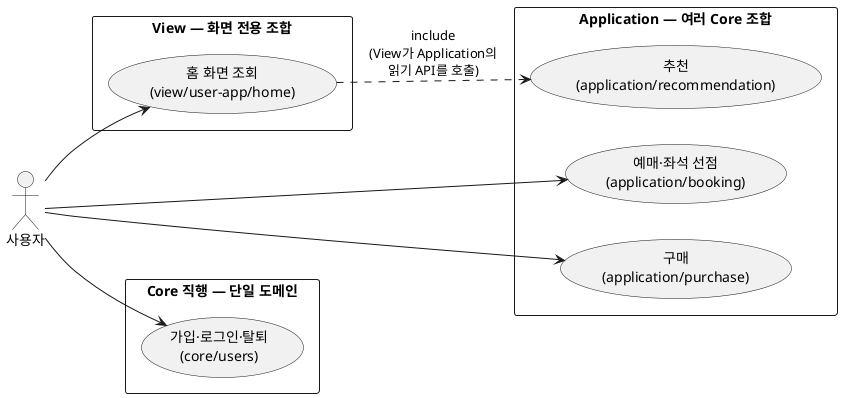
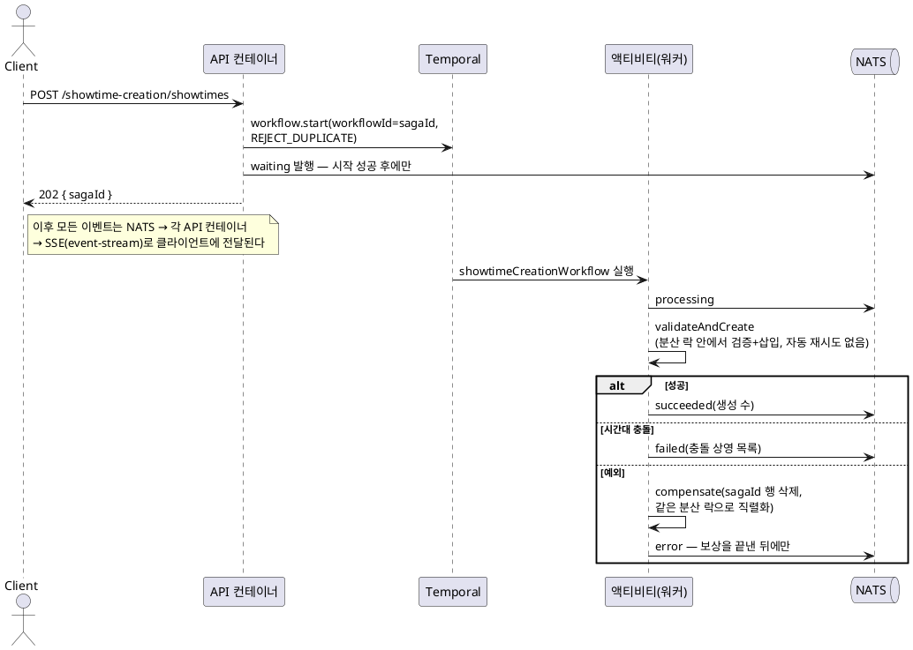

# apps/ — 애플리케이션

NestJS 백엔드인 `api`가 이 시드의 목적이고, `console`과 `user-app`은 모노레포 구성을 보여주는 최소 데모다.

`apps/api/src`의 최상위는 다음과 같이 나뉜다. 이 문서의 대부분은 `services/`를 다룬다.

| 경로            | 역할                                                                                                                |
| --------------- | ------------------------------------------------------------------------------------------------------------------- |
| `services/`     | 도메인 — SoLA 5계층(아래 전체 절)                                                                                   |
| `modules/`      | 인프라 배선 — Mongo·Redis·NATS·Temporal 연결 모듈(`*-setup`), 공용 제공자(`GlobalModule`), health. 도메인 로직 없음 |
| `config/`       | `AppConfigService` — `process.env`를 검증해 타입 있는 설정으로 바꾸는 단일 정의처                                   |
| `__tests__/`    | 통합 테스트([테스트](#테스트) 절)                                                                                   |
| `app.module.ts` | 루트 모듈 — modules와 services의 모듈·컨트롤러·전역 가드/파이프를 한곳에서 조립한다                                 |
| `bootstrap.ts`  | 앱 기동 — 로거, `x-replica-id` 미들웨어, listen                                                                     |
| `main.ts`       | 배포 엔트리. `development.ts`는 `NODE_ENV=development`를 강제하는 dev 전용 엔트리                                   |

## SoLA 5계층

여기서 말하는 계층은 컨트롤러/서비스/리포지토리처럼 한 서비스 내부의 코드 구조를 뜻하지 않는다. Application, Core, Infrastructure는 하나의 백엔드 서비스를 제공하기 위해 협력하고, View는 그 서비스를 화면 요구에 맞게 소비한다. 이렇게 계층을 나누고 의존 방향을 제한하는 규칙은 모듈 사이의 순환 참조를 원천에서 막아, 한쪽을 바꾸면 다른 쪽까지 흔들리는 문제가 생기지 않도록 한다.

### 풀려는 문제: 순환 참조

모듈끼리 자유롭게 서로를 부르게 두면 시간이 지날수록 순환 참조가 생긴다. 처음에는 A만 B를 부르더라도, 기능이 늘면 B도 A를 부르게 되기 쉽다. 그러면 두 모듈은 사실상 하나로 묶이고, 한쪽 수정이 다른 쪽까지 흔든다.

### 기존 레이어드와 다른 점

기존 레이어드 아키텍처는 보통 기술적 역할을 기준으로 계층을 나눈다.

```
Controller → Application(Service) → Domain → Repository
```

이 구조에서 Service 계층은 Application 계층이라고도 부른다. 요청 하나의 유스케이스를 처리하고, 트랜잭션 경계를 잡고, Domain이나 Repository를 호출하는 곳이다.

기존 레이어드가 주로 막으려는 것은 Controller가 Repository를 직접 부르거나 Repository가 Controller를 아는 식의 계층 침범이다. 그래서 같은 Application(Service) 계층 안의 모듈 호출은 같은 추상화 수준의 협력으로 보고 허용하는 경우가 많다.

하지만 Service 계층은 쉽게 넓어진다. 한 도메인의 기본 기능, 여러 도메인을 조합하는 유스케이스, 외부 시스템 호출 전 조립 로직이 모두 Service 안에 쌓이면, 같은 계층 안에서도 코드끼리 호출이 얽히고 순환 참조가 생긴다.

SoLA는 이 지점을 나눈다. 기존 Service 계층에 섞이기 쉬운 책임 중, 여러 도메인을 조합하는 유스케이스는 Application Service에 두고, 한 도메인의 규칙과 상태를 책임지는 기능은 Core Service에 둔다. 여기서 Service라는 말은 전통적인 Application Service만 뜻하지 않고, 독립적인 책임을 가진 모듈 단위를 넓게 가리킨다.

### 해결책: 같은 계층끼리도 직접 부르지 않는다

흔한 레이어드 아키텍처는 위 계층이 아래 계층을 부르는 방향만 제한한다. 같은 계층 안에서는 서로 부르게 두는 경우가 많다. 하지만 그렇게 두면 같은 계층 안에서 순환 참조가 다시 생긴다.

SoLA는 여기서 한 걸음 더 나아간다. **같은 계층에 있는 모듈끼리도 직접 부르지 않는다.** 두 모듈을 함께 써야 한다면, 그 둘을 모두 부를 수 있는 한 단계 위 계층에 조립용 모듈을 만든다.

```
┌─────────────────────────────────────────┐
│  Gateway                                │  HTTP 진입 (컨트롤러·가드·파이프)
│  *HttpController, AdminAuthGuard        │
├─────────────────────────────────────────┤
│  View Services                          │  화면 전용 서비스 소비자
│  UserHomeView                           │
├─────────────────────────────────────────┤
│  Application Services                   │  여러 도메인 묶는 유스케이스
│  ShowtimeCreation, Booking, Purchase    │  (사가/보상 포함)
├─────────────────────────────────────────┤
│  Core Services                          │  도메인 로직, 자기 DB 소유
│  Movies, Theaters, Showtimes, Tickets   │
├─────────────────────────────────────────┤
│  Infrastructure Services                │  외부 시스템 연동
│  Payments, Assets                       │
└─────────────────────────────────────────┘
```

Application, Core, Infrastructure는 단일 서비스를 제공하는 협력 관계다. Application은 여러 Core를 묶어 유스케이스를 만들고, Core는 도메인 기능과 상태를 책임지고, Infrastructure는 외부 시스템 연동을 맡는다. Gateway와 View는 이 흐름의 일부가 아니라, 이미 제공되는 서비스를 외부 요청에 맞게 소비하는 계층이다. Gateway는 HTTP 요청을, View는 특정 화면 응답을 책임진다.

의존 규칙은 다음과 같다.

1. 같은 계층 안에서는 서로를 참조하지 않는다.
2. 위 계층만 아래 계층을 참조할 수 있다. 예: Gateway → View → Application → Core → Infrastructure.
3. Gateway와 View는 서비스 소비자이므로 아래 계층의 공개 API를 자유롭게 호출한다. 단 View는 읽기 응답에 집중하고, 상태를 바꾸는 유스케이스는 두지 않는다.
4. 서비스 제공 쪽(Application/Core/Infrastructure)은 Gateway와 View를 참조하지 않는다.

이 규칙은 ESLint로 강제한다. 계층 간 의존 방향은 `eslint-plugin-boundaries`가 막고, 계층별 세부 금지 항목은 `no-restricted-imports`가 막는다. 설정은 [apps/api/eslint.config.js](../apps/api/eslint.config.js)에 있다.

어느 서비스부터 읽을지는 [README 도메인 둘러보기](../README.md#도메인-둘러보기)의 순서를 따른다.

### View는 화면 전용 서비스 소비자다

View는 SoLA의 순환 참조 문제를 풀기 위한 핵심 계층이 아니다. 화면 전용 읽기 응답은 원래 프론트엔드가 여러 API를 호출해 직접 조립해도 된다. View는 그 조립을 효율을 위해 백엔드로 옮겨 온 것이다.

예를 들어 사용자 앱 홈 화면은 추천 영화, 상영시간, 극장 이름을 한 응답에 담아야 한다. 그래서 `view/user-app/home`처럼 화면 단위의 소비자 코드를 백엔드에 둔다. 이렇게 두는 이유와 검토했던 대안은 [설계 결정 §4](reference/decisions.md#4-view-계층-화면-전용-서비스-소비자)에 있다. Application도 View보다 아래 계층이므로, View는 Application의 읽기 API도 호출할 수 있다.

```
Frontend(User App)
    → Gateway(UserHomeViewHttpController)
        → View(UserHomeViewService)
            → Application(Recommendation)
            → Core(Movies, Showtimes, Theaters)
```

View는 서비스 제공 계층(Application·Core·Infrastructure)보다 위에 놓인다. 다만 이것은 프론트엔드가 백엔드를 호출하고, 그 요청을 받은 백엔드가 내부 서비스를 소비하는 자연스러운 흐름의 결과일 뿐이다. View가 서비스 제공 쪽 협력 관계에 포함된다는 뜻은 아니다.

View가 해도 되는 일은 필요한 서비스의 읽기 API를 호출하고, 화면에 맞는 DTO로 묶고, 표시 순서나 개수 같은 조회 정책을 적용하는 것이다. 상태를 바꾸는 유스케이스, 트랜잭션, 도메인 규칙은 View에 두지 않는다. 그런 책임은 Application이나 Core에 둔다.

또한 View는 다른 계층이 재사용하는 공용 서비스가 아니다. 특정 화면 응답에만 쓰이는 소비자 코드이므로, Application/Core/Infrastructure가 View를 참조하지 않는다.

### Application Service는 조립이 필요할 때만 만든다

Core Service 하나로 처리할 수 있는 API라면 컨트롤러에서 Core를 바로 호출한다. Application 계층을 억지로 끼워 넣지 않는다. 여러 Core를 함께 써야 하는 유스케이스에서만 Application Service를 만든다.

실제 코드의 두 패턴이 그 예다.

- [movies.http-controller.ts](../apps/api/src/services/gateway/movies.http-controller.ts) — 영화 조회·등록은 Core인 `MoviesService`를 바로 호출한다.
- [showtime-creation.http-controller.ts](../apps/api/src/services/gateway/showtime-creation.http-controller.ts) — 상영 등록은 영화·극장·상영시간·티켓을 한꺼번에 다뤄야 하므로 Application인 `ShowtimeCreationService`를 거친다.

이 규칙이 사용자 여정(가입 → 홈 → 예매 → 구매)에서 어떻게 나타나는지가 다음 유스케이스 지도다 — 각 유스케이스가 어느 계층의 어떤 서비스로 처리되는지 보여준다(다이어그램은 devcontainer의 VS Code 미리보기에서 렌더된다). Application에는 여러 Core를 조합하는 유스케이스만 있고, 단일 도메인으로 끝나는 유스케이스는 Core로 직행한다. 즉 Application은 "유스케이스 계층"이 아니라 "조립이 필요한 유스케이스만 올라오는 계층"이다.



추천은 자기 HTTP 엔드포인트가 없다 — 홈 View가 소비하는 내부 유스케이스라 액터 없이 include로만 이어진다. 관리자·root 쪽 유스케이스도 같은 규칙을 따른다 — 영화·극장 등록과 admin 관리는 Core 직행, 상영 등록만 조합이 필요해 Application이다(위 두 예시가 그 대비다). 전체 서비스 목록은 [README 도메인 둘러보기](../README.md#도메인-둘러보기)를 본다.

### 왜 모놀리스에 SoLA를 쓰는가

SoLA는 원래 마이크로서비스를 염두에 둔 원칙이다. 마이크로서비스에서는 서비스가 서로 다른 프로세스로 실행된다. 같은 계층끼리 직접 부르기 어렵고, 여러 서비스를 묶는 일은 그 위의 오케스트레이터나 게이트웨이가 맡는다.

모놀리스에서도 이 규칙을 모듈 단위로 적용해 두면, 나중에 특정 모듈을 독립 서비스로 떼어내기 쉽다. 다른 모듈과 직접 엮여 있지 않으므로, 경계만 끊어내면 분리할 수 있다.

## 분산 협력 — MSA 준비형 모놀리스

API는 배포할 때 **기본 4개** 컨테이너로 실행하고, NATS와 Temporal 같은 분산 인프라도 함께 사용한다. 컨테이너가 여러 개라면 한 컨테이너 안에서만 생각해서는 안 된다. 예를 들어 다음 상황을 처리해야 한다.

- 여러 컨테이너가 같은 자원을 동시에 수정하려는 상황
- 한 컨테이너에 붙은 클라이언트에게 다른 컨테이너에서 생긴 이벤트를 보내야 하는 상황
- 여러 단계를 거치는 작업이 중간에 실패했을 때 앞 단계 작업을 되돌려 보상해야 하는 상황 — 이런 처리 패턴을 사가(saga)라고 한다

이 시드는 이런 문제를 아래 도구로 푼다.

| 상황                               | 도구                         | 동작 방식                         |
| ---------------------------------- | ---------------------------- | --------------------------------- |
| 같은 키를 동시에 처리하면 안 될 때 | Redis 분산 락                | 건너뛰거나 순서대로 처리          |
| 다른 컨테이너의 클라이언트로 알림  | NATS pub/sub                 | 모두에게 보내거나 그룹 안 한 명만 |
| 중간 실패 시 보상해야 하는 작업    | Temporal 워크플로 + 액티비티 | 저장·재시도·보상 처리             |

각 도구를 고른 이유와 검토한 대안은 [설계 결정](reference/decisions.md)에 있다. 여기서는 도구를 어디에 어떻게 쓰는지에 집중한다.

### 분산 락 — `cache.withLock`와 `cache.withLockBlocking`

분산 락은 두 형태로 나누었다. `withLock(key, ttl, fn)`은 이미 락이 점유되어 있으면 바로 `{ran: false}`를 반환하고 종료한다. `withLockBlocking(key, ttl, fn, {pollMs, waitMs})`은 락이 해제될 때까지 짧은 간격으로 다시 시도하다가, 너무 오래 기다리면 예외를 던진다. 어느 쪽을 고를지의 기준은 [설계 결정 §1](reference/decisions.md#1-분산-락-cachewithlock와-withlockblocking)에 있다.

현재 사용 위치는 다음과 같다.

| 위치                                                                                                                        | 유형               | 목적                                                                                 |
| --------------------------------------------------------------------------------------------------------------------------- | ------------------ | ------------------------------------------------------------------------------------ |
| [AssetsService.cleanupExpiredUploads](../apps/api/src/services/infrastructure/assets/assets.service.ts)                     | `withLock`         | 4개 컨테이너의 cron 중 한 번만 실행                                                  |
| [ShowtimeCreationActivities.validateAndCreate](../apps/api/src/services/application/showtime-creation/worker/activities.ts) | `withLockBlocking` | 겹치는 시간대 사가의 검증 후 삽입 경합 차단                                          |
| [ShowtimeCreationActivities.compensate](../apps/api/src/services/application/showtime-creation/worker/activities.ts)        | `withLockBlocking` | 같은 락 키로 보상과 진행 중 검증·삽입을 직렬화                                       |
| [PurchaseService.processPurchase](../apps/api/src/services/application/purchase/purchase.service.ts)                        | `withLockBlocking` | 동시 결제 직렬화로 불필요한 결제·보상 축소(이중 판매 방지는 티켓의 원자 전이가 보장) |

### 컨테이너 사이 메시지 — `NatsPubSubService`

`NatsPubSubService`는 NATS subject 기반 pub/sub을 감싼 서비스이다. 같은 subject를 구독하는 모든 컨테이너에 이벤트를 보내고, 큐 그룹 옵션을 쓰면 같은 그룹 안에서 한 컨테이너만 이벤트를 받는다. 컨테이너 사이 메시지 통로가 필요한 이유와 NATS를 고른 근거는 [설계 결정 §2](reference/decisions.md#2-컨테이너-사이-메시지-nats-pubsub)에 있다.

현재 두 경로가 이 서비스를 탄다.

- **showtime-creation 사가의 상태 브로드캐스트** — 사가가 상태를 NATS에 발행하면 모든 컨테이너의 구독 핸들러가 그 이벤트를 받는다. 각 핸들러는 이벤트를 로컬 RxJS Subject로 넘기고, SSE 컨트롤러는 자기 컨테이너에 붙은 클라이언트에게 흘려보낸다.
- **purchase 이벤트** — 브로드캐스트 구독은 [PurchaseEventLoggerService](../apps/api/src/services/application/purchase/internal/purchase-event-logger.service.ts), 큐 그룹 구독은 [PurchaseNotificationService](../apps/api/src/services/application/purchase/internal/purchase-notification.service.ts)가 예시다.

### Saga 오케스트레이션 — Temporal

오래 걸리거나 여러 단계를 거치는 작업은 Temporal 워크플로로 작성한다. 워크플로 함수는 결정적으로(같은 입력이면 항상 같은 실행 경로를 타도록) 작성하고, DB 쓰기나 외부 API 호출 같은 부수효과는 액티비티로 분리한다. Temporal을 고른 이유와 결정성 제약의 상세는 [설계 결정 §3](reference/decisions.md#3-saga-오케스트레이션-temporal-워크플로)에 있다.

현재 [showtimeCreationWorkflow](../apps/api/src/services/application/showtime-creation/worker/workflow.ts) 워크플로가 _processing emit → validate/create → result emit_ 흐름을 담당한다. `waiting` 이벤트는 워크플로 시작에 성공한 뒤에 오케스트레이터([ShowtimeCreationOrchestratorService](../apps/api/src/services/application/showtime-creation/internal/showtime-creation-orchestrator.service.ts))가 발행한다.

중간에 예외가 나면 catch 블록에서 **보상을 먼저 끝내고 나서** `error` 이벤트를 발행한다. 클라이언트에게 `error`는 "정리까지 끝났다"는 신호이므로 이 순서를 바꾸면 안 된다. 보상은 진행 중인 검증·삽입과 같은 분산 락으로 직렬화된다(위 표의 compensate 행).

전체 흐름을 시퀀스로 보면 다음과 같다(다이어그램은 devcontainer의 VS Code 미리보기에서 렌더된다).



## 코드 컨벤션

코드 스타일보다 **같은 방식으로 생각하고 읽기 위한 약속**이다. 자동 포맷팅으로 해결되는 내용은 적지 않는다. 주 무대는 apps/api지만 libs의 TypeScript 코드에도 같은 약속이 적용된다. 폴더가 없는 횡단 약속(커밋 메시지, fail-fast, 값의 위치, npm 스크립트 계약)은 [컨벤션](reference/conventions.md)에 있다.

### 이름 짓기

서비스 이름은 맡고 있는 도메인 이름을 기준으로 짓는다.

```ts
UsersService
MoviesService
ShowtimesService
```

여러 도메인을 묶는 서비스는 처리하는 유스케이스 이름을 사용한다.

```ts
ShowtimeCreationService
PurchaseService
```

ID만 받는 조회·삭제 메서드는 처음부터 복수형(`getMany`, `deleteMany`)으로, 요청 본문을 받는 생성·수정 메서드는 단수형(`create`, `update`)으로 짓는다. 이유와 컨트롤러 패턴은 [아래 REST API 설계](#id만-받는-api는-처음부터-복수형으로-둔다)에 있다.

요청 DTO는 `동작 + 대상 + Dto` 형식으로 짓는다.

```ts
CreateTheaterDto
UpdateUserDto
SearchTheatersPageDto
```

응답 타입은 꼭 필요할 때만 따로 만든다. 서비스 내부 모델을 그대로 반환해도 충분하다면 새 타입을 만들지 않는다.

경로 변수는 파일 이름까지 포함하면 `Path`, 디렉터리만 가리키면 `Dir`로 끝낸다. 변수 이름만 보고 호출 측에서 `path.join`을 더 붙여야 하는지 판단할 수 있어야 한다.

```ts
workflowBundleDir = '_output/workflows/showtime-creation' // 디렉터리
workflowBundlePath = '_output/workflows/showtime-creation/workflow.js' // 파일까지 포함
```

환경 변수와 설정 키도 디렉터리를 가리키면 이름에 그대로 드러낸다 (`LOG_DIRECTORY` 등).

### 에러 규칙

도메인에서 예상할 수 있는 실패는 `errors.ts`에 모아 둔다. 에러는 문자열을 바로 던지지 않고, 코드와 메시지를 가진 객체로 만든다.

```ts
export const MovieErrors = {
    NotFound: (notFoundMovieId: string) => ({
        code: 'ERR_MOVIE_NOT_FOUND',
        message: 'The movie does not exist.',
        notFoundMovieId
    }),
    InvalidForPublish: (missingFields: string[]) => ({
        code: 'ERR_MOVIE_INVALID_FOR_PUBLISH',
        message: 'The movie is not ready to be published.',
        missingFields
    })
}
```

지켜야 할 약속은 다음과 같다.

- 에러 정의는 서비스 디렉터리 안의 `errors.ts` 파일로 분리한다. 서비스 클래스 파일 안에 함께 적지 않는다.
- 같은 디렉터리의 `index.ts`에서 `export * from './errors'`로 다시 내보낸다.
- 단순 파싱/검증처럼 한 파일 안에서만 쓰는 gateway 계층의 에러는 예외적으로 가까운 곳에 둘 수 있다. 예: `RequestValidationPipeErrors`, URL 날짜 파싱 에러. 여러 핸들러나 서비스에서 재사용되면 `errors.ts`로 옮긴다.
- 클라이언트가 분기해야 하는 HTTP 4xx 응답에 `code`를 함께 보낸다. 5xx는 서버 장애이므로 클라이언트에게 자세한 원인을 노출하지 않는다.
- `message`는 디버깅과 로그를 위한 참고 값이다. 화면에 보여 줄 문구는 클라이언트가 `code`를 보고 정한다.

### 가져오기 규칙

각 폴더에는 `index.ts`를 둔다. 폴더 밖에서 사용해도 되는 것만 `index.ts`에서 다시 내보낸다. 이렇게 하면 공개 API를 한눈에 볼 수 있다.

가져오기 규칙은 두 가지이다.

**상위 폴더는 상대 경로로 가져온다.** 절대 경로 별칭으로 상위 폴더를 가져오면 순환 참조가 생기기 쉽다. 상위 폴더의 `index.ts`(폴더의 공개 내보내기를 모은 파일, 보통 배럴이라고 부른다)가 다시 하위 모듈을 가져오기 때문이다.

```ts
/* core/users/internal/user-authentication.service.ts */
import { UsersRepository } from '../users.repository' // O
import { UsersRepository } from 'core' // X — core의 index.ts가 users를 재참조해 순환이 생긴다
```

**상위 경로에 속하지 않는 폴더는 절대 경로로 가져온다.** 이런 경우 상대 경로를 쓰면 `../../../`가 길어져 읽기 어려워진다.

```ts
/* gateway/users.http-controller.ts */
import { UsersService } from 'core' // O — gateway에서 core는 형제 묶음이므로 별칭 사용
```

모든 가져오기가 `index.ts`를 지나가면 의존 그래프가 단순해진다. 순환 참조가 생겨도 빌드 오류로 빨리 드러난다.

### REST API 설계

URL 경로는 *행위*가 아니라 *리소스*를 기준으로 짓는다. 리소스 사이의 관계는 중첩 경로로 표현한다.

```
GET    /movies                       목록
GET    /movies/:movieId              조회
POST   /movies                       생성
PATCH  /movies/:movieId              수정
DELETE /movies/:movieId              삭제
POST   /movies/:movieId/assets       하위 리소스
```

어떤 유스케이스는 여러 API 단계를 묶어서 진행해야 한다. 그 단계가 해당 유스케이스 안에서만 의미 있다면 네임스페이스로 묶는다. 단독으로도 의미가 있는 API와 구분하기 위해서다.

```
# 복합 유스케이스 — namespace로 묶음
GET  /booking/movies/:id/theaters
GET  /booking/showtimes/:id/tickets
POST /booking/showtimes/:id/tickets/hold

# 다른 맥락에서도 단독으로 의미가 있음 — namespace 없이 둠
GET  /movies/:movieId
```

#### ID만 받는 API는 처음부터 복수형으로 둔다

ID만 받는 조회·삭제 API는 처음부터 복수형으로 설계한다. 단수형으로 시작했다가 나중에 벌크 처리가 필요해지면 API를 깨야 하기 때문이다. 생성·수정처럼 요청 본문을 받는 API는 단일 형태가 자연스럽다.

```ts
getMany(theaterIds: string[]) {}      // ID만 받는 API — 복수형
deleteMany(theaterIds: string[]) {}

create(dto: CreateTheaterDto) {}                        // 요청 본문이 있는 API — 단일
update(theaterId: string, dto: UpdateTheaterDto) {}
```

REST API에서 단일 항목을 다루는 엔드포인트가 필요하면, 컨트롤러가 ID 하나를 배열로 감싸 서비스의 복수형 메서드를 호출한다.

```ts
@Get(':id')
async get(@Param('id') id: string) {
    return this.service.getMany([id])
}
```

#### 오래 걸리는 작업은 비동기로 처리한다

처리에 시간이 걸리는 작업은 바로 결과를 반환하려 하지 않는다. 먼저 `202 Accepted`와 작업 추적용 식별자(sagaId)를 응답하고, 진행 상황은 SSE(Server-Sent Events)로 보낸다.

```
POST /some-resource               → 202 { sagaId }
GET  /some-resource/event-stream  → SSE { status, sagaId }
```

실물 예시는 [showtime-creation.http-controller.ts](../apps/api/src/services/gateway/showtime-creation.http-controller.ts)의 `@Sse('event-stream')`이다.

#### 쿼리 파라미터가 길어질 수 있으면 POST를 사용한다

GET의 쿼리 스트링에는 길이 제한이 있다. 일부 프록시에서 잘릴 수도 있다. 배열이나 긴 필터를 받는 검색 API는 처음부터 POST로 만드는 편이 안전하다.

```
POST /showtime-creation/showtimes/search
{ "theaterIds": [...] }
```

#### 본인 자원은 `/me`로 다룬다

본인 자원은 경로에 식별자가 없는 **`/me` 계열**로 다루고, 식별자는 인증 토큰의 주체(`req.user.sub`)로 못박는다. 여기에 규칙 하나가 더 필요하다 — 임의 ID를 받는 경로는 전부 admin 전용이다. `/me`가 있어도 user용 임의 ID 경로가 하나라도 남아 있으면 IDOR는 생기므로, 두 규칙이 합쳐져야 로그인 사용자가 ID를 바꿔 남의 자원에 접근하는 경로가 user 역할에서 사라진다. 결제도 같은 원칙이라 `POST /purchases`는 본문이 아니라 토큰 주체로 결제자를 정한다.

가드는 한 컨트롤러에 서로 다른 역할의 핸들러가 섞이면 핸들러마다 붙이고, 모든 핸들러가 같은 역할이면 클래스에 붙인다. 이렇게 나누는 이유는 NestJS에서 클래스 가드와 메서드 가드가 합쳐져 둘 다 통과해야 하기 때문이다. 상세는 [users.http-controller.ts](../apps/api/src/services/gateway/users.http-controller.ts) 머리 주석에 있다.

```ts
// 라우트 매칭상 `me`를 `:userId`보다 먼저 선언해야 `/users/me`가 파라미터로 잡히지 않는다.
@Delete('me')
@UseGuards(UserAuthGuard)
async deleteMe(@Req() req: UserAuthRequest) {
    await this.usersService.deleteMany([req.user.sub]) // 식별자는 토큰 주체로 고정
}

@Delete(':userId')
@UseGuards(AdminAuthGuard)
async delete(@Param('userId') userId: string) {
    await this.usersService.deleteMany([userId]) // 임의 ID는 admin만
}
```

### 데이터 비정규화

조회 성능을 높이고 계층 사이의 의존을 줄일 수 있다면 데이터를 어느 정도 중복 저장해도 된다. 예를 들어 `Ticket`에 `movieId`와 `theaterId`를 함께 저장해 두면 티켓을 조회할 때마다 `ShowtimesService`를 다시 부르지 않아도 된다.

대신 중복된 값은 항상 함께 갱신해야 한다. 이 부담보다 조회 단순성이 더 중요하다면 중복 저장을 선택한다.

### Type vs Interface

기본은 `type`이다. `interface`는 클래스가 `implements`해야 하거나, 같은 이름으로 다시 선언해 필드를 더할 수 있어야 하는(선언 병합) 자리에만 사용한다.

## 테스트

이 시드의 테스트는 mock 객체를 거의 사용하지 않는다. 인덱스, 트랜잭션, 레이스 컨디션처럼 mock으로는 놓치기 쉬운 문제를 실제 환경에 가깝게 확인하기 위해서다. `apps/api` 통합 테스트는 devcontainer가 띄운 MongoDB Replica Set, Redis Cluster, MinIO, NATS, Temporal을 재사용하고, `libs/common` 테스트는 Testcontainers와 Temporal local test environment로 필요한 인프라를 직접 시작한다. 커버리지 100%를 못 채우면 `npm test`가 실패한다 — 이유와 유일한 예외(libs/testing)는 [설계 결정 §6](reference/decisions.md#6-테스트-커버리지-100-게이트).

이 구조는 테스트 주도 개발과 잘 맞고, 그 이점은 모듈 경계 설계에서 나온다. 테스트가 필요한 환경(인프라·해당 모듈)을 코드로 세우므로, 한 모듈을 작업할 때 다른 앱이나 서비스를 함께 띄울 필요가 없다 — 모듈을 독립 서비스로 떼어내도 그 모듈의 작업 루프는 그대로다. 반대로 `npm run dev`로 앱을 직접 띄우는 방식은 서비스가 늘수록 기동 대상이 늘어 부담이 커진다. 단, 이 이점은 단위·단일 모듈 통합 테스트의 inner-loop에 한한다 — 여러 서비스를 가로지르는 e2e·분산 레이스 테스트는 여전히 배포 스택 전체가 필요하다([tests 문서](tests.md)).

### 테스트 구조와 한글 메시지 규칙

테스트 코드는 사람이 읽는 문서이기도 하다. 코드 식별자를 가리키는 곳은 영어를 그대로 쓰고, 시나리오와 기대 결과는 쉬운 한국어로 적는다. 이렇게 나누면 테스트 흐름이 자연스럽게 읽힌다.

```
describe('ServiceName')         -- 서비스나 모듈 이름. 코드 식별자이므로 영어
  describe('POST /resource')    -- 엔드포인트. 영어
    describe('methodName')      -- 메서드 이름. 코드 식별자이므로 영어
      describe('조건이 충족되면')  -- 조건. 한글로 작성
        beforeEach(...)         -- 조건을 만드는 셋업
        it('결과를 반환한다')      -- 결과 검증. 한글로 작성
```

세부 약속은 다음과 같다.

- 최상위 `describe('ServiceName')`, HTTP 메서드/URL `describe('POST /resource')`, 메서드 이름 `describe('methodName')`처럼 코드 식별자를 가리키는 자리는 영어를 그대로 쓴다.
- 조건을 표현하는 `describe`에는 한글 문자열을 직접 넣는다. `~할 때`, `~되었을 때`, `~않았을 때`처럼 절 형태로 적는다. 같은 내용을 주석으로 다시 쓰지 않는다.
- 결과 검증을 표현하는 `it`에도 한글 문자열을 직접 넣는다. `~한다`, `~반환한다`, `~던진다`처럼 결과가 드러나게 적는다. HTTP 응답은 `~반환한다`, 서비스 계층의 예외는 `~던진다`로 구분한다. 부모 `describe`에 조건이 이미 있으면 `it` 메시지에서 조건을 반복하지 않는다.
- 여러 `it`이 같은 조건을 공유하거나 시나리오에 설명이 필요하면 조건 `describe`로 묶고 그 `beforeEach`에서 조건을 만든다. `it` 하나뿐인 단발 조건은 `it` 문장에 `~면` 절로 싣고 본문에서 만든다.
- 조건이 아니라 주제를 묶는 한글 명사구 `describe`도 쓴다(`'인가 경계'`, `'고객 예매 흐름'`). 절 형태 규칙은 조건을 표현하는 `describe`에만 적용된다.

### 픽스처 패턴

libs의 테스트 스위트는 스위트별 `createXxxFixture()` 팩토리(예: `createRedisModuleFixture`)로 격리된 컨텍스트를 만든다. `apps/api` 통합 테스트는 공용 `createAppTestContext()`(`src/__tests__/integration/helpers`) 하나를 모든 테스트가 같이 쓴다. 어느 쪽이든 필요한 NestJS 모듈과 HTTP 클라이언트를 묶어서 반환하고, 테스트가 끝나면 `teardown()`으로 자원을 정리한다.

```ts
describe('UsersService', () => {
    let fix: AppTestContext

    beforeEach(async () => {
        const { createAppTestContext } = await import('../helpers')
        fix = await createAppTestContext()
    })

    afterEach(() => fix.teardown())

    describe('POST /users', () => {
        it('생성된 고객을 반환한다', async () => {
            await fix.httpClient.post('/users').body(dto).created(expected)
        })

        describe('이메일이 이미 존재하면', () => {
            beforeEach(async () => {
                await fix.httpClient.post('/users').body(dto).created()
            })

            it('409 Conflict를 반환한다', async () => {
                await fix.httpClient.post('/users').body(dto).conflict()
            })
        })
    })
})
```

PATCH나 DELETE처럼 상태를 바꾸는 API는 두 가지를 확인한다. 하나는 응답이 올바른지, 다른 하나는 DB 반영 여부다. 두 검증은 서로 다른 `it`으로 나눈다. 그래야 실패했을 때 어느 쪽 문제인지 바로 알 수 있다. DB 반영은 GET 재조회로 확인한다.

```ts
describe('PATCH /theaters/:id', () => {
    let theater: TheaterDto

    beforeEach(async () => {
        theater = await createTheater(fix)
    })

    it('수정된 극장을 반환한다', async () => {
        await fix.httpClient
            .patch(`/theaters/${theater.id}`)
            .body(updateDto)
            .ok({ ...theater, ...updateDto })
    })

    it('수정 내용이 DB에 저장된다', async () => {
        await fix.httpClient.patch(`/theaters/${theater.id}`).body(updateDto).ok()
        await fix.httpClient.get(`/theaters/${theater.id}`).ok({ ...theater, ...updateDto })
    })
})
```

### 동적 가져오기 — 왜 필요한가

각 테스트가 다른 테스트와 부딪히지 않도록, `jest.setup`이 테스트마다 고유한 `TEST_ID`를 발급한다. `apps/api` 테스트는 앱 설정값인 `PROJECT_ID`를 이 값으로 새로 만들고, Redis/cache prefix, NATS subject, Temporal task queue 이름이 그 값을 따라 테스트마다 갈라진다. MongoDB 데이터베이스와 S3 버킷은 Jest worker별로 만들고, 각 테스트가 끝날 때 컬렉션과 버킷 내용을 비운다.

문제는 일반적인 가져오기 방식이다. 파일 맨 위에 `import { createUsersFixture } from './users.fixture'`라고 쓰면, 그 모듈은 처음 한 번만 평가된다. 모듈이 처음 평가될 때 읽은 `process.env.PROJECT_ID`나 `process.env.TEST_ID`로 cache prefix, NATS subject, Temporal queue 같은 값이 만들어진다. 그래서 다음 테스트도 이전 테스트의 값을 그대로 쓰게 된다.

이 문제를 피하려고 Jest 설정에 `resetModules: true`를 켠다. 그리고 픽스처는 **`beforeEach` 안에서 `await import`로 동적으로 가져온다**. 이렇게 하면 테스트마다 모듈이 새로 평가되고, 그 시점의 `TEST_ID`와 `PROJECT_ID`가 픽스처와 앱 모듈에 반영된다.

IDE 자동 완성과 타입 체크는 유지하고 싶다. 그래서 타입은 `import type`으로 정적으로 가져온다. 타입 가져오기는 런타임 코드를 만들지 않는다.

```ts
import type { AppTestContext } from '../helpers' // 타입만 가져오므로 런타임 영향 없음

describe('Users', () => {
    let fix: AppTestContext

    beforeEach(async () => {
        const { createAppTestContext } = await import('../helpers')
        fix = await createAppTestContext()
    })
})
```

### 테스트 인프라

Jest 기반 테스트 인프라는 네 단계로 동작한다.

```
jest.global.js    workspace별 전역 준비
                   - apps/api: workflow bundle 생성 (env는 Dev Container가 주입한 process.env를 그대로 사용)
                   - libs/common: Testcontainers로 MongoDB · Redis · MinIO · NATS 기동,
                     Temporal local test environment 생성
jest.setup.js     worker별 DB·버킷 준비
                   beforeEach마다 TEST_ID 발급 (apps/api는 PROJECT_ID도 이 값으로 파생)
                   afterEach에서 컬렉션과 버킷 내용 정리
*.spec.ts         개별 테스트가 픽스처로 위 자원 사용
jest.teardown.js  전체 워커 종료 후 한 번: worker별 DB·버킷 드롭, Redis 전체 flush
```

`apps/api`의 통합 테스트는 devcontainer가 시작해 둔 공용 인프라(Mongo / Redis / MinIO / NATS / Temporal 컨테이너)를 재사용한다. `libs/common`은 외부 의존을 줄이기 위해 Testcontainers로 자체 인프라를 시작한다. `libs/testing`과 `libs/temporal-sandbox`는 인프라 없는 단위 테스트로 돈다.

단일 spec만 실행하려면 Jest에 파일 패턴을 넘기고 커버리지 게이트를 끈다. VS Code에서는 devcontainer에 포함된 Jest Runner 확장으로 describe/it 단위 실행도 된다.

```bash
npm test -w apps/api -- users.spec --coverage=false
```

## 실행 가능한 API 문서

`apps/api/api-docs/*.spec`는 bash와 curl로 작성한 실행 가능한 API 문서이다. 문서를 따로 손으로 관리하지 않고, 실제 요청을 보내는 spec을 실행해 API 목록과 상세 요청/응답 로그를 만든다.

spec에는 사람이 읽을 설명을 `TEST`의 첫 번째 인자로 붙인다. 그룹은 spec 파일 이름에서 자동으로 만들어진다(`movies.spec` → `movies` 그룹).

```bash
TEST "영화를 생성한다" \
    201 POST /movies \
    -H 'Content-Type: application/json' \
    -d '{ ... }'
```

`SETUP <METHOD> <경로>`는 시나리오 준비 요청이다. 설명과 기대 상태 없이 요청만 적고, 실패하면 문서 실행을 중단한다. 다만 API 목록에는 넣지 않는다 — 목록은 검증 대상인 `TEST`만 기록한다.

```bash
# 구매 TEST의 전제(티켓 선점)를 만든다 — 준비 요청이라 API 목록에는 남지 않는다 (purchases.spec)
SETUP POST /booking/showtimes/${SHOWTIME_ID}/tickets/hold \
    -H 'Content-Type: application/json' \
    -d '{ "ticketIds": ["'${TICKET_ID_1}'", "'${TICKET_ID_2}'"] }'

TEST "선점한 티켓 묶음을 구매한다" \
    201 POST /purchases \
    -H 'Content-Type: application/json' \
    -d '{ ... }'
```

인증은 `common.fixture`의 `login_admin`/`login_user`로 주체를 전환하고, 게스트(인증 없음) 케이스는 `as_guest`로 자동 주입을 끊는다. 로그인 헬퍼들이 `CURRENT_AUTH_TOKEN`을 채우면 run.sh가 이후 모든 호출에 Bearer 헤더를 자동으로 붙이고, spec이 `Authorization` 헤더를 직접 명시하면 그쪽이 우선한다. [views.spec](../apps/api/api-docs/views.spec)이 세 계약을 모두 보여준다.

```bash
login_admin                # 이후 호출에 admin 토큰이 자동 주입된다
setup_showtime_resources
create_and_login_user      # user 토큰으로 전환

as_guest                   # 자동 주입을 끊는다 — "게스트/인증 없이" 케이스를 만들 때

TEST "게스트가 사용자 앱 홈을 조회한다(추천은 개봉일 순)" \
    200 GET /views/user-app/home

TEST "로그인 사용자가 사용자 앱 홈을 조회한다(추천 개인화)" \
    200 GET /views/user-app/home \
    -H "Authorization: Bearer ${USER_ACCESS_TOKEN}"   # 직접 명시가 자동 주입보다 우선
```

특정 spec만 실행하려면 파일 이름을 인자로 넘긴다: `bash apps/api/api-docs/run.sh movies.spec`

실행 결과는 `apps/api/api-docs/_output/` 아래에 남는다.

| 경로                     | 내용                                                                         |
| ------------------------ | ---------------------------------------------------------------------------- |
| `logs/<timestamp>/*.log` | spec별 실제 curl 명령, 응답 상태, 응답 본문                                  |
| `docs/summary.md`        | 최신 실행의 API 목록. 설명, method, endpoint, 기대/실제 상태, 상세 로그 링크 |
| `docs/summary.json`      | 같은 내용을 도구가 읽기 쉬운 JSON 배열로 저장                                |

```bash
bash deploy/verify.sh
# 또는 API가 이미 떠 있다면
bash apps/api/api-docs/run.sh
```

번들은 둘로 갈린다 — 배포 번들은 `nest build -b webpack`(`webpack.config.js`, 왜 webpack인지는 머리 주석)이 만들고, Temporal 워크플로 번들은 `scripts/bundle-workflows.ts`가 별도로 만든다(워크플로 샌드박스 제약 때문에 프로젝트 webpack 설정을 쓰지 않는다).

## console·user-app — 최소 데모

Next.js 앱 두 개는 이 시드로 모노레포를 구성할 사람을 위해 최소한으로 넣은 데모다. 콘솔은 admin 로그인과 영화·극장 등록, 극장·사용자 목록 조회를, 사용자 앱은 가입·로그인과 홈 화면(`view/user-app/home` 응답 소비)을 보여준다. 상영 등록(202+SSE)·예매·구매 흐름은 UI가 아니라 실행 가능한 API 문서(`api-docs/showtime-creation.spec`·`booking.spec`·`purchases.spec`)와 분산 레이스 시나리오(`tests/api-race/`)가 보여준다. 프로덕션 수준의 프론트엔드 구조를 의도하지 않았다.
