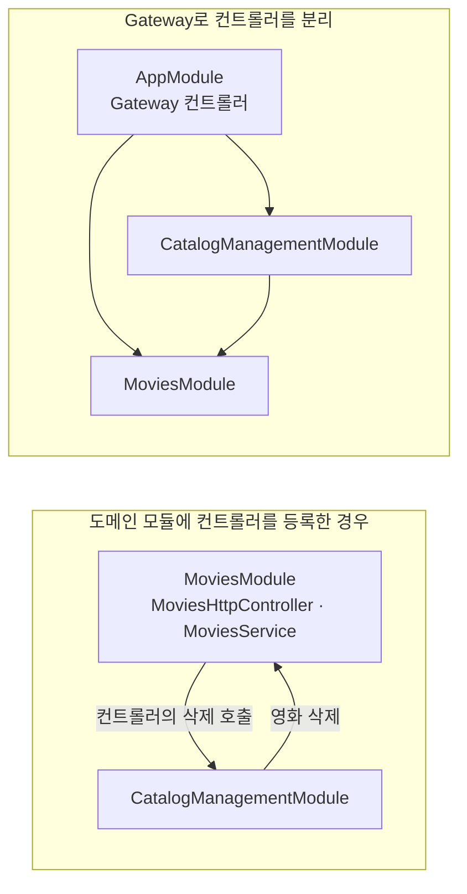
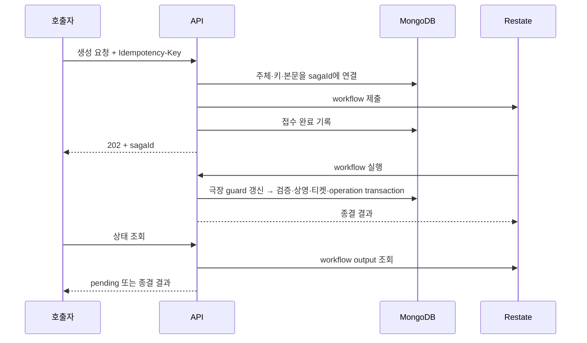

# apps/ — API와 연결 데모

`apps/api`는 이 시드의 중심이다. `console`과 `user-app`은 API 연결·쿠키 인증·화면 조회의 예제다. API의 모듈 설계는 아래 경계를 따르고, 공통화할 구현은 [libs 기준](libs.md)으로 판단한다.

## SoLA의 모듈 의존 방향

SoLA는 모듈 사이의 책임과 의존 방향을 정한다. Controller·Service·Repository의 기술적 역할 구분과는 별개로, 한 도메인의 규칙은 Core에, 여러 도메인을 조합하는 책임은 Application에 둔다. 각 도메인 모듈 안에는 필요한 Service·Repository를 함께 둘 수 있다. 같은 계층의 다른 모듈을 직접 참조하지 않고, 둘을 사용할 수 있는 상위 계층에서 협력시킨다.

```text
Gateway         HTTP 진입점·인증 주체·입력 변환
    ↓
View            화면 전용 읽기 조합
    ↓
Application     여러 도메인·외부 효과의 유스케이스 조합
    ↓
Core            한 도메인의 상태·규칙·저장소
    ↓
Infrastructure  결제·파일 같은 외부 연동의 앱 정책
```

필요한 하위 계층은 직접 사용할 수 있다. 단일 극장 CRUD는 Gateway → Core로 충분하다. 영화 삭제 전에 상영 존재를 확인해야 하는 작업은 `CatalogManagementService`가 Movies와 Showtimes를 조합한다. 계층 수를 맞추기 위해 통과만 하는 Application Service를 만들지 않는다.

View는 데이터를 읽어 화면 DTO·순서·개수를 결정한다. `UserHomeViewService`가 추천·영화·상영·극장을 조합하는 예다. 도메인 상태 변경과 transaction은 View에 두지 않는다. Application과 Core는 View를 모르며 화면 요구가 도메인 API의 목적을 바꾸지 않게 한다.

도메인 내부에는 필요한 Service·Repository·모델·DTO를 둔다. `internal/`과 `worker/`는 구현을 나눈 위치이며 별도 도메인 계층이 아니다. 모듈 공개 진입점과 이름은 [개발 규칙](reference/conventions.md)을 따른다. 계층 방향과 모듈 간 import는 lint가 검사하지만 View의 읽기 전용 책임처럼 코드의 의미는 리뷰해야 한다.

`config/`는 주입받은 env를 검증하고, `modules/`와 `app.module.ts`는 연결·제공자를 조립한다. 이곳에 도메인 규칙을 넣지 않는다. `ConfigModule`은 `ignoreEnvFile: true`로 실행 환경을 사용한다. 파일 주입과 재생성은 [Dev Container](devcontainer.md)의 책임이다.

### 컨트롤러를 Gateway로 분리하는 이유

이 시드에서는 컨트롤러가 다른 모듈에서 export한 서비스를 주입받도록, 컨트롤러를 등록한 모듈이 해당 모듈을 import한다. 이 때문에 컨트롤러를 도메인 모듈에 묶으면 상위 유스케이스에 대한 의존까지 도메인 모듈에 생길 수 있다.

예를 들어 현재 `MoviesHttpController`는 `MoviesService`와 `CatalogManagementService`를 사용한다. 이 컨트롤러를 `MoviesModule`에 등록하면 `CatalogManagementModule`을 import해야 하는데, `CatalogManagementModule`도 영화 삭제를 위해 `MoviesModule`을 import한다. 서비스 호출은 CatalogManagement → Movies의 단방향이어도 모듈은 서로 참조하게 된다.


```mermaid
flowchart LR
    subgraph coupled["도메인 모듈에 컨트롤러를 등록한 경우"]
        direction TB
        M1["MoviesModule<br/>MoviesHttpController · MoviesService"]
        C1["CatalogManagementModule"]
        M1 -->|컨트롤러의 삭제 호출| C1
        C1 -->|영화 삭제| M1
    end
    subgraph separated["Gateway로 컨트롤러를 분리"]
        direction TB
        A["AppModule<br/>Gateway 컨트롤러"]
        C2["CatalogManagementModule"]
        M2["MoviesModule"]
        A --> C2
        A --> M2
        C2 --> M2
    end
```

그래서 이 시드는 컨트롤러를 `services/gateway`에 두고 `AppModule`에 등록해 필요한 모듈을 상위에서 소비한다. `MoviesModule`은 컨트롤러의 유스케이스 의존을 갖지 않고, CatalogManagement → Movies의 단방향이 유지된다. 폴더 이동과 함께 NestJS 모듈의 등록·import 경계도 분리해야 한다. `forwardRef`로 순환 의존의 주입을 가능하게 해도 이 책임 결합은 사라지지 않는다.

## 데이터와 DTO

각 도메인은 자기 collection을 소유한다. 다른 도메인의 repository나 collection을 직접 join하지 않고 공개 서비스를 통해 협력한다. Ticket의 `movieId`·`theaterId`·`showtimeId`처럼 조회를 단순하게 하는 안정적인 값은 중복 저장할 수 있다. 중복 값이 바뀔 때의 책임까지 사라지는 것은 아니다.

| 용어           | 역할                                            |
| -------------- | ----------------------------------------------- |
| Booking        | 상영·좌석을 찾고 임시 선점하는 동선             |
| Purchase       | 결제·티켓 판매와 보상을 조율하는 작업           |
| PurchaseRecord | 진행·실패·완료와 멱등 응답을 보관하는 구매 기록 |
| TicketHolding  | 만료되는 Redis 선점 상태                        |
| Ticket         | DB에 남는 판매 여부와 좌석 좌표                 |

극장은 좌석 배치 하나를 가진 상영 공간으로 단순화한다. 극장 좌석과 티켓 좌석은 같은 모양이어도 각 도메인이 소유하는 의미가 달라 별도 모델이다. 좌석 좌표에는 별도 ID를 만들지 않는다. 생성·수정 입력에서 활성 좌석의 `(block, row, seatNumber)` 중복을 거부해 같은 좌석의 티켓이 여러 개 생기지 않게 한다.

빈 배치나 전부 `X`인 배치도 허용한다. 티켓이 없는 상영은 예매 조회에서 판매 집계를 0으로 반환한다. Tickets의 집계는 요청한 상영 ID마다 결과를 제공하며, 그 결과 자체가 누락된 내부 오류는 정상적인 0건과 구분한다.

HTTP ID는 문자열로 전달한다. ObjectId 변환은 Repository의 명시적인 필터에서 처리한다. 서비스는 Mongo 오류 번호나 ClientSession을 다루지 않는다. transaction으로 묶을 업무는 Application이 결정하고, 세션 생성·종료와 driver 실행은 common이 소유한다. `TransactionContext`는 콜백 안에서만 유효하며, 재실행될 수 있는 transaction 콜백에 결제·메시지 발행을 넣지 않는다.

HTTP 요청은 명시한 Zod 스키마로 검사·변환하고, 응답도 DTO 스키마가 데이터 형태를 소유한다. 내부 DB 모델 전체를 응답으로 내보내지 않는다. 달력 날짜는 `Temporal.PlainDate`, 특정 순간은 `Temporal.Instant`로 구분한다. 테스트와 Restate JSON 복원도 같은 DTO 스키마를 사용하며 문자열 모양으로 날짜를 추측하지 않는다.

영화는 draft로 만들고 필수 정보가 갖춰지면 publish한다. 공개 단건·목록·추천은 공개된 영화만 사용한다. 관람 기록처럼 내부 조회에 필요한 `getMany`까지 공개 조회로 바꾸지는 않는다. 영화·극장에 상영이 등록돼 있으면 삭제를 거부한다. 삭제 단계는 사람이 판단하며 자동 cascade와 삭제·생성 동시성 조정은 시드 범위에 넣지 않는다.

영화 이미지는 해당 영화의 업로드 요청 → 파일 전송 → finalize 순서로 연결한다. finalize가 업로드 완료와 소유자를 확인한 뒤 영화에 연결하므로, 생성·수정 본문의 `assetIds`는 허용하지 않는다. 이미지 제거도 전용 삭제 경로를 사용한다.

## 구매와 선점

한 구매에는 한 상영의 티켓만 포함한다. 같은 상영의 Redis 키는 hash slot을 공유해 Lua 한 번으로 티켓 묶음의 소유자를 확인·변경한다. 사용자 선점을 구매 기록의 소유권으로 claim한 뒤 결제하고, 판매 직전에 claim을 확인·연장한다. 부분 구매에서 남은 사용자 선점은 기존 TTL을 유지한다.

Ticket의 `available`은 아직 판매되지 않았다는 뜻이다. 다른 사용자의 Redis 선점 여부까지 나타내지는 않는다. 구매 가능 여부를 이 필드 하나로 판단하지 않는다.

구매의 durable 시작점은 Restate 접수다. HTTP 요청은 workflow 결과를 기다리며, workflow는 다음 상태를 진행한다.

```text
pending → completed
   └────→ compensating → cancelled
```

구매 기록 예약 → claim → 결제 → 판매를 순서대로 실행한다. 티켓의 Available → Sold, 구매 완료 상태, 최초 응답 스냅샷은 같은 MongoDB transaction으로 확정한다. 일부 티켓만 겹치는 두 구매의 이중 판매도 이 조건부 전이가 막는다. 구매 요청 전체에 별도 Redis 락을 덧붙이지 않는다.

선점 상실·판매 충돌처럼 확정된 업무 실패는 기록한 뒤 claim 해제와 결제 취소를 수행한다. 결제·DB 결과가 불명확한 실패는 Restate가 재시도하며, 인프라 장애가 계속되면 처리 중으로 남는다. 결과를 모르는 상태를 취소 성공으로 해석하지 않는다.

외부 효과가 성공한 직후 journal 기록을 잃으면 같은 step이 다시 실행될 수 있다. 따라서 claim은 같은 구매 소유자를 허용하고 결제는 구매 ID로 중복을 막는다. 완료 transaction을 재실행할 때는 이미 저장한 응답을 사용한다. 현재 Payments는 외부 PG 없이 MongoDB에 결제 상태를 기록하는 예제다.

완료 후에는 구매 ID를 키로 별도 알림 workflow를 접수한다. 구매 응답은 그 접수까지만 기다리고 JetStream 발행을 기다리지 않는다. 발행 진행 상태와 재시도는 Restate journal이 소유하며 PubAck까지 기다린다. PubAck는 JetStream의 저장 확인이며 소비자가 알림을 처리했다는 뜻이 아니다.

## 상영 생성과 알림

상영 생성은 `202 + sagaId` 접수와 실행 결과를 분리한다.


```mermaid
sequenceDiagram
    participant C as 호출자
    participant A as API
    participant M as MongoDB
    participant R as Restate
    C->>A: 생성 요청 + Idempotency-Key
    A->>M: 주체·키·본문을 sagaId에 연결
    A->>R: workflow 제출
    A->>M: 접수 완료 기록
    A-->>C: 202 + sagaId
    R->>A: workflow 실행
    A->>M: 극장 guard 갱신 → 검증·상영·티켓·operation transaction
    A-->>R: 종결 결과
    C->>A: 상태 조회
    A->>R: workflow output 조회
    A-->>C: pending 또는 종결 결과
```

실행은 202 응답 전에 시작할 수도 있다. 접수 기록의 lease는 제출 결과를 저장하기 전에 API가 종료됐을 때 같은 sagaId로 재제출할 수 있게 한다. Restate key는 같은 작업의 중복 제출을 합치지만, 서로 다른 작업이 같은 극장 시간을 차지하는 경쟁까지 막지는 않는다.

상태 조회는 principalId와 sagaId로 접수 주체를 먼저 확인한다. 다른 주체이거나 접수 기록이 없으면 404이며, 확인된 작업의 output만 Restate에서 읽는다.

시간 충돌 검증 전에 transaction 안에서 극장 문서를 갱신해 경쟁 transaction의 쓰기 충돌 지점으로 삼는다. driver가 새로운 snapshot으로 재시도하면 앞선 생성 결과를 다시 확인한다. 상영·티켓·operation은 한 transaction에 생성하며 sagaId unique operation으로 재실행 결과를 재사용한다.

구간의 끝은 포함하지 않는다. 기존 상영이 13:30에 끝나면 13:30부터 새 상영을 시작할 수 있다. 요청 내부의 겹치는 시작 시각은 접수 전에 400, 기존 상영과의 충돌은 실행 결과 `failed`, 생성 완료는 `succeeded`, 해결되지 않은 시스템 실패는 `error`다. 부분 쓰기는 transaction으로 롤백하며 별도 삭제 보상 step을 만들지 않는다.

한 operation의 상영·티켓 수와 실행 시간에는 상한을 둔다. 정확한 값은 [persistence](../apps/api/src/services/application/showtime-creation/internal/showtime-creation-persistence.service.ts), [creator](../apps/api/src/services/application/showtime-creation/internal/showtime-bulk-creator.service.ts), [workflow](../apps/api/src/services/application/showtime-creation/worker/workflow.ts)가 소유한다. 대규모 배치 분할과 작업 관리 제품을 구현한 예제는 아니다.

### 메시지가 보장하는 것

상영 진행 이벤트는 Core NATS → 각 복제본의 RxJS Subject → 연결된 SSE client로 전달된다. 연결 전 이벤트는 replay하지 않으며, payload의 sagaId로 자기 작업을 골라야 한다. NATS flush는 서버가 이전 명령을 처리했다는 확인으로, 소비자 처리나 durable 저장 ack가 아니다.

SSE 발행 실패·기한 초과는 기록하고 업무 실행을 계속한다. DB commit으로 생성은 완료되며 SSE는 진행 알림이다. 알림을 놓친 호출자는 Restate 출력 보존 기간 안에 상태 API를 조회할 수 있다. 출력 보존은 유한하고 영구 멱등 저장소가 아니므로 DB operation과 역할이 다르다.

구매 완료 알림은 JetStream에 보존한다. DB·PubAck·소비자의 외부 효과·ack 사이를 한 transaction으로 묶지 못하므로 at-least-once이고 중복은 가능하다. 실제 발송을 추가할 소비자는 구매 ID를 provider 멱등성 키 또는 durable inbox 키로 사용해야 한다. 현재 소비자는 발송할 내용을 로그로 남기는 예제다.

stream은 용량을 넘으면 새 발행을 거부하고 workflow가 재시도한다. 보존·중복 억제 기간과 크기는 [purchase-event.service.ts](../apps/api/src/services/application/purchase/purchase-event.service.ts)가 소유한다. 상세 원리와 도구 선택은 [설계 결정](reference/decisions.md)에 둔다.

## HTTP와 인증 계약

리소스 중심 경로를 기본으로 하되 `booking/`, `showtime-creation/`처럼 여러 단계가 함께 의미를 갖는 유스케이스는 namespace로 묶는다. 긴 ID 목록·복합 검색은 `POST .../search`를 사용할 수 있다. 이 예외로 상태 변경을 조회처럼 숨기지 않는다.

구매·상영 생성처럼 중복 실행 비용이 큰 POST에는 Idempotency-Key가 필요하다. 주체·키·본문의 관계를 유지한다.

| 재요청                                          | 처리                                     |
| ----------------------------------------------- | ---------------------------------------- |
| 같은 키·같은 본문                               | 최초 접수 또는 확정된 결과 재사용        |
| 같은 키·다른 본문                               | 409 Conflict                             |
| 구매가 아직 처리 중인 같은 키                   | 409 Conflict                             |
| 상영 제출 담당자가 접수를 확정하기 전인 같은 키 | 409 Conflict                             |
| 상영 접수를 확정한 같은 키·같은 본문            | workflow 실행 중이어도 같은 sagaId의 202 |
| 다른 키·같은 본문                               | 별도 작업이며 DB 상태 조건으로 경쟁 처리 |

부수 효과 전 검증 실패와 실행을 시작한 뒤 저장한 실패는 다르다. 구매가 저장한 오류도 보상 완료 후 같은 키로 재현한다. 재시도마다 새 키를 만들면 멱등 요청이 아니다.

구매 기록은 멱등성 키가 없는 내부 생성도 허용하므로 문자열 키에만 unique 제약을 적용한다. 멱등성 조회에도 이 부분 인덱스의 문자열 조건을 명시해야 누적된 구매 기록 전체를 순회하지 않는다. 결제의 구매 ID 조회도 같은 이유로 부분 인덱스의 문자열 조건을 포함한다.

admin은 콘텐츠와 임의 사용자 자원을, user는 본인 자원을 다룬다. 최초 admin은 독립 스크립트로 생성한다. `/me`와 구매자의 ID는 본문의 값 대신 token subject로 결정한다. 같은 컨트롤러에 공개·user·admin 경로가 섞이면 guard를 메서드마다 지정하고, `/me`는 `/:userId`보다 먼저 선언한다.

액세스 JWT는 서명·만료·issuer/audience·필수 claim을 검사하고 계정 DB를 조회하지 않는다. 유효 기간은 5분이며 로그아웃·비밀번호 변경·계정 삭제가 이미 발급한 액세스 권한을 즉시 회수하지 않는다. 삭제된 계정의 `/me`는 인증 후 자원 조회에서 404가 될 수 있다.

리프레시 토큰은 로그인 세션별 현재 해시를 Redis에 저장하고 원자적으로 교체한다. 교체된 과거 토큰은 409이며 현재 세션은 유지한다. 로그아웃은 그 세션을, 전체 로그아웃·비밀번호 변경·계정 삭제는 기존 리프레시 세션을 제거한다. authVersion·토큰 재사용 계보·즉시 액세스 회수는 추가하지 않는다.

로그인 실패는 IP별로 제한하며 성공해도 실패 횟수를 초기화하지 않는다. 이메일별 잠금이나 추가 보안 정책은 구현하지 않는다. 역할별 서명 키와 `/me`의 소유권은 기본 API 계약으로 유지한다.

## 통합 테스트와 실행 가능한 API 문서

API 테스트는 실제 Nest 앱과 MongoDB·Redis·S3·NATS·Restate 경계를 사용한다. `createAppTestContext`가 만든 앱은 각 테스트가 teardown한다. worker별 DB·bucket과 테스트별 PROJECT_ID로 자원을 구분하고, 같은 API Vitest 명령을 동시에 여러 개 실행하지 않는다.

모듈 최상위의 `process.env` 읽기는 import 때 고정된다. 테스트별 prefix·subject·workflow 이름은 provider 생성 때 주입한 설정으로 결정한다. workflow 테스트는 `enableRestate: true`로 endpoint를 등록하고, teardown은 작업 종료 후 등록을 제거한다. 다른 테스트에서는 의도하지 않은 workflow 제출을 거절한다.

접수 202, DB 생성, 이벤트 전달은 서로 다른 결과다. DB 결과는 작업 종결 후 다시 조회하고, SSE 자체를 검증할 때는 구독 준비 후 요청한다. 실제 insert 뒤 오류를 주입해야 transaction rollback을 검증할 수 있다. 자세한 작성 기준은 [개발 규칙](reference/conventions.md), 여러 프로세스의 검증은 [tests](tests.md)를 따른다.

`api-docs/*.spec`는 bash·curl로 주요 요청 흐름을 실행한다. `TEST`는 설명과 기대 상태를 가진 문서 항목이고 `SETUP`은 그 조건을 준비하는 요청이다. SSE·장애 행렬까지 curl 문서에 복제하지 않는다. 응답은 `_output/logs/`, 실행한 항목 요약은 `_output/docs/summary.md`에 남는다.

`common.fixture`의 `login_admin`·`login_user`는 이후 요청에 인증 헤더를 넣고, `as_guest`는 자동 주입을 해제한다. spec의 명시적 Authorization이 우선한다. 직접 실행 대상은 api-docs의 `.env`, 외부 검증 스택은 runner가 지정한 SERVER_URL을 사용한다.

`scripts/`는 API 소스와 별도로 실행한다. admin 생성과 Restate 개발 등록 같은 도구는 common 빌드 없이 필요한 SDK를 직접 사용한다. 이 경계를 이유 없이 앱 DI나 공통 runtime으로 옮기지 않는다.

## 데모와 BFF

console은 관리자 로그인·영화·극장·사용자 관리, user-app은 가입·로그인·홈 조회를 보여 준다. 예매 전체 UI와 frontend 전용 공통 프레임워크를 만들지 않는다. 화면 응답 조합은 API View가, 각 Next.js Route Handler는 쿠키와 API 요청 전달을 맡는다.

access·refresh token은 HttpOnly cookie에 보관하고 각 JWT exp로 만료한다. access 인증 실패 시 refresh 후 원 요청을 한 번 재시도한다. 같은 프로세스의 동시 갱신은 합치고 결과를 짧게 공유한다. 다른 프로세스에서 회전한 토큰의 409 때문에 쿠키를 지우지 않으며, 원 요청 재시도가 실패해도 이미 발급받은 새 쿠키는 보관한다.

최초 요청과 회전 후 재시도에서 upstream 응답을 받기 전 fetch가 실패하면 `502` JSON 오류로 반환한다. 브라우저가 같은 오류 응답 형식으로 실패를 표시할 수 있게 하는 계약이다.

현재 BFF는 body 제한·상태 변경 요청의 Origin/Host 확인을 수행한다. 최종 인가는 API guard의 책임이다. frontend의 API_BASE_URL은 API_PORT와 자동 연동되지 않고, frontend 포트 변경도 Compose·tunnel·포트 전달 설정을 함께 맞춰야 한다.

BFF는 기본적으로 전달된 IP 헤더를 신뢰하지 않는다. 이때 API에는 BFF 주소가 보여 여러 사용자가 같은 로그인 제한 버킷을 공유할 수 있다. 운영에서 `BFF_TRUST_PROXY_HEADERS=true`를 선택하려면 다음 경계를 갖춰야 한다.

```text
인터넷 → 실제 연결 주소로 IP 헤더를 재구성하는 edge → BFF → 사설 API
```

origin과 API에 직접 접근하지 못하게 하고, edge가 X-Forwarded-For의 오른쪽 끝 및 X-Real-IP를 실제 연결 주소로 덮어써야 한다. BFF는 오른쪽 끝값을 사용하며 잘못된 값 대신 앞쪽 주소를 신뢰하지 않는다. production cookie의 Secure가 기본이며, HTTP로 실행하는 [web 테스트](tests.md)는 이 조건의 일부만 모사한다.

API production은 Rspack으로 앱 코드를 bundle하고 common 등 runtime 패키지는 external로 배포한다. 개발 watch의 TSC 경로와 목적이 다르다. Restate endpoint는 API 안에서 함께 실행하며 별도 worker bundle은 두지 않는다.
