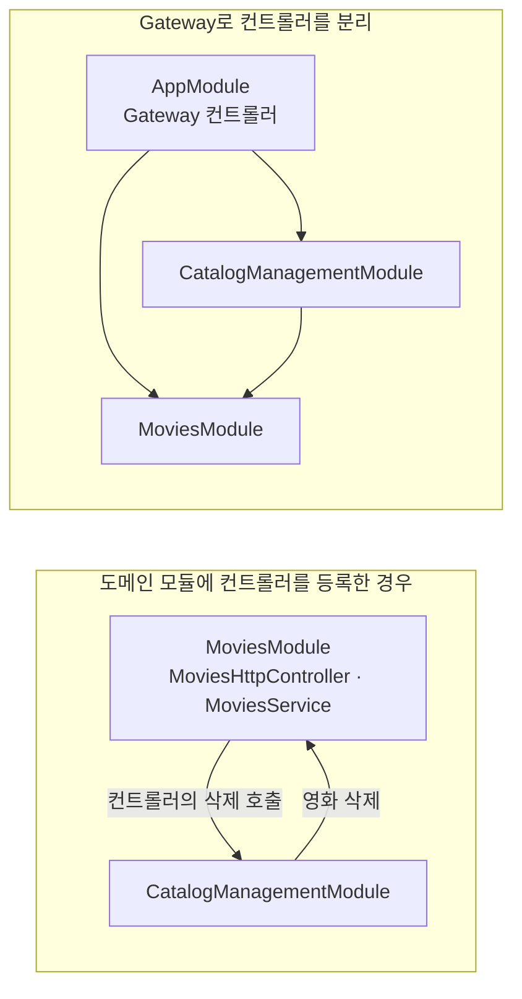
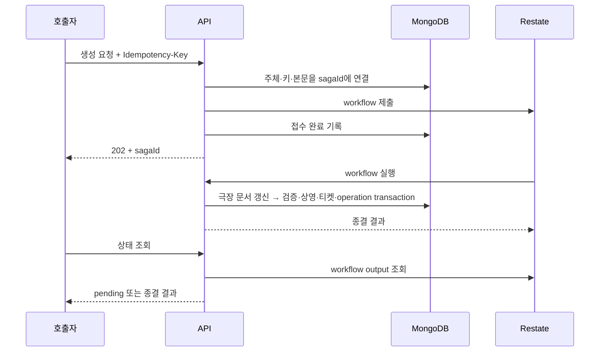

# apps/ — API와 연결 데모

`apps/api`는 이 시드의 중심이다. `console`과 `user-app`은 API 연결과 쿠키 인증, 화면 조회를 보여 주는 데모다. API 모듈은 아래 의존 방향을 따르며, 공통 코드로 옮길지는 [libs 기준](libs.md)으로 판단한다.

## SoLA의 모듈 의존 방향

SoLA는 모듈 사이의 책임과 의존 방향을 정한다. 모듈 내부의 Controller·Service·Repository 역할 구분과는 다르다. 한 도메인의 규칙은 Core에, 여러 도메인을 조합하는 책임은 Application에 둔다. 각 도메인 모듈에는 필요한 Service·Repository·모델·DTO를 함께 둘 수 있다. 같은 계층의 다른 모듈을 직접 참조하지 않고, 상위 계층에서 이들을 조합한다.

```text
Gateway         HTTP 진입점·인증 주체·입력 변환
    ↓
View            화면 전용 읽기 조합
    ↓
Application     여러 도메인·외부 효과의 유스케이스 조합
    ↓
Core            한 도메인의 상태·규칙·저장소
    ↓
Infrastructure  결제·파일 같은 외부 연동의 앱 정책
```

필요한 하위 계층은 직접 사용할 수 있다. 극장 도메인의 CRUD는 Gateway → Core로 충분하다. 영화 삭제 전에 상영이 있는지 확인하는 작업은 `CatalogManagementService`가 Movies와 Showtimes를 조합한다. 계층 수를 맞추려고 호출을 전달하기만 하는 Application Service를 만들지 않는다.

View는 데이터를 읽어 화면에 반환할 DTO와 항목의 순서·개수를 결정한다. `UserHomeViewService`는 추천·영화·상영·극장 정보를 조합한다. 도메인 상태 변경과 transaction은 View에 두지 않는다. Application과 Core는 View에 의존하지 않으며, 화면 요구에 맞추기 위해 도메인 API의 목적을 바꾸지 않는다.

`internal/`과 `worker/`는 모듈 내부 구현을 나눈 폴더이며 별도 도메인 계층이 아니다. 모듈 공개 진입점과 이름은 [개발 규칙](reference/conventions.md)을 따른다. 계층 방향과 모듈 간 import는 lint가 검사한다. View가 상태를 바꾸지 않는지처럼 코드의 동작에 관한 규칙은 리뷰로 확인한다.

`config/`는 주입받은 env를 검증하고, `modules/`와 `app.module.ts`는 외부 연결과 Nest provider를 구성한다. 도메인 규칙은 이곳에 넣지 않는다. `ConfigModule`은 `ignoreEnvFile: true`로 실행 환경에 주입된 값을 사용한다. env 파일의 주입과 변경 반영 방법은 [Dev Container](devcontainer.md)를 따른다.

### 컨트롤러를 Gateway로 분리하는 이유

이 시드에서는 컨트롤러가 다른 모듈에서 export한 서비스를 주입받도록, 컨트롤러를 등록한 모듈이 그 서비스를 제공하는 모듈을 import한다. 따라서 컨트롤러를 도메인 모듈에 등록하면 상위 유스케이스에 대한 의존까지 도메인 모듈에 생길 수 있다.

예를 들어 현재 `MoviesHttpController`는 `MoviesService`와 `CatalogManagementService`를 사용한다. 이 컨트롤러를 `MoviesModule`에 등록하면 `CatalogManagementModule`을 import해야 하는데, `CatalogManagementModule`도 영화 삭제를 위해 `MoviesModule`을 import한다. 서비스 호출은 CatalogManagement → Movies의 단방향이어도 모듈은 서로 참조하게 된다.


```mermaid
flowchart LR
    subgraph coupled["도메인 모듈에 컨트롤러를 등록한 경우"]
        direction TB
        M1["MoviesModule<br/>MoviesHttpController · MoviesService"]
        C1["CatalogManagementModule"]
        M1 -->|컨트롤러의 삭제 호출| C1
        C1 -->|영화 삭제| M1
    end
    subgraph separated["Gateway로 컨트롤러를 분리"]
        direction TB
        A["AppModule<br/>Gateway 컨트롤러"]
        C2["CatalogManagementModule"]
        M2["MoviesModule"]
        A --> C2
        A --> M2
        C2 --> M2
    end
```

그래서 이 시드는 컨트롤러를 `services/gateway`에 두고 `AppModule`에 등록한다. 필요한 모듈은 상위의 `AppModule`에서 import하므로 `MoviesModule`이 컨트롤러의 유스케이스에 의존하지 않고, CatalogManagement → Movies의 단방향을 유지한다. 폴더만 옮기지 말고 컨트롤러 등록과 모듈 import도 함께 분리해야 한다. `forwardRef`로 순환 의존을 주입할 수 있게 해도 모듈 간 결합은 남는다.

## 데이터와 DTO

각 도메인은 자기 collection의 읽기·쓰기를 담당한다. 다른 도메인의 Repository나 collection에 직접 접근해 join하지 않고 공개 서비스를 통해 협력한다. Ticket의 `movieId`·`theaterId`·`showtimeId`처럼 조회를 단순하게 하는 안정적인 값은 중복 저장할 수 있다.

| 용어           | 역할                                            |
| -------------- | ----------------------------------------------- |
| Booking        | 상영·좌석을 찾고 임시 선점하는 동선             |
| Purchase       | 결제·티켓 판매와 보상을 조율하는 작업           |
| PurchaseRecord | 진행·실패·완료와 멱등 응답을 보관하는 구매 기록 |
| TicketHolding  | 만료되는 Redis 선점 상태                        |
| Ticket         | DB에 남는 판매 여부와 좌석 좌표                 |

극장은 좌석 배치 하나를 가진 상영 공간으로 단순화한다. 극장 좌석과 티켓 좌석은 형태가 같아도 각 도메인에서 뜻하는 바가 달라 별도 모델로 둔다. 좌석 좌표에는 별도 ID를 만들지 않는다. 생성·수정 입력에서 활성 좌석의 `(block, row, seatNumber)` 중복을 거부해 같은 좌석의 티켓이 여러 개 생기지 않게 한다.

빈 배치나 전부 `X`인 배치도 허용한다. 티켓이 없는 상영은 예매 조회에서 판매 집계를 0으로 반환한다. Tickets는 요청한 상영 ID마다 집계 결과를 반환한다. 집계 결과 자체가 빠진 경우는 내부 오류이며, 정상적인 0건과 구분한다.

HTTP에서 ID는 문자열로 전달하고, Repository가 ID 필터를 명시해 ObjectId로 변환한다. 서비스는 MongoDB 오류 번호나 ClientSession을 다루지 않는다. transaction으로 묶을 업무는 Application이 결정하고, 세션 생성·종료와 driver 실행은 common이 맡는다. `TransactionContext`는 콜백 안에서만 유효하다. transaction 콜백은 재실행될 수 있으므로 결제·메시지 발행을 넣지 않는다.

HTTP 요청은 명시한 Zod 스키마로 검사·변환하고, 응답의 형태도 DTO 스키마로 정의한다. 내부 DB 모델 전체를 응답으로 내보내지 않는다. 달력 날짜는 `Temporal.PlainDate`, 특정 순간은 `Temporal.Instant`로 구분한다. 테스트 응답과 Restate의 JSON 데이터를 복원할 때도 같은 DTO 스키마를 사용하며, 문자열 모양으로 날짜를 추측하지 않는다.

영화는 draft로 만들고 필수 정보가 갖춰지면 publish한다. 공개 단건 조회·목록·추천에는 공개된 영화만 포함한다. 관람 기록 등에서 사용하는 내부 조회 `getMany`에는 이 공개 조건을 적용하지 않는다. 영화나 극장에 상영이 등록돼 있으면 삭제를 거부한다. 어떤 자원을 먼저 삭제할지는 사람이 판단한다. 연관 자원의 자동 삭제(cascade)와 삭제·생성 요청 사이의 동시성 조정은 제공하지 않는다.

영화 이미지는 해당 영화의 업로드 요청 → 파일 전송 → finalize 순서로 연결한다. finalize가 업로드 완료와 소유자를 확인한 뒤 영화에 연결하므로, 생성·수정 본문의 `assetIds`는 허용하지 않는다. 이미지 제거도 전용 삭제 경로를 사용한다.

## 구매와 선점

한 구매에는 한 상영의 티켓만 포함한다. 같은 티켓 ID를 중복하면 대소문자가 달라도 구매 기록·결제를 만들기 전에 400으로 거절하며 기존 선점은 유지한다.

같은 상영의 Redis 키는 hash slot을 공유하므로 Lua 스크립트 한 번으로 티켓 묶음의 소유자를 확인·변경한다. claim 단계에서 선점 소유자를 사용자에서 구매 기록으로 바꾼 뒤 결제하고, 판매 직전에 claim을 확인·연장한다. 선점한 티켓 중 일부만 구매하면 나머지 사용자 선점은 기존 TTL을 유지한다.

Ticket의 `available`은 아직 판매되지 않았다는 뜻이다. 다른 사용자의 Redis 선점 여부는 나타내지 않으므로 이 필드만으로 구매 가능 여부를 판단할 수 없다.

구매는 Restate가 접수한 뒤부터 중단 후 재개할 수 있다. HTTP 요청은 workflow 결과를 기다리며, workflow가 구매 기록을 다음 상태로 전환한다.

```text
pending → completed
   └────→ compensating → cancelled
```

구매 기록 예약 → claim → 결제 → 판매를 순서대로 실행한다. 티켓의 Available → Sold 전환, 구매 완료 상태, 최초 응답 스냅샷은 같은 MongoDB transaction으로 확정한다. 일부 티켓만 겹치는 두 구매도 이 조건부 상태 전환으로 이중 판매를 막는다. 구매 요청 전체를 묶는 별도 Redis 락은 두지 않는다.

선점 상실·판매 충돌처럼 확정된 업무 실패는 구매 기록에 남긴 뒤 claim 해제와 결제 취소를 수행한다. 결제나 DB 작업의 결과를 확인하지 못한 경우에는 Restate가 재시도하며, 인프라 장애가 계속되면 구매는 처리 중으로 남는다. 결과를 모르는 상태를 취소 성공으로 응답하지 않는다.

외부 효과가 성공한 뒤 journal에 기록되기 전에 실행이 중단되면 같은 step이 다시 실행될 수 있다. 따라서 같은 구매가 다시 claim하는 것을 허용하고 결제는 구매 ID로 중복을 막는다. 완료 transaction을 재실행할 때는 이미 저장한 응답을 사용한다. 현재 Payments는 외부 PG 없이 MongoDB에 결제 상태를 기록하는 예제다.

구매 완료 후에는 구매 ID를 키로 별도 알림 workflow를 접수한다. 구매 응답은 그 접수까지만 기다리고 JetStream 발행은 기다리지 않는다. 알림 workflow가 PubAck까지 기다리며, Restate가 journal을 바탕으로 진행 상태와 재시도를 관리한다. PubAck는 JetStream의 저장 확인이며 소비자가 알림을 처리했다는 뜻이 아니다.

## 상영 생성과 알림

상영 생성은 `202 + sagaId` 접수와 실행 결과를 분리한다.


```mermaid
sequenceDiagram
    participant C as 호출자
    participant A as API
    participant M as MongoDB
    participant R as Restate
    C->>A: 생성 요청 + Idempotency-Key
    A->>M: 주체·키·본문을 sagaId에 연결
    A->>R: workflow 제출
    A->>M: 접수 완료 기록
    A-->>C: 202 + sagaId
    R->>A: workflow 실행
    A->>M: 극장 문서 갱신 → 검증·상영·티켓·operation transaction
    A-->>R: 종결 결과
    C->>A: 상태 조회
    A->>R: workflow output 조회
    A-->>C: pending 또는 종결 결과
```

workflow는 202 응답 전에 시작할 수도 있다. 접수 기록의 lease를 통해, 제출 결과를 저장하기 전에 API가 종료돼도 같은 sagaId로 재제출할 수 있다. Restate key는 같은 작업의 중복 제출을 합치지만, 서로 다른 작업이 같은 극장 시간을 차지하는 경쟁까지 막지는 않는다.

상태 조회 시에는 principalId와 sagaId로 요청자가 작업을 접수한 주체인지 먼저 확인한다. 다른 주체이거나 접수 기록이 없으면 404를 반환한다. 확인된 작업의 결과만 Restate에서 읽는다.

시간 충돌을 검증하기 전에 transaction 안에서 극장 문서를 갱신한다. 같은 극장에 상영을 만드는 transaction끼리 쓰기 충돌이 나도록 하기 위해서다. driver가 새로운 snapshot으로 재시도하면 앞선 생성 결과를 확인할 수 있다. 상영·티켓과 생성 결과를 기록한 operation은 한 transaction에서 만든다. operation의 sagaId에 unique 제약을 두어 같은 작업을 재실행하면 기존 결과를 재사용한다.

상영 시간 구간의 끝은 포함하지 않는다. 기존 상영이 13:30에 끝나면 13:30부터 새 상영을 시작할 수 있다. 한 요청 안에서 상영 시간이 겹치면 접수 전에 400을 반환한다. 접수 후 기존 상영과 충돌하면 실행 결과는 `failed`, 생성이 완료되면 `succeeded`, 시스템 실패가 해결되지 않으면 `error`다. 일부 쓰기만 성공한 경우에는 transaction으로 롤백하며, 별도 삭제 보상 step을 만들지 않는다.

한 operation에서 만들 수 있는 상영·티켓 수와 실행 시간에는 상한이 있다. 정확한 값은 [persistence](../apps/api/src/services/application/showtime-creation/internal/showtime-creation-persistence.service.ts), [creator](../apps/api/src/services/application/showtime-creation/internal/showtime-bulk-creator.service.ts), [workflow](../apps/api/src/services/application/showtime-creation/worker/workflow.ts)에 정의한다. 이 예제는 대규모 배치 분할이나 작업 관리 기능까지 제공하지 않는다.

### 메시지가 보장하는 것

상영 진행 이벤트는 Core NATS → 각 복제본의 RxJS Subject → 연결된 SSE client로 전달된다. 연결 전 이벤트는 다시 보내지 않으며, 호출자는 payload의 sagaId로 자기 작업의 이벤트를 골라야 한다. NATS flush는 서버가 이전 명령을 처리했다는 확인이다. 메시지의 영속 저장이나 소비자의 처리 완료를 확인하는 ack는 아니다.

workflow는 SSE 발행 실패나 기한 초과를 로그에 남기고 업무 실행을 계속한다. 상영 생성은 DB commit으로 완료되며 SSE는 진행 상황을 알린다. 알림을 놓친 호출자는 Restate의 결과 보존 기간 안에 상태 API를 조회할 수 있다. Restate 결과에는 보존 기한이 있으므로, 재실행의 중복 생성을 막는 DB operation을 대신하지 않는다.

구매 완료 알림은 JetStream에 보존한다. DB 저장, 발행의 PubAck, 소비자의 외부 효과와 ack를 한 transaction으로 묶을 수 없으므로 at-least-once로 전달하며 중복이 가능하다. 실제 발송을 추가할 때는 소비자가 구매 ID를 발송 서비스의 멱등성 키나 durable inbox의 키로 사용해야 한다. 현재 소비자는 발송할 내용을 로그로 남기는 예제다.

stream의 용량이 한도에 도달하면 새 발행을 거부하고 workflow가 재시도한다. 보존 기간·중복 억제 기간·용량은 [purchase-event.service.ts](../apps/api/src/services/application/purchase/purchase-event.service.ts)에 정의한다. 전달 방식의 원리와 도구 선택 이유는 [설계 결정](reference/decisions.md)을 참고한다.

## HTTP와 인증 계약

리소스 중심 경로를 기본으로 하되 여러 단계가 하나의 유스케이스를 이루면 `booking/`, `showtime-creation/`처럼 공통 경로로 묶는다. 긴 ID 목록이나 복합 조건을 받는 읽기 전용 검색에는 `POST .../search`를 사용할 수 있다.

구매·상영 생성처럼 중복 실행 비용이 큰 POST에는 Idempotency-Key가 필요하다. 같은 요청 주체의 키와 본문을 연결해 다음과 같이 처리한다.

| 재요청                                          | 처리                                     |
| ----------------------------------------------- | ---------------------------------------- |
| 같은 키·같은 본문                               | 최초 접수 또는 확정된 결과 재사용        |
| 같은 키·다른 본문                               | 409 Conflict                             |
| 구매가 아직 처리 중인 같은 키                   | 409 Conflict                             |
| 상영 제출 담당자가 접수를 확정하기 전인 같은 키 | 409 Conflict                             |
| 상영 접수를 확정한 같은 키·같은 본문            | workflow 실행 중이어도 같은 sagaId의 202 |
| 다른 키·같은 본문                               | 별도 작업이며 DB 상태 조건으로 경쟁 처리 |

부수 효과를 실행하기 전의 검증 실패와 실행을 시작한 뒤 저장한 실패는 구분한다. 구매 과정에서 저장한 오류는 보상이 끝난 뒤 같은 키로 재요청해도 다시 반환한다. 재시도마다 새 키를 만들면 별도 작업으로 처리된다.

구매 기록은 멱등성 키가 없는 내부 생성도 허용하므로 문자열 키에만 unique 제약을 적용한다. 멱등성 조회에도 키가 문자열이라는 조건을 명시해야 이 부분 인덱스를 사용해 전체 기록 조회를 피할 수 있다. 결제의 구매 ID 조회도 같은 이유로 부분 인덱스의 문자열 조건을 포함한다.

admin은 콘텐츠와 모든 사용자의 자원을, user는 본인 자원을 다룬다. 최초 admin은 독립 스크립트로 생성한다. `/me`의 사용자 ID와 구매자 ID는 요청 본문 대신 토큰의 subject로 결정한다. 같은 컨트롤러에 공개·user·admin 경로가 섞이면 guard를 메서드마다 지정하고, `/me`는 `/:userId`보다 먼저 선언한다.

액세스 JWT 인증에서는 서명·만료·issuer/audience·필수 claim을 검사하며 계정 DB를 조회하지 않는다. 유효 기간은 5분이며 로그아웃·비밀번호 변경·계정 삭제로도 이미 발급한 액세스 권한을 즉시 회수하지 않는다. 삭제된 계정의 `/me` 요청은 인증을 통과한 뒤 자원 조회에서 404가 될 수 있다.

리프레시 토큰은 로그인 세션별로 현재 토큰의 해시를 Redis에 저장하고 원자적으로 교체한다. 교체된 과거 토큰을 사용하면 409를 반환하고 현재 세션은 유지한다. 로그아웃은 해당 세션을, 전체 로그아웃·비밀번호 변경·계정 삭제는 해당 계정의 기존 리프레시 세션을 모두 제거한다.

로그인 실패는 IP별로 제한하며 로그인에 성공해도 실패 횟수를 초기화하지 않는다. admin과 user는 서로 다른 서명 키를 사용하며, `/me`는 본인의 자원만 다룬다. 인증 범위를 이렇게 정한 이유는 [설계 결정](reference/decisions.md#기본-로그인과-데모)에 있다.

## 통합 테스트와 실행 가능한 API 문서

API 테스트는 실제 Nest 앱과 MongoDB·Redis·S3·NATS·Restate에 연결한다. worker별 DB·bucket과 테스트별 PROJECT_ID로 자원을 구분하며, 같은 API Vitest 명령의 동시 실행은 지원하지 않는다.

모듈 최상위에서 읽은 `process.env` 값은 import 시점에 고정된다. 따라서 테스트마다 달라지는 prefix·subject·workflow 이름은 provider를 만들 때 주입한 설정으로 결정한다. workflow 테스트는 `enableRestate: true`로 endpoint를 등록하고, 작업 종료 후 정리 단계에서 등록을 제거한다. 다른 테스트에서는 의도하지 않은 workflow 제출을 거절한다.

접수 202, DB 생성, 이벤트 전달은 서로 다른 결과다. DB 결과는 작업이 끝난 후 다시 조회하고, SSE 자체를 검증할 때는 구독을 준비한 뒤 요청한다. 테스트 작성은 [개발 규칙](reference/conventions.md#테스트는-한-행동의-결과를-검증한다), 여러 프로세스의 검증은 [tests](tests.md)를 따른다.

`api-docs/*.spec`는 bash·curl로 주요 요청 흐름을 실행한다. `TEST`는 설명과 기대 HTTP 상태를 정의하는 문서 항목이고, `SETUP`은 그 조건을 준비하는 요청이다. SSE와 세부 장애 조건까지 curl 문서에 복제하지 않는다. 실행 방법과 결과 위치는 [README](../README.md#실행과-검증)를 참고한다.

`common.fixture`의 `login_admin`·`login_user`는 이후 요청에 인증 헤더를 넣고, `as_guest`는 자동 주입을 해제한다. spec에 Authorization을 명시하면 그 값이 우선한다. 직접 실행할 때는 api-docs의 `.env`에서 지정한 서버를, 외부 검증 스택에서는 runner가 지정한 SERVER_URL을 사용한다.

`scripts/`는 API 소스와 별도로 실행한다. admin 생성과 Restate 개발 등록 같은 도구는 common 빌드 없이 필요한 SDK를 직접 사용한다.

## 데모와 BFF

console은 관리자 로그인과 영화·극장·사용자 관리, user-app은 가입·로그인·홈 조회를 보여 준다. 예매 전체 UI와 frontend 전용 공통 프레임워크는 제공하지 않는다. API View는 화면 응답을 조합하고, 각 Next.js Route Handler는 쿠키와 API 요청 전달을 맡는다.

BFF는 액세스·리프레시 토큰을 HttpOnly 쿠키에 보관하고 각 JWT의 exp에 맞춰 쿠키를 만료시킨다. 액세스 인증에 실패하면 토큰을 갱신한 뒤 원 요청을 한 번 재시도한다. 같은 프로세스에서 같은 리프레시 토큰으로 동시에 갱신을 요청하면 하나로 합치고 결과를 짧게 공유한다. 다른 프로세스가 먼저 토큰을 교체해 409를 받더라도 쿠키를 지우지 않는다. 원 요청 재시도가 실패해도 이미 발급받은 새 쿠키는 보관한다.

최초 요청이나 토큰 갱신 후 재시도에서 API 응답을 받기 전에 fetch가 실패하면 BFF는 `502` JSON 오류를 반환한다. 브라우저가 다른 API 오류와 같은 응답 형식으로 실패를 표시할 수 있게 하기 위해서다.

BFF는 요청 본문의 크기를 제한하고, 상태를 변경하는 요청의 Origin/Host를 확인한다. 최종 인가는 API guard가 판단한다. frontend의 API_BASE_URL은 API_PORT와 자동 연동되지 않는다. frontend 포트를 바꿀 때도 Compose·tunnel·포트 전달 설정을 함께 맞춰야 한다.

BFF는 기본적으로 전달된 IP 헤더를 신뢰하지 않는다. 이때 API에는 BFF의 주소가 보이므로 여러 사용자의 로그인 실패 횟수가 같은 IP로 집계될 수 있다. 운영에서 `BFF_TRUST_PROXY_HEADERS=true`를 사용하려면 다음 구조가 필요하다.

```text
인터넷 → 실제 연결 주소로 IP 헤더를 재구성하는 edge → BFF → 사설 API
```

edge를 우회해 origin(BFF 서버)과 API에 직접 접근하지 못하게 해야 한다. edge는 X-Forwarded-For의 오른쪽 끝과 X-Real-IP를 실제 연결 주소로 덮어써야 한다. BFF는 오른쪽 끝값을 사용하며, 그 값이 잘못돼도 앞쪽 주소로 대체하지 않는다. 운영 모드의 쿠키에는 Secure가 기본으로 켜진다. HTTP로 실행하는 [web 테스트](tests.md)는 이 조건의 일부만 모사한다.

API의 production build는 Rspack으로 앱 코드를 묶고, common 등 런타임 패키지는 번들에 넣지 않고 별도로 배포한다. 개발 중 변경을 감지하는 watch 모드는 TSC를 사용한다. Restate endpoint는 API 안에서 함께 실행하므로 별도 worker bundle은 두지 않는다.
