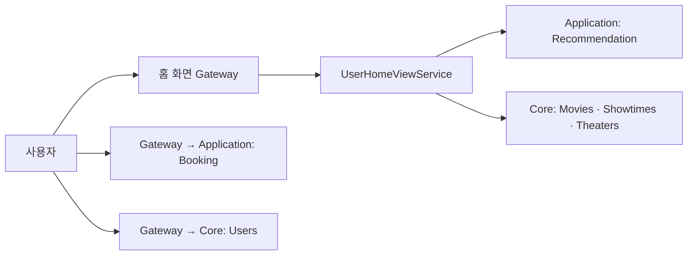
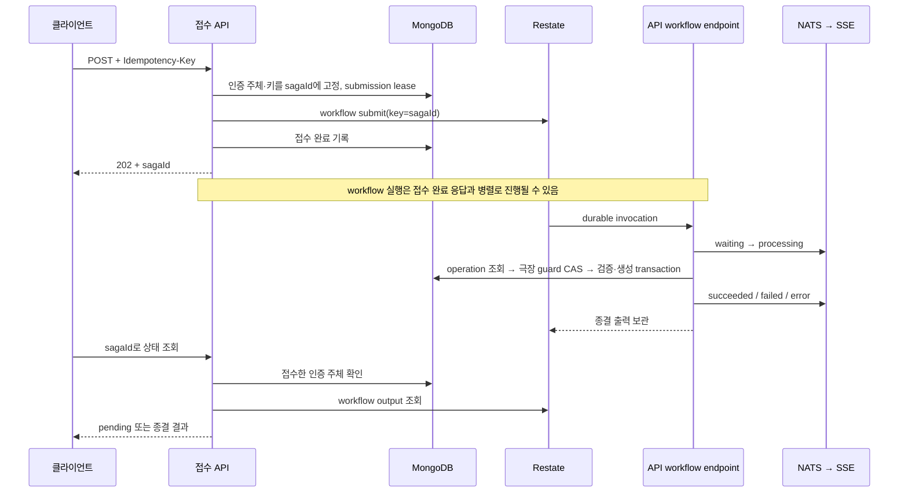

# apps/ — 애플리케이션

`apps/api`가 이 시드의 본체다. `console`과 `user-app`은 Next.js BFF와 모노레포 연결을 보여 주는 최소 데모이며, 제품 수준의 frontend architecture를 제안하지는 않는다.

API를 읽을 때는 `src/services/`의 다섯 경계를 먼저 본다. `gateway`는 HTTP 진입점, `view`는 화면 전용 조합, `application`은 여러 도메인의 유스케이스, `core`는 도메인 상태와 규칙, `infrastructure`는 외부 시스템 연동을 담당한다. `modules/`와 `config/`는 이 코드를 실행하기 위한 배선이지 도메인 계층이 아니다.

`config/`는 주입된 환경을 검증하고, `modules/`는 공통 연결·제공자를 조립한다. 도메인 로직은 이곳에 두지 않는다. `app.module.ts`는 모듈과 전역 guard·pipe를 조립하고 `bootstrap.ts`는 HTTP 앱을 기동한다. `scripts/`는 이 앱의 소스와 별개로 실행되는 운영·개발 도구다.

API의 `ConfigModule`은 `ignoreEnvFile: true`로 실행 환경이 주입한 `process.env`만 검증한다. 앱이 추가 env 파일을 찾아 읽지 않는다. 개발 환경의 주입·재생성 규칙은 [Dev Container](devcontainer.md#1-환경-변수는-재생성해야-반영된다)를 따른다.

## 1. SoLA 5계층

SoLA의 목적은 계층 숫자를 맞추는 것이 아니라 **모듈 사이의 순환 참조를 구조적으로 막는 것**이다. 일반적인 layered architecture가 위→아래 방향을 제한한다면, 이 시드는 규칙 하나를 더한다.

> 같은 계층의 모듈끼리도 직접 호출하지 않는다. 둘을 조합해야 하면 둘을 모두 부를 수 있는 위 계층에 조립 모듈을 만든다.

여기서 계층은 한 기능 안의 Controller·Service·Repository 구분과 다르다. 일반적인 Service 계층에 섞이기 쉬운 두 책임, 즉 한 도메인의 규칙과 여러 도메인을 묶는 작업을 Core와 Application으로 나눈다. 예를 들어 상영이 영화를 조회하고 영화가 다시 상영을 조회하게 만들면 두 Core가 사실상 하나로 묶인다. 두 정보를 필요로 하는 상위 유스케이스가 각각의 공개 API를 호출하게 한다.

```text
Gateway         HTTP·인증·입력 변환
    ↓
View            화면 전용 읽기 조합
    ↓
Application     여러 Core/Infrastructure를 조합하는 유스케이스
    ↓
Core            한 도메인의 상태·규칙·저장소 소유권
    ↓
Infrastructure  결제·스토리지 같은 외부 연동
```

위 계층은 아래 계층의 공개 API를 사용할 수 있지만, 아래 계층은 Gateway와 View를 모른다. 컨트롤러를 Gateway로 분리해 라우팅·인증 주체 추출·요청 변환을 도메인 모듈 밖에 둔다. 오류는 계층에 관계없이 아래의 공통 에러 규칙을 따른다.

예를 들어 `MoviesController`와 `MoviesService`를 `MoviesModule`에 함께 둔다고 하자. Controller가 추천을 호출하고 추천 서비스가 영화를 조회하면 `MoviesModule → RecommendationModule → MoviesModule`의 순환이 생긴다. 서비스 호출이 Recommendation → Movies의 단방향이어도 Controller를 묶은 방식 때문에 모듈이 서로 의존한다.

Controller를 Gateway로 옮기면 Gateway가 Recommendation과 Movies를 사용하고, Recommendation은 하위 Movies만 참조한다. `forwardRef`로 서로 주입할 수 있게 만드는 것만으로는 이 책임의 결합이 사라지지 않는다.

Oxlint의 `eslint-plugin-boundaries`가 실제 import 대상 파일을 해석해 계층 방향, 동료 모듈 참조, 모듈 외부의 공개 진입점을 검사한다. 계층 barrel은 자기 계층의 공개 API를 모으지만 도메인에서 자기 계층 barrel을 참조할 수는 없다. 여러 도메인을 조합하는 테스트는 이 검사에서 제외하며, View의 읽기 전용 책임처럼 코드의 의미에 관한 규칙은 리뷰로 확인한다.

### 1.1. Application Service는 조립이 필요할 때만 만든다

Application은 모든 요청이 통과하는 의식적인 계층이 아니다. Core 하나로 끝나는 CRUD는 Gateway가 해당 Core를 직접 사용한다. 여러 Core를 조합하거나 transaction·workflow·외부 효과를 조율해야 할 때만 Application Service를 만든다.

- `core/theaters`는 단일 도메인 CRUD의 기준이다.
- `application/booking`은 예매 동선에 필요한 여러 Core를 조합한다.
- `application/showtime-creation`은 영화·극장·상영·티켓과 durable workflow를 조율한다.

조합할 것이 없는데 Application을 추가하면 경계가 아니라 통과 계층만 늘어난다.

같은 영화 API에서도 등록·조회는 `MoviesService`로 충분하지만, 삭제 전에 다른 도메인의 상영 참조를 검사해야 하면 `CatalogManagementService`가 조합한다. 기능의 이름이 아니라 필요한 협력으로 배치를 결정한다.


```mermaid
flowchart LR
    User[사용자] --> Home[홈 화면 Gateway]
    Home --> View[UserHomeViewService]
    View --> Recommendation[Application: Recommendation]
    View --> Catalog[Core: Movies · Showtimes · Theaters]
    User --> Booking[Gateway → Application: Booking]
    User --> Users[Gateway → Core: Users]
```

추천은 홈 View가 소비하는 내부 유스케이스라 별도 HTTP endpoint가 없어도 된다. 이런 모듈 경계는 배포를 나눌 때 결합을 줄이지만, 네트워크 실패·데이터 소유권·분산 transaction까지 자동으로 해결하지는 않는다.

트랜잭션으로 묶을 작업은 Application Service가 정하고, MongoDB 세션의 생성·종료와 드라이버 실행 옵션은 `common`의 Repository가 소유한다. 앱의 Repository는 필요한 실행 정책을 선택한다. 서비스는 `TransactionContext`를 명시적으로 전달하며, 이 식별자는 실행 콜백 안에서만 유효하다. 충돌 시 콜백이 재실행될 수 있으므로 결제 provider 호출·이벤트 발행 같은 외부 효과는 밖에서 수행한다.

### 1.2. View는 화면 전용 서비스 소비자다

View는 도메인 서비스가 아니다. 프런트엔드가 여러 API를 호출해 조합할 화면 응답을 백엔드 한 곳에서 만드는 소비자 계층이다. `view/user-app/home`은 추천·영화·상영·극장을 화면 DTO로 묶는다.

View는 읽기 API를 조합하고 표시 순서·개수 같은 화면 정책을 적용할 수 있다. 상태를 바꾸는 유스케이스, transaction, 도메인 규칙은 두지 않는다. Application·Core·Infrastructure가 View를 참조해서도 안 된다. 이 계층을 두는 이유와 대안은 [설계 결정 §4](reference/decisions.md#4-view-계층-화면-전용-서비스-소비자)에 있다.

## 2. 분산 협력 — MSA 준비형 모놀리스

코드는 모놀리스지만 검증 스택은 API를 여러 프로세스로 실행한다. 중요한 것은 도구 목록이 아니라 각 문제의 **최종 보장 경계**다.

| 문제                             | 선택                       | 최종 보장                         |
| -------------------------------- | -------------------------- | --------------------------------- |
| 중복 작업·불필요한 경쟁 축소     | Redis 분산 락              | 락이 아니라 DB 상태 전이·CAS      |
| 연결된 구독자에게 실시간 fan-out | Core NATS                  | 손실 시 상태 재조회               |
| 중단 후에도 이어야 하는 작업     | Restate durable workflow   | journal + 멱등한 외부 효과        |
| 나중에도 처리해야 하는 이벤트    | MongoDB outbox + JetStream | at-least-once + 소비자 멱등성     |
| 여러 시스템에 걸친 결제·보상     | durable 상태 머신 + lease  | 주기 재조정을 통한 종료 상태 수렴 |

구체적인 도구 선택 이유와 거부한 대안은 [설계 결정](reference/decisions.md)이 소유한다.

### 2.1. 분산 락 — 정합성의 마지막 보루가 아니다

만료된 업로드 정리는 `withLock`으로 한 복제본만 실행한다. 구매 요청에는 별도 Redis 락을 두지 않는다. 같은 티켓 묶음뿐 아니라 일부만 겹치는 요청도 선점 소유권과 DB 원자 전이로 처리한다.

락은 TTL이 만료하거나 소유 프로세스가 종료될 수 있다. 따라서 이중 판매는 티켓의 원자 조건부 전이가, 상영 시간 충돌은 MongoDB transaction과 극장별 guard CAS가 막는다. 락을 정합성의 근거로 삼지 않는다.

### 2.2. 메시지 — Core NATS와 JetStream의 선을 그어 둔다

상영 생성의 SSE 진행 알림은 현재 연결된 사용자에게 빠르게 전달하면 되고 최종 상태를 다시 조회할 수 있으므로 Core NATS를 쓴다. 연결 전 이벤트를 replay하지 않고 중복도 가능하다. SSE를 최종 상태의 저장소로 취급하지 않는다.

반면 구매 완료 이벤트는 소비자가 중단된 동안에도 보존해야 하므로 MongoDB outbox와 JetStream을 쓴다. DB 갱신과 broker ack, 실제 부수 효과와 consumer ack를 한 transaction으로 묶을 수 없으므로 보장은 **at-least-once**다. 실제 메일·알림·외부 호출을 추가하는 소비자는 `purchaseRecordId`를 durable inbox unique key나 provider idempotency key로 써야 한다.

진행 알림은 NATS → 각 API 복제본의 로컬 RxJS Subject → 그 복제본에 연결된 SSE 클라이언트로 전달된다. 서버는 saga별 구독을 만들지 않으므로 클라이언트가 payload의 `sagaId`로 자기 작업을 고른다. Core NATS의 `flush`는 서버가 이전 명령을 처리했다는 확인이며 소비자가 처리했거나 메시지가 저장됐다는 ack가 아니다.

구매는 완료 문서의 `purchaseEventStatus=pending`을 outbox로 삼는다. publication lease를 얻은 복제본이 발행하고 PubAck 뒤에 `published`로 바꾼다. 알림 복제본들은 같은 durable pull consumer를 공유하고 처리 성공 뒤 ack한다. 저장 성공 후 DB 갱신을 잃거나 처리 성공 후 ack를 잃으면 재전달될 수 있다. message ID의 중복 억제 기간도 유한하다.

구매 stream은 해당 subject만 보존하며 용량 한계에서는 새 발행을 거부해 outbox가 pending으로 남게 한다. 보존 기간·용량은 구매 이벤트 설정이 소유한다. 현재 알림 소비자는 실제 메일을 발송하지 않고 `dedupeKey`가 있는 로그를 남긴다.

### 2.3. 구매 상태 머신과 재조정

현재 [PaymentsService](../apps/api/src/services/infrastructure/payments/payments.service.ts)는 외부 PG를 호출하지 않고 MongoDB에 결제 상태를 기록해 생성·취소와 중복 요청을 재현하는 예제다. 실제 PG 통신은 검증 범위에 포함하지 않는다.

결제 생성·취소와 Redis의 티켓 claim은 구매 완료 transaction 밖에서 처리한다. 구매는 이 작업들보다 먼저 durable 기록을 남기고 다음 상태로 수렴한다.

```text
pending → completing → completed
   │          │
   └──────────┴─→ compensating → cancelled
```

각 전이는 owner ID와 만료 시각이 있는 lease를 CAS로 획득한 복제본만 실행한다. 프로세스가 중간에 종료되면 주기 재조정이 stale 기록을 찾아 만료된 lease를 인수한다. 결국 구매는 `completed` 또는 `cancelled`로 수렴하며, 완료 이벤트 발행 실패는 이미 완료된 구매를 되돌리지 않고 별도로 재시도한다.

완료 transaction은 티켓의 `Available → Sold`, 구매 완료, 결제 resolution marker와 HTTP 응답 스냅샷을 함께 저장한다. outbox 상태가 이후 바뀌어도 같은 멱등성 키의 재시도 응답은 최초 결과를 유지한다. 보상은 해당 구매가 소유한 티켓·Redis claim만 해제하고 결제를 취소한다. 완료와 lease 회수가 경합하면 transaction write conflict와 owner CAS가 두 종결 상태 중 하나만 남긴다.

### 2.4. Saga 오케스트레이션 — Restate

상영 생성은 접수와 실행을 분리한다.


```mermaid
sequenceDiagram
    participant C as 클라이언트
    participant A as 접수 API
    participant M as MongoDB
    participant R as Restate
    participant W as API workflow endpoint
    participant N as NATS → SSE
    C->>A: POST + Idempotency-Key
    A->>M: 인증 주체·키를 sagaId에 고정, submission lease
    A->>R: workflow submit(key=sagaId)
    A->>M: 접수 완료 기록
    A-->>C: 202 + sagaId
    Note over A,W: workflow 실행은 접수 완료 응답과 병렬로 진행될 수 있음
    R->>W: durable invocation
    W->>N: waiting → processing
    W->>M: operation 조회 → 극장 guard CAS → 검증·생성 transaction
    W->>N: succeeded / failed / error
    W-->>R: 종결 출력 보관
    C->>A: sagaId로 상태 조회
    A->>M: 접수한 인증 주체 확인
    A->>R: workflow output 조회
    A-->>C: pending 또는 종결 결과
```

Restate journal은 완료된 step을 재사용하고 복제본 종료 후에도 실행을 이어 간다. 그러나 외부 효과의 성공과 journal 기록은 원자적이지 않으므로 durable step은 다시 호출될 수 있다. 상영·티켓·operation을 한 MongoDB transaction으로 묶고 `sagaId`의 unique operation을 저장하는 것이 최종 멱등성 경계다.

workflow key는 **같은 `sagaId`**의 중복 제출만 합친다. 서로 다른 `sagaId`가 같은 극장 시간을 동시에 변경하는 경쟁은 막지 못한다. 두 요청이 모두 “겹치는 상영이 없다”고 읽고 삽입할 수 있으므로, transaction 안에서 극장별 guard를 **검증 조회보다 먼저** CAS 갱신한다. 경쟁 transaction은 WriteConflict로 재시도하며 변경된 상태에서 다시 검증한다. **durable workflow와 concurrency control은 다른 문제**다.

SSE는 사용자 경험을 위한 best-effort 진행 알림이다. 발행 실패나 10초 제한 초과는 기록하고 업무 단계와 종결 결과 처리를 계속한다. 사용자가 종결 상태를 알아야 할 때는 `sagaId`로 상태 API를 재조회하고, 실제 생성 결과의 기준은 MongoDB다.

시간 충돌은 자원을 생성하지 않은 `failed`, 생성 성공은 `succeeded`, 재시도로 해결되지 않은 시스템 오류는 `error`다. operation에는 입력 fingerprint와 결과를 함께 저장해 같은 `sagaId`의 다른 입력을 거부한다. 트랜잭션 안의 생성이 실패하면 부분 상영·티켓이 롤백되므로 별도 삭제 보상 step은 없다.

상영 구간은 끝 시각을 포함하지 않는다. 기존 `12:00~13:30`과 새 `12:00~12:30`은 충돌하지만, 13:30부터 시작하는 상영은 허용한다. 기존 데이터와의 충돌은 접수 뒤 `failed`로 끝나며, 요청 본문 안의 시작 시각끼리 겹치는 오류는 사가를 시작하기 전에 `400`으로 거부한다.

상태 이벤트도 durable step으로 발행해 workflow 안의 순서를 유지하지만 중복 발행은 가능하다. step별 retry·timeout·abort와 workflow 출력의 보존 기간은 [workflow.ts](../apps/api/src/services/application/showtime-creation/worker/workflow.ts)가 정한다. 출력 보존은 유한하므로 workflow key를 영구 멱등 저장소로 취급하지 않는다.

## 3. 코드 컨벤션

HTTP 계약과 도메인 모델에 적용하는 규칙이다. apps와 libs가 함께 지킬 이름·타입·import·테스트 문장 규칙은 [개발 규칙](reference/conventions.md)에 모은다.

### 3.1. 서비스 이름과 공개 경계

서비스·DTO의 이름, 조건을 객체 인자로 전달하는 원칙, 조회·삭제의 공개 계약은 [개발 규칙 §1](reference/conventions.md#1-서비스와-메서드-이름)을 따른다.

외부 모듈은 공개 barrel만 사용하고 `internal/`·`worker/`를 직접 참조하지 않는다. ESM 확장자·별칭·개발 의존성 분류는 [Import와 공개 경계](reference/conventions.md#3-import와-공개-경계)를 따른다. SDK 연동과 Node 유틸의 경계는 [libs 문서](libs.md)가 소유한다.

### 3.2. 에러 규칙

NestJS 공통 예외와 도메인의 `errors.ts`를 사용한다. MongoDB 오류를 도메인 오류로 바꾸는 곳은 Repository이며, controller는 도메인 조건을 다시 만들지 않는다. 오류 객체·클라이언트 코드·노출 범위는 [개발 규칙 §4](reference/conventions.md#4-에러는-소유한-경계에서-정의한다)를 따른다.

### 3.3. REST API 설계

경로는 행위보다 리소스를 중심으로 짓는다. 다만 여러 API 단계가 특정 유스케이스 안에서만 의미가 있다면 `booking/...`, `showtime-creation/...`처럼 namespace로 묶어 범용 리소스 API와 구분한다.

범용 영화 목록에 추천순·최신순 옵션을 계속 더하면, 두 옵션을 함께 요청했을 때의 우선순위도 일반 조회가 책임져야 한다. 업무 흐름별 API는 이런 조합의 영향을 제한하며, 독립적인 영화 조회는 범용 리소스 API로 유지한다.

#### 3.3.1. 중복 실행 비용이 큰 POST는 멱등성 키를 요구한다

결제와 장기 비동기 작업처럼 중복 요청이 다른 부수 효과를 만드는 POST는 `Idempotency-Key`를 필수로 받는다. 키는 인증 주체·endpoint와 함께 논리 요청을 식별한다. 같은 키와 같은 본문의 재시도는 처음 결과로 수렴하고, 다른 본문은 거부한다.

키는 재시도를 합칠 뿐이지 도메인 경쟁을 없애지 않는다. 다른 키의 동시 요청은 원자 상태 전이·transaction·CAS가 따로 안전하게 만들어야 한다. 메모리 캐시나 프로세스 로컬 상태를 멱등성의 근거로 쓰지 않는다.

같은 사용자와 endpoint에서 구매 요청을 보낸다고 하면 다음처럼 구분한다.

| 키   | 본문          | 처리                                                        |
| ---- | ------------- | ----------------------------------------------------------- |
| 키 A | 본문 X        | 처음 실행하고 응답을 저장                                   |
| 키 A | 본문 X 재시도 | 저장한 최초 응답을 반환                                     |
| 키 A | 본문 Y        | 같은 키의 의미가 바뀌었으므로 `409 Conflict`                |
| 키 B | 본문 X        | 별도 요청으로 실행하며, 키 A와의 경쟁은 DB 상태 전이가 조정 |

같은 키의 최초 요청이 처리 중이면 `409 Conflict`다. 클라이언트는 새 키를 만들어 중복 작업을 시작하지 않고 같은 키로 다시 확인한다. 부수 효과 전의 입력 검증 실패와 실행을 시작한 뒤의 실패도 구분한다. 구매가 실행을 시작한 뒤 저장한 오류 응답은 보상이 끝나도 같은 키로 재현된다.

구매는 인증 주체·키의 unique index와 응답 스냅샷을 구매 기록에 저장한다. 상영 생성은 같은 조합을 고정 `sagaId`로 연결한다. Restate 제출 응답을 잃어도 lease를 인수한 복제본이 같은 workflow key로 재제출한다.

#### 3.3.2. ID만 받는 API는 처음부터 복수형으로 둔다

서비스는 `getMany`, `deleteMany`로 제공하고, 단일 리소스의 HTTP 핸들러가 ID 하나를 배열로 감싸 호출한다. 이유와 생성·수정의 예외는 [개발 규칙](reference/conventions.md#1-서비스와-메서드-이름)을 따른다.

#### 3.3.3. 오래 걸리는 작업은 접수와 결과를 분리한다

요청 안에서 끝날 수 없는 작업은 `202 Accepted`와 식별자를 먼저 반환한다. 종결 결과는 다시 조회할 수 있게 저장하고, SSE는 상태 저장소가 아니라 진행 알림으로만 사용한다.

상영 생성에서 `극장 4,000 × 날짜 60 × 하루 8회 × 좌석 500`을 가정하면 생성 대상은 9억 건을 넘는다. 이는 현재 한 요청의 허용량이 아니라, 대량 작업을 동기 HTTP 계약으로 설계하면 안 된다는 사고 실험이다.

접수와 완료를 분리해도 DB transaction의 처리량 제한은 남는다. 현재 한 operation의 생성 수와 실행 시간에는 상한을 두며, 대규모 작업의 분할·일정 관리까지 구현한 예제는 아니다. 정확한 상한은 [persistence](../apps/api/src/services/application/showtime-creation/internal/showtime-creation-persistence.service.ts)와 [operation Repository](../apps/api/src/services/application/showtime-creation/internal/showtime-creation-operation.repository.ts)가 소유한다.

#### 3.3.4. 긴 검색 조건은 POST를 쓸 수 있다

의미상 조회여도 대량의 ID·복합 필터가 URL 한계를 넘을 수 있으면 search 리소스에 POST를 사용한다. 이 예외는 긴 입력을 안전하게 전달하기 위한 것이며, 상태를 변경하는 의미를 숨기기 위한 것이 아니다.

#### 3.3.5. 본인 자원은 `/me`로 다룬다

admin은 콘텐츠와 임의 사용자 대상 작업을, user는 본인 자원을 다룬다. 최초 admin은 HTTP가 아닌 독립 운영 스크립트로 만들고, 두 역할의 token은 서로 다른 secret으로 서명한다.

사용자 본인의 자원은 URL·본문의 ID가 아니라 인증 token의 subject로 식별한다. 그런 경로는 `/me`로 드러내고, 임의 ID를 받는 경로는 admin에게만 허용한다. 두 규칙을 함께 지켜야 로그인 사용자가 ID를 바꿔 다른 사용자의 자원에 접근하는 IDOR 경로가 사라진다.

이 기준은 사용자·결제처럼 소유 주체가 있는 자원에 적용한다. 공개 영화·극장 조회까지 user 소유 자원으로 취급하지 않는다. `POST /purchases`도 결제자를 본문에서 받지 않고 token subject로 정한다. 같은 controller에 user·admin 핸들러가 섞이면 guard를 핸들러마다 붙인다. 클래스 guard와 메서드 guard는 함께 적용되므로 역할이 다른 guard를 중첩하지 않는다. `/me`는 `/:userId`보다 먼저 선언한다.

액세스 JWT는 서명·만료·issuer/audience·필수 claim을 검증하며, 인증 중 계정 DB를 조회하지 않는다. 로그아웃·비밀번호 변경·계정 삭제 후에도 이미 발급한 액세스 토큰은 만료까지 인증에 사용할 수 있다. 삭제된 계정의 `/me` 조회·수정은 인증을 통과한 뒤 자원이 없어 404를 반환한다.

리프레시 토큰은 로그인 세션마다 Redis에 현재 해시 하나를 보관하고 사용할 때 원자적으로 교체한다. 이미 교체된 토큰은 409로 거부하며 현재 세션은 유지한다. 일반 로그아웃은 해당 세션을, 전체 로그아웃·비밀번호 변경·계정 삭제는 그 계정의 기존 리프레시 세션을 삭제한다. 삭제 이후 늦게 도착한 갱신이 세션을 다시 만들지 못한다. 액세스 권한은 5분 만료로 제한하며 즉시 회수하지 않는다.

로그인 실패는 IP별로만 제한한다. 기본값은 15분 동안 50회이며 성공해도 IP 실패 횟수를 초기화하지 않는다. 이메일별 계정 잠금이나 리프레시 재사용을 근거로 한 세션 전체 폐기는 시드의 기본 정책에 포함하지 않는다.

### 3.4. 도메인 모델과 데이터 소유권

사용자의 행동과 그 행동을 기록한 데이터를 구분해 이름 짓는다.

| 용어                       | 의미                                                              |
| -------------------------- | ----------------------------------------------------------------- |
| 예매 `Booking`             | 상영·좌석을 선택하고 임시 선점하는 동선                           |
| 구매 `Purchase`            | 결제와 티켓 판매를 조율해 완료하거나 실패 시 보상하는 작업        |
| 구매 기록 `PurchaseRecord` | 구매의 진행·종결 상태를 저장해 재시도와 복구의 기준이 되는 데이터 |

구매 기록은 성공한 영수증만 뜻하지 않는다. 결제 전에 만들고 실패한 구매의 상태도 남긴다.

도메인은 자기 collection을 소유하고 다른 도메인의 DB를 직접 join하지 않는다. 조회 경로를 단순하게 하고 모듈 의존을 줄일 수 있다면 ID처럼 안정적인 값을 중복 저장한다. 대신 중복 값의 갱신 책임이 생기므로, 조회 단순성이 그 비용보다 클 때만 선택한다.

예제에서 극장은 좌석 배치 하나를 가진 상영 공간이다. 극장 안의 여러 상영관과 좌석 등급은 생략한다. 좌석은 독립적으로 관리하는 엔티티가 아니라 블록·행·번호로 식별되는 값이라 별도 ID를 두지 않는다.

반면 Ticket은 자기 collection만으로 조회할 수 있도록 `movieId`, `theaterId`, `showtimeId`를 중복 저장한다. 극장의 좌석 배치와 티켓의 좌석 좌표처럼 모양이 같아도 도메인에서 뜻이 다르면 각자 모델을 소유한다.

임시 선점은 만료 시간이 있는 Redis 상태로 `TicketHolding`이 관리한다. 구매 claim 실패로 복원할 때도 원래 만료 시각을 넘기지 않으며 무기한 선점은 지원하지 않는다. `Ticket.status`는 영속적인 판매 여부(`available`·`sold`)만 나타낸다. 선점된 티켓도 판매 전에는 `available`이므로 구매 가능 여부를 이 필드 하나로 판단하지 않는다.

파일 완료는 같은 소유자의 재시도를 허용한다. 소유권 지정 후 영화 연결이 실패했더라도 업로드 만료를 이유로 파일을 지우지 않는다. 다른 소유자의 완료 요청은 거부하며, 만료 정리는 소유자가 없는 업로드만 cron에서 처리한다.

## 4. 테스트

인덱스, transaction, race condition, 프로토콜 경계는 mock으로 재현하기 어렵다. 그래서 도메인 통합 테스트는 실제 NestJS 모듈과 MongoDB·Redis·S3·NATS·Restate를 사용하고, mock을 최소화한다. 다중 컨테이너 스택이 필요한 race·browser·benchmark는 [tests 문서](tests.md)의 별도 계층이 담당한다.

테스트의 unit은 함수 하나가 아니라 **사용자가 관찰하는 행동**이다. 성공·충돌·재시도 계약을 HTTP 시나리오와 조건별 테스트로 먼저 표현하고, 이를 만족하도록 내부를 구현한다. 내부 함수 호출 순서보다 API 응답·DB의 최종 상태·외부 계약을 검증한다. 내부 구현을 나누거나 합쳐도 행동이 같으면 테스트는 유지되어야 한다. 순수 계산이 독립 계약인 경우에는 그 계산을 직접 테스트할 수 있다.

spy를 금지하지는 않는다. 실제 인프라 경로는 유지하면서 호출 관찰, 장애 주입, 결정적인 동시성 barrier, 시간·환경 제어가 필요할 때 쓴다. 의존성 전체를 가짜로 바꿔 통합 계약을 사라지게 만드는 mock을 경계한다.

테스트 제목을 조건과 결과로 쓰는 프로젝트 공통 규칙은 [개발 규칙 §5](reference/conventions.md#5-테스트-문장은-조건과-결과를-이어-읽게-쓴다)가 소유한다.

API 테스트에는 집중 실행·비활성 테스트가 남거나 같은 범위의 제목이 중복되어 검증 대상이 누락·혼동되지 않도록 lint를 적용한다. `expect`의 matcher와 비동기 단언 대기도 검사하지만, 단언이 요구사항을 제대로 검증하는지는 리뷰로 확인한다.

### 4.1. 테스트 자원은 소유자가 드러나야 한다

API와 공용 라이브러리는 서로 다른 접두사를 쓰고, 각 workspace 안에서는 worker별 DB·bucket과 테스트별 `PROJECT_ID`로 자원을 나눈다. 같은 API Vitest 명령을 동시에 두 번 실행하는 것은 지원하지 않는다. 정확한 이름과 lifecycle은 테스트 설정과 helper가 소유한다.

API는 Dev Container 인프라를 재사용하고, common은 Testcontainers로 필요한 인프라를 준비한다. API의 DB·bucket은 `mongo-api-w<worker>`·`s3bucket-api-w<worker>` 형태다. 파일 안에서는 같은 연결을 쓰되 테스트 뒤 collection과 bucket을 비우며, Redis·NATS·workflow 이름은 테스트별 `PROJECT_ID`로 분리한다. suite 종료 후의 정리도 해당 workspace의 자원 범위에 한정한다.

`export const value = process.env.KEY`처럼 모듈 최상위에서 읽은 값은 import 시점에 고정된다. 이후 `ConfigModule`을 초기화하거나 테스트에서 env를 바꿔도 다시 계산되지 않는다. Nest 데코레이터에서도 테스트별 환경 값을 미리 읽지 않고, 제공자를 만들 때 `AppConfigService.projectId`를 받아 prefix·subject·workflow 이름을 만든다. 테스트 setup은 앱을 import하기 전에 startup 환경을 먼저 정하고, `beforeEach`에서 테스트별 값을 정한다.

커버리지를 수집하는 구현 workspace는 100%를 게이트로 사용한다. 이 수치의 의미·한계·예외 원칙은 [설계 결정 §6](reference/decisions.md#6-테스트-커버리지-100-게이트)에만 정의한다.

### 4.2. Fixture와 비동기 작업의 수명

API 통합 테스트는 [createAppTestContext](../apps/api/src/__tests__/helpers/create-app-test-context.ts)로 실제 Nest 앱과 HTTP client를 만든다. common은 모듈별 fixture factory를 사용한다. 각 테스트는 자신이 만든 context의 `teardown()`까지 책임진다.

```ts
// API fixture의 수명만 보여 주는 예시
let fix: AppTestContext
beforeEach(async () => {
    fix = await createAppTestContext()
})
afterEach(() => fix.teardown())
```

상영 workflow를 검증할 때는 `enableRestate: true`로 임시 endpoint를 등록한다. teardown은 제출한 workflow가 끝난 뒤 그 deployment를 제거하고 앱을 닫는다. 일반 테스트에서는 workflow 제출을 허용하지 않아 실수로 외부 실행을 시작하면 실패한다. cron은 테스트 중 자율 실행을 멈춰 시나리오가 작업 시점을 제어하게 한다.

SSE를 검증할 때는 요청 전에 구독을 준비한다. [waitForCompletion](../apps/api/src/__tests__/application/showtime-creation.utils.ts)은 SSE 종결 이벤트를 기다리며 상태 API를 대신 조회하지 않는다. 이벤트를 놓친 클라이언트의 복구는 별도의 상태 조회 계약으로 검증한다. 임의의 sleep으로 완료를 추측하지 않는다.

### 4.3. 접수·완료·롤백을 구분해 검증한다

[상영 생성 통합 테스트](../apps/api/src/__tests__/application/showtime-creation.spec.ts)는 `202`와 `sagaId`를 받는 접수 성공, 상영 생성, 티켓 생성을 각각 검증한다. 뒤의 두 결과는 작업이 종결된 뒤 `sagaId`로 실제 저장 상태를 재조회한다. 응답에 적힌 생성 수나 내부 creator의 호출만으로 완료를 판단하지 않는다.

롤백을 검증할 때는 spy로 실패 시점을 제어하되 실제 insert와 transaction 경로를 유지한다.

```ts
const realCreateMany = ticketsService.createMany.bind(ticketsService)
vi.spyOn(ticketsService, 'createMany').mockImplementation(
    async (createDtos, transaction, signal) => {
        await realCreateMany(createDtos, transaction, signal)
        throw new Error('ticket creation failed after insert')
    }
)
```

생성 요청이 `error`로 끝날 때까지 기다린 뒤 같은 `sagaId`의 상영과 티켓이 모두 없는지 조회한다. insert 자체를 가짜로 성공시켰다면 실제 부분 쓰기의 롤백을 검증할 수 없다.

일시적인 쓰기 실패 뒤 재시도가 한 세트만 생성하는지, 커밋 후 완료 보고를 잃어도 operation 결과를 재사용하는지는 별도 시나리오로 확인한다. 롤백 성공과 재시도의 멱등성은 각각 검증할 보장이다.

## 5. 실행 가능한 API 문서

`apps/api/api-docs/*.spec`는 bash와 curl로 작성한 주요 성공·실패 흐름의 HTTP 계약이다. 실제 요청을 보내지 못하는 정적 endpoint 카탈로그 대신, 실행해 요청·응답 예시와 브라우징 가능한 요약을 만든다. 이 선택의 이유는 [도구 선택 기준](reference/decisions.md#10-현재-도입하지-않은-도구)에 있다.

`TEST`는 사람이 읽을 설명과 기대 상태를 가진 문서 항목이고, `SETUP`은 시나리오를 만들기 위한 준비 요청이다. 두 의미를 섞어 준비 호출을 API 목록으로 부풀리지 않는다. 장기 연결인 SSE는 curl 카탈로그에 억지로 넣지 않고 상태 종결까지 대기하는 통합 테스트가 검증한다.

```bash
# 축약한 spec 예시
SETUP POST /booking/showtimes/${SHOWTIME_ID}/tickets/hold \
    -d '{ ... }'

TEST "선점한 티켓 묶음을 구매한다" \
    201 POST /purchases \
    -d '{ ... }'
```

첫 요청은 구매 조건을 만들지만 API 문서 항목은 아니다. 설명과 기대 상태가 있는 두 번째 요청만 실행 결과에 계약으로 기록된다.

요청은 spec에, `TEST`의 실제 응답 본문은 상세 로그에 남긴다. 준비용 `SETUP`은 문서 항목에 포함하지 않는다. 실행 명령은 [README](../README.md#3-api-레퍼런스)가 소유한다.

직접 실행할 대상은 `apps/api/api-docs/.env`가 정하며, 검증 스택 실행기는 `SERVER_URL`로 자기 스택을 지정한다. 대상 URL의 공개 포트와 API 컨테이너 내부 포트는 별개다.

인증 주체는 `common.fixture`의 `login_admin`·`login_user`로 전환한다. `CURRENT_AUTH_TOKEN`이 있으면 이후 요청에 Bearer 헤더가 자동으로 붙고, spec이 직접 지정한 `Authorization`이 우선한다. 게스트 조건은 `as_guest`로 자동 주입을 끊는다. [views.spec](../apps/api/api-docs/views.spec)이 이 구분을 보여 준다.

`apps/api/api-docs/_output/`의 `logs/`에서 실제 응답을, `docs/summary.md`에서 검증한 항목을 확인한다. 요약은 실행한 HTTP 시나리오의 목록이며 SSE까지 포함한 전체 라우트 인벤토리는 아니다.

## 6. 빌드와 두 frontend의 범위

API 배포는 Nest의 Rspack 빌드를 사용한다. [rspack.config.cjs](../apps/api/rspack.config.cjs)는 Nest 기본 변환 규칙을 `ts-loader`로 교체하고 API 코드만 번들링한다. `common`을 포함한 런타임 패키지는 external로 두며, Docker의 `pnpm deploy --prod` 결과에 해당 패키지의 빌드 산출물을 포함한다. 개발 watch는 `development.ts` 진입점을 사용하는 TSC 경로다. Restate endpoint도 API 안에서 실행하므로 별도 workflow bundle을 만들지 않는다.

console은 admin 로그인과 영화·극장 관리, user-app은 가입·로그인과 홈 View 소비를 보여 준다. 상영 생성·예매·구매 전체 UI는 범위에 없으며, 실행 가능한 API 문서와 통합·race 테스트가 그 흐름을 보여 준다.

### 6.1. BFF와 클라이언트 IP 경계

두 앱은 `common/bff`의 쿠키·프록시 구현을 공유한다. access·refresh token은 HttpOnly cookie에 보관하고 쿠키 만료는 각 JWT의 `exp`를 따른다. 액세스 인증이 실패하면 리프레시 토큰을 회전한 뒤 원 요청을 한 번 재시도한다. 응답을 캐시하지 않고 body 크기를 제한한다. catch-all proxy의 일부 auth 경로 차단만으로 권한을 보장하지 않으며, 최종 인가는 API guard가 담당한다.

같은 프로세스의 동시 갱신은 하나로 합치고 결과를 1초간 공유한다. 이는 처음 보낸 요청들의 401 응답이 서로 다른 시각에 도착하기 때문이다. 프로세스 간에는 공유되지 않으므로 다른 인스턴스에서 교체된 토큰의 409 응답은 쿠키를 지우지 않는다. 원 요청 재시도가 실패해도 이미 회전한 새 쿠키는 보관한다.

각 frontend의 `.env`는 API 대상과 proxy 설정을 소유한다. API의 HTTP 포트를 바꿔도 `API_BASE_URL`에 적힌 주소는 자동으로 바뀌지 않는다. frontend 포트 변경도 실행 명령·web Compose·tunnel과 개발 환경의 포트 전달을 함께 맞춰야 한다.

console·user-app을 운영에 배포할 때는 두 Next.js origin을 신뢰할 수 있는 edge 뒤에 두고 브라우저의 직접 접근을 막아야 한다. edge는 외부 proxy IP 헤더를 그대로 신뢰하지 않고 실제 연결 주소를 기준으로 체인을 재구성해야 한다.

BFF는 기본적으로 proxy IP 헤더를 무시한다. 위 경계가 있는 배포에서만 `BFF_TRUST_PROXY_HEADERS=true`로 opt-in한다. 현재 BFF는 `X-Forwarded-For`의 오른쪽 끝 IP를 선택하므로 edge가 실제 연결 주소를 그 위치에 넣어야 한다. 이 헤더가 없을 때 쓰는 `X-Real-IP`도 edge가 덮어써야 한다. 끝값이 잘못됐다고 앞쪽 값을 신뢰하지 않는다.

API도 BFF/NGINX에서만 접근할 수 있는 사설 경계에 둔다. 이 조건 없이 opt-in하면 위조 IP가 rate limit을 우회할 수 있다. 기본값에서는 API가 BFF 주소를 보므로 여러 사용자가 로그인 IP 버킷 하나를 공유할 수 있다.

```text
인터넷 → 신뢰 edge(IP 헤더 재구성) → BFF → 사설 API
인터넷 ───────────────────────────╳→ origin 직접 접근
```

상태 변경 요청의 same-origin 판정은 브라우저의 `Origin`과 `Host`를 기준으로 한다. production cookie는 기본적으로 `Secure`다. 이 경계를 모사하는 web 테스트의 설정과 검증 한계는 [tests 문서](tests.md#3-web--브라우저-e2e)를 본다.
