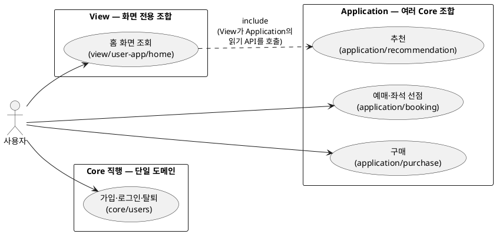
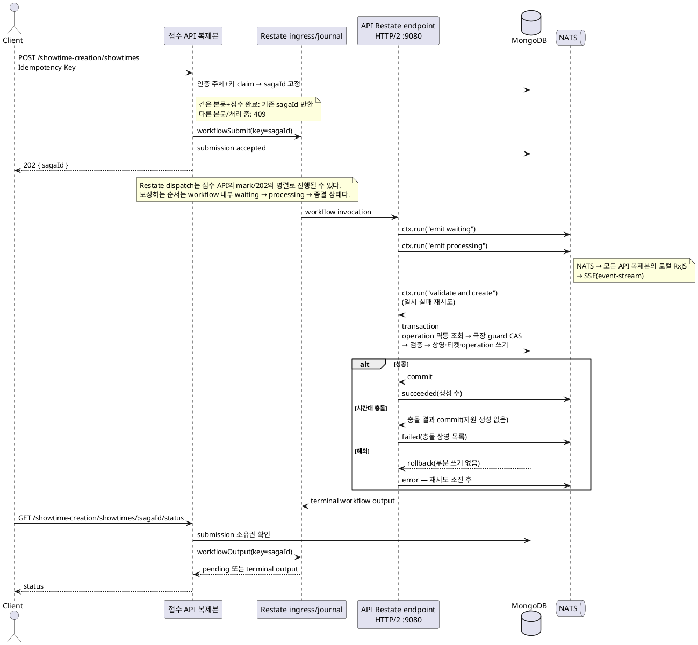

# apps/ — 애플리케이션

NestJS 백엔드인 `api`가 이 시드의 목적이고, `console`과 `user-app`은 모노레포 구성을 보여주는 최소 데모다.

`apps/api/src`의 최상위는 다음과 같이 나뉜다. 이 문서의 대부분은 `services/`를 다룬다.

| 경로            | 역할                                                                                                                    |
| --------------- | ----------------------------------------------------------------------------------------------------------------------- |
| `services/`     | 도메인 — SoLA 5계층(아래 전체 절)                                                                                       |
| `modules/`      | 인프라 배선 — Mongo·Redis·NATS 연결 모듈(`*-setup`), 공용 제공자(`GlobalModule`), Restate 포함 health. 도메인 로직 없음 |
| `config/`       | `AppConfigService` — `process.env`를 검증해 타입 있는 설정으로 바꾸는 단일 정의처                                       |
| `__tests__/`    | 통합 테스트([테스트](#테스트) 절)                                                                                       |
| `app.module.ts` | 루트 모듈 — modules와 services의 모듈·컨트롤러·전역 가드/파이프를 한곳에서 조립한다                                     |
| `bootstrap.ts`  | 앱 기동 — 로거, `x-replica-id` 미들웨어, listen                                                                         |
| `main.ts`       | 배포 엔트리. `development.ts`는 `NODE_ENV=development`를 강제하는 dev 전용 엔트리                                       |

## SoLA 5계층

여기서 말하는 계층은 컨트롤러/서비스/리포지토리처럼 한 서비스 내부의 코드 구조를 뜻하지 않는다. Application, Core, Infrastructure는 하나의 백엔드 서비스를 제공하기 위해 협력하고, View는 그 서비스를 화면 요구에 맞게 소비한다. 이렇게 계층을 나누고 의존 방향을 제한하는 규칙은 모듈 사이의 순환 참조를 원천에서 막아, 한쪽을 바꾸면 다른 쪽까지 흔들리는 문제가 생기지 않도록 한다.

### 풀려는 문제: 순환 참조

모듈끼리 자유롭게 서로를 부르게 두면 시간이 지날수록 순환 참조가 생긴다. 처음에는 A만 B를 부르더라도, 기능이 늘면 B도 A를 부르게 되기 쉽다. 그러면 두 모듈은 사실상 하나로 묶이고, 한쪽 수정이 다른 쪽까지 흔든다.

### 기존 레이어드와 다른 점

기존 레이어드 아키텍처는 보통 기술적 역할을 기준으로 계층을 나눈다.

```
Controller → Application(Service) → Domain → Repository
```

이 구조에서 Service 계층은 Application 계층이라고도 부른다. 요청 하나의 유스케이스를 처리하고, 트랜잭션 경계를 잡고, Domain이나 Repository를 호출하는 곳이다.

기존 레이어드가 주로 막으려는 것은 Controller가 Repository를 직접 부르거나 Repository가 Controller를 아는 식의 계층 침범이다. 그래서 같은 Application(Service) 계층 안의 모듈 호출은 같은 추상화 수준의 협력으로 보고 허용하는 경우가 많다.

하지만 Service 계층은 쉽게 넓어진다. 한 도메인의 기본 기능, 여러 도메인을 조합하는 유스케이스, 외부 시스템 호출 전 조립 로직이 모두 Service 안에 쌓이면, 같은 계층 안에서도 코드끼리 호출이 얽히고 순환 참조가 생긴다.

SoLA는 이 지점을 나눈다. 기존 Service 계층에 섞이기 쉬운 책임 중, 여러 도메인을 조합하는 유스케이스는 Application Service에 두고, 한 도메인의 규칙과 상태를 책임지는 기능은 Core Service에 둔다. 여기서 Service라는 말은 전통적인 Application Service만 뜻하지 않고, 독립적인 책임을 가진 모듈 단위를 넓게 가리킨다.

### 해결책: 같은 계층끼리도 직접 부르지 않는다

흔한 레이어드 아키텍처는 위 계층이 아래 계층을 부르는 방향만 제한한다. 같은 계층 안에서는 서로 부르게 두는 경우가 많다. 하지만 그렇게 두면 같은 계층 안에서 순환 참조가 다시 생긴다.

SoLA는 여기서 한 걸음 더 나아간다. **같은 계층에 있는 모듈끼리도 직접 부르지 않는다.** 두 모듈을 함께 써야 한다면, 그 둘을 모두 부를 수 있는 한 단계 위 계층에 조립용 모듈을 만든다.

```
┌─────────────────────────────────────────┐
│  Gateway                                │  HTTP 진입 (컨트롤러·가드·파이프)
│  *HttpController, AdminAuthGuard        │
├─────────────────────────────────────────┤
│  View Services                          │  화면 전용 서비스 소비자
│  UserHomeView                           │
├─────────────────────────────────────────┤
│  Application Services                   │  여러 도메인 묶는 유스케이스
│  ShowtimeCreation, Booking, Purchase    │  (워크플로·트랜잭션·재조정)
├─────────────────────────────────────────┤
│  Core Services                          │  도메인 로직, 자기 DB 소유
│  Movies, Theaters, Showtimes, Tickets   │
├─────────────────────────────────────────┤
│  Infrastructure Services                │  외부 시스템 연동
│  Payments, Assets                       │
└─────────────────────────────────────────┘
```

Application, Core, Infrastructure는 단일 서비스를 제공하는 협력 관계다. Application은 여러 Core를 묶어 유스케이스를 만들고, Core는 도메인 기능과 상태를 책임지고, Infrastructure는 외부 시스템 연동을 맡는다. Gateway와 View는 이 흐름의 일부가 아니라, 이미 제공되는 서비스를 외부 요청에 맞게 소비하는 계층이다. Gateway는 HTTP 요청을, View는 특정 화면 응답을 책임진다.

의존 규칙은 다음과 같다.

1. 같은 계층 안에서는 서로를 참조하지 않는다.
2. 위 계층만 아래 계층을 참조할 수 있다. 예: Gateway → View → Application → Core → Infrastructure.
3. Gateway와 View는 서비스 소비자이므로 아래 계층의 공개 API를 자유롭게 호출한다. 단 View는 읽기 응답에 집중하고, 상태를 바꾸는 유스케이스는 두지 않는다.
4. 서비스 제공 쪽(Application/Core/Infrastructure)은 Gateway와 View를 참조하지 않는다.

이 규칙은 시드가 제시하는 구조적 관례다. 기본 정적 검사는 [루트 Oxlint 설정](../oxlint.json)이 맡지만 SoLA 계층 전용 플러그인은 두지 않는다. 새 도메인을 추가할 때는 아래 의존 방향을 코드 리뷰에서 함께 확인한다.

어느 서비스부터 읽을지는 [README 도메인 둘러보기](../README.md#도메인-둘러보기)의 순서를 따른다.

### View는 화면 전용 서비스 소비자다

View는 SoLA의 순환 참조 문제를 풀기 위한 핵심 계층이 아니다. 화면 전용 읽기 응답은 원래 프론트엔드가 여러 API를 호출해 직접 조립해도 된다. View는 그 조립을 효율을 위해 백엔드로 옮겨 온 것이다.

예를 들어 사용자 앱 홈 화면은 추천 영화, 상영시간, 극장 이름을 한 응답에 담아야 한다. 그래서 `view/user-app/home`처럼 화면 단위의 소비자 코드를 백엔드에 둔다. 이렇게 두는 이유와 검토했던 대안은 [설계 결정 §4](reference/decisions.md#4-view-계층-화면-전용-서비스-소비자)에 있다. Application도 View보다 아래 계층이므로, View는 Application의 읽기 API도 호출할 수 있다.

```
Frontend(User App)
    → Gateway(UserHomeViewHttpController)
        → View(UserHomeViewService)
            → Application(Recommendation)
            → Core(Movies, Showtimes, Theaters)
```

View는 서비스 제공 계층(Application·Core·Infrastructure)보다 위에 놓인다. 다만 이것은 프론트엔드가 백엔드를 호출하고, 그 요청을 받은 백엔드가 내부 서비스를 소비하는 자연스러운 흐름의 결과일 뿐이다. View가 서비스 제공 쪽 협력 관계에 포함된다는 뜻은 아니다.

View가 해도 되는 일은 필요한 서비스의 읽기 API를 호출하고, 화면에 맞는 DTO로 묶고, 표시 순서나 개수 같은 조회 정책을 적용하는 것이다. 상태를 바꾸는 유스케이스, 트랜잭션, 도메인 규칙은 View에 두지 않는다. 그런 책임은 Application이나 Core에 둔다.

또한 View는 다른 계층이 재사용하는 공용 서비스가 아니다. 특정 화면 응답에만 쓰이는 소비자 코드이므로, Application/Core/Infrastructure가 View를 참조하지 않는다.

### Application Service는 조립이 필요할 때만 만든다

Core Service 하나로 처리할 수 있는 API라면 컨트롤러에서 Core를 바로 호출한다. Application 계층을 억지로 끼워 넣지 않는다. 여러 Core를 함께 써야 하는 유스케이스에서만 Application Service를 만든다.

실제 코드의 두 패턴이 그 예다.

- [movies.http-controller.ts](../apps/api/src/services/gateway/movies.http-controller.ts) — 영화 조회·등록은 Core인 `MoviesService`를 바로 호출한다.
- [showtime-creation.http-controller.ts](../apps/api/src/services/gateway/showtime-creation.http-controller.ts) — 상영 등록은 영화·극장·상영시간·티켓을 한꺼번에 다뤄야 하므로 Application인 `ShowtimeCreationService`를 거친다.

이 규칙이 사용자 여정(가입 → 홈 → 예매 → 구매)에서 어떻게 나타나는지가 다음 유스케이스 지도다 — 각 유스케이스가 어느 계층의 어떤 서비스로 처리되는지 보여준다(다이어그램은 devcontainer의 VS Code 미리보기에서 렌더된다). Application에는 여러 Core를 조합하는 유스케이스만 있고, 단일 도메인으로 끝나는 유스케이스는 Core로 직행한다. 즉 Application은 "유스케이스 계층"이 아니라 "조립이 필요한 유스케이스만 올라오는 계층"이다.


```plantuml
@startuml
left to right direction
actor 사용자 as user

rectangle "View — 화면 전용 조합" {
    usecase "홈 화면 조회\n(view/user-app/home)" as UC_home
}
rectangle "Application — 여러 Core 조합" {
    usecase "예매·좌석 선점\n(application/booking)" as UC_booking
    usecase "구매\n(application/purchase)" as UC_purchase
    usecase "추천\n(application/recommendation)" as UC_reco
}
rectangle "Core 직행 — 단일 도메인" {
    usecase "가입·로그인·탈퇴\n(core/users)" as UC_users
}

user --> UC_home
user --> UC_booking
user --> UC_purchase
user --> UC_users
UC_home ..> UC_reco : include\n(View가 Application의\n읽기 API를 호출)
@enduml
```

추천은 자기 HTTP 엔드포인트가 없다 — 홈 View가 소비하는 내부 유스케이스라 액터 없이 include로만 이어진다. 관리자·root 쪽 유스케이스도 같은 규칙을 따른다 — 영화·극장 등록과 admin 관리는 Core 직행, 상영 등록만 조합이 필요해 Application이다(위 두 예시가 그 대비다). 전체 서비스 목록은 [README 도메인 둘러보기](../README.md#도메인-둘러보기)를 본다.

### 왜 모놀리스에 SoLA를 쓰는가

SoLA는 원래 마이크로서비스를 염두에 둔 원칙이다. 마이크로서비스에서는 서비스가 서로 다른 프로세스로 실행된다. 같은 계층끼리 직접 부르기 어렵고, 여러 서비스를 묶는 일은 그 위의 오케스트레이터나 게이트웨이가 맡는다.

모놀리스에서도 이 규칙을 모듈 단위로 적용해 두면, 나중에 특정 모듈을 독립 서비스로 떼어내기 쉽다. 다른 모듈과 직접 엮여 있지 않으므로, 경계만 끊어내면 분리할 수 있다.

## 분산 협력 — MSA 준비형 모놀리스

검증용 deploy 스택은 API를 **기본 4개** 컨테이너로 실행하고, NATS와 Restate 같은 분산 인프라도 함께 사용한다. 컨테이너가 여러 개라면 한 컨테이너 안에서만 생각해서는 안 된다. 예를 들어 다음 상황을 처리해야 한다.

- 여러 컨테이너가 같은 자원을 동시에 수정하려는 상황
- 한 컨테이너에 붙은 클라이언트에게 다른 컨테이너에서 생긴 이벤트를 보내야 하는 상황
- workflow endpoint를 실행하던 복제본이 종료되어도 오래 걸리는 작업을 재시도·완료해야 하는 상황
- DB·Redis·외부 결제처럼 한 트랜잭션으로 묶을 수 없는 단계가 중간에 멈춘 상황

이 시드는 이런 문제를 아래 도구로 푼다.

| 상황                                       | 도구                                  | 동작 방식                                               |
| ------------------------------------------ | ------------------------------------- | ------------------------------------------------------- |
| 중복 실행을 줄이거나 같은 키를 직렬화할 때 | Redis 분산 락                         | 건너뛰거나 기다림. 핵심 정합성은 DB CAS·트랜잭션이 보장 |
| 다른 컨테이너의 클라이언트로 알림          | NATS pub/sub                          | 모두에게 보내거나 그룹 안 한 명만                       |
| 장기 비동기 작업의 실행 기록·재시도        | Restate 워크플로 + durable step       | journal 기반 재개, step별 timeout·재시도                |
| 한 시스템의 묶음 쓰기                      | MongoDB 트랜잭션·CAS                  | 상영 생성과 티켓 판매를 원자적으로 커밋·롤백            |
| 여러 시스템에 걸친 외부 효과·보상          | durable 상태 머신·lease 재조정·outbox | 구매를 완료 또는 취소로 수렴시키고 완료 이벤트를 재발행 |

각 도구를 고른 이유와 검토한 대안은 [설계 결정](reference/decisions.md)에 있다. 여기서는 도구를 어디에 어떻게 쓰는지에 집중한다.

### 분산 락 — `cache.withLock`와 `cache.withLockBlocking`

분산 락은 두 형태로 나누었다. `withLock(key, ttl, fn)`은 이미 락이 점유되어 있으면 바로 `{ran: false}`를 반환하고 종료한다. `withLockBlocking(key, ttl, fn, {pollMs, waitMs})`은 락이 해제될 때까지 짧은 간격으로 다시 시도하다가, 너무 오래 기다리면 예외를 던진다. 어느 쪽을 고를지의 기준은 [설계 결정 §1](reference/decisions.md#1-분산-락-cachewithlock와-withlockblocking)에 있다.

현재 사용 위치는 다음과 같다.

| 위치                                                                                                    | 유형               | 목적                                                                                      |
| ------------------------------------------------------------------------------------------------------- | ------------------ | ----------------------------------------------------------------------------------------- |
| [AssetsService.cleanupExpiredUploads](../apps/api/src/services/infrastructure/assets/assets.service.ts) | `withLock`         | 4개 컨테이너의 cron 중 한 번만 실행                                                       |
| [PurchaseService.processPurchase](../apps/api/src/services/application/purchase/purchase.service.ts)    | `withLockBlocking` | 동일한 티켓 묶음의 결제를 직렬화해 불필요한 결제·보상을 줄임(이중 판매는 티켓 CAS가 방지) |

상영 생성은 Redis 락을 쓰지 않는다. 같은 극장의 동시 작업은 MongoDB 트랜잭션 안에서 극장별 스케줄 guard를 먼저 CAS 갱신해 WriteConflict로 직렬화하고, Restate의 workflow key는 같은 `sagaId`의 중복 실행만 합친다. 서로 다른 `sagaId` 사이의 정합성을 workflow key에 맡기지 않는다.

### 컨테이너 사이 메시지 — Core NATS와 JetStream

`NatsPubSubService`는 저장이 필요 없는 Core NATS pub/sub을 감싼다. 같은 subject를 구독하는 모든 컨테이너에 이벤트를 보내고, 큐 그룹 옵션을 쓰면 같은 그룹 안에서 한 컨테이너만 이벤트를 받는다. 소비자가 중단된 동안에도 보존해야 하는 구매 완료 이벤트만 `PurchaseEvents`가 JetStream API를 직접 사용한다. 컨테이너 사이 메시지 통로가 필요한 이유와 NATS를 고른 근거는 [설계 결정 §2](reference/decisions.md#2-컨테이너-사이-메시지-nats-pubsub)에 있다.

현재 두 경로가 이 서비스를 탄다.

- **showtime-creation 사가의 상태 브로드캐스트** — 사가가 상태를 NATS에 발행하면 모든 컨테이너의 구독 핸들러가 그 이벤트를 받는다. 각 핸들러는 이벤트를 로컬 RxJS Subject로 넘기고, SSE 컨트롤러는 자기 컨테이너에 붙은 클라이언트에게 흘려보낸다. 서버는 saga별로 스트림을 나누지 않으므로 클라이언트가 payload의 `sagaId`로 자기 작업을 골라야 한다. 연결 전 종결 이벤트는 replay하지 않으며, 클라이언트는 `GET /showtime-creation/showtimes/:sagaId/status`로 Restate에 보관된 최종 결과를 복구한다.
- **purchase 이벤트** — 완료된 구매 기록의 `purchaseEventStatus=pending`이 durable outbox이다. 복제본 중 publication lease를 CAS로 획득한 하나가 JetStream에 `purchaseRecordId`를 message ID로 발행하고, 서버의 저장 확인(PubAck)을 받은 뒤 MongoDB 기록을 `published`로 바꾼다. [PurchaseNotificationService](../apps/api/src/services/application/purchase/internal/purchase-notification.service.ts)는 네 복제본이 같은 durable pull consumer를 공유하고, 처리 성공 뒤 명시적으로 ack한다.

JetStream PubAck와 MongoDB의 `published` 갱신은 한 트랜잭션으로 묶을 수 없다. 저장은 성공했지만 DB 갱신을 잃으면 lease 만료 뒤 같은 이벤트가 다시 발행될 수 있고, 부수 효과 실행 뒤 consumer ack를 잃어도 재전달될 수 있으므로 전체 계약은 **at-least-once**다. `purchaseRecordId` message ID는 10분 duplicate window 안의 재발행을 줄일 뿐 exactly-once를 만들지 않는다. 실제 알림·메일·외부 제공자 호출을 추가할 때는 이 ID를 durable inbox unique key나 provider idempotency key로 사용해야 한다. 현재 알림 소비자는 실제 발송 대신 `dedupeKey`가 포함된 로그만 남긴다.

구매 stream은 이 subject 하나만 파일 저장소에 최대 7일·256 MiB 보존한다. 용량 한계에서는 오래된 미처리 이벤트를 밀어내지 않고 새 발행을 실패시켜 Mongo outbox가 계속 pending 상태로 재시도하게 한다. 현재 NATS는 단일 서버와 named volume이므로 컨테이너 재시작은 견디지만 broker HA는 아니다. 상영 상태 SSE처럼 다음 상태 조회로 복구 가능한 실시간 신호는 계속 Core NATS를 사용한다.

### 구매 상태 머신과 재조정

외부 결제, Redis 티켓 claim, MongoDB 티켓·구매 기록을 하나의 분산 트랜잭션으로 묶을 수는 없다. 그래서 [PurchaseService](../apps/api/src/services/application/purchase/purchase.service.ts)는 외부 효과보다 먼저 durable 구매 기록을 남기고 다음 상태로 전이한다.

```text
pending ── completion lease 획득 ──> completing ── Mongo transaction ──> completed
   │                                  (티켓 Sold + 구매 완료 + 결제 resolution)
   └── 실패·stale lease ──> compensating ── 티켓/claim 해제+결제 취소 ──> cancelled
```

- `pending`은 외부 결제나 티켓 전이보다 먼저 저장되므로, 프로세스가 어느 줄에서 종료되어도 재시도 기준점이 남는다.
- 완료는 `completionId`와 만료 시각이 있는 lease를 CAS로 획득한 복제본만 시도한다. 티켓 `Available→Sold`, 구매 `completing→completed`, 결제 resolution marker는 같은 MongoDB 트랜잭션으로 커밋된다.
- HTTP 멱등 응답 스냅샷도 완료 트랜잭션에 함께 저장한다. 따라서 outbox 상태가 나중에 갱신돼도 같은 키의 재시도 응답은 최초 응답과 달라지지 않는다.
- 예외와 주기 재조정은 stale `pending`, 만료된 `completing`, 만료된 `compensating`을 찾는다. `reconciliationId` lease를 CAS로 얻은 하나만 멱등으로 티켓·Redis claim을 해제하고 결제를 취소한 뒤 `cancelled`로 바꾼다. 재조정 중 종료되면 lease 만료 후 다른 복제본이 이어받는다.
- 구매 완료 트랜잭션과 재조정 lease 회수가 경합하면 MongoDB write conflict와 owner ID CAS로 승자 하나만 `completed` 또는 `cancelled`로 수렴한다.
- 완료 후에는 위의 durable outbox가 별도로 이벤트를 발행한다. 이벤트 발행 실패는 이미 완료된 구매를 되돌리지 않고 재시도한다.

### Saga 오케스트레이션 — Restate

오래 걸리거나 여러 단계를 거치는 작업은 [Restate 워크플로](../apps/api/src/services/application/showtime-creation/worker/workflow.ts)로 작성한다. `ctx.run`으로 감싼 각 단계의 결과를 Restate journal에 남기므로 API 복제본이 종료되어도 완료된 단계 다음부터 이어 간다. DB 쓰기와 NATS 발행은 일반 NestJS 제공자를 그대로 호출하고, 단계별 timeout·재시도 경계를 워크플로 코드에 둔다. Restate를 고른 이유와 보장 범위는 [설계 결정 §3](reference/decisions.md#3-saga-오케스트레이션-restate-워크플로)에 있다.

HTTP `Idempotency-Key`와 Restate workflow key는 역할이 다르지만 같은 `sagaId`로 이어진다.

1. [ShowtimeCreationSubmissionRepository](../apps/api/src/services/application/showtime-creation/internal/showtime-creation-submission.repository.ts)가 인증 주체+HTTP 키를 한 `sagaId`에 고정하고 짧은 submission lease를 잡는다.
2. [ShowtimeCreationWorkflowClient](../apps/api/src/services/application/showtime-creation/worker/restate-workflow-client.service.ts)가 그 `sagaId`를 workflow key로 제출한다. 제출 응답을 잃고 lease가 만료되어 다른 복제본이 재제출해도 새 invocation을 만들지 않고 기존 실행을 가리킨다.
3. 워크플로의 첫 durable step이 `waiting`, 다음 단계가 `processing`을 NATS에 발행한다. 따라서 접수 API가 이벤트를 따로 발행하다가 순서가 뒤집히는 경로가 없다.
4. `validate and create` 단계가 [ShowtimeCreationPersistenceService](../apps/api/src/services/application/showtime-creation/internal/showtime-creation-persistence.service.ts)를 호출하고, `succeeded`·`failed`·`error` 중 하나를 후속 durable step으로 발행한다.
5. 같은 종결 값을 workflow 출력으로 반환한다. 접수한 인증 주체는 상태 API에서 출력이 준비되기 전 `pending`, 준비된 뒤 종결 값을 조회한다.

`validateAndCreate`는 다음 쓰기를 MongoDB 트랜잭션 하나로 묶는다.

1. `sagaId`로 완료된 operation을 찾아 이미 있으면 저장된 결과를 반환한다. 같은 ID에 다른 입력이 오면 거부한다.
2. 대상 극장의 스케줄 guard를 검증 조회보다 먼저 CAS 갱신한다. 동시 트랜잭션은 WriteConflict를 내고 MongoDB 드라이버가 재시도하므로, 각자 예전 snapshot을 보고 둘 다 검증을 통과하는 일이 없다.
3. 시간대를 검증하고 상영 시간·티켓을 생성한 뒤 operation 결과를 저장한다.

Restate journal은 완료한 durable step을 재실행하지 않게 하지만, 외부 효과의 성공과 journal 기록 사이에서 연결이 끊기면 step 함수가 다시 호출될 수 있다. 그래서 MongoDB operation unique key와 입력 fingerprint가 최종 멱등성 경계다. NATS 상태 이벤트도 순서는 유지하지만 같은 이유로 at-least-once이며, 각 발행 시도는 10초 안에 끝나지 않으면 Restate 재시도로 넘긴다. 완료 workflow와 상태 API가 읽는 출력의 보존 기간은 1시간이므로 workflow key를 영구 멱등 저장소로 취급하지 않는다. `validate and create`는 일시 오류를 최대 네 번 시도하고 각 시도의 DB 작업에 60초 abort 신호를 전달한다. 실패한 트랜잭션은 부분 데이터를 남기지 않고, 커밋 응답만 잃은 경우에도 다음 시도가 저장된 operation 결과를 돌려준다. 모든 시도가 실패하면 `error`를 발행하며 삭제 보상은 필요 없다.

상태 이벤트도 durable step으로 재시도하지만 전달 통로는 저장하지 않는 Core NATS다. 이벤트가 중복될 수 있고 연결 전에 지나간 이벤트를 replay하지 않으므로, SSE는 best-effort 진행 알림이다. 종결 상태 재조회는 Restate workflow 출력, 자원 생성 결과와 멱등성의 기준은 MongoDB가 맡는다.

전체 흐름을 시퀀스로 보면 다음과 같다(다이어그램은 devcontainer의 VS Code 미리보기에서 렌더된다).


```plantuml
@startuml
actor Client
participant "접수 API 복제본" as API
participant "Restate ingress/journal" as Restate
participant "API Restate endpoint\nHTTP/2 :9080" as Endpoint
database MongoDB as mongo
queue NATS

Client -> API: POST /showtime-creation/showtimes\nIdempotency-Key
API -> mongo: 인증 주체+키 claim → sagaId 고정
note right of API
  같은 본문+접수 완료: 기존 sagaId 반환
  다른 본문/처리 중: 409
end note
API -> Restate: workflowSubmit(key=sagaId)
API -> mongo: submission accepted
API --> Client: 202 { sagaId }
note over API, Restate
  Restate dispatch는 접수 API의 mark/202와 병렬로 진행될 수 있다.
  보장하는 순서는 workflow 내부 waiting → processing → 종결 상태다.
end note

Restate -> Endpoint: workflow invocation
Endpoint -> NATS: ctx.run("emit waiting")
Endpoint -> NATS: ctx.run("emit processing")
note right of NATS
  NATS → 모든 API 복제본의 로컬 RxJS
  → SSE(event-stream)
end note
Endpoint -> Endpoint: ctx.run("validate and create")\n(일시 실패 재시도)
Endpoint -> mongo: transaction\noperation 멱등 조회 → 극장 guard CAS\n→ 검증 → 상영·티켓·operation 쓰기
alt 성공
    mongo --> Endpoint: commit
    Endpoint -> NATS: succeeded(생성 수)
else 시간대 충돌
    mongo --> Endpoint: 충돌 결과 commit(자원 생성 없음)
    Endpoint -> NATS: failed(충돌 상영 목록)
else 예외
    mongo --> Endpoint: rollback(부분 쓰기 없음)
    Endpoint -> NATS: error — 재시도 소진 후
end
Endpoint --> Restate: terminal workflow output
Client -> API: GET /showtime-creation/showtimes/:sagaId/status
API -> mongo: submission 소유권 확인
API -> Restate: workflowOutput(key=sagaId)
Restate --> API: pending 또는 terminal output
API --> Client: status
@enduml
```

## 코드 컨벤션

코드 스타일보다 **같은 방식으로 생각하고 읽기 위한 약속**이다. 자동 포맷팅으로 해결되는 내용은 적지 않는다. 주 무대는 apps/api지만 libs의 TypeScript 코드에도 같은 약속이 적용된다. 폴더가 없는 횡단 약속(커밋 메시지, fail-fast, 값의 위치, pnpm 스크립트 계약)은 [컨벤션](reference/conventions.md)에 있다.

### 이름 짓기

서비스 이름은 맡고 있는 도메인 이름을 기준으로 짓는다.

```ts
UsersService
MoviesService
ShowtimesService
```

여러 도메인을 묶는 서비스는 처리하는 유스케이스 이름을 사용한다.

```ts
ShowtimeCreationService
PurchaseService
```

ID만 받는 조회·삭제 메서드는 처음부터 복수형(`getMany`, `deleteMany`)으로, 요청 본문을 받는 생성·수정 메서드는 단수형(`create`, `update`)으로 짓는다. 이유와 컨트롤러 패턴은 [아래 REST API 설계](#id만-받는-api는-처음부터-복수형으로-둔다)에 있다.

요청 DTO는 `동작 + 대상 + Dto` 형식으로 짓는다.

```ts
CreateTheaterDto
UpdateUserDto
SearchTheatersPageDto
```

응답 타입은 꼭 필요할 때만 따로 만든다. 서비스 내부 모델을 그대로 반환해도 충분하다면 새 타입을 만들지 않는다.

경로 변수는 파일 이름까지 포함하면 `Path`, 디렉터리만 가리키면 `Dir`로 끝낸다. 변수 이름만 보고 호출 측에서 `path.join`을 더 붙여야 하는지 판단할 수 있어야 한다.

```ts
reportDir = 'tests/web/_output/report' // 디렉터리
reportPath = 'tests/web/_output/report/index.html' // 파일까지 포함
```

환경 변수와 설정 키도 디렉터리를 가리키면 이름에 그대로 드러낸다 (`API_VITEST_OUTPUT_DIRECTORY` 등).

### 에러 규칙

도메인에서 예상할 수 있는 실패는 `errors.ts`에 모아 둔다. 에러는 문자열을 바로 던지지 않고, 코드와 메시지를 가진 객체로 만든다.

```ts
export const MovieErrors = {
    NotFound: (notFoundMovieId: string) => ({
        code: 'ERR_MOVIE_NOT_FOUND',
        message: 'The movie does not exist.',
        notFoundMovieId
    }),
    InvalidForPublish: (missingFields: string[]) => ({
        code: 'ERR_MOVIE_INVALID_FOR_PUBLISH',
        message: 'The movie is not ready to be published.',
        missingFields
    })
}
```

지켜야 할 약속은 다음과 같다.

- 에러 정의는 서비스 디렉터리 안의 `errors.ts` 파일로 분리한다. 서비스 클래스 파일 안에 함께 적지 않는다.
- 같은 디렉터리의 `index.ts`에서 `export * from './errors'`로 다시 내보낸다.
- 단순 파싱/검증처럼 한 파일 안에서만 쓰는 gateway 계층의 에러는 예외적으로 가까운 곳에 둘 수 있다. 예: `RequestValidationPipeErrors`, URL 날짜 파싱 에러. 여러 핸들러나 서비스에서 재사용되면 `errors.ts`로 옮긴다.
- 클라이언트가 분기해야 하는 HTTP 4xx 응답에 `code`를 함께 보낸다. 5xx는 서버 장애이므로 클라이언트에게 자세한 원인을 노출하지 않는다.
- `message`는 디버깅과 로그를 위한 참고 값이다. 화면에 보여 줄 문구는 클라이언트가 `code`를 보고 정한다.

### 가져오기 규칙

각 폴더에는 `index.ts`를 둔다. 폴더 밖에서 사용해도 되는 것만 `index.ts`에서 다시 내보낸다. 이렇게 하면 공개 API를 한눈에 볼 수 있다.

가져오기 규칙은 두 가지이다.

**상위 폴더는 상대 경로로 가져온다.** 절대 경로 별칭으로 상위 폴더를 가져오면 순환 참조가 생기기 쉽다. 상위 폴더의 `index.ts`(폴더의 공개 내보내기를 모은 파일, 보통 배럴이라고 부른다)가 다시 하위 모듈을 가져오기 때문이다.

```ts
/* core/users/internal/user-authentication.service.ts */
import { UsersRepository } from '../users.repository' // O
import { UsersRepository } from 'core' // X — core의 index.ts가 users를 재참조해 순환이 생긴다
```

**상위 경로에 속하지 않는 폴더는 절대 경로로 가져온다.** 이런 경우 상대 경로를 쓰면 `../../../`가 길어져 읽기 어려워진다.

```ts
/* gateway/users.http-controller.ts */
import { UsersService } from 'core' // O — gateway에서 core는 형제 묶음이므로 별칭 사용
```

모든 가져오기가 `index.ts`를 지나가면 의존 그래프가 단순해진다. 순환 참조가 생겨도 빌드 오류로 빨리 드러난다.

### REST API 설계

URL 경로는 *행위*가 아니라 *리소스*를 기준으로 짓는다. 리소스 사이의 관계는 중첩 경로로 표현한다.

```
GET    /movies                       목록
GET    /movies/:movieId              조회
POST   /movies                       생성
PATCH  /movies/:movieId              수정
DELETE /movies/:movieId              삭제
POST   /movies/:movieId/assets       하위 리소스
```

어떤 유스케이스는 여러 API 단계를 묶어서 진행해야 한다. 그 단계가 해당 유스케이스 안에서만 의미 있다면 네임스페이스로 묶는다. 단독으로도 의미가 있는 API와 구분하기 위해서다.

```
# 복합 유스케이스 — namespace로 묶음
GET  /booking/movies/:id/theaters
GET  /booking/showtimes/:id/tickets
POST /booking/showtimes/:id/tickets/hold

# 다른 맥락에서도 단독으로 의미가 있음 — namespace 없이 둠
GET  /movies/:movieId
```

#### 중복 실행 비용이 큰 POST는 멱등성 키를 요구한다

결제나 장기 비동기 작업처럼 중복 실행이 별도 외부 효과나 작업을 만드는 POST는
`Idempotency-Key`를 필수로 받는다. 현재 적용 대상은 `POST /purchases`와
`POST /showtime-creation/showtimes`다. 조회를 위해 POST를 쓰는
`POST /showtime-creation/showtimes/search`에는 요구하지 않는다.

```http
Content-Type: application/json
Idempotency-Key: 550e8400-e29b-41d4-a716-446655440000
```

- 키는 클라이언트가 논리적 요청마다 만드는 16~128자의 opaque token이다. 같은 논리적
  요청을 재시도할 때만 같은 키를 쓴다.
- 서버는 인증 주체와 엔드포인트별 저장소, 키의 조합으로 요청을 구분한다. 같은 키와 같은
  정규화 본문이면 최초 성공 응답을 반환하고, 다른 본문이면 `409 Conflict`를 반환한다.
- 최초 요청을 아직 처리 중이면 `409 Conflict`를 반환한다. 클라이언트는 새 키로 우회하지
  않고 같은 키로 나중에 다시 확인한다.
- DTO·업무 검증처럼 부수효과를 시작하기 전의 실패는 키를 소비하지 않는다. 실행을 시작한
  구매의 오류 응답은 보상이 끝난 뒤에도 같은 키로 재현한다.
- 키가 같아도 서로 다른 논리적 요청을 하나로 합치지는 않는다. 다른 키로 들어온 동시 요청의
  정합성은 티켓 원자 전이, MongoDB 트랜잭션과 업무 상태 검증이 담당한다.

구매는 인증 주체+키 unique index와 완료 응답 스냅샷을 구매 기록에 함께 저장한다. 상영 생성은
인증 주체+키를 고정 `sagaId`에 매핑하고 lease를 저장한다. API 컨테이너가 Restate 제출 응답을
잃고 종료되어도 다른 컨테이너가 같은 `sagaId`로 이어받으며, 같은 Restate workflow key의 재제출은
기존 invocation을 가리킨다. 메모리 캐시나 프로세스 로컬 중복 방지는 정합성 근거로 쓰지 않는다.

#### ID만 받는 API는 처음부터 복수형으로 둔다

ID만 받는 조회·삭제 API는 처음부터 복수형으로 설계한다. 단수형으로 시작했다가 나중에 벌크 처리가 필요해지면 API를 깨야 하기 때문이다. 생성·수정처럼 요청 본문을 받는 API는 단일 형태가 자연스럽다.

```ts
getMany(theaterIds: string[]) {}      // ID만 받는 API — 복수형
deleteMany(theaterIds: string[]) {}

create(dto: CreateTheaterDto) {}                        // 요청 본문이 있는 API — 단일
update(theaterId: string, dto: UpdateTheaterDto) {}
```

REST API에서 단일 항목을 다루는 엔드포인트가 필요하면, 컨트롤러가 ID 하나를 배열로 감싸 서비스의 복수형 메서드를 호출한다.

```ts
@Get(':id')
async get(@Param('id') id: string) {
    return this.service.getMany([id])
}
```

#### 오래 걸리는 작업은 비동기로 처리한다

처리에 시간이 걸리는 작업은 바로 결과를 반환하려 하지 않는다. 먼저 `202 Accepted`와 작업 추적용 식별자(sagaId)를 응답한다. 종결 상태는 다시 조회할 수 있게 저장하고, SSE(Server-Sent Events)는 진행 알림에 사용한다.

```
POST /some-resource                  → 202 { sagaId }
GET  /some-resource/:sagaId/status   → { status: pending | terminal, sagaId, ... }
GET  /some-resource/event-stream     → SSE { status, sagaId } (best effort)
```

실물 예시는 [showtime-creation.http-controller.ts](../apps/api/src/services/gateway/showtime-creation.http-controller.ts)의 상태 조회와 `@Sse('event-stream')`이다.

#### 쿼리 파라미터가 길어질 수 있으면 POST를 사용한다

GET의 쿼리 스트링에는 길이 제한이 있다. 일부 프록시에서 잘릴 수도 있다. 배열이나 긴 필터를 받는 검색 API는 처음부터 POST로 만드는 편이 안전하다.

```
POST /showtime-creation/showtimes/search
{ "theaterIds": [...] }
```

#### 본인 자원은 `/me`로 다룬다

본인 자원은 경로에 식별자가 없는 **`/me` 계열**로 다루고, 식별자는 인증 토큰의 주체(`req.user.sub`)로 못박는다. 여기에 규칙 하나가 더 필요하다 — 임의 ID를 받는 경로는 전부 admin 전용이다. `/me`가 있어도 user용 임의 ID 경로가 하나라도 남아 있으면 IDOR는 생기므로, 두 규칙이 합쳐져야 로그인 사용자가 ID를 바꿔 남의 자원에 접근하는 경로가 user 역할에서 사라진다. 결제도 같은 원칙이라 `POST /purchases`는 본문이 아니라 토큰 주체로 결제자를 정한다.

가드는 한 컨트롤러에 서로 다른 역할의 핸들러가 섞이면 핸들러마다 붙이고, 모든 핸들러가 같은 역할이면 클래스에 붙인다. 이렇게 나누는 이유는 NestJS에서 클래스 가드와 메서드 가드가 합쳐져 둘 다 통과해야 하기 때문이다. 상세는 [users.http-controller.ts](../apps/api/src/services/gateway/users.http-controller.ts) 머리 주석에 있다.

```ts
// 라우트 매칭상 `me`를 `:userId`보다 먼저 선언해야 `/users/me`가 파라미터로 잡히지 않는다.
@Delete('me')
@UseGuards(UserAuthGuard)
async deleteMe(@Req() req: UserAuthRequest) {
    await this.usersService.deleteMany([req.user.sub]) // 식별자는 토큰 주체로 고정
}

@Delete(':userId')
@UseGuards(AdminAuthGuard)
async delete(@Param('userId') userId: string) {
    await this.usersService.deleteMany([userId]) // 임의 ID는 admin만
}
```

### 데이터 비정규화

조회 성능을 높이고 계층 사이의 의존을 줄일 수 있다면 데이터를 어느 정도 중복 저장해도 된다. 예를 들어 `Ticket`에 `movieId`와 `theaterId`를 함께 저장해 두면 티켓을 조회할 때마다 `ShowtimesService`를 다시 부르지 않아도 된다.

대신 중복된 값은 항상 함께 갱신해야 한다. 이 부담보다 조회 단순성이 더 중요하다면 중복 저장을 선택한다.

### Type vs Interface

기본은 `type`이다. `interface`는 클래스가 `implements`해야 하거나, 같은 이름으로 다시 선언해 필드를 더할 수 있어야 하는(선언 병합) 자리에만 사용한다.

## 테스트

이 시드의 테스트는 mock 객체를 거의 사용하지 않는다. 인덱스, 트랜잭션, 레이스 컨디션처럼 mock으로는 놓치기 쉬운 문제를 실제 환경에 가깝게 확인하기 위해서다. `apps/api` 통합 테스트는 devcontainer가 띄운 MongoDB Replica Set, Redis Cluster, VersityGW, NATS와 Restate를 재사용하고, `libs/common` 테스트는 Testcontainers로 MongoDB·Redis·VersityGW·NATS를 직접 시작한다. 커버리지를 수집하는 `apps/api`·`libs/common`·`tools/vitest-helpers`는 100%를 못 채우면 실패한다. 하네스·BFF·shell 계약 테스트처럼 커버리지를 수집하지 않는 예외는 목적과 실행 경로를 [설계 결정 §6](reference/decisions.md#6-테스트-커버리지-100-게이트)에 명시한다.

이 구조는 테스트 주도 개발과 잘 맞고, 그 이점은 모듈 경계 설계에서 나온다. 테스트가 필요한 환경(인프라·해당 모듈)을 코드로 세우므로, 한 모듈을 작업할 때 다른 앱이나 서비스를 함께 띄울 필요가 없다 — 모듈을 독립 서비스로 떼어내도 그 모듈의 작업 루프는 그대로다. 반대로 `pnpm run dev`로 앱을 직접 띄우는 방식은 서비스가 늘수록 기동 대상이 늘어 부담이 커진다. 단, 이 이점은 단위·단일 모듈 통합 테스트의 inner-loop에 한한다 — 여러 서비스를 가로지르는 e2e·분산 레이스 테스트는 여전히 배포 스택 전체가 필요하다([tests 문서](tests.md)).

### 테스트 구조와 한글 메시지 규칙

테스트 코드는 사람이 읽는 문서이기도 하다. 코드 식별자를 가리키는 곳은 영어를 그대로 쓰고, 시나리오와 기대 결과는 쉬운 한국어로 적는다. 이렇게 나누면 테스트 흐름이 자연스럽게 읽힌다.

```
describe('ServiceName')         -- 서비스나 모듈 이름. 코드 식별자이므로 영어
  describe('POST /resource')    -- 엔드포인트. 영어
    describe('methodName')      -- 메서드 이름. 코드 식별자이므로 영어
      describe('조건이 충족되면')  -- 조건. 한글로 작성
        beforeEach(...)         -- 조건을 만드는 셋업
        it('결과를 반환한다')      -- 결과 검증. 한글로 작성
```

세부 약속은 다음과 같다.

- 최상위 `describe('ServiceName')`, HTTP 메서드/URL `describe('POST /resource')`, 메서드 이름 `describe('methodName')`처럼 코드 식별자를 가리키는 자리는 영어를 그대로 쓴다.
- 조건을 표현하는 `describe`에는 한글 문자열을 직접 넣는다. `~할 때`, `~되었을 때`, `~않았을 때`처럼 절 형태로 적는다. 같은 내용을 주석으로 다시 쓰지 않는다.
- 결과 검증을 표현하는 `it`에도 한글 문자열을 직접 넣는다. `~한다`, `~반환한다`, `~던진다`처럼 결과가 드러나게 적는다. HTTP 응답은 `~반환한다`, 서비스 계층의 예외는 `~던진다`로 구분한다. 부모 `describe`에 조건이 이미 있으면 `it` 메시지에서 조건을 반복하지 않는다.
- 여러 `it`이 같은 조건을 공유하거나 시나리오에 설명이 필요하면 조건 `describe`로 묶고 그 `beforeEach`에서 조건을 만든다. `it` 하나뿐인 단발 조건은 `it` 문장에 `~면` 절로 싣고 본문에서 만든다.
- 조건이 아니라 주제를 묶는 한글 명사구 `describe`도 쓴다(`'인가 경계'`, `'고객 예매 흐름'`). 절 형태 규칙은 조건을 표현하는 `describe`에만 적용된다.

### 픽스처 패턴

libs의 테스트 스위트는 스위트별 `createXxxFixture()` 팩토리(예: `createRedisModuleFixture`)로 격리된 컨텍스트를 만든다. `apps/api` 통합 테스트는 공용 `createAppTestContext()`(`src/__tests__/helpers`) 하나를 모든 테스트가 같이 쓴다. 어느 쪽이든 필요한 NestJS 모듈과 HTTP 클라이언트를 묶어서 반환하고, 테스트가 끝나면 `teardown()`으로 자원을 정리한다.

```ts
describe('UsersService', () => {
    let fix: AppTestContext

    beforeEach(async () => {
        const { createAppTestContext } = await import('../helpers')
        fix = await createAppTestContext()
    })

    afterEach(() => fix.teardown())

    describe('POST /users', () => {
        it('생성된 고객을 반환한다', async () => {
            await fix.httpClient.post('/users').body(dto).created(expected)
        })

        describe('이메일이 이미 존재하면', () => {
            beforeEach(async () => {
                await fix.httpClient.post('/users').body(dto).created()
            })

            it('409 Conflict를 반환한다', async () => {
                await fix.httpClient.post('/users').body(dto).conflict()
            })
        })
    })
})
```

PATCH나 DELETE처럼 상태를 바꾸는 API는 두 가지를 확인한다. 하나는 응답이 올바른지, 다른 하나는 DB 반영 여부다. 두 검증은 서로 다른 `it`으로 나눈다. 그래야 실패했을 때 어느 쪽 문제인지 바로 알 수 있다. DB 반영은 GET 재조회로 확인한다.

```ts
describe('PATCH /theaters/:id', () => {
    let theater: TheaterDto

    beforeEach(async () => {
        theater = await createTheater(fix)
    })

    it('수정된 극장을 반환한다', async () => {
        await fix.httpClient
            .patch(`/theaters/${theater.id}`)
            .body(updateDto)
            .ok({ ...theater, ...updateDto })
    })

    it('수정 내용이 DB에 저장된다', async () => {
        await fix.httpClient.patch(`/theaters/${theater.id}`).body(updateDto).ok()
        await fix.httpClient.get(`/theaters/${theater.id}`).ok({ ...theater, ...updateDto })
    })
})
```

### 테스트별 자원 격리

각 테스트가 다른 테스트와 부딪히지 않도록, `apps/api/vitest.config.mjs`가 Vitest 명령마다 고유한 실행 ID를 만든다. `setupFiles`로 지정한 `src/__tests__/vitest.setup.ts`는 app 모듈을 읽기 전에 실행 ID와 `VITEST_POOL_ID`가 들어간 startup `PROJECT_ID`를 설정하고, `beforeEach`에서 테스트별 `TEST_ID` suffix로 다시 갱신한다. Redis/cache prefix, NATS subject·JetStream stream과 Restate workflow 서비스 이름이 이 값을 따라 갈라진다. MongoDB 데이터베이스와 S3 버킷도 실행 ID와 `VITEST_POOL_ID`를 조합해 만든다. coverage는 `_output/vitest-runs/r<실행 ID>/coverage/`에서 실행별로 분리된다. global teardown은 subject가 현재 실행 ID와 정확히 일치하는 JetStream stream만 삭제한다. 따라서 같은 devcontainer의 두 API Vitest 명령이 같은 pool ID를 받아도 자원이나 coverage 산출물을 공유하지 않는다.

Nest 모듈 파일은 프로세스에서 한 번만 평가된다. 따라서 데코레이터 인자에서 `process.env.PROJECT_ID`를 읽으면 첫 테스트의 값에 고정된다. cache와 JWT 모듈은 정적인 값을 캡처하지 않고, 제공자를 만들 때 `AppConfigService.projectId`를 주입받아 prefix를 계산한다. NATS subject와 Restate workflow definition 이름도 제공자를 생성할 때 같은 설정값으로 만든다.

이 구조에서는 모듈 캐시를 테스트마다 초기화할 필요가 없다. 애플리케이션 코드와 Nest/Restate 의존성은 pool worker 안에서 한 번 로드되고, 테스트별 애플리케이션 컨텍스트만 새로 만든다. 픽스처는 정적으로 가져와도 자원 격리가 유지된다.

```ts
import { createAppTestContext, type AppTestContext } from '../helpers'

describe('Users', () => {
    let fix: AppTestContext

    beforeEach(async () => {
        fix = await createAppTestContext()
    })
})
```

### 테스트 인프라

Vitest 설정과 lifecycle은 다음 순서로 동작한다.

```
vitest.config.base.mjs                 TypeScript 변환, forks pool, tree reporter 공통 설정
<workspace>/vitest.config.mjs          alias·coverage·globalSetup·setupFiles 지정
                                         - apps/api: 실행 ID 발급, coverage 출력 경로 분리
<workspace>/vitest.global.cjs          workspace별 전역 준비
                                         - apps/api: config의 실행 ID와 출력 경로 검증
                                         - libs/common: Testcontainers로 MongoDB · Redis · VersityGW · NATS 기동
<workspace>/src/__tests__/vitest.setup.ts
                                       app 모듈 로드 전에 startup PROJECT_ID 설정
                                       VITEST_POOL_ID별 DB·버킷 준비, beforeEach마다 TEST_ID 발급
                                       afterEach에서 컬렉션과 버킷 내용 정리
*.spec.ts                               개별 테스트가 픽스처로 위 자원 사용
<workspace>/vitest.teardown.cjs         모든 pool worker 종료 후 한 번만 현재 실행 자원 정리
tools/vitest-helpers/index.js            setup·teardown의 공통 자원 격리 로직
```

`apps/api`의 통합 테스트는 devcontainer가 시작해 둔 공용 인프라(Mongo / Redis / VersityGW / NATS / Restate 컨테이너)를 재사용한다. 대부분의 앱 컨텍스트는 Restate endpoint와 client를 끄고, 전체 상영 생성 스위트만 `enableRestate: true`로 실제 endpoint를 임시 포트에 열어 고유한 `PROJECT_ID`의 서비스를 등록한다. 정상 teardown은 현재 컨텍스트가 제출한 workflow 완료를 먼저 기다리고, 등록 응답으로 받은 정확한 deployment ID만 Admin API에서 제거한 뒤 endpoint를 닫는다. Restate의 삭제 API가 force를 요구하므로 `?force=true`를 쓰되, 자기 invocation을 drain한 테스트 전용 deployment에만 한정한다. 등록·정리 도중 오류가 나도 앱 close는 `finally`에서 실행한다.

Mongo·S3·Redis teardown은 실행 ID에 정확히 대응하는 자원만 제거하며, 실행 ID가 없거나 형식이 잘못되면 넓은 범위를 정리하지 않고 실패한다. Redis teardown도 scoped glob이 필수이고, 전체 flush는 실행 전용 Testcontainers Redis를 쓰는 `libs/common`만 명시적으로 허용한다. 강제 종료로 teardown을 건너뛰면 실행별 디렉터리와 외부 자원이 남을 수 있지만 다음 실행과 이름이 겹치지는 않는다. `pnpm run clean`은 남은 `_output`을 제거하고, `pnpm run preatoz`는 그 작업과 인프라 reset을 함께 수행한다. AtoZ의 격리 하네스는 실제 API global setup·setupFiles·teardown을 지정한 전용 config로 Vitest 명령 두 개를 병렬 실행한다. B 실행이 실제 Mongo·S3·Redis sentinel을 만든 뒤 기다리고, A teardown이 끝난 다음 B의 세 sentinel이 남고 A의 세 자원은 제거됐는지 확인한다. 성공한 두 child의 `_output/vitest-runs/r<실행 ID>/` 디렉터리는 경로 형식을 검증한 뒤 하네스가 제거한다. 이 probe spec은 일반 API suite에서도 skip하지 않고 namespace assertion만 수행한다. stability의 apps/api 반복은 run별 coverage 디렉터리가 누적되지 않도록 `--coverage.enabled=false`로 수집을 끈다. `libs/testing`은 인프라 없는 Vitest 단위 테스트로 돈다.

단일 spec은 Vitest CLI에 파일 패턴을 넘기고 커버리지 게이트를 끈다. 한 `describe`나 `it`만 고르려면 `-t`에 이름 패턴을 더한다.

```bash
pnpm --filter './apps/api' test users.spec --coverage.enabled=false
pnpm --filter './apps/api' test users.spec -t '409 Conflict를 반환한다' --coverage.enabled=false
```

devcontainer의 `firsttris.vscode-jest-runner`는 현재 Jest / Vitest Runner로 Vitest와 `node:test`를 자동 감지한다. 프로젝트에 Jest를 다시 설치하는 의존성이 아니며 파일·테스트 단위 실행과 디버깅에 사용하므로 유지한다.

## 실행 가능한 API 문서

`apps/api/api-docs/*.spec`는 bash와 curl로 작성한 실행 가능한 API 문서이다. 문서를 따로 손으로 관리하지 않고, 실제 요청을 보내는 spec을 실행해 API 목록과 상세 요청/응답 로그를 만든다.

이 카탈로그는 현재 HTTP 요청·응답을 `TEST`로 표현할 수 있는 엔드포인트를 담는다. 단, 연결이 즉시 종료되지 않는 SSE 라우트 `GET /showtime-creation/event-stream`은 curl 문서 목록에서 제외한다. 이 장기 연결 계약은 [showtime-creation 통합 테스트](../apps/api/src/__tests__/application/showtime-creation.spec.ts)가 상태 스트림 종결까지 검증한다. 따라서 `_output/docs/summary.md`를 SSE를 포함한 전체 라우트 인벤토리로 간주하지 않는다.

spec에는 사람이 읽을 설명을 `TEST`의 첫 번째 인자로 붙인다. 그룹은 spec 파일 이름에서 자동으로 만들어진다(`movies.spec` → `movies` 그룹).

```bash
TEST "영화를 생성한다" \
    201 POST /movies \
    -H 'Content-Type: application/json' \
    -d '{ ... }'
```

`SETUP <METHOD> <경로>`는 시나리오 준비 요청이다. 설명과 기대 상태 없이 요청만 적고, 실패하면 문서 실행을 중단한다. 다만 API 목록에는 넣지 않는다 — 목록은 검증 대상인 `TEST`만 기록한다.

```bash
SETUP POST /booking/showtimes/${SHOWTIME_ID}/tickets/hold \
    -H 'Content-Type: application/json' \
    -d '{ "ticketIds": ["'${TICKET_ID_1}'", "'${TICKET_ID_2}'"] }'

TEST "선점한 티켓 묶음을 구매한다" \
    201 POST /purchases \
    -H 'Content-Type: application/json' \
    -d '{ ... }'
```

인증은 `common.fixture`의 `login_admin`/`login_user`로 주체를 전환하고, 게스트(인증 없음) 케이스는 `as_guest`로 자동 주입을 끊는다. 로그인 헬퍼들이 `CURRENT_AUTH_TOKEN`을 채우면 run.sh가 이후 모든 호출에 Bearer 헤더를 자동으로 붙이고, spec이 `Authorization` 헤더를 직접 명시하면 그쪽이 우선한다. [views.spec](../apps/api/api-docs/views.spec)이 세 계약을 모두 보여준다.

```bash
login_admin                # 이후 호출에 admin 토큰이 자동 주입된다
setup_showtime_resources
create_and_login_user      # user 토큰으로 전환

as_guest                   # 자동 주입을 끊는다 — "게스트/인증 없이" 케이스를 만들 때

TEST "게스트가 사용자 앱 홈을 조회한다(추천은 개봉일 순)" \
    200 GET /views/user-app/home

TEST "로그인 사용자가 사용자 앱 홈을 조회한다(추천 개인화)" \
    200 GET /views/user-app/home \
    -H "Authorization: Bearer ${USER_ACCESS_TOKEN}"   # 직접 명시가 자동 주입보다 우선
```

특정 spec만 실행하려면 파일 이름을 인자로 넘긴다: `bash apps/api/api-docs/run.sh movies.spec`

실행 결과는 `apps/api/api-docs/_output/` 아래에 남는다.

| 경로                     | 내용                                                                         |
| ------------------------ | ---------------------------------------------------------------------------- |
| `logs/<timestamp>/*.log` | spec별 실제 curl 명령, 응답 상태, 응답 본문                                  |
| `docs/summary.md`        | 최신 실행의 API 목록. 설명, method, endpoint, 기대/실제 상태, 상세 로그 링크 |
| `docs/summary.json`      | 같은 내용을 도구가 읽기 쉬운 JSON 배열로 저장                                |

`run.sh`는 상세 로그에서 `Authorization`, password, access/refresh token, presigned 응답 URL, `X-Amz-Credential`·`Signature`·`Security-Token`·`Policy`, 민감한 query/form 값을 숨긴다. non-JSON 응답 본문은 안전하게 파싱·가림할 수 없으므로 생략한다. 그래도 API 문서 fixture와 요청 본문에 실제 운영 secret·고객 데이터를 넣지 않는다. `_output/`은 진단 산출물이며 공개 문서 호스팅용이 아니다.

```bash
bash deploy/verify.sh
# 또는 API가 이미 떠 있다면
bash apps/api/api-docs/run.sh
```

API 배포 번들은 `nest build -b rspack --rspackPath rspack.config.cjs`로 만든다. Nest 기본 SWC 변환 규칙은 [rspack.config.cjs](../apps/api/rspack.config.cjs)에서 `ts-loader`로 교체한다. ESM 번들에는 API 코드만 넣고 `@mannercode/common`을 포함한 런타임 패키지는 Nest 기본값대로 external 처리한다. Docker용 `pnpm deploy --prod` tree에는 common의 `_output/dist`가 포함된다. Restate 워크플로는 NestJS 제공자와 같은 API 번들 안에서 실행되므로 별도 workflow bundle이나 sandbox 패키지가 없다. 개발 watch는 별도 `development.ts` 진입점을 보존하기 위해 TSC를 유지한다.

## console·user-app — 최소 데모

Next.js 앱 두 개는 이 시드로 모노레포를 구성할 사람을 위해 최소한으로 넣은 데모다. 콘솔은 admin 로그인과 영화·극장 등록, 극장·사용자 목록 조회를, 사용자 앱은 가입·로그인과 홈 화면(`view/user-app/home` 응답 소비)을 보여준다. 두 앱의 `/api` Route Handler는 access/refresh 토큰을 HttpOnly 쿠키에 보관하고, 만료 시 회전한 뒤 원 요청을 한 번 재시도하는 BFF다. BFF 응답은 캐시하지 않고 요청 본문을 1MiB로 제한한다. 이 BFF는 catch-all proxy다. 각 앱의 역할과 맞지 않는 login/logout·외부 refresh 같은 일부 auth endpoint를 차단하지만, 최종 인가 경계는 백엔드 guard다. 상영 등록(202+상태 조회+SSE)·예매·구매 흐름은 UI가 아니라 실행 가능한 API 문서(`api-docs/showtime-creation.spec`·`booking.spec`·`purchases.spec`)와 분산 레이스 시나리오(`tests/api-race/`)가 보여준다. 프로덕션 수준의 프론트엔드 구조를 의도하지 않았다.
