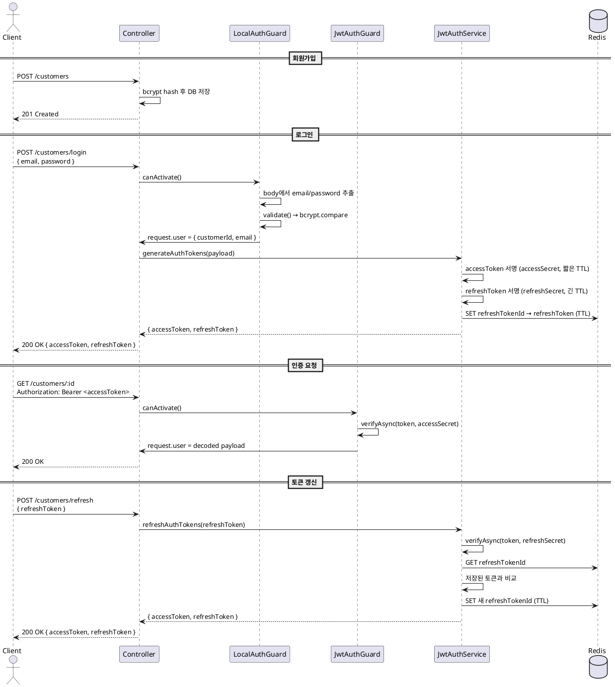
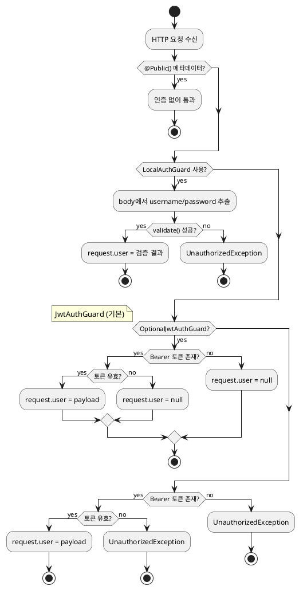

# 인증 (Authentication)

`@mannercode/common`의 `auth` 모듈은 JWT 기반 인증 가드와 토큰 서비스를 제공한다.
Passport 없이 NestJS Guard(`CanActivate`)를 직접 구현한 구조다.

## 구성 요소

| export                  | 역할                                            |
| ----------------------- | ----------------------------------------------- |
| `JwtAuthGuard`          | Bearer 토큰 검증 (abstract, 전역 가드로 등록)   |
| `OptionalJwtAuthGuard`  | 토큰 없으면 `user=null`, 예외 없이 통과         |
| `LocalAuthGuard`        | 요청 body에서 username/password 검증 (abstract) |
| `JwtAuthService`        | access/refresh 토큰 발급 및 갱신, Redis 저장    |
| `JwtAuthModule`         | `JwtAuthService` 동적 등록 모듈                 |
| `@Public()`             | 가드를 우회하는 공개 라우트 데코레이터          |
| `@InjectJwtAuth(name?)` | 이름 기반 `JwtAuthService` 주입 데코레이터      |

## 인증 흐름



## 토큰 구조

- **Access Token**: 짧은 TTL, `accessSecret`으로 서명, API 요청 인증에 사용
- **Refresh Token**: 긴 TTL, `refreshSecret`으로 서명, `refreshTokenId` 포함
- 두 토큰 모두 `jti`(JWT ID)를 포함한다
- Refresh token은 Redis에 `{prefix}:{refreshTokenId}` 키로 저장되며 TTL이 설정된다

## Guard 판단 흐름



## 가드 사용 패턴

### 1. JwtAuthGuard — abstract 클래스 상속

```ts
@Injectable()
export class CustomerJwtAuthGuard extends JwtAuthGuard {
    constructor(jwtService: JwtService, reflector: Reflector, config: AppConfigService) {
        super(jwtService, reflector, { secret: config.auth.accessSecret })
    }

    // LocalAuthGuard가 적용된 핸들러를 감지해 JWT 검증 건너뛰기
    protected isUsingLocalAuth(context: ExecutionContext): boolean {
        const guards =
            this.reflector.get(GUARDS_METADATA, context.getHandler()) ??
            this.reflector.get(GUARDS_METADATA, context.getClass())
        return defaultTo(guards, []).some((guard) => guard === CustomerLocalAuthGuard)
    }
}
```

### 2. LocalAuthGuard — 로그인 엔드포인트 전용

```ts
@Injectable()
export class CustomerLocalAuthGuard extends LocalAuthGuard {
    constructor(private readonly customersService: CustomersService) {
        super({
            usernameField: 'email',
            passwordField: 'password',
            validate: async (email, password) => {
                const customer = await this.customersService.findCustomerByCredentials({
                    email,
                    password
                })
                if (!customer) throw new UnauthorizedException(AuthErrors.Unauthorized())
                return { customerId: customer.id, email }
            }
        })
    }
}
```

### 3. 컨트롤러에서 가드 적용

```ts
@Controller('customers')
@UseGuards(CustomerJwtAuthGuard)          // 클래스 레벨 — 전체 엔드포인트 JWT 필수
export class CustomersHttpController {

    @Post('signup')
    @Public()                              // JWT 검증 건너뛰기
    async signup(@Body() dto: CreateCustomerDto) { ... }

    @Post('login')
    @UseGuards(CustomerLocalAuthGuard)     // body에서 자격증명 검증
    async login(@Req() req: CustomerAuthRequest) {
        return this.service.generateAuthTokens(req.user)
    }
}
```

### 4. OptionalJwtAuthGuard — 비로그인 허용 엔드포인트

```ts
@Get('recommended')
@UseGuards(CustomerOptionalJwtAuthGuard)   // 토큰 없으면 user=null, 있으면 디코딩
async searchRecommendedMovies(@Req() req: CustomerOptionalAuthRequest) {
    const customerId = defaultTo(req.user?.customerId, null)
}
```

## JwtAuthModule 등록

`JwtAuthService`는 동적 모듈로 등록한다. Redis 연결과 설정을 주입받는다.

```ts
JwtAuthModule.register({
    prefix: 'customer-auth',
    inject: [AppConfigService],
    useFactory: (config: AppConfigService) => ({
        auth: {
            accessSecret: config.auth.accessSecret,
            accessTokenTtlMs: config.auth.accessTokenTtlMs,
            refreshSecret: config.auth.refreshSecret,
            refreshTokenTtlMs: config.auth.refreshTokenTtlMs
        }
    })
})
```

`name` 옵션으로 여러 인스턴스를 등록할 수 있고, `@InjectJwtAuth(name)`으로 주입한다.

## 에러 코드

| 코드                                             | 상황                      |
| ------------------------------------------------ | ------------------------- |
| `ERR_JWT_AUTH_REFRESH_TOKEN_INVALID`             | refresh token 불일치/무효 |
| `ERR_JWT_AUTH_REFRESH_TOKEN_VERIFICATION_FAILED` | refresh token 검증 실패   |

## Passport를 사용하지 않는 이유

NestJS Guard 인터페이스(`CanActivate`)를 직접 구현한다.
Passport 의존성 없이 동일한 기능을 더 적은 코드로 제공하며,
Guard 로직이 명시적으로 드러나 디버깅과 커스터마이징이 용이하다.
