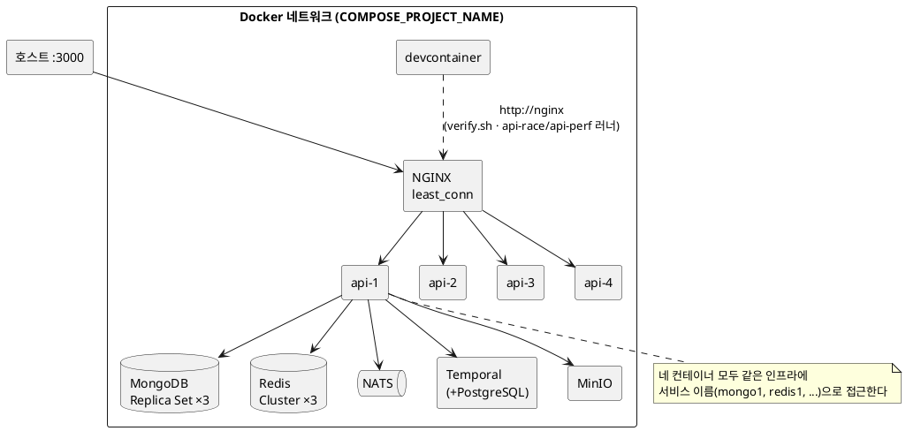

# deploy/ — 앱 배포

Docker Compose로 API 컨테이너를 여러 개 띄우고 NGINX로 요청을 나눈다. Node.js는 기본적으로 한 프로세스가 한 이벤트 루프를 쓰기 때문에, 컨테이너를 나누어 여러 CPU 코어를 활용한다.

MongoDB, Redis, MinIO, NATS, Temporal 같은 인프라는 이미 실행 중이라고 가정한다.

토폴로지는 다음과 같다(다이어그램은 devcontainer의 VS Code 미리보기에서 렌더된다).



## 구성

| 파일                   | 설명                                                                                                |
| ---------------------- | --------------------------------------------------------------------------------------------------- |
| `compose.yml`          | API 컨테이너 N개 + NGINX 로드밸런서                                                                 |
| `nginx.conf`           | 연결 수가 가장 적은 컨테이너로 보내는(`least_conn`) 리버스 프록시, upstream 정보를 담은 액세스 로그 |
| `deps.Dockerfile`      | lockfile 기준 node_modules를 담은 베이스 이미지 (API 이미지 빌드가 참조)                            |
| `ensure-deps-image.sh` | lockfile과 deps.Dockerfile의 합본 해시로 `DEPS_TAG`를 계산하고, 해당 태그 이미지가 없으면 빌드      |
| `verify.sh`            | deps 이미지 보장 → compose up → [../apps/api/api-docs/run.sh](../apps/api/api-docs/run.sh) → down   |

## 주요 설정

| 변수                   | 기본값                                | 설명                                                                                                                                                                                                                                       |
| ---------------------- | ------------------------------------- | ------------------------------------------------------------------------------------------------------------------------------------------------------------------------------------------------------------------------------------------ |
| `COMPOSE_PROJECT_NAME` | 필수 (devcontainer: workspace 폴더명) | API와 개발 인프라가 공유할 Docker 네트워크 이름                                                                                                                                                                                            |
| `DEPS_TAG`             | 자동 계산                             | deps 이미지 태그. `ensure-deps-image.sh`를 source하면 lockfile·deps.Dockerfile 합본 해시로 태그를 계산해 export하고, 이미지가 없으면 그 자리에서 빌드한다(의존성이나 설치 방법이 바뀔 때만 재빌드). `verify.sh`가 이 스크립트를 source한다 |

스택을 띄워 둔 채 쓰려면(예: api-perf 반복 측정 — `verify.sh`는 검증 후 바로 내린다) 다음처럼 직접 띄운다.

```bash
cd deploy && export COMPOSE_IGNORE_ORPHANS=True && source ensure-deps-image.sh && docker compose up -d --build --wait
# 끝나면: docker compose down -v
```

API 컨테이너 개수(4)와 NGINX가 호스트에 노출하는 포트(3000)는 운영자가 바꾸는 값이 아니라 배포 정책이므로 [compose.yml](../deploy/compose.yml)에 직접 고정한다. 복제본을 여러 개로 두는 것 자체가 시드의 전제다 — 분산 락·NATS·원자 전이는 모두 컨테이너 사이 경쟁을 다루는 패턴이라, 1개로 줄이면 이 패턴들이 검증되지 않은 채 통과한다.

API 컨테이너는 `${COMPOSE_PROJECT_NAME}` Docker 네트워크에 붙은 뒤, 서비스 이름(`mongo1`, `redis1`, `nats`, `temporal`, `minio` 등)으로 인프라에 접근한다. devcontainer에서는 `infra` compose와 `deploy/compose.yml`이 같은 네트워크를 공유한다.

환경 변수가 컨테이너로 들어오는 경로는 [환경 변수](reference/environment.md)가 정리한다. deploy 고유의 값은 배포 시점에 덮어쓰는 `NODE_ENV=production`, `LOG_DIRECTORY=/app/logs` 등이며, compose.yml의 `environment`에 둔다.

`verify.sh`는 Dev Container 환경 변수인 `WORKSPACE_ROOT`를 사용한다. 배포 검증도 Dev Container 안에서 실행하는 것을 기준으로 한다.

## `x-replica-id` 응답 헤더

[bootstrap.ts](../apps/api/src/bootstrap.ts)의 미들웨어는 모든 HTTP 응답에 `x-replica-id: <os.hostname()>`를 넣는다. 컨테이너 hostname이 API 컨테이너의 고유 ID 역할을 한다. 클라이언트와 분산 테스트는 이 헤더로 NGINX가 실제로 여러 컨테이너에 요청을 나누었는지 확인한다.
