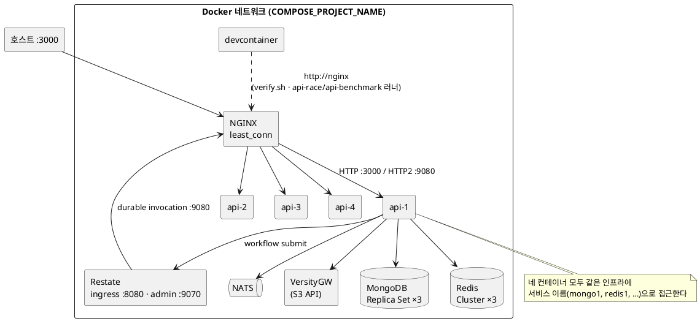

# deploy/ — 다중 복제본 검증 스택

> **운영 배포본이 아니다.** 이 폴더는 API 복제본 4개와 NGINX를 띄워 실행 가능한 API 문서·분산 레이스·성능 하네스를 재현하는 참고 스택이다. 커밋된 개발 env, HTTP NGINX, 외부에 이미 띄워진 개발 인프라를 사용한다. TLS·secret manager·백업/복구·모니터링·무중단 오케스트레이션·console/user-app 배포는 별도로 설계해야 한다.

Docker Compose로 API 컨테이너를 여러 개 띄우고 NGINX로 요청을 나눈다. Node.js는 기본적으로 한 프로세스가 한 이벤트 루프를 쓰기 때문에, 컨테이너를 나누어 여러 CPU 코어를 활용한다.

MongoDB, Redis, VersityGW, NATS, Restate 같은 인프라는 이미 실행 중이라고 가정한다.

토폴로지는 다음과 같다(다이어그램은 devcontainer의 VS Code 미리보기에서 렌더된다).


```plantuml
@startuml
skinparam componentStyle rectangle

rectangle "호스트 :3000" as hostport
rectangle "Docker 네트워크 (COMPOSE_PROJECT_NAME)" {
    [NGINX\nleast_conn] as nginx
    [api-1] as a1
    [api-2] as a2
    [api-3] as a3
    [api-4] as a4
    database "MongoDB\nReplica Set ×3" as mongo
    database "Redis\nCluster ×3" as redis
    queue NATS as nats
    [Restate\ningress :8080 · admin :9070] as restate
    [VersityGW\n(S3 API)] as s3
    [devcontainer] as dev
}

hostport --> nginx
nginx --> a1 : HTTP :3000 / HTTP2 :9080
nginx --> a2
nginx --> a3
nginx --> a4
a1 --> mongo
a1 --> redis
a1 --> nats
a1 --> restate : workflow submit
restate --> nginx : durable invocation :9080
a1 --> s3
note bottom of a1
  네 컨테이너 모두 같은 인프라에
  서비스 이름(mongo1, redis1, ...)으로 접근한다
end note
dev ..> nginx : http://nginx\n(verify.sh · api-race/api-benchmark 러너)
@enduml
```

## 구성

| 파일                   | 설명                                                                                                   |
| ---------------------- | ------------------------------------------------------------------------------------------------------ |
| `compose.yml`          | API 컨테이너 N개 + NGINX 로드밸런서 + Restate endpoint 등록용 one-shot 서비스                          |
| `nginx.conf`           | HTTP API(:80)와 Restate HTTP/2 endpoint(:9080)를 API 복제본에 `least_conn`으로 분배                    |
| `deps.Dockerfile`      | lockfile 기준 node_modules를 담은 베이스 이미지 (API 이미지 빌드가 참조)                               |
| `ensure-deps-image.sh` | 의존성 입력의 합본 해시로 `DEPS_TAG`를 계산하고, 해당 태그 이미지가 없으면 빌드                        |
| `prebuild-images.sh`   | Stability 반복 전 deps·API·NGINX 이미지를 한 번만 준비. 실패하면 짧은 backoff로 최대 3회 시도          |
| `verify.sh`            | deps 이미지 보장 → compose up → Restate endpoint 등록 → [API 문서](../apps/api/api-docs/run.sh) → down |

## 주요 설정

| 변수                   | 기본값                                                  | 설명                                                                                                                                                                                                                       |
| ---------------------- | ------------------------------------------------------- | -------------------------------------------------------------------------------------------------------------------------------------------------------------------------------------------------------------------------- |
| `COMPOSE_PROJECT_NAME` | 필수 (devcontainer: 사용자명과 workspace basename 조합) | API와 개발 인프라가 공유할 Docker 네트워크 이름                                                                                                                                                                            |
| `DEPS_TAG`             | 자동 계산                                               | deps 이미지 태그. `ensure-deps-image.sh`를 source하면 lockfile·npm 정책·Dockerfile·workspace manifest의 합본 해시로 태그를 계산해 export하고, 이미지가 없으면 그 자리에서 빌드한다. `verify.sh`가 이 스크립트를 source한다 |

베이스·NGINX·인프라 이미지 참조는 사람이 읽을 버전 태그와 실제 바이트를 고정하는 multi-architecture digest를 같이 둔다. 버전을 올릴 때는 태그와 digest를 함께 확인·갱신한다.

스택을 띄워 둔 채 쓰려면(예: api-benchmark 반복 측정 — `verify.sh`는 검증 후 바로 내린다) 다음처럼 직접 띄운다.

고정 등록 URI를 `force: false`로 쓰므로, Restate가 이미 `http://nginx:9080`을 알고 있는 상태에서 API 코드·workflow manifest를 바꿨다면 먼저 `bash infra/reset.sh`로 개발 Restate를 초기화한다. 이 reset은 journal volume도 지우므로 운영 절차가 아니라 보존할 execution이 없는 개발·검증 환경에서만 실행한다.

```bash
cd deploy && export COMPOSE_IGNORE_ORPHANS=True && source ensure-deps-image.sh && docker compose up -d --build --wait
docker compose run --rm --no-deps restate-register
# 끝나면: docker compose down -v
```

스택을 반복해 띄우는 CI는 반복 안에서 이미지를 다시 빌드하지 않도록 먼저 다음을 실행한다.

```bash
bash deploy/prebuild-images.sh
DEPLOY_IMAGES_PREBUILT=true bash tests/api-race/runner.sh <scenario>
```

`DEPLOY_IMAGES_PREBUILT=true`는 `nest-seed-api`가 이미 존재할 때만 `docker compose up --no-build`로 재사용하라는 로컬 하네스 계약이다. 이미지가 없으면 실패하며 원격 레지스트리에 올리거나 운영 배포를 하지 않는다. 일반 `verify.sh`는 소스 변경을 포함하려고 그대로 `--build`를 사용한다.

API 컨테이너 개수(4)와 NGINX가 호스트에 노출하는 포트(3000)는 운영자가 바꾸는 값이 아니라 검증 정책이므로 [compose.yml](../deploy/compose.yml)에 직접 고정한다. 복제본을 여러 개로 두는 것 자체가 시드의 전제다. NATS fan-out, 락·lease owner CAS, Mongo 트랜잭션 경합, 원자 상태 전이는 모두 복제본 사이 경쟁을 다루므로, 1개로 줄이면 핵심 패턴이 실제로 경쟁하지 않은 채 통과한다.

API 컨테이너는 `${COMPOSE_PROJECT_NAME}` Docker 네트워크에 붙은 뒤, 서비스 이름(`mongo1`, `redis1`, `nats`, `restate`, `s3` 등)으로 인프라에 접근한다. devcontainer에서는 `infra` compose와 `deploy/compose.yml`이 같은 네트워크를 공유한다.

환경 변수가 컨테이너로 들어오는 경로는 [환경 변수](reference/environment.md)가 정리한다. deploy 고유의 값은 배포 시점에 덮어쓰는 `NODE_ENV=production`, `LOG_DIRECTORY=/app/logs` 등이며, compose.yml의 `environment`에 둔다.

`verify.sh`는 Dev Container 환경 변수인 `WORKSPACE_ROOT`를 사용한다. 배포 검증도 Dev Container 안에서 실행하는 것을 기준으로 한다.

## 프런트엔드 BFF와 클라이언트 IP 경계

이 Compose 스택은 API만 배포한다. `console`과 `user-app`을 운영에 함께 배포할 때는 두 Next.js 서버를 신뢰할 수 있는 edge/reverse proxy 뒤에 두고, 브라우저가 Next origin에 직접 접근하지 못하게 제한해야 한다. edge는 외부 요청의 `X-Forwarded-For`를 그대로 신뢰하지 않고 실제 연결 주소를 체인의 오른쪽 끝에 append하며, `X-Real-IP`는 실제 연결 주소로 덮어써야 한다.

BFF는 기본적으로 proxy IP 헤더를 무시한다. 위 경계를 보장한 배포에서만 두 Next.js 서버에 `BFF_TRUST_PROXY_HEADERS=true`를 명시해 opt-in한다. 이때 BFF는 `X-Forwarded-For`의 오른쪽 끝 값 하나(헤더가 없으면 검증된 `X-Real-IP`)가 실제 IP일 때만 API로 전달한다. 오른쪽 끝 값이 잘못됐다고 앞쪽 값으로 후퇴하지 않는다.

API는 `loopback`·`linklocal`·`uniquelocal` 프록시만 신뢰하므로, API 포트 역시 사설 네트워크의 BFF/NGINX에서만 접근 가능해야 한다. 이 경계를 보장할 수 없는 환경에서는 opt-in하지 말고 IP 제한을 신뢰 가능한 edge로 옮겨야 한다. 기본값에서는 모든 요청이 API 관점에서 BFF 주소 하나로 보이므로 IP별 로그인 버킷도 공유된다는 점에 유의한다.

이 경계는 `deploy/verify.sh`가 아니라 각 테스트 계층이 자기 범위만 검증한다.

- [BFF 계약 테스트](../tests/web/contracts/bff-proxy.spec.ts)는 기본값에서 proxy IP 헤더를 무시하는 규칙, opt-in에서 오른쪽 끝 IP만 선택하는 규칙, 잘못된 끝값에서 앞쪽 공격자 값으로 후퇴하지 않는 규칙을 두 Next.js 앱에 공통으로 검증한다.
- Playwright는 두 BFF를 의도적으로 `BFF_TRUST_PROXY_HEADERS=true`로 시작한다. 브라우저가 보낸 `X-Forwarded-For`로 신뢰 edge를 모사해 서로 다른 주소의 로그인 실패가 별도 IP 버킷에 쌓이는 opt-in wiring을 검증한다. 이것은 실제 public edge가 외부 헤더를 덮어쓰는지는 증명하지 않는다.
- API 인증 통합 테스트는 프로세스 안에서 trusted-proxy 해석과 로그인 rate-limit 동작을 검증한다. Compose의 BFF·edge 경계를 통과하는 통합 검증은 아니다.

## Restate endpoint 등록과 운영 전환

각 API 복제본은 일반 HTTP 포트 3000과 별도로 [Restate HTTP/2 endpoint](../apps/api/src/services/application/showtime-creation/worker/restate-endpoint.service.ts)를 9080에 연다. Restate에는 복제본 주소를 하나씩 등록하지 않고 NGINX의 안정적인 `http://nginx:9080`을 등록한다. NGINX가 Restate invocation을 healthy한 API 복제본으로 분배하므로 4개 복제본이 하나의 서비스 endpoint처럼 동작한다.

[`verify.sh`](../deploy/verify.sh)는 API와 NGINX가 healthy가 된 다음 `restate-register` one-shot 서비스를 실행한다. 이 서비스는 Restate Admin API의 `/deployments`에 `{ uri: "http://nginx:9080", force: false, use_http_11: false }`를 보낸다. 등록을 빼면 일반 REST health는 통과해도 상영 생성 workflow는 dispatch되지 않으므로, compose를 직접 띄울 때도 위 명령을 함께 실행한다.

같은 URI가 이미 있으면 `force: false` 등록은 기존 deployment를 그대로 반환하며 service manifest를 다시 발견하지 않는다. AtoZ와 Stability는 시작 시 `infra/reset.sh`로 fresh Restate를 만들고, 반복 안에서는 미리 빌드한 같은 코드를 재사용하기 때문에 이 동작이 맞다. 수동 검증에서 코드를 바꿨다면 위 초기화 절차를 먼저 따른다.

API `/health`의 Restate 항목은 ingress의 `/restate/health`만 확인한다. NGINX 9080 endpoint의 등록 여부와 도달 가능성까지 확인하는 readiness probe가 아니므로, health 통과를 등록 성공으로 해석하지 않는다.

이 폴더는 같은 URI 뒤의 컨테이너 이미지를 바꿔 가는 **검증 스택**이다. 실제 운영의 무중단 버전 전환 계약은 아니다. 운영에서는 새 revision마다 구별되는 endpoint URI를 등록하고, 기존 deployment에 묶인 invocation이 끝날 때까지 이전 revision을 유지한 뒤 제거한다. `force: true`로 같은 URI의 정의를 덮어쓰면 실행 중인 invocation의 호환성을 깨뜨릴 수 있다. 개발 스크립트의 강제 등록을 운영 절차로 복사하지 않는다.

Temporal에서 Restate로는 workflow history를 옮길 수 없으므로 이 저장소는 두 런타임을 함께 싣지 않는 **direct cutover**를 택했다. 시드 자체에는 보존할 운영 execution이 없다는 전제다. 이미 Temporal을 운영 중인 포크는 다음 순서 없이 바로 교체하면 안 된다.

1. 신규 Temporal 상영 생성 제출을 중지한다.
2. **구 API 바이너리와 worker가 살아 있는 동안** Temporal의 open workflow와 실행 중 Activity를 조회해 모두 완료시키거나 명시적으로 취소한다. 필요한 history와 업무 상태를 별도로 보존한다.
3. open execution이 0임을 확인한 뒤에만 Temporal worker가 빠진 새 API revision과 Restate 서버를 배포하고, version-specific endpoint를 등록한다.
4. 같은 `Idempotency-Key` 재요청, `waiting → processing → succeeded/failed/error`, MongoDB의 상영·티켓·operation 일치를 smoke test한다.
5. 그 뒤에만 남은 Temporal 서버·DB와 구 worker 배포 자원을 제거한다. Temporal history가 Restate journal로 자동 변환된다고 가정하지 않는다.

Restate의 deployment/version 동작은 [공식 versioning 문서](https://docs.restate.dev/services/versioning)를 기준으로 운영 환경에 맞게 설계한다.

## 인증·구매 상태 스키마 교체

`authVersion`과 구매 상태 머신을 처음 도입하는 버전은 구·신 API 바이너리를 함께 서비스하지 않는다. 기존 DB 문서와 `authVersion` claim이 없는 version 0 토큰은 신 버전이 읽을 수 있지만, 구 버전은 신 `pending`/`compensating` 구매 기록을 완료 구매처럼 노출할 수 있다.

따라서 이 릴리스는 새 구매 유입을 잠시 중지하고 기존 복제본을 모두 내린 뒤 동일 이미지로 한 번에 교체한다. 교체 후 `pending`/`completing`/`compensating` 기록이 재조정 주기에서 정상 수렴하는지 확인한 뒤 트래픽을 다시 연다.

## `x-replica-id` 응답 헤더

[bootstrap.ts](../apps/api/src/bootstrap.ts)의 미들웨어는 모든 HTTP 응답에 `x-replica-id: <os.hostname()>`를 넣는다. 컨테이너 hostname이 API 컨테이너의 고유 ID 역할을 한다. 클라이언트와 분산 테스트는 이 헤더로 NGINX가 실제로 여러 컨테이너에 요청을 나누었는지 확인한다.
