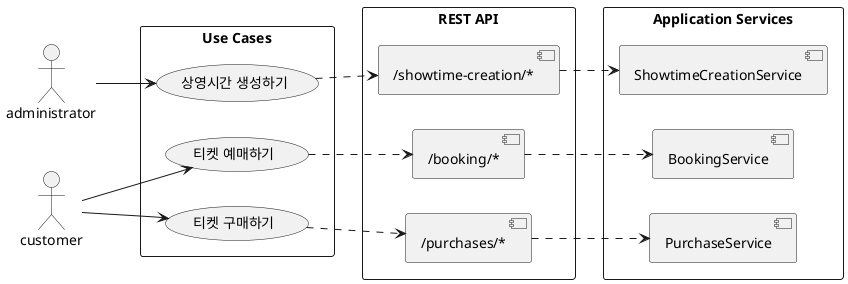

# 백엔드 설계 가이드

---

## 1. 서비스 아키텍처 — SoLA (Service-oriented Layered Architecture)

### 1.0. 시스템 개요

```
Client ── HTTP ──▶ Gateway ── NATS RPC ──┬──▶ Applications  (비즈니스 로직, 비동기 작업)
                                         ├──▶ Cores          (도메인 모델, 데이터 영속성)
                                         └──▶ Infrastructures (외부 서비스 연동)
```

| Service             | Role                                         | Domains                                                                                       |
| ------------------- | -------------------------------------------- | --------------------------------------------------------------------------------------------- |
| **Gateway**         | API 진입점, 인증(JWT/Local)                  | Customers, Movies, Theaters, Booking, Purchase, ShowtimeCreation                              |
| **Applications**    | 비즈니스 오케스트레이션, Temporal 워크플로우 | ShowtimeCreation, Booking, Purchase, Recommendation                                           |
| **Cores**           | 핵심 도메인 엔터티, 데이터 영속성            | Customers, Movies, Theaters, Showtimes, Tickets, TicketHolding, PurchaseRecords, WatchRecords |
| **Infrastructures** | 외부 서비스 통합                             | Payments, Assets(MinIO)                                                                       |

| Component    | Configuration                                        |
| ------------ | ---------------------------------------------------- |
| **MongoDB**  | 3-node replica set (27017-27019)                     |
| **Redis**    | 6-node cluster, 3 primary + 3 replica (6379-6384)    |
| **NATS**     | 3-node cluster (4222-4224)                           |
| **MinIO**    | S3-compatible object storage (9000, console 9001)    |
| **Temporal** | Workflow engine + PostgreSQL backend (7233, UI 8233) |

### 1.1. 문제: MSA의 순환 참조

MSA는 작은 서비스들이 협력해서 기능을 제공한다. 이때 서비스 간 참조에 제약이 없으면 기능이 확장되면서 순환 참조가 발생할 수 있다.

서비스 간 참조에 제약이 없으면, 처음에는 A → B 단방향이었던 관계가 기능 확장 과정에서 B → A 참조가 추가되어 순환 참조로 발전할 수 있다. 이렇게 되면 두 서비스는 사실상 하나로 묶인다. A를 변경하면 B가 영향을 받고, B를 변경하면 다시 A가 영향을 받는다.

### 1.2. 해결: 계층 분리

이 프로젝트에서는 서비스를 세 계층으로 나누고, 순환 참조를 원천적으로 방지한다. 이 구조를 SoLA(Service-oriented Layered Architecture)라 부른다.

일반적인 레이어드 아키텍처는 상위 → 하위 참조만 금지하고 같은 계층 간 참조는 허용한다. 그러나 SoLA는 **동일 계층 간 참조도 금지**한다. 같은 계층의 서비스끼리 참조를 허용하면 결국 순환 참조로 발전할 수 있기 때문이다. 여러 서비스를 조합해야 하는 경우에는 반드시 상위 계층에서 조립한다.

```
┌─────────────────────────────────────────┐
│         Application Services            │  유스케이스 조립, 트랜잭션 관리
│  ShowtimeCreation, Booking, Purchase    │
├─────────────────────────────────────────┤
│            Core Services                │  도메인 기본 로직
│  Movies, Theaters, Showtimes, Tickets   │
├─────────────────────────────────────────┤
│        Infrastructure Services          │  외부 시스템 연동
│           Payments, Assets              │
└─────────────────────────────────────────┘
```

**의존 규칙**:

1. **동일 계층 간 참조 금지** — 같은 계층의 서비스끼리는 서로를 알지 못한다
2. 상위 계층만 하위 계층을 참조 가능 (Application → Core → Infrastructure, 화살표는 참조 방향)
3. 하위 계층은 상위 계층을 알지 못한다

### 1.3. 각 계층의 역할

| 계층               | 역할                                                                                        | 참조 가능 대상       |
| ------------------ | ------------------------------------------------------------------------------------------- | -------------------- |
| **Application**    | 사용자 시나리오를 조립한다 (예: 상영시간 생성 → 티켓 생성). 트랜잭션 관리를 주도한다.       | Core, Infrastructure |
| **Core**           | 도메인의 기본 로직을 담당한다 (예: 영화 관리, 극장 관리). 각 서비스는 자신의 DB만 소유한다. | Infrastructure       |
| **Infrastructure** | 결제, 스토리지 등 외부 시스템 연동을 담당한다.                                              | 없음                 |

하나의 마이크로서비스를 설계할 때 Application · Domain · Infrastructure 레이어로 객체를 분류하듯이, 마이크로서비스 전체도 동일한 원리로 계층을 나누는 것이다.

### 1.4. Application Service 설계

유스케이스, REST API 네임스페이스, Application Service는 1:1로 대응된다.



유스케이스에서 시작해 API를 설계하고, API 구조에 맞춰 서비스를 만들기 때문에 세 레이어가 자연스럽게 정렬된다. 이 대응 관계가 유지되면 코드 어디서든 유스케이스 → API → 서비스를 일관되게 추적할 수 있다.

Application Service는 오케스트레이터 역할에 충실한다. 비즈니스 로직이 복잡해지면 내부 클래스로 책임을 분산시킨다.

```
ShowtimeCreationService            (오케스트레이터)
  └─ showtimeCreationWorkflow      (Temporal Workflow, 작업 흐름 제어)
       ├─ ShowtimeBulkValidatorService  (요청 검증)
       └─ ShowtimeBulkCreatorService    (Showtime/Ticket 생성)
```

---

## 2. REST API 설계

### 2.1. Namespace

API 경로에 유스케이스 맥락을 반영하는 네임스페이스를 사용한다. 네임스페이스 단위로 API를 묶으면 해당 유스케이스의 요구사항이 크게 변하지 않는 한 API를 변경할 필요가 없다.

### 2.2. 긴 쿼리 파라미터

쿼리 파라미터가 길어질 수 있는 API는 POST 방식으로 정의한다.

```
POST /showtime-creation/showtimes/search
{
    "theaterIds": [...]
}
```

### 2.3. 비동기 요청

처리 시간이 오래 걸리는 작업은 202 Accepted를 반환하고 비동기로 처리한다.

```
POST /showtime-creation/showtimes → 202 Accepted { sagaId }
SSE  /showtime-creation/event-stream → { status, sagaId }
```

---

## 3. 엔티티 설계

### 3.1. MSA 데이터 비정규화

서비스 간 DB를 공유하지 않으므로, 정규화보다 **서비스 간 결합 감소**를 우선한다.

`Ticket`에 `movieId`·`theaterId`를 중복 저장하는 것이 대표적인 예다. 이 값들은 `Showtime`에도 존재하지만, 중복 저장하지 않으면 조회 시마다 `ShowtimesService`를 호출해야 한다.

### 3.2. Entity vs Value Object

도메인 맥락에 따라 같은 개념이라도 Entity가 될 수도, Value Object가 될 수도 있다.

`Theater.seatmap`은 티켓 생성을 위한 템플릿이다. 고객은 `Block`·`Row`·`Number`로 좌석을 찾을 뿐 좌석 ID는 필요 없으므로 Value Object로 정의한다.

### 3.3. sagaId

비동기 대량 작업의 추적과 취소를 위해 관련 엔티티에 `sagaId` 속성을 추가한다.

---

## 4. 서비스 호출 흐름

REST API 호출은 4단계를 거쳐 서비스를 실행한다.

```
┌────────────────────────────┐        ┌──────────────────────────────┐
│    #1 Gateway Controller   │        │          #4 Service          │
│      ┌─────────────────────┤        ├────────────────────────┐     │
│      │  #2 Service Client  ├───────>│  #3 Service Controller │     │
│      └─────────────────────┤        ├────────────────────────┘     │
└────────────────────────────┘        └──────────────────────────────┘
```

```
apps
├── gateway
│   └── controllers
│       └── #1 movies.http-controller.ts
│
└── cores
    └── services
        └── movies
            ├── #2 movies.client.ts
            ├── #3 movies.controller.ts
            └── #4 movies.service.ts
```

---

## 5. 서비스 이름 규칙

프로세스 중심 서비스는 단수형, 엔티티 관리 서비스는 복수형으로 명명한다.

| 유형               | 예시                                | 설명                 |
| ------------------ | ----------------------------------- | -------------------- |
| 프로세스 (단수)    | `BookingService`, `PurchaseService` | 특정 프로세스를 처리 |
| 엔티티 관리 (복수) | `MoviesService`, `TheatersService`  | 엔티티 CRUD 담당     |

`Service` suffix는 **다른 서비스를 직접 호출해 스스로 처리하는 경우**에만 붙인다. 필요한 데이터를 호출자에게 전달받아 계산만 수행하는 경우에는 suffix를 붙이지 않는다.

```
ShowtimeBulkValidatorService  ← Showtimes/Movies/Theaters 클라이언트를 직접 호출
ShowtimeBulkValidator         ← 호출자가 데이터를 주입하면 검증 계산만 수행
```

---

## 6. API 단수/복수 설계

id만 전달하는 조회·삭제 API는 처음부터 **복수형**으로 설계한다. 나중에 복수 처리가 필요해져서 API를 변경하는 것을 방지한다.

```ts
// id만 받는 API — 복수형
getMany(theaterIds: string[]) {}
deleteMany(theaterIds: string[]) {}

// 생성·업데이트 — 단일
create(createDto: CreateTheaterDto) {}
update(updateDto: UpdateTheaterDto) {}
```

REST API에서 단일 요청이 필요한 경우, Gateway Controller에서 배열로 감싸서 호출한다.

```ts
@Get(':theaterId')
async getTheater(@Param('theaterId') theaterId: string) {
    return this.theatersService.getMany([theaterId])
}
```

---

## 7. 에러 메시지

- **언어 중립적인 code**를 반드시 포함한다. 다국어 지원은 클라이언트 책임이다.
- `message`는 참고용으로 간단히 기술한다.
- HTTP Status가 **4xx 범위일 때만** code를 포함한다. 5xx는 서버 장애이므로 클라이언트에 상세 원인을 노출하지 않는다.

---
