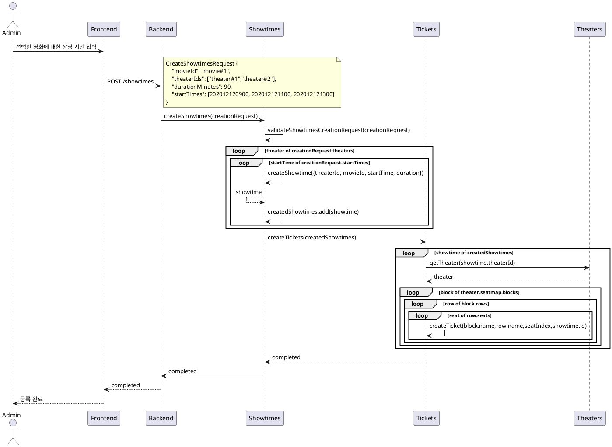
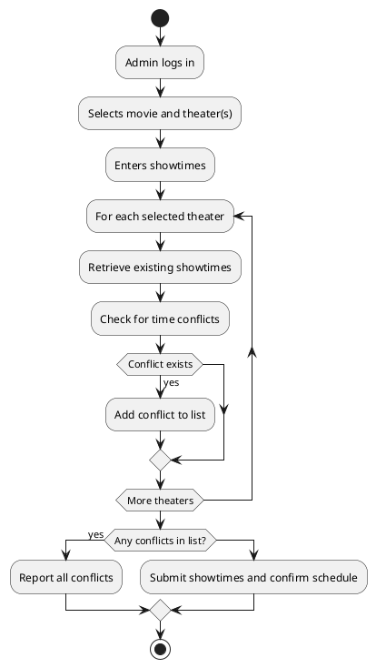

# Showtimes Registration

```
Showtime과 Ticket을 한 번에 생성하려는 시행착오가 있었다.
ShowtimesService에서 createTickets를 호출했다.

Showtime과 Ticket이 분리된 서비스라면 각자 알아서 행동하도록 해야 한다.
event를 도입하고 각자의 할 일이나 오류 처리는 각자가 하도록 한다.
지금은 showtime과 ticket이지만 나중에 showtime이나 ticket에 기반한 서비스가 생성되면 종속성 문제가 생길 것이다.
```

goal : 하나의 영화를 여러 극장에 상영 시간 등록하기

description : 이 유스케이스는 하나의 영화에 대해 여러 극장에 상영 시간을 등록하는 기능을 설명합니다.

actor: Admin

preconditions :

-   관리자는 시스템에 로그인해야 합니다.
-   영화와 극장은 이미 시스템에 등록되어 있어야 합니다.

trigger:

-   관리자가 영화 상영 시간 등록 페이지를 방문합니다.

main flow :

1. 시스템은 현재 등록된 영화 목록을 보여줍니다.
1. 관리자는 상영 시간을 등록하려는 영화를 선택합니다.
1. 시스템은 현재 등록된 극장 목록을 보여줍니다.
1. 관리자는 상영 시간을 등록하려는 극장들을 선택합니다.
1. 관리자는 각 극장에 대한 상영 시간을 입력합니다.
1. 관리자는 상영 시간을 등록합니다.
1. 시스템은 등록한 상영 시간이 기존의 상영 시간과 겹치는지 검사합니다.
1. 만약 겹치지 않는다면, 시스템은 상영 시간을 등록하고, 상영 시간 등록이 완료되었다는 메시지를 보여줍니다.

Exception Flow :

-   만약 상영 시간이 기존의 상영 시간과 겹친다면
    1. 시스템은 상영 시간 등록에 실패했다는 메시지와 함께 어떤 상영 시간이 겹쳤는지 정보를 보여줍니다.
    1. 기본 흐름 5단계로 돌아갑니다.

Postconditions :

-   선택한 극장에서 선택한 영화의 상영 시간이 성공적으로 등록되어야 합니다.
-   데이터베이스에 등록한 상영 시간 정보가 반영되어야 합니다.
-   상영시간에 해당하는 티켓이 생성되어야 한다.

## 상영 시간 충돌 검증 알고리즘 컨셉

상영 시간은 최소 10분 단위다.

기존에 등록되어 있던 showtime[] 중에서 등록하려는 상영시간의 최소와 최대에 해당하는 showtime[]을 set<number>로 등록한다.

예를 들어 2023/12/31 09:00 - 10:40이면

202312310900,202312310910,202312310920, ... 이렇게 등록한다.

그러면 바로 비교 가능하다.

## 시퀀스

트랜잭션과 동시성 제어를 위해서 나중에 배치 프로세스로 실행되도록 해야 한다. 배치 프로세스로 순차적으로 처리하면 동시성 문제도 해결 가능하다.



## validateShowtimesCreationRequest(creationRequest)

```
  200개의 극장, 60일의 상영일, 8회차
= 200 * 6 0 * 8
= 96,000 개의 showtime이 있을 것으로 가정함.
```

1. 10분 단위로 모든 future showtime을 set에 등록한다.
2. createShowtime(만들려는 시간)이 timeslots에 존재하면 기존 시간과 충돌하는 것이다.

```ts
const timeslots: Set<number> = new Set([
    202010300430, 202010300440, 202010300450, 202010300500, 202010300510, 202010300520
])

const createShowtime = 202010300500

if (timeslots.has(createShowtime)) {
    console.log('Conflict')
} else {
    console.log('No conflict')
}
```

> 지금은 backend 메모리를 사용하여 충돌 체크하지만 규모가 커지면 redis로 timeslots을 옮길 수 있다.



```ts
ValidationResultDto
{
    status: 'success' | 'fail'
    errors: [
        {
            movieId: 'movie#1',
            theaterId: 'theater#1',
            conflictingShowtimes: [{ startDatetime: 202012120900 }]
        }
    ]
}
```
