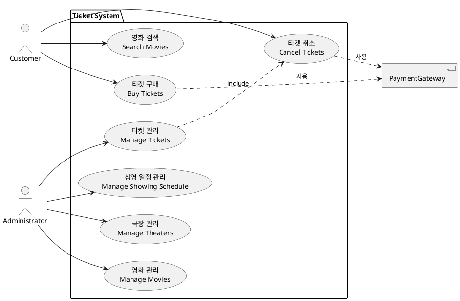
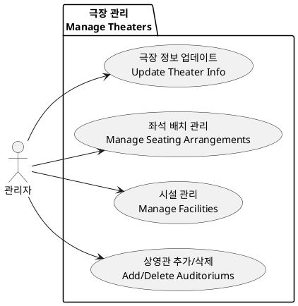

# Use Cases

극장 예매 시스템의 유스케이스다.

```plantuml
@startuml
left to right direction

actor Customer
actor Administrator
component PaymentGateway

package "Ticket System" {
    usecase "영화 검색\nSearch Movies" as SearchMovies
    usecase "티켓 구매\nBuy Tickets" as BuyTickets
    usecase "티켓 취소\nCancel Tickets" as CancelTickets
    usecase "상영 일정 관리\nManage Showing Schedule" as ManageShowingSchedule
    usecase "극장 관리\nManage Theaters" as ManageTheaters
    usecase "영화 관리\nManage Movies" as ManageMovies
    usecase "티켓 관리\nManage Tickets" as ManageTickets

    Customer --> SearchMovies
    Customer --> BuyTickets
    BuyTickets ..> PaymentGateway : 사용
    Customer --> CancelTickets
    CancelTickets ..> PaymentGateway : 사용
    Administrator --> ManageShowingSchedule
    Administrator --> ManageTheaters
    Administrator --> ManageMovies
    Administrator --> ManageTickets
    ManageTickets ..> CancelTickets : include
}
@enduml

```

```plantuml
@startuml
left to right direction

actor 관리자 as Administrator

package "극장 관리\nManage Theaters" {
    usecase "극장 정보 업데이트\nUpdate Theater Info" as UpdateTheaterInfo
    usecase "좌석 배치 관리\nManage Seating Arrangements" as ManageSeating
    usecase "시설 관리\nManage Facilities" as ManageFacilities
    usecase "상영관 추가/삭제\nAdd/Delete Auditoriums" as ManageAuditoriums

    Administrator --> UpdateTheaterInfo
    Administrator --> ManageSeating
    Administrator --> ManageFacilities
    Administrator --> ManageAuditoriums
}
@enduml

```
