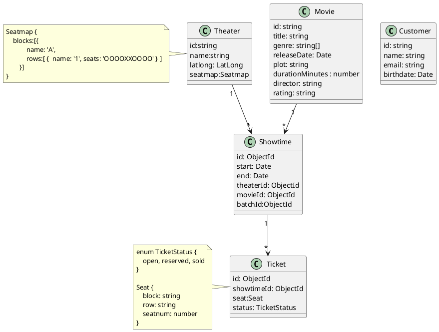

# Entities

Seat는 왜 value object인가?

여기서 Seat는 Ticket을 생성하기 위한 일종의 템플릿으로 사용된다.
템플릿을 사용해서 생성되는 object에 id가 부여되어야 하는 것이다.
극장의 시설관리 서비스라면 각각의 Seat에 id를 부여했을 수 있다.

엔티티는 call by ref라면 value object는 call by value와 같다.
call by ref는 어딘가에서 엔티티의 값을 변경하면 다른 곳에도 변경된 값이 적용된다.
만약 고객의 주소를 엔티티로 하고 배송 주소에 이 엔티티를 사용하면 의도와 다를 수 있다.
배송이 시작되고 고객의 주소를 변경할 수 있기 때문이다.
그러나 배송 주소는 한 번 정해지면 변경하면 안 된다.

