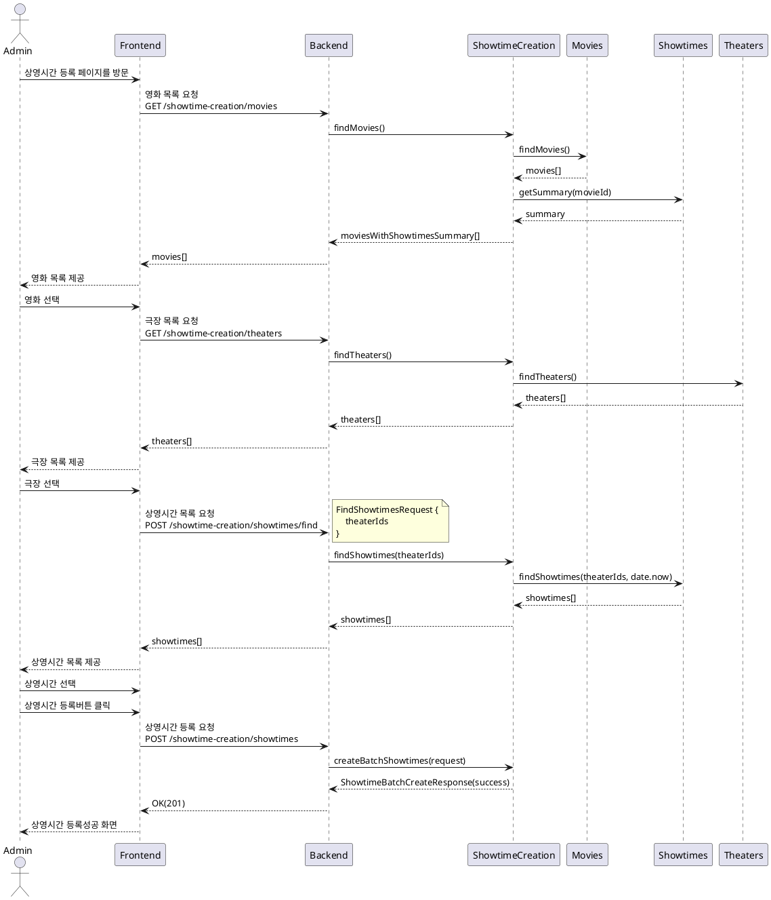
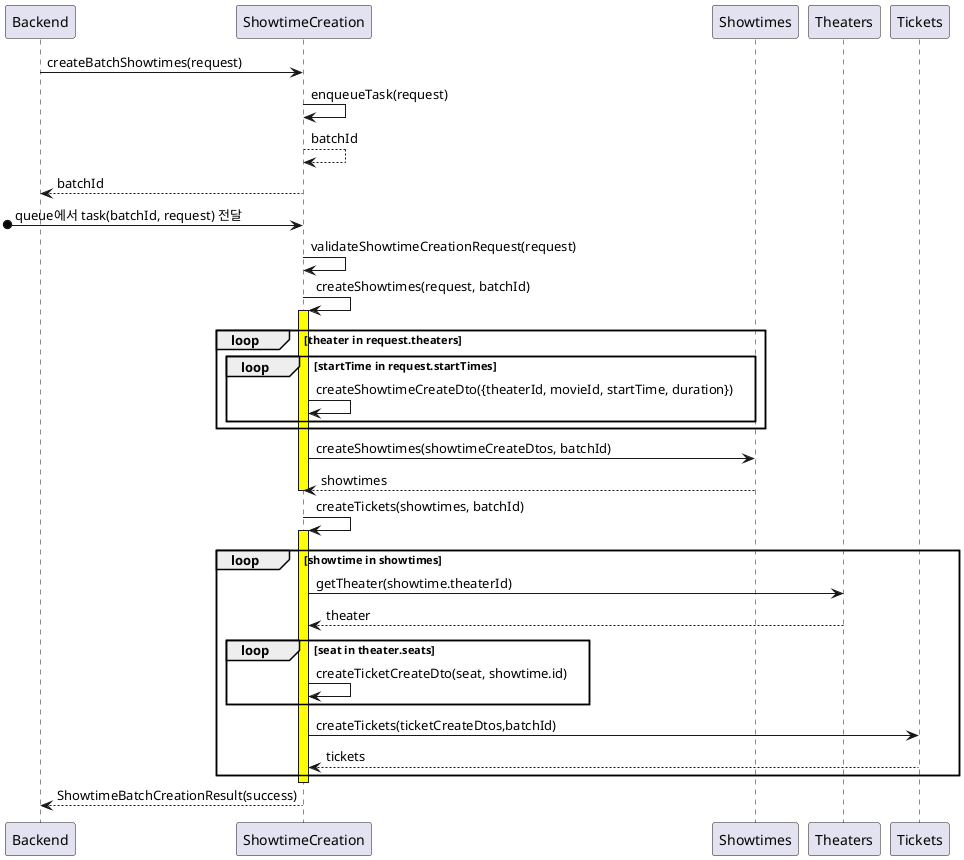

# Showtime Creation

## 1. 상영시간 등록 유스케이스 명세서

**목표**: 하나의 영화를 여러 극장에 상영시간 등록하기

**액터**: 관리자

**선행 조건**:

-   관리자는 시스템에 로그인해야 합니다.
-   영화와 극장은 시스템에 등록되어 있어야 합니다.

**트리거**:

-   관리자가 영화 상영시간 등록 페이지를 방문합니다.

**기본 흐름**:

1. 시스템은 현재 등록된 영화 목록을 보여줍니다.
1. 관리자는 상영시간을 등록하려는 영화를 선택합니다.
1. 시스템은 현재 등록된 극장 목록을 보여줍니다.
1. 관리자는 상영시간을 등록하려는 극장들을 선택합니다.
1. 관리자는 각 극장에 대한 상영시간을 입력합니다.
1. 관리자는 상영시간을 등록합니다.
1. 시스템은 등록한 상영시간이 기존의 상영시간과 겹치는지 검사합니다.
1. 만약 겹치지 않는다면, 시스템은 상영시간을 등록하고, 상영시간 등록이 완료되었다는 메시지를 보여줍니다.

**대안 흐름**:

-   만약 상영시간이 기존의 상영시간과 겹친다면
    1. 시스템은 상영시간 등록에 실패했다는 메시지와 함께 어떤 상영시간이 겹쳤는지 정보를 보여줍니다.
    1. 기본 흐름 5단계로 돌아갑니다.

**후행 조건**:

-   선택한 극장에서 선택한 영화의 상영시간이 성공적으로 등록되어야 합니다.
-   상영시간에 해당하는 티켓이 생성되어야 한다.

## 2. 상영시간 등록 시퀀스 다이어그램



-   검증과 생성에 오랜시간이 걸리기 때문에 위의 동기 요청(Synchronous Request)은 UX에 부정적이다. 그래서 클라이언트가 생성 요청을 하면 batchId를 리턴하고 후에 SSE로 처리 결과 이벤트를 발생시킨다.
-   ShowtimeCreationService는 애플리케이션 서비스이고 다른 서비스에 영향을 주지 않는다. 설계를 최소화 하고 많은 부분은 구현 단계에서 정한다. 예를 들어 중간에 실패했을 때 롤백 전략 같은 것들.



```
ShowtimeBatchCreateDto {
    "movieId": "movie#1",
    "theaterIds": ["theater#1","theater#2"],
    "durationMinutes": 90,
    "startTimes": [202012120900, 202012121100, 202012121300]
}

ShowtimeBatchCreateResult{
    "batchId": "batchid#1",
    "result": "complete",
    "createdShowtimes": 100,
    "createdTickets": 500
}

Showtime {
    theaterId
    movieId
    startTime
    endTime
}
```

## 3. 상영시간 충돌 검증 알고리즘

```
  200개의 극장, 60일의 상영일, 8회차
= 200 * 60 * 8
= 96,000 개의 showtime이 있을 것으로 가정함.
```

1. 10분 단위로 모든 startTimes, startTimes + duration 사이의 시간을 timeslots에 등록한다.
2. 등록된 showtimes이 timeslots에 존재하면 기존 시간과 충돌하는 것이다.

```ts
const timeslots: Set<number> = new Set([
    202010300430, 202010300440, 202010300450, 202010300500, 202010300510, 202010300520
])
```

```ts
const conflictingShowtimes:Showtime[] = []
const timeslots: Set<number> = new Set([])

for startTime of startTimes {
    const endTime = startTime + duration

    for(timeslot = startTime;timeslot <= endTime;timeslot+=10) {
        timeslots.set(timeslot)
    }
}

for theater of theaters{
    const showtimes = findShowtime(movie.id,theater.id);

    for showtime of showtimes{
        for(timeslot = startTime;timeslot <= endTime;timeslot+=10) {
            if(timeslots.has(timeslot)){
                conflictingShowtimes.push(showtime)
                break
            }
        }
    }
}
```
