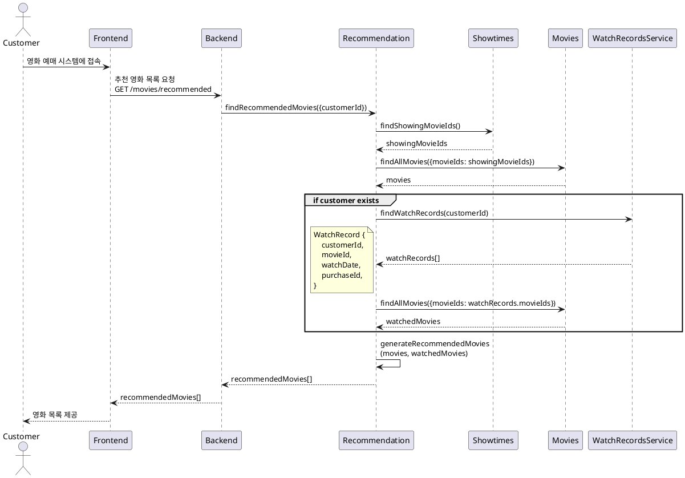
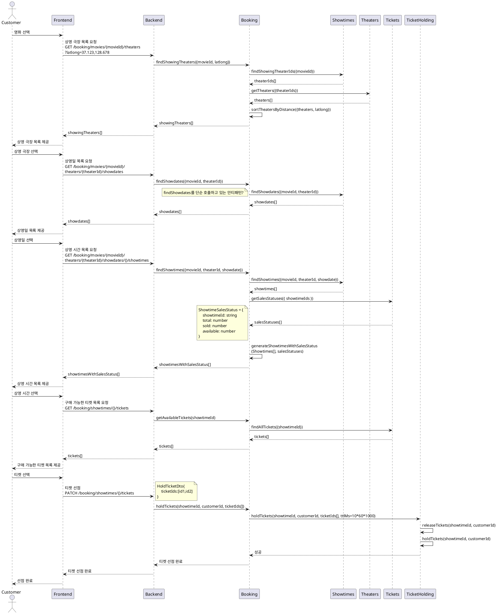
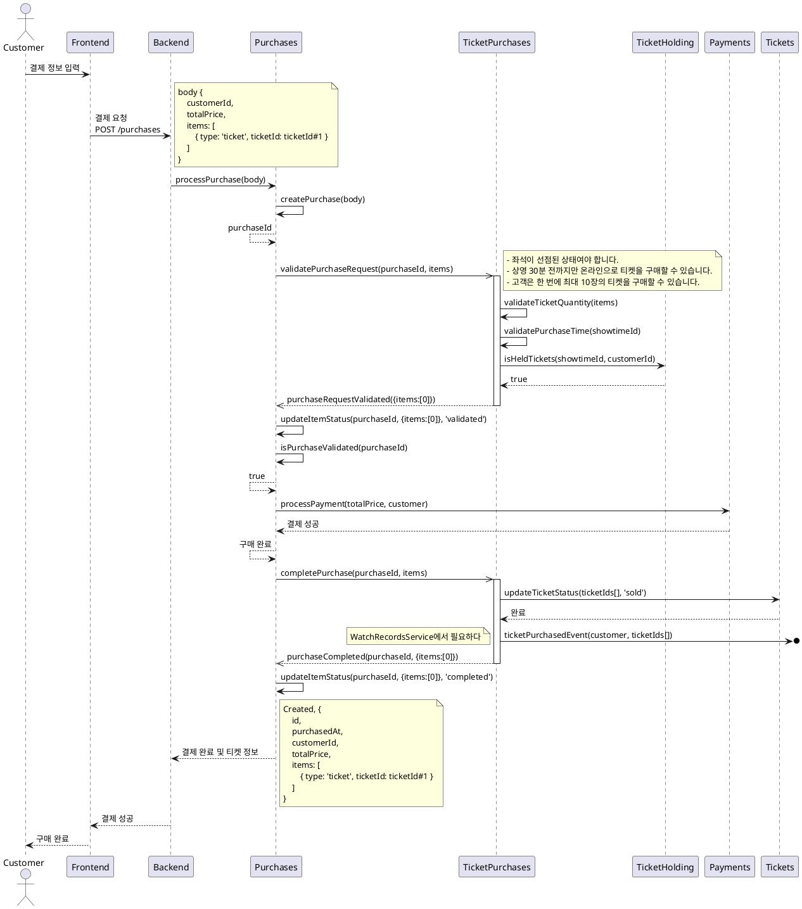
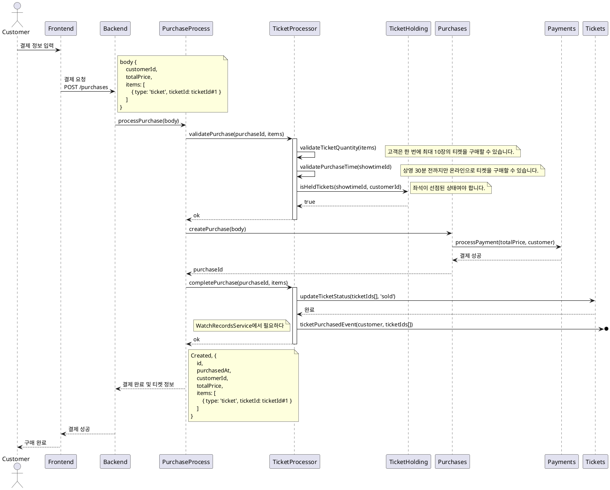

# Tickets Purchase

## 1. 티켓 구매 유스케이스 명세서

**선행 조건**:

- 고객이 시스템에 로그인되어 있어야 한다.
- 원하는 영화와 극장의 상영 시간 및 좌석이 사용 가능해야 한다.

**트리거**:

- 고객은 극장 예매 시스템에 접속한다.

**기본 흐름**:

1. 시스템은 추천 영화 목록을 제공한다.
1. 고객은 영화 목록에서 원하는 영화를 선택한다.
1. 시스템은 영화를 상영하는 극장 목록을 제공한다.
    - 사용자의 현재 위치를 기반으로 반경 5km의 가까운 극장을 추천
    - 특정 지역을 선택하여 해당 지역의 극장 목록을 제공
    - 없으면 가장 가까운 극장 5개
1. 고객은 상영하는 극장을 선택한다.
1. 시스템은 선택된 극장에서 영화 상영일 목록을 제공한다.
1. 고객은 원하는 상영일을 선택한다.
1. 시스템은 선택한 상영일의 상세 정보를 제공한다.
    - 상영 시간 별 남은 좌석수를 포함해야 한다.
1. 고객은 원하는 상영 시간을 선택한다.
1. 시스템은 해당 상영의 선택이 가능한 좌석을 보여준다.
    - 좌석은 층,블록,열,좌석번호로 지정된다.
1. 고객은 하나 이상의 좌석을 선택한다.
    - 선택한 좌석은 10분간 선점된다.
1. 시스템은 선택한 좌석과 총 가격을 요약하여 보여준다.
1. 고객은 결제 정보를 입력하고 구매를 확정한다.
1. 시스템은 결제를 처리하고, 티켓 구매 성공 메시지와 함께 전자 티켓을 제공한다.

**대안 흐름**:

- A1. 원하는 상영 시간이나 좌석이 사용 불가능한 경우:
    - 시스템은 사용 불가능한 메시지를 표시하고, 다른 상영 시간이나 좌석을 선택하도록 유도한다.
- A2. 결제가 실패한 경우:
    - 시스템은 결제 실패 메시지를 표시하고, 결제 정보를 재입력하거나 다른 결제 방법을 선택하도록 유도한다.

**후행 조건**:

- 고객은 구매한 티켓에 대한 전자 티켓을 이메일로 받는다.
- 시스템은 구매된 티켓의 좌석을 사용 불가능으로 업데이트한다.

**특별 요구 사항**:

- 시스템은 결제 처리를 위해 외부 결제 게이트웨이(PaymentGateway)와 통신해야 한다.
- 시스템은 고객이 선택한 좌석이 동시에 다른 고객에게 판매되지 않도록 동시성 관리를 해야 한다.

**비즈니스 규칙**:

- 고객은 한 번에 최대 10장의 티켓을 구매할 수 있다.
- 상영 30분 전까지만 온라인으로 티켓을 구매할 수 있다.

## 2. 티켓 구매 시퀀스 다이어그램



```
generateMovieRecommendations(movies, watchedMovies){
    아래 순서로 간단하게 구현한다.
    1. genre 일치
    2. 최신 개봉일

    showingMovies는 ShowingService에서 관리한다.
    ShowingMovie{
    ...
    theaterIds:[]
    }
}
```





현재 단계에서 Ticket 이외의 다른 품목을 고려한 Purchase 설계는 과도하다. 너무 일찍 일반화 함수를 정의하면 나중에 요구사항이 변경될 때 기존에 정의한 규칙이 제대로 대응하지 못하고 `createPurchase2`함수를 만들어야 하는 상황이 될 수 있다. 여기서는 설명을 위해 범용적인 설계를 한 것이다. 실제 프로젝트라면 테스트 케이스를 작성하고 바로 구현을 시작했을 것이다.

구현 순서는 어떻게 할까? 뿌리에 가까운 서비스부터 한다. 그럼 이것은 down-up이 아닌가? 레이어 아래부터 한다면 모를까 서비스를 코어부터 구현한다고 down-up으로 보긴 어렵다. 설계가 없다면 앱 서비스부터 구현했을 것이다. 그러나 설계가 있다면 코어부터 구현하는 것이 효율적이다.

커버리지는 100%여야 한다.

Payments와 StorageFile은 외부 인프라를 사용하기 위한 서비스다. 이것은 infra 서비스다
Purchase는 Core서비스다. 그런데 TicketPurchase서비스를 참조? 아니 이건 의존 역전으로 구현한다.

core,app,infra로 나누려는 이유. 이렇게 안 하면 단순 트리 구조로만 생각할 것 같아서. 단일 책임 원칙에 소홀할까봐



이전 설계는 구현이 복잡하기 때문에 위와 같이 단순화 한다.

PurchaseProcess를 제거하고 Purchases를 루트로 넣고 싶을 수 있다. 그렇게 되면 Purchases는 applications가 되고 다른 서비스가 참조할 수 없게 된다.
