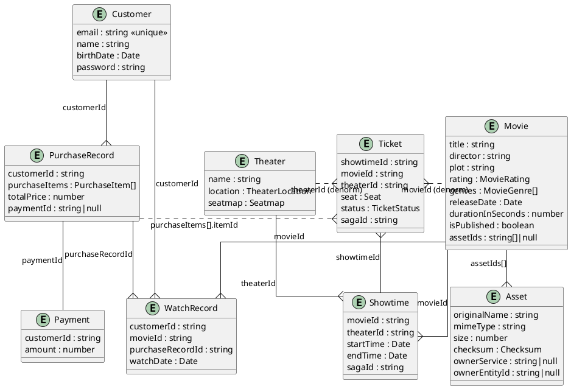

# Entity Design

모든 엔터티는 다음 필드를 공통으로 갖는다.

| Field       | Type   |
| ----------- | ------ |
| `id`        | string |
| `createdAt` | Date   |
| `updatedAt` | Date   |

`id`는 MongoDB의 `_id: ObjectId`를 Mongoose가 `string`으로 변환한 가상 필드이다. 다른 엔터티를 참조하는 ID 필드(`movieId`, `customerId` 등)도 모두 `string` 타입으로 저장한다. MSA에서 각 서비스는 독립적인 데이터 저장소를 가질 수 있으므로, 특정 DB의 ID 구현(MongoDB ObjectId, UUID, auto-increment 등)에 의존하지 않기 위해 서비스 간에는 문자열로 ID를 주고받는다.

## ER Diagram

## Notes

- Customer `password` — bcrypt 해시, 조회 시 기본 제외
- MovieRating — `G` `PG` `PG13` `R` `NC17` `Unrated`
- MovieGenre — `action` `comedy` `drama` `fantasy` `horror` `mystery` `romance` `thriller` `western`
- TicketStatus — `Available = 'available'` `Sold = 'sold'`
- PurchaseItemType — `tickets` `foods`
- TheaterLocation — `{ latitude, longitude }`
- Seatmap — `SeatBlock[] > SeatRow[]`, layout: `X` = 빈 공간, 나머지 = 좌석
- Seat — `{ block, row, seatNumber }`
- PurchaseItem — `{ itemId, type: PurchaseItemType }`
- Checksum — `{ algorithm, base64 }`, algorithm: `sha1` | `sha256`
- Asset lifecycle — presigned URL 발급 → 업로드 → finalize → 소유자 할당 (미완료 업로드는 10분 주기로 정리)
