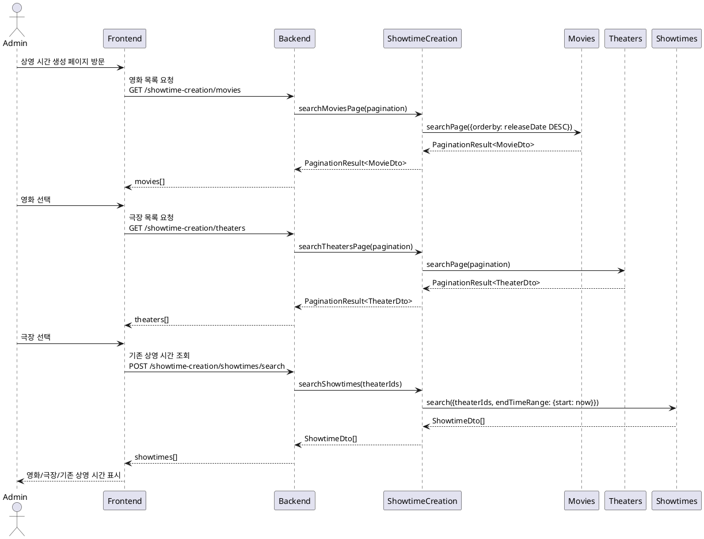
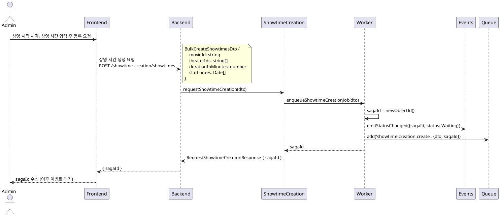
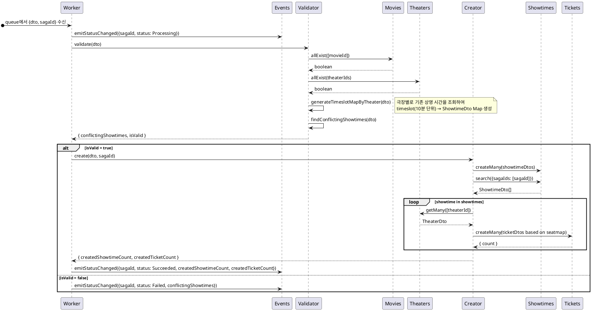

# Showtime Creation

## 1. 유스케이스 명세서

**목표**: 하나의 영화를 여러 극장에 상영 시간 일괄 등록하기

**액터**: 관리자

**선행 조건**:

- 관리자는 시스템에 로그인해야 한다.
- 영화와 극장은 시스템에 등록되어 있어야 한다.

**기본 흐름**:

1. 시스템은 현재 등록된 영화 목록을 제공한다.
1. 관리자는 상영 시간을 등록할 영화를 선택한다.
1. 시스템은 현재 등록된 극장 목록을 제공한다.
1. 관리자는 상영 시간을 등록할 극장들을 선택한다.
1. 관리자는 각 극장에 등록할 상영 시작 시각들과 상영 시간을 입력한다.
1. 관리자가 등록을 요청한다.
1. 시스템은 sagaId를 즉시 반환하고, 백그라운드에서 검증 및 생성을 진행한다.
1. 시스템은 기존 상영 시간과 충돌이 없으면 상영 시간과 티켓을 생성하고 완료 이벤트를 발행한다.

**대안 흐름**:

- 기존 상영 시간과 충돌이 발생하면, 시스템은 충돌 목록과 함께 실패 이벤트를 발행한다.

**후행 조건**:

- 선택한 극장 각각에 선택한 영화의 상영 시간이 생성된다.
- 생성된 상영 시간마다 해당 극장의 좌석 배치도(`seatmap`)를 기반으로 티켓이 생성된다.

---

## 2. 시퀀스 다이어그램

### 2.1. 화면 구성 단계

관리자가 상영 시간 생성 화면을 구성하는 단계이다.



### 2.2. 생성 요청 단계

관리자가 상영 시작 시각들과 상영 시간을 입력하고 등록을 요청하는 단계이다.



### 2.3. 백그라운드 처리 단계

BullMQ 워커가 큐에서 작업을 꺼내어 검증과 생성을 수행하는 단계이다.



---

## 3. 상영 시간 충돌 검증 알고리즘

### 원리

기존 상영 시간을 **10분 단위 timeslot**으로 펼쳐 `Map<timeslot, ShowtimeDto>`를 구성한다. 신규 상영 시간의 구간(`startTime` ~ `startTime + durationInMinutes`)을 같은 단위로 순회하여 Map에 존재하면 충돌로 판정한다.

### 타임슬롯 단위

`Rules.Showtime.timeslotInMinutes = 10` (분)

### 알고리즘

```
timeslotsByTheater = {}

for each theaterId:
    existingShowtimes = Showtimes.search({theaterIds: [theaterId], startTimeRange: {start, end}})

    timeslots = Map<number(ms), ShowtimeDto>
    for each showtime in existingShowtimes:
        for timeslot in [showtime.startTime .. showtime.endTime] step 10m:
            timeslots.set(timeslot, showtime)

    timeslotsByTheater[theaterId] = timeslots

conflictingShowtimes = []

for each theaterId:
    timeslots = timeslotsByTheater[theaterId]
    for each startTime in dto.startTimes:
        endTime = startTime + durationInMinutes
        for timeslot in [startTime .. endTime] step 10m:
            if timeslots.has(timeslot):
                conflictingShowtimes.push(timeslots.get(timeslot))
                break
```

### 시간 복잡도

```
M = 신규 상영 시간 수 (theaterIds × startTimes)
N = 기존 상영 시간 수 (극장당)
```

timeslot Map을 선(先)구성하면 충돌 탐색이 O(1) 조회가 되어 전체 복잡도는 **O(M + N)**이 된다.

단순 비교 방식(`startTime <= x <= endTime`)은 중첩 루프가 입력에 비례하여 **O(M × N)**이 되므로 채택하지 않았다. 이진 탐색을 응용하면 O(M + N)보다 상수 항을 줄일 수 있으나 구현 복잡도 대비 이점이 크지 않아 역시 채택하지 않았다.

### 상태 흐름

```
Waiting → Processing → Succeeded
                     ↘ Failed   (충돌 발생)
                     ↘ Error    (예외 발생)
```
