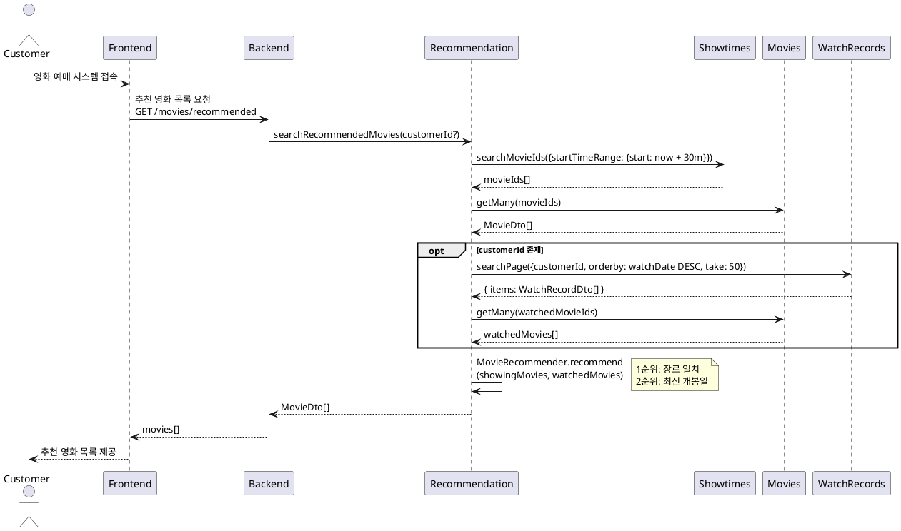
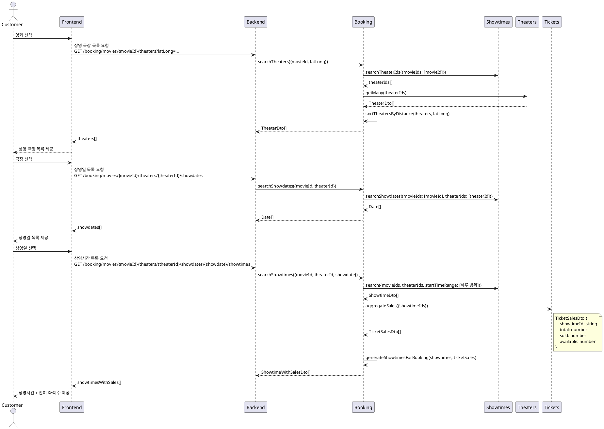
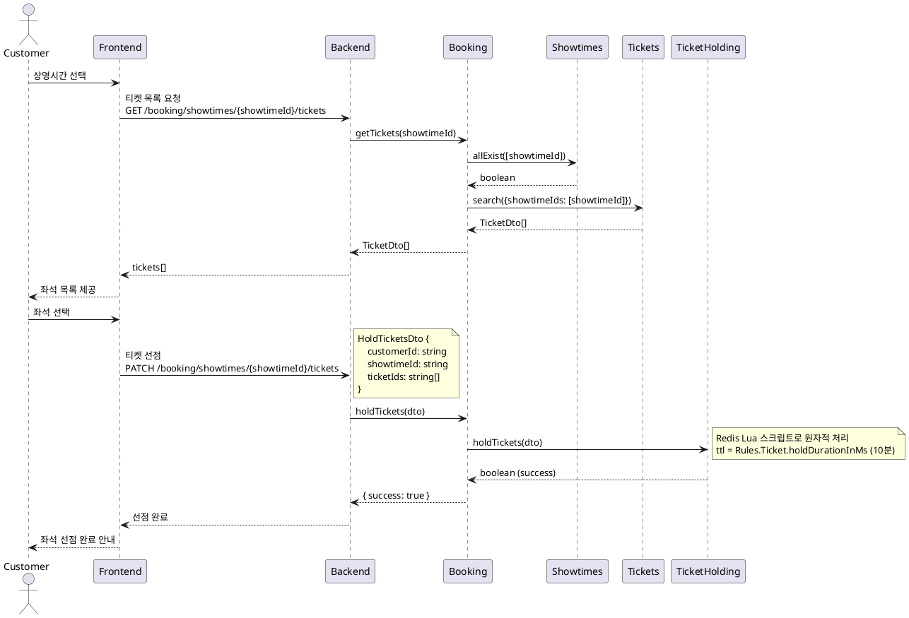
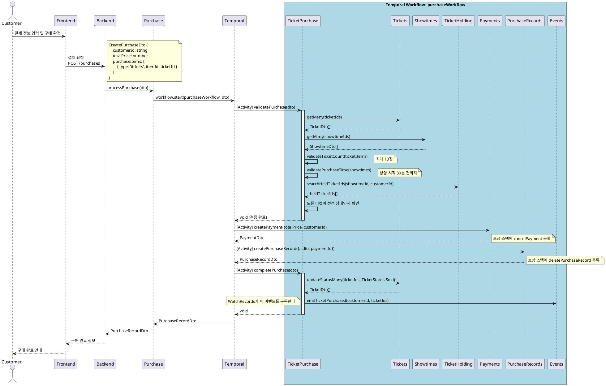
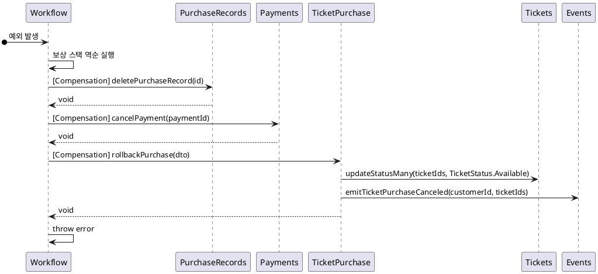

# Tickets Purchase

## 1. 유스케이스 명세서

**목표**: 고객이 원하는 영화의 좌석을 선택하고 티켓을 구매하기

**액터**: 고객

**선행 조건**:

- 고객은 시스템에 로그인되어 있어야 한다.
- 구매할 영화의 상영시간과 좌석이 사용 가능해야 한다.

**기본 흐름**:

1. 시스템은 현재 상영 중인 영화 목록을 추천순으로 제공한다.
1. 고객은 원하는 영화를 선택한다.
1. 시스템은 해당 영화를 상영 중인 극장 목록을 거리순으로 제공한다.
1. 고객은 극장을 선택한다.
1. 시스템은 선택한 극장의 상영일 목록을 제공한다.
1. 고객은 원하는 상영일을 선택한다.
1. 시스템은 해당 상영일의 상영시간 목록과 잔여 좌석 수를 제공한다.
1. 고객은 원하는 상영시간을 선택한다.
1. 시스템은 선택 가능한 좌석 목록을 제공한다.
1. 고객은 하나 이상의 좌석을 선택한다. 선택한 좌석은 10분간 선점된다.
1. 고객은 결제 정보를 입력하고 구매를 확정한다.
1. 시스템은 결제를 처리하고 구매 완료 정보를 반환한다.

**대안 흐름**:

- 티켓이 이미 선점된 경우: 시스템은 선점 실패를 반환한다.
- 결제 처리 후 티켓 상태 업데이트에 실패한 경우: 시스템은 티켓 상태를 롤백하고 예외를 던진다.

**비즈니스 규칙**:

- 고객은 한 번에 최대 10장의 티켓을 구매할 수 있다. (`Rules.Ticket.maxTicketsPerPurchase = 10`)
- 상영 시작 30분 전까지만 온라인으로 티켓을 구매할 수 있다. (`Rules.Ticket.purchaseCutoffMinutes = 30`)
- 티켓 선점 유효 시간은 10분이다. (`Rules.Ticket.holdDurationInMs = 10m`)
- 구매 시점에 티켓이 선점 상태여야 한다.

---

## 2. 시퀀스 다이어그램

### 2.1. 영화 추천

### 2.2. 극장 / 날짜 / 상영시간 선택

### 2.3. 좌석 선택 및 선점

### 2.4. 결제 및 구매 완료

Temporal 워크플로우(`purchaseWorkflow`)가 구매 흐름 전체를 오케스트레이션한다. 각 단계는 Temporal Activity로 실행되며, 실패 시 보상 스택을 역순으로 실행한다.

---

## 3. 롤백 처리 (Temporal 보상 스택)

워크플로우 실행 중 예외가 발생하면 보상 스택을 역순으로 실행한다.

> 보상 스택은 성공한 Activity만 역순으로 취소한다. 예를 들어 `createPayment`까지만 성공했다면 `cancelPayment`만 실행되고 `deletePurchaseRecord`는 실행되지 않는다.
