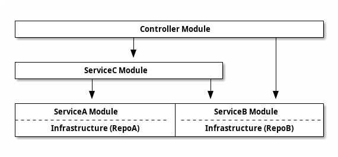

# Design Guide

이 프로젝트의 아키텍쳐는 일반적인 Nest 프로젝트와 다소 다른 부분이 있다.


## Controller의 분리

Nest에서는 일반적으로 Controller, Service, Repository가 같은 모듈에 위치하는 `Feature Module` 구조를 사용한다. 그러나 이 구조는 [순환 참조 문제](./problems-with-feature-modules.md)가 쉽게 발생할 수 있다. 따라서 이 문제를 해결하기 위해 Controller와 Service를 분리하는 구조를 선택했다.

Layered Architecture 관점에서도 Controller를 모듈에서 분리하는 것이 자연스럽다.
Controller와 Service는 Layered Architecture에서 서로 다른 계층에 속하며, Controller는 서비스 계층의 기능을 활용하기 위해 특별한 제약을 두지 않는다.

하나의 컨트롤러가 커진다면 여러 개의 컨트롤러 모듈로 분리할 수 있다.

## 상호 참조

모든 서비스는 단방향 의존 관계를 갖도록 설계해서 상호 참조 문제가 발생하지 않도록 한다.
상호참조가 필요한 경우 그 부분만 별도의 서비스로 만들거나 두 서비스를 하나로 합쳐야 한다.
이 규칙은 서비스, 모듈, 클래스 등 규모에 상관없이 동일하게 적용된다.

## REST API

### 1. Shallow Routing VS Nested Routing

REST API의 라우팅 디자인은 크게 `Shallow Routing`과 `Nested Routing`이 있다.

`Shallow Routing`은 각 리소스를 독립적으로 관리할 수 있으므로 확장성이 좋다. 그러나 리소스 간의 관계를 명확하게 표현하지 않기 때문에 복잡한 계층 구조의 데이터를 표현하는데 어려움이 있다.

`Nested Routing`은 리소스 간의 관계를 URL에서 명확하게 표현할 수 있으므로, 복잡한 리소스 구조를 표현하는데 적합하다. 그러나 중첩된 리소스 구조가 변경될 경우, URL도 함께 변경되어야 하므로 유연성이 제한된다.

```sh
# Shallow Routing
/screening?movieId={movieId}&theaterId={theaterId}

# Nested Routing
/screening/movies/{movieId}/theaters/{theaterId}
```

두 방식 중에서 무엇을 선택할 것인지는 개념적인 관점에서 리소스의 구조가 중첩되는 것인지를 우선해서 판단해야 한다. 판단하기 어렵다면 `Shallow Routing`을 사용한다.

만약, 경로가 `/screening/movies`가 아니라 `/screening/theaters`로 시작한다면 어떤 의미일까?

```sh
/screening/theaters/{theaterId}/movies/{movieId}
```

이것은 사용자 시나리오에서 극장을 먼저 선택하고 그 극장에서 상영 중인 영화를 선택한다는 뜻이다. 이렇게 `Nested Routing`는 사용자에게 구조적인 힌트를 제공한다.
만약 이 예매 프로세스를 REST API로 표현하지 않고 `BookingProcess.ts`와 같은 코드로 표현하려고 하면 상태를 가지지 않는 HTTP의 특성 상 많은 어려움이 따를 것이다.

거듭 얘기하지만 `Shallow Routing`이나 `Nested Routing`이 중요한 것이 아니다.
분석과 구현의 개념이 일치되도록 하는 것이 중요하다. `Nested Routing`를 선택한다는 것은 분석 단계에서 예매 프로세스가 그렇게 정의된 것을 반영하는 것 뿐이다.
기술적 우월성 보다 분석을 정확히 반영하는 것이 우선이다.

### 2. GET과 POST 선택

10,000명의 user정보 조회 요청은 너무 길어서 GET 메소드로 전달할 수 없다.

```sh
GET /users?user-id=userid1, userid2, userid3 ...
```

이렇게 `GET`이나 `DELETE` 메소드인데 쿼리가 너무 길다면 아래처럼 POST로 요청한다.

```sh
# 찾는다
GET /movies?...
# 찾기를 실행한다
POST /movies/find

# 삭제를 한다
DELETE /movies?...
# 삭제를 실행한다
POST /movies/delete
```

POST 메소드는 일반적으로 `Create`를 의미하지만 `함수를 실행한다`는 의미로도 사용한다.

GET과 POST를 선택할 때는 다음의 사항을 고려해야 한다.

-   GET이 적합한 경우
    -   전달할 데이터가 매우 적고 간단한 경우
    -   캐싱이 필요한 경우
    -   북마크 가능성이나 주소창을 통한 URL 공유가 필요한 경우
-   POST가 적합한 경우
    -   전달할 데이터가 많거나 복잡한 경우 (예: 파일, 긴 텍스트 등)
    -   데이터가 민감한 경우 (예: 패스워드, 개인 정보 등)
    -   서버의 상태를 변경하는 동작을 수행하는 경우 (예: 리소스 생성, 수정)

### 3. Self Descriptive API 제한

HATEOAS(Hypermedia as the engine of application state)의 완전한 자체 설명을 구현하는 것은 어렵고 복잡하다.
단순 link 정도의 수준으로 제공해야 하며 복잡한 API는 문서로 설명해야 한다.

문서를 완전히 대체하려는 노력보다는 오류 정보를 더 자세히 출력하는 코드를 작성하는 것이 효율적이다.

```json
// 일반적인 HATEOAS의 예
{
    "results": [
        {
            "_expandable": {
                "children": "/rest/api/content/98308/child",
                "history": "/rest/api/content/98308/history"
            },
            "_links": {
                "self": "http://localhost:8080/confluence/rest/api/content/98308",
                "webui": "/pages/viewpage.action?pageId=98308"
            }
        }
    ]
}
```
