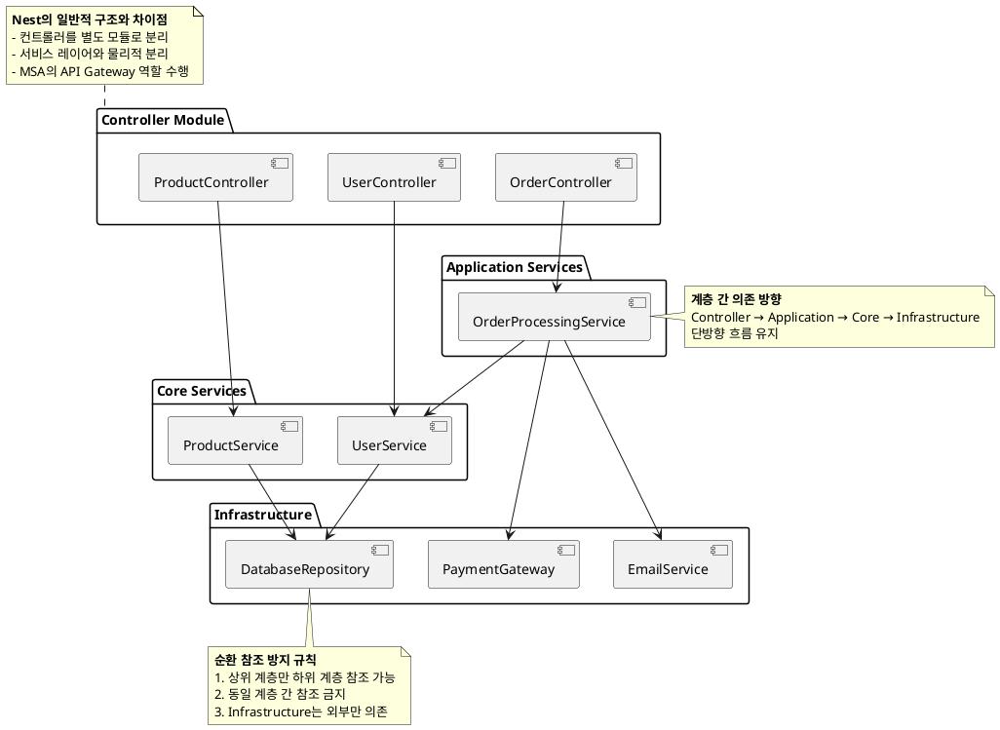

# Design Guide

설계 단계의 규칙을 설명한다.

## 1. 상호 참조

모든 서비스는 단방향 의존 관계를 갖도록 설계해서 상호 참조 문제가 발생하지 않도록 한다.
상호참조가 필요한 경우 그 부분만 별도의 서비스로 만들거나 두 서비스를 하나로 합쳐야 한다.
이 규칙은 서비스, 모듈, 클래스 등 규모에 상관없이 동일하게 적용된다.

마찬가지로, 같은 레이어의 서비스는 참조하지 않는다. 이것은 상호 참조가 가능해지는 것이다.



### 1.1. Controller의 분리

이 프로젝트의 아키텍쳐는 상호 참조 문제를 피하기 위해서 일반적인 Nest 프로젝트와 다소 다른 부분이 있다.

Nest에서는 일반적으로 Controller, Service, Repository가 같은 모듈에 위치하는 `Feature Module` 구조를 사용한다. 그러나 이 구조는 [순환 참조 문제](./problems-with-feature-modules.md)가 쉽게 발생할 수 있다. 따라서 이 문제를 해결하기 위해 Controller와 Service를 분리하는 구조를 선택했다.

여기서 Controller는 Monolithic에서 MSA의 gateway에 해당하는 기능을 한다.
만약 프로젝트가 MSA라면 Controller는 각 `Feature Module`에 속하는 것이 옳다.

### 1.2. 서비스의 분리

이 프로젝트의 서비스는 크게 Application, Core, Infrastructure로 나눈다

- **Infrastructure Service**:

    - 외부 시스템 연동 (DB, 결제, 스토리지).

- **Core Service**:

    - 도메인 핵심 로직 (예: 주문 유효성 검사).
    - Infra 서비스 호출만 허용.

- **Application Service**:
    - 사용자 시나리오 조립 (예: 주문 → 결제 → 알림).
    - Core/Infra 서비스 호출만 허용.
    - 트랜잭션 관리 주체.

### 1.3. 서비스의 이름

프로세스 중심 서비스는 단수형으로 명명하는 것이 일반적입니다.

1. AuthenticationService: 사용자 인증 프로세스를 처리합니다.
1. AuthorizationService: 권한 부여 프로세스를 처리합니다.
1. RecommendationService: 컨텐츠를 추천합니다.

엔티티 관리 서비스는 복수형으로 명명하는 것이 일반적입니다.

1. UsersService: 사용자 엔티티를 관리합니다.
1. OrdersService: 주문 엔티티를 관리합니다.
1. ProductsService: 제품 엔티티를 관리합니다.

## 2. REST API

### 2.1. GET과 POST 선택

10,000명의 user정보 조회 요청은 너무 길어서 GET 메서드로 전달할 수 없다.

```sh
GET /users?user-id=userid1, userid2, userid3 ...
```

이렇게 `GET`이나 `DELETE` 메서드인데 쿼리가 너무 길다면 아래처럼 POST로 요청한다.

```sh
# 찾는다
GET /movies?...
# 찾기를 실행한다
POST /movies/find

# 삭제를 한다
DELETE /movies?...
# 삭제를 실행한다
POST /movies/delete
```

POST 메서드는 일반적으로 `Create`를 의미하지만 `함수를 실행한다`는 의미로도 사용한다.

GET과 POST를 선택할 때는 다음의 사항을 고려해야 한다.

- GET이 적합한 경우
    - 전달할 데이터가 매우 적고 간단한 경우
    - 캐싱이 필요한 경우
    - 북마크 가능성이나 주소창을 통한 URL 공유가 필요한 경우
- POST가 적합한 경우
    - 전달할 데이터가 많거나 복잡한 경우 (예: 파일, 긴 텍스트 등)
    - 데이터가 민감한 경우 (예: 패스워드, 개인 정보 등)
    - 서버의 상태를 변경하는 동작을 수행하는 경우 (예: 리소스 생성, 수정)

### 2.2. Self Descriptive API 제한

HATEOAS(Hypermedia as the engine of application state)의 완전한 자체 설명을 구현하는 것은 어렵고 복잡하다.
단순 link 정도의 수준으로 제공해야 하며 복잡한 API는 문서로 설명해야 한다.

문서를 완전히 대체하려는 노력보다는 오류 정보를 더 자세히 출력하는 코드를 작성하는 것이 효율적이다.

```json
// 일반적인 HATEOAS의 예
{
    "results": [
        {
            "_expandable": {
                "children": "/rest/api/content/98308/child",
                "history": "/rest/api/content/98308/history"
            },
            "_links": {
                "self": "http://localhost:8080/confluence/rest/api/content/98308",
                "webui": "/pages/viewpage.action?pageId=98308"
            }
        }
    ]
}
```

## 3. Microservice

마이크로서비스는 아래 원칙을 기반으로 설계했다.

1. 메시지 브로커는 전달을 보장하지 않는다. 요청/응답 패턴에서 응답이 없는 경우를 대비해야 한다. 이벤트도 모든 인스턴스에 전달된다고 보장되지 않는다. 이벤트는 단순 알림으로 취급하고 반드시 전달이 성공해야 한다면 요청/응답 패턴을 사용해야 한다.

메시지 유실 시 처리 방안은 다음과 같은 것이 있다.

1. Idempotent Consumer: 중복 요청 방지를 위한 고유 ID 사용.
1. Dead Letter Queue (DLQ): 실패 메시지 재처리 시스템.
1. Saga 패턴: 분산 트랜잭션 관리 (Compensating Transaction 예시 추가).
