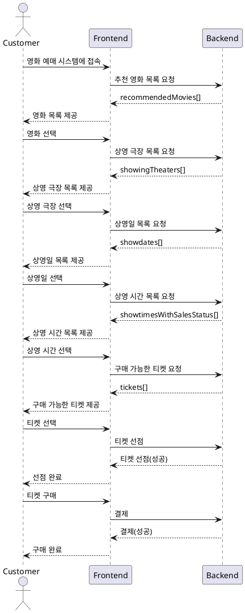

## REST API Guide



왜 자원 중심으로 설계해야 하나요?

RESTful API의 핵심은 **자원(Resource)**을 중심으로 하고, 그 자원에 대한 행위는 **HTTP 메서드(GET, POST, PUT, DELETE 등)**를 통해 표현하는 것입니다. 이렇게 하면 다음과 같은 장점이 있습니다:

-   일관성 및 예측 가능성: 자원 중심의 경로 설계는 API의 일관성을 높여주며, 클라이언트가 API의 동작을 예측하기 쉽게 만듭니다.
-   유지보수성 향상: 자원 중심 설계는 서버의 내부 구현과 관계없이 경로를 유지할 수 있어, 내부 구조 변경 시 클라이언트에 미치는 영향을 최소화합니다.

```
추천영화목록요청  GET /movies?filter=recommended&customerId={}
상영극장목록요청  GET /theaters?movieId={}&latlong=37.123,128.678
상영일목록요청   GET /showtimes?movieId={}&theaterId={}&group=date
                 /showdates?movieId={}&theaterId={}
상영시간목록요청  GET /showtimes?movieId={}&theaterId={}&showdate={}
예매정보요청     GET /tickets?showtimeId={}
티켓선점      PATCH /tickets
티켓구매        POST /purchases

-  group=date 어색하다. showdate가 리턴된다고 알 수 있나?
-  특정한 기능을 위한 작은 옵션들까지 모두 넣으면 유지보수가 어려워 진다
-  기존 옵션 설정과 충돌할 수 있다. 기존에 type=abcd 이렇게 했는데 이것과는 다른 type을 정의해야 할지도 모른다.
-  기능이 커지면 그만큼 변경은 어려워진다. filter=recommended 라고 정의했는데 나중에 추천이 세분화되어야 할지도 모른다.
    recommendation=genre,recommendation=top-rated 이렇게 해야 한다면?
    그럼 기존 옵션인 recommended는 삭제할 수 있을까? 어디서 누가 사용하고 있을지 장담 못한다. 이런 식으로 레거시가 쌓여가기 쉽다
-  옵션이 많으면 기능 하나를 위해서 검토해야 하는 정보가 많아진다. 그러니까 바닷가에서 점점 작은 바늘을 찾아야 한다.
-  옵션이 많으면 동작을 직관적으로 이해하기 어렵다. /movies?filter=recommended&popular=week 이러면 어떻게 처리하지? 에러인가? recommended만 처리하나?
-  앞뒤 맥락 파악이 안 되니까 옵션을 이해하기도 어렵다. 그래서 옵션명을 길게 하거나 옵션에 대한 설명을 봐야 한다.
-  뭉치면 살고 흩어지면 죽는다. 틀린말이다. 끼리끼리 뭉쳐야 산다. 유유상종. 끼리끼리 놀아야 한다.

```

```
추천영화목록요청  GET /movies/recommendations?customerId={}
상영극장목록요청  GET /movies/{movieId}/theaters?latlong=37.123,128.678
상영일목록요청   GET /movies/{movieId}/theaters/{theaterId}/showdates
상영시간목록요청  GET /movies/{movieId}/theaters/{theaterId}/showdates/{}/showtimes
예매정보요청     GET /showtimes/{}/tickets
티켓선점      PATCH /showtimes/{}/tickets
티켓구매        POST /purchases

일관성 및 예측 가능성이 떨어진다. 이건 영화 예매 시스템이라서 /대다수가 movies로 시작한다.
상영극장목록요청인데 /movies로 시작한다.
그렇다고 /theaters/movies/{movieId} 이렇게 바꾸면?
영화 하나를 GET 하는 것 아닌가?
```

```
추천영화목록요청 GET /movies/recommendations?customerId={}
상영극장목록요청 GET /booking/movies/{movieId}/theaters?latlong=37.123,128.678
상영일목록요청 GET /booking/movies/{movieId}/theaters/{theaterId}/showdates
상영시간목록요청 GET /booking/movies/{movieId}/theaters/{theaterId}/showdates/{}/showtimes
예매정보요청 GET /booking/showtimes/{}/tickets
티켓선점 PATCH /booking/showtimes/{}/tickets
티켓구매 POST /purchases

booking이라는 하나의 행위 집합
단수 명사로 시작하면 리소스 그룹,복수 명사로 시작하면 리소스

/movies/recommendations에서 recommendations는 왜 옵션으로 하지 않는가?
이건 모든 영화들에 대한 하위 카테코리로 해석했다.
영화를 customer에 따라 분류하지는 않을 것이다.
그러나 이번 주/이번 달 인기 영화처럼 통계에 의한 분류를 한다.
이런 것은 하위 경로로 해석한다.

프론트 화면에 맞춰서 api를 설계했더니 /showdates도 자연스럽다.
처음 /showdates는 컬렉션도 아닌데 컬렉션처럼 취급해야 했다.
```
