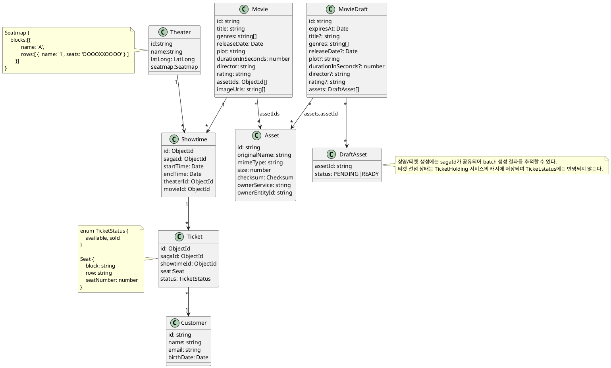

# Entities

```plantuml
@startuml
class Customer {
    id: string
    name: string
    email: string
    birthDate: Date
}

class Asset {
    id: string
    originalName: string
    mimeType: string
    size: number
    checksum: Checksum
    ownerService: string
    ownerEntityId: string
}

class Movie {
    id: string
    title: string
    genres: string[]
    releaseDate: Date
    plot: string
    durationInSeconds: number
    director: string
    rating: string
    assetIds: ObjectId[]
    imageUrls: string[]
}

class Theater{
    id:string
    name:string
    latLong: LatLong
    seatmap:Seatmap
}
note left
Seatmap {
    blocks:[{
            name: 'A',
            rows:[ {  name: '1', seats: 'OOOOXXOOOO' } ]
        }]
}
end note

class Showtime {
    id: ObjectId
    sagaId: ObjectId
    startTime: Date
    endTime: Date
    theaterId: ObjectId
    movieId: ObjectId
}

class Ticket {
    id: ObjectId
    sagaId: ObjectId
    showtimeId: ObjectId
    seat:Seat
    status: TicketStatus
}

note left
enum TicketStatus {
    available, sold
}

Seat {
    block: string
    row: string
    seatNumber: number
}
end note

class MovieDraft {
    id: string
    expiresAt: Date
    title?: string
    genres: string[]
    releaseDate?: Date
    plot?: string
    durationInSeconds?: number
    director?: string
    rating?: string
    assets: DraftAsset[]
}

class DraftAsset {
    assetId: string
    status: PENDING|READY
}

Showtime "1" --> "*" Ticket
Movie "1" --> "*" Showtime
Theater "1" --> "*" Showtime
Ticket "*" --> "1" Customer
Movie "*" --> "*" Asset : assetIds
MovieDraft "*" --> "*" Asset : assets.assetId
MovieDraft "*" --> "*" DraftAsset
note right
상영/티켓 생성에는 sagaId가 공유되어 batch 생성 결과를 추적할 수 있다.
티켓 선점 상태는 TicketHolding 서비스의 캐시에 저장되며 Ticket.status에는 반영되지 않는다.
end note
@enduml
```
