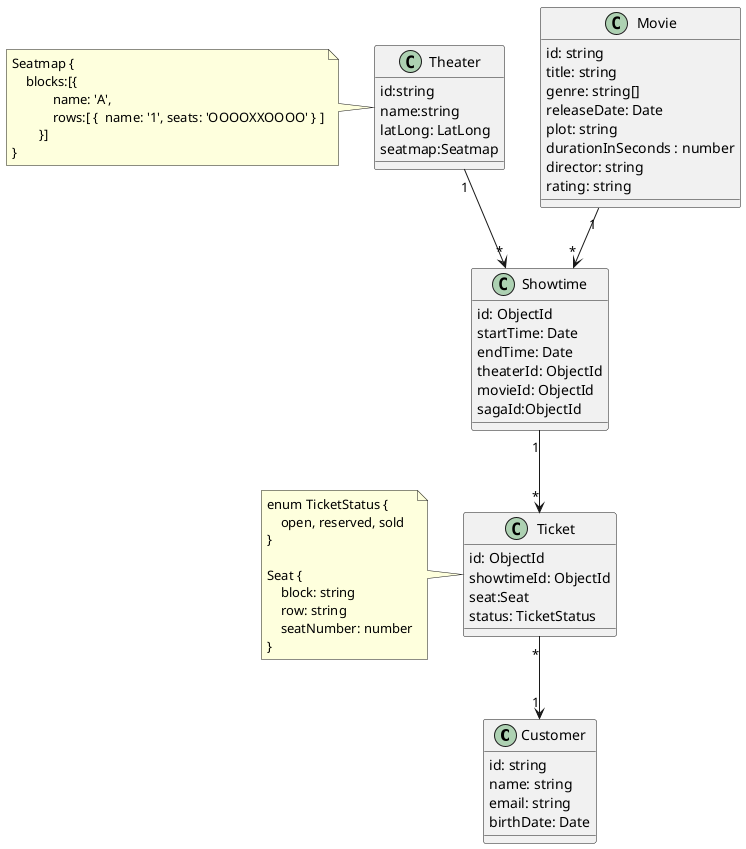

# Entities

```plantuml
@startuml
class Customer {
    id: string
    name: string
    email: string
    birthDate: Date
}

class Movie {
    id: string
    title: string
    genre: string[]
    releaseDate: Date
    plot: string
    durationInSeconds : number
    director: string
    rating: string
}

class Theater{
    id:string
    name:string
    latLong: LatLong
    seatmap:Seatmap
}
note left
Seatmap {
    blocks:[{
            name: 'A',
            rows:[ {  name: '1', seats: 'OOOOXXOOOO' } ]
        }]
}
end note

class Showtime {
    id: ObjectId
    startTime: Date
    endTime: Date
    theaterId: ObjectId
    movieId: ObjectId
    sagaId:ObjectId
}

class Ticket {
    id: ObjectId
    showtimeId: ObjectId
    seat:Seat
    status: TicketStatus
}

note left
enum TicketStatus {
    open, reserved, sold
}

Seat {
    block: string
    row: string
    seatNumber: number
}
end note

Showtime "1" --> "*" Ticket
Movie "1" --> "*" Showtime
Theater "1" --> "*" Showtime
Ticket "*" --> "1" Customer
@enduml
```
