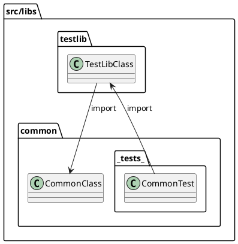

# Implementation Guide

구현 과정에서 적용한 규칙을 정리했습니다.

## 1. Jest 테스트 명명 가이드

<!-- // TODO  정리 필요-->

1. 기본 구조는 when/action: 조건/맥락은 describe('when ...'), 행위/결과는 it('...')로 분리
2. it 제목에 조건을 섞지 않음(예: ... when ..., ... for ..., ... if ...) → 조건 문구는 모두 상위 describe('when ...')로 이동
3. 조건(쿼리/옵션/값) 생략은 not provided로 표기(예: when the pagination query is not provided)
4. it는 동사로 시작하는 “행위/결과” 문장으로 작성(의미 없는 it('info'), it('general') 같은 제목은 구체적으로 변경)
5. 성공 케이스는 상태코드 없이 결과로 서술(returns the created ..., creates ..., logs ... 등)
6. 실패 케이스는 it에 상태코드/예외만 남김(returns 400 Bad Request, throws 404 Not Found), 실패 사유는 when ...로 올림
7. 서비스 메서드에서 예외를 기대하는 테스트는 returns 대신 throws 사용
8. PATCH/DELETE류는 “응답 검증”과 “영속성 검증”을 서로 다른 it로 분리
9. 최상위 단독 it는 의미 있는 describe 트리 아래로 넣어 테스트 스코프/대상을 명확히 함

10. `when ...`은 맥락(조건), `it(...)`는 행위/결과(action)
    - `describe('when ...')`: **조건/맥락**
    - `it('...')`: **행위/결과**를 **동사로 시작**해 작성

11. `when/action` 구조가 기본이지만 예외적으로 다양한 검증을 하나의 테스트 케이스에서 수행하는 경우에는 `when`을 생략할 수 있다.

    ```ts
    it('converts lowercase units to bytes', () => {
        expect(Byte.fromString('1024b')).toEqual(1024)
        expect(Byte.fromString('1kb')).toEqual(1024)
        expect(Byte.fromString('1mb')).toEqual(1024 * 1024)
        expect(Byte.fromString('1gb')).toEqual(1024 * 1024 * 1024)
        expect(Byte.fromString('1tb')).toEqual(1024 * 1024 * 1024 * 1024)
    })
    ```

12. 성공 케이스(200/201)는 상태코드를 제목에 쓰지 않는다
    - 상태코드 대신 결과를 서술
        - 예: `returns the created ...`, `returns the updated ...`, `returns the default page ...`

13. 실패 케이스는 “상태코드”만 명시
    - 예:
        - `returns 404 Not Found`
        - `returns 401 Unauthorized`
        - `returns 400 Bad Request`

14. PATCH/DELETE는 “응답 검증”과 “영속성 검증”을 분리
    - 응답 검증: `returns the updated/deleted ...`
    - 영속성 검증: `persists the update/deletion`
        - PATCH: 후속 GET으로 값이 유지됨을 확인
        - DELETE: 후속 GET에서 NotFound(또는 조회 실패)로 삭제됨을 확인

15. 예외를 기대하는 서비스 메서드 테스트는 `returns` 대신 `throws` 사용
    - 예: `throws 400 ...`, `throws 404 ...`

16. 조건을 생략하는 테스트는 `not provided`라고 표현
    - 예: `when the pagination query is not provided`

> Jest는 `context`를 지원하지 않는다. 그렇다고 해서 `describe`를 `context`의 alias로 사용하면 안 된다.
>
> `Jest Runner` 같은 Jest 도구에서 `context`를 인식하지 못한다.

```ts
describe('', () => {
    // TODO 예시 작성
})
```

## 2. TypeORM과 도메인의 Entity 관계

다음은 일반적인 엔티티를 구현한 예시 코드입니다.

```ts
@Entity()
export class Seed extends TypeormEntity {
    @Column()
    name: string

    @Column({ type: 'text' })
    desc: string

    @Column({ type: 'integer' })
    integer: number

    @Column('varchar', { array: true })
    enums: SeedEnum[]

    @Column({ type: 'timestamptz' })
    date: Date
}
```

`Entity` 코드와 `Infrastructure` 레이어에 위치하는 `TypeORM` 코드가 섞여 있지만, 엔티티 자체는 `Infrastructure` 코드를 직접 참조하지 않습니다.
또한, `TypeORM`의 `@Column` 데코레이터는 데이터 매핑을 위한 코드이며, 도메인 로직에 직접적인 영향을 주지 않습니다.

결과적으로, 도메인 객체에 `TypeORM` 코드가 일부 추가된 것은 양쪽을 편리하게 연결하기 위한 방식입니다. `TypeORM`은 엔티티에 의존하지만, 엔티티가 `TypeORM`에 의존하지 않도록 하여, `DDD` 관점에서도 크게 문제되지 않는 구조를 유지합니다.

## 3. import

아래와 같은 폴더/파일 구조를 가정합니다.

```
src
├── controllers
│   ├── index.ts
│   ├── auth.controller.ts
│   └── users.controller.ts
└── services
    ├── auth
    │   ├── index.ts
    │   ├── auth.service.ts
    │   └── strategies
    └── users
        ├── index.ts
        ├── users.repository.ts
        └── users.service.ts

```

이때 순환 참조를 피하기 위해 다음 규칙을 지킵니다.

- 직계 조상 폴더는 절대 경로로 import하지 않습니다.

    ```ts
    /* users.service.ts */

    // (X) 순환 참조 발생 가능
    import { AuthService } from 'src/services'

    // (O) 상대 경로로 참조
    import { AuthService } from '../auth'
    ```

- 직계 조상이 아닌 폴더는 절대 경로를 사용합니다.

    ```ts
    /* users.controller.ts */

    // (O) 절대 경로 사용
    import { AuthService } from 'src/services'

    // (X) 상대 경로로는 권장하지 않음
    import { AuthService } from '../services'
    ```

> index.ts에서 여러 모듈을 하나로 묶어서 export해주는 방식을 Barrel import라고 합니다.\
> 이 프로젝트는 index.ts를 폴더 마다 두고 있는데, 이렇게 하면 순환 참조를 더 빨리 발견할 수 있습니다.

## 4. testlib와 common의 순환 참조

`src/libs` 폴더에는 `testlib`와 `common`이 있습니다. 언뜻 보면 서로를 참조하는 순환 구조처럼 보일 수 있습니다.

- 기본적으로 `testlib`는 `common`을 `import`합니다.
- `common`에도 **tests** 폴더가 있는데, 여기서 `testlib`를 `import`하는 코드가 들어 있을 수 있습니다.

그러나 **tests** 폴더는 해당 모듈 내부 테스트를 위한 것이며, 실제 애플리케이션 로직에서는 참조되지 않습니다. 따라서 상호 의존성이 실행 시점에 충돌을 일으키지 않으므로 실제 순환 참조 문제가 발생하지 않습니다.



## 5. 테스트에서 dynamic import

여러 테스트에서 같은 NATS 서버를 공유하기 때문에, 각 테스트마다 고유한 subject를 생성하기 위해 process.env.TESTLIB_ID를 사용합니다.

문제는 Jest의 모듈 캐시 때문에 @MessagePattern 데코레이터가 모듈 로딩 시점에 한 번만 평가됩니다. 따라서 최상위에서 이미 import된 모듈은 새로운 process.env.TESTLIB_ID 값을 인식하지 못합니다.

이 문제를 해결하기 위해서, Jest 설정에서 resetModules: true를 적용하여 각 테스트마다 모듈 캐시를 초기화합니다.

```ts
// 타입 전용 import를 활용하면 런타임에 영향을 주지 않고 타입만 가져올 수 있습니다.
import type { Fixture } from './customers.fixture'

describe('Customers', () => {
    let fix: Fixture

    beforeEach(async () => {
        const { createFixture } = await import('./customers.fixture')
        fix = await createFixture()
    })
})
```

## 6. entry file

각 프로젝트의 루트에는 다음 파일들이 존재합니다.

- development.ts
- main.ts
- production.ts

일반적으로는 `main.ts`가 엔트리 파일이 되지만, 이 프로젝트에서는 `development.ts`나 `production.ts`가 실제 엔트리 파일로 사용됩니다.
이는 `main.ts` 내부에서 `process.env.NODE_ENV`에 따라 여러 `조건문(if)`을 사용하는 복잡성을 피하기 위함입니다.

아래는 관련 예시 설정입니다.

```json
// package.json
"scripts": {
    "build": "nest build ${TARGET_APP} -b webpack",
    "debug": "nest start ${TARGET_APP} --watch",
}
```

```json
// nest-cli.json
"projects": {
    "gateway": {
        "type": "application",
        "entryFile": "apps/gateway/development",
        "sourceRoot": "src"
    }
}
```

```json
// webpack.config.js
    const output = {
        ...options,
        entry: path.resolve(dirname, 'production.ts'),
    }
```

## 7. 테스트 코드를 .spec.ts와 .fix.ts로 분리

### 7.1 예전 방식

.spec.ts에 Fixture 설정 코드를 모두 넣으면, 실제 테스트 로직이 무엇을 검증하는지 파악하기가 어렵습니다. 따라서 테스트 로직은 .spec.ts에 집중하고, 테스트에 필요한 리소스나 설정은 .fix.ts에 둡니다.

예: `src/apps/__tests__/utils` 폴더에 공통 코드가 모여 있고, 그중 `clients.ts`에서 `module.get()`으로 필요한 `Service 인스턴스`를 미리 가져옵니다. 이렇게 하면 테스트가 간결해지며, 중복 코드를 줄일 수 있습니다.

만약 새로운 서비스를 추가하고 테스트를 작성한다면, `clients.ts`와 `create-all-test-contexts.ts` 등을 변경해야 합니다.

```ts
import { CustomersClient, MoviesClient } from 'apps/cores'
import { HttpTestContext, TestContext } from 'testlib'

export class AllProviders {
    customersClient: CustomersClient
    moviesClient: MoviesClient
}

export async function getProviders(coresContext: TestContext) {
    const { module: coresModule } = coresContext
    const customersClient = coresModule.get(CustomersClient)
    const moviesClient = coresModule.get(MoviesClient)

    return { customersClient, moviesClient }
}
```

### 7.2 현재 방식

<!-- TODO 7. 항목은 정리 다시 -->

각 모듈에서 필요한 모듈만 생성해서 테스트 한다.

전체 모듈을 생성하는 예전 방식은 테스트 완료에 89s가 걸렸다. 현재 방식은 83s가 걸렸다. 실제 프로젝트에서는 훨씬 큰 차이가 발생할 것이다.

## 8. 주석

```ts
// 한 줄은 이렇게 한다.

/**
 * 두 줄 이상은 이렇게 한다.
 */

/*
이런 형태는 사용하지 않는다. 편집기에서 자동 정렬이 안 된다.
*/
```

## 9. ESM modules

NestJS는 CommonJS 모듈 시스템을 사용하지만, Node.js >= 22에서는 CommonJS와 ESM을 동시에 지원하므로 호환성 문제가 발생하지 않습니다.

그러나 Jest는 아직 ESM 모듈을 완전히 지원하지 않기 때문에, ESM 전용 모듈을 사용할 때 문제가 발생할 수 있습니다. 예를 들어, chalk와 같은 ESM 전용 모듈을 사용할 경우 jest.config.ts에서 해당 모듈을 등록해야 합니다.

```ts
{
    // ECMAScript modules
    transformIgnorePatterns: ['!node_modules/(?!chalk)']
}
```

이와 관련된 설정은 [ts-jest 예제](https://github.com/kulshekhar/ts-jest/tree/main/examples/js-with-ts)를 참고하세요.
