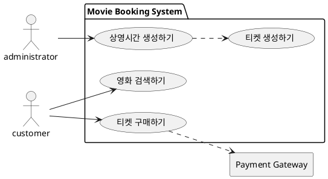
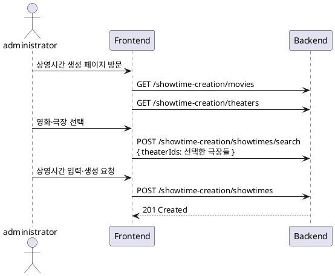
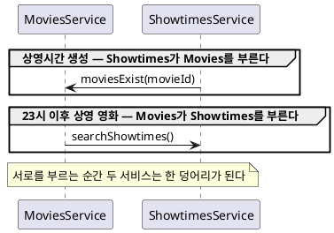
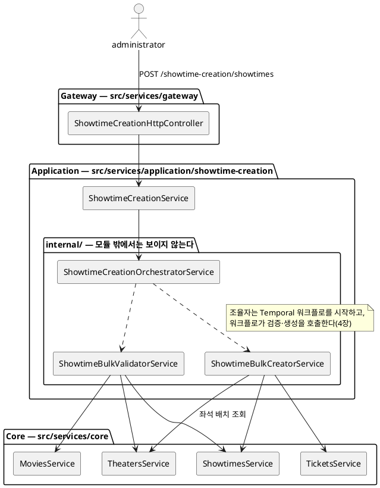
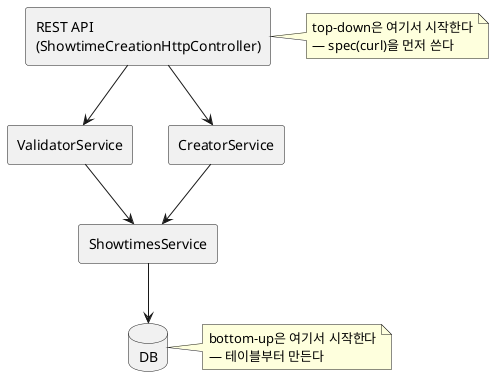
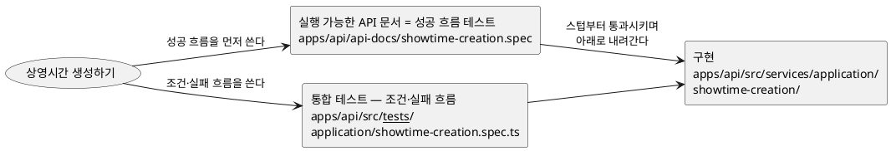

# 튜토리얼 — 유스케이스에서 테스트까지

이 글은 nest-seed를 처음 보는 초급 백엔드 개발자를 위한 튜토리얼이다. 이 시드가 어떤 사고 과정을 거쳐 지금의 모양이 되었는지를, 요구사항 분석부터 테스트 작성까지 순서대로 걷는다. 각 단계마다 시드의 실제 코드를 가리키므로, 읽으면서 해당 파일을 함께 열어 보길 권한다. 다이어그램은 devcontainer의 VS Code 미리보기에서 렌더된다.

이 흐름을 영화 예매 시스템 설계로 길게 풀어낸 원전은 블로그 연재 [백엔드 서비스 분석과 설계 1](https://mannercode.com/2025/04/01/backend-design-1.html)·[2](https://mannercode.com/2025/05/01/backend-design-2.html)·[3](https://mannercode.com/2025/06/01/backend-design-3.html)이다. 이 튜토리얼은 그 연재의 핵심을 시드 실물에 맞춰 요약한 것이다.

---

## 1. 시작은 코드가 아니라 유스케이스다

새 시스템(또는 새 기능)을 맡으면 코드를 열고 싶은 유혹이 먼저 온다. 그러나 시작은 질문이다 — **누가(액터), 무엇을(유스케이스) 하는가.**

도메인 전문가는 이렇게 말한다. "극장이 많다, 전국에 4,000개 정도다. 좌석이 중복 예약되면 안 된다, 예전에 그 문제로 고객센터가 고생을 많이 했다. 기존 데이터는 유지해야 한다." 이 말들을 개발자의 언어로 정리하면 **최우선 요구사항**이 된다.

```txt
최우선 요구사항
1. 극장은 4,000개 이상
2. 좌석 중복 예약 방지 필수
3. 기존 데이터 마이그레이션 필수
```

이 목록이 중요한 이유는, 이후의 모든 설계 선택을 이 목록에 비추어 판단하기 때문이다. 뒤에서 보겠지만 "극장 4,000개"라는 숫자 하나가 API 형태와 비동기 설계를 결정한다.

유스케이스를 뽑는 방법은 거창하지 않다. 도메인 전문가가 "상영 시간 선택하기, 좌석 선택하기, 영화 예매하기…"를 나열하면, 되묻는 것이다 — "상영 시간 선택하기는 영화 예매하기의 한 과정인가요?", "예매와 취소는 결국 티켓을 구매하고 환불하는 것 아닌가요?" 이런 문답을 반복하면 흩어진 항목들이 **티켓 구매하기** 같은 진짜 유스케이스로 묶인다.



점선 두 개가 이미 설계의 복선이다. 티켓 구매는 외부 시스템(결제)에 의존하고, **상영시간 생성은 티켓 생성을 끌고 들어간다**. 뒤의 의존이 4장에서 다단계 작업(사가)이 되는 이유이고, 앞의 의존(결제)도 4장에서 다시 만난다.

두 가지 요령이 있다.

- **이름은 영어로 짓는다.** 유스케이스 이름은 그대로 코드가 된다(`PurchaseTickets` → `PurchaseService`). 도메인 전문가에게는 이 사정을 설명하고 합의하면 된다.
- **"관리"라는 단어를 경계한다.** "티켓 관리"는 무슨 일을 하는지 알 수 없다. 추가인지, 검색인지, 생성인지 세분화해야 설계가 시작된다.

이 시드의 유스케이스가 어느 계층으로 배치됐는지는 [apps 문서의 유스케이스 지도](../apps.md#application-service는-조립이-필요할-때만-만든다)에 있고, 서비스 전체 목록은 [README 도메인 둘러보기](../../README.md#도메인-둘러보기)에 있다. 다이어그램의 customer·administrator는 시드에서 user·admin 역할이고, admin 계정을 만드는 운영용 root가 하나 더 있다 — 세 역할의 권한 구분은 [README 인가](../../README.md#인가) 절이 요약한다.

## 2. 유스케이스를 REST API로 옮긴다

유스케이스가 정해지면 구현이 아니라 **외부 계약(API)** 부터 설계한다. 이 순서가 이 튜토리얼 전체를 관통하는 태도다 — 사용자에게 보이는 것에서 시작해 아래로 내려간다(top-down).

기본은 리소스 중심 경로다(`GET /movies`, `POST /theaters`). 그런데 "상영시간 생성하기"처럼 여러 리소스를 오가는 복잡한 유스케이스는 어떨까? 범용 API를 조합해서 쓸 수도 있다.

```sh
GET /movies?orderby=releaseDate:desc&includes=showtime-summary   # 점점 복잡해진다
```

범용 API는 유연하지만, 유연함은 곧 구현과 사용 양쪽의 부담이다. 요청의 목적이 "상영시간 생성"이라고 명확하게 알고 있다면, API에도 그 목적을 드러내는 것이 낫다. 그래서 복잡한 유스케이스는 **자기 namespace**를 갖는다.

```sh
GET  /showtime-creation/movies            # 상영시간 생성 화면에 필요한 영화 목록
GET  /showtime-creation/theaters
POST /showtime-creation/showtimes/search  # 극장 4,000개 — theaterIds가 길어질 수 있어 POST
POST /showtime-creation/showtimes         # 생성 요청
```

세 번째 줄에서 최우선 요구사항이 벌써 작동했다. 극장이 4,000개 이상이므로 `theaterIds`를 받는 조회는 쿼리 스트링에 담을 수 없고, 처음부터 POST search로 설계한다.

유스케이스의 기본 흐름(영화 선택 → 극장 선택 → 상영시간 입력 → 생성)이 그대로 API 호출 순서가 된다.



마지막 응답이 `201 Created`인 것을 기억해 두자 — 4장에서 규모를 계산해 보면 이 계약은 유지될 수 없다.

이 경로들은 그대로 시드의 실물이다 — [showtime-creation.http-controller.ts](../../apps/api/src/services/gateway/showtime-creation.http-controller.ts)를 열어 비교해 보라. 경로 규칙 전체는 [apps 문서의 REST API 설계](../apps.md#rest-api-설계)에 있다.

## 3. API를 계층에 배치한다 — SoLA

API가 정해졌으니 그걸 처리할 서비스를 배치할 차례다. 여기서 이 시드의 가장 특징적인 구조인 SoLA가 등장한다.

문제부터 보자. 서비스들이 서로를 자유롭게 호출하게 두면 어떻게 될까? `ShowtimesService`가 검증을 위해 `MoviesService`를 부르고, 나중에 "23시 이후 상영하는 영화 목록" 기능이 생기면 `MoviesService`가 `ShowtimesService`를 부른다. 이제 두 서비스는 **순환 참조**로 묶였다 — 한쪽을 고치면 다른 쪽이 흔들리고, 사실상 한 덩어리가 된다. 기능이 늘수록 이런 결합은 반드시 생긴다.



SoLA(Service-oriented Layered Architecture)는 이 문제를 규칙 두 개로 막는다.

1. **같은 계층의 모듈끼리 직접 부르지 않는다.**
2. 두 모듈을 함께 써야 한다면, 둘을 모두 부를 수 있는 **한 단계 위 계층에 조립용 모듈**을 만든다.

그래서 "상영시간 생성"처럼 영화·극장·상영·티켓을 한꺼번에 다루는 유스케이스는 위 계층(Application)의 `ShowtimeCreationService`가 되고, Core의 `MoviesService`·`TheatersService`는 서로를 모른 채 각자의 도메인만 지킨다.

주의할 점 — **Application은 "유스케이스 계층"이 아니다.** 단일 도메인으로 끝나는 유스케이스(극장 등록, 가입·로그인)는 Application을 만들지 않고 컨트롤러가 Core를 직접 호출한다. 조립할 게 없는데 계층을 만들면 빈 껍데기 통과 계층만 늘어난다. 실물 대비: [movies.http-controller.ts](../../apps/api/src/services/gateway/movies.http-controller.ts)(Core 직행)와 [showtime-creation.http-controller.ts](../../apps/api/src/services/gateway/showtime-creation.http-controller.ts)(Application 경유).

NestJS에 익숙하다면 낯선 점이 하나 더 보일 것이다. **컨트롤러가 feature 모듈 안에 없다.** NestJS 관례는 users 모듈 안에 UsersController를 두지만, 이 시드는 컨트롤러 전부를 Gateway 계층([services/gateway/](../../apps/api/src/services/gateway/))으로 분리했다. 모듈이 HTTP에도, 이웃 모듈에도 묶이지 않으므로 나중에 특정 모듈을 독립 서비스로 떼어내기 쉽다.

그리고 이 배치는 설계 문서에만 있는 그림이 아니다 — **아래 다이어그램의 모든 이름이 시드의 실제 클래스이고, 패키지 이름이 실제 폴더 경로다.**



Core 서비스들 사이에는 화살표가 하나도 없다는 점을 보라 — 조합은 전부 위 계층의 몫이다. 그리고 `internal/` 상자가 이 그림의 또 다른 요점이다. 조율·검증·생성으로 분해된 내부 서비스들은 [showtime-creation/internal/](../../apps/api/src/services/application/showtime-creation/internal/)에 살고 모듈의 공개 barrel(index.ts 재수출 목록)로 내보내지 않는다. 경계 밖에 공개되는 것은 `ShowtimeCreationService`와 SSE 이벤트 통로인 `ShowtimeCreationEvents`뿐이다. 경계 밖에서는 내부 사정을 몰라도 되게 하는 것 — 이것도 같은 원칙이다.

SoLA는 원래 마이크로서비스 — 서비스가 서로 다른 프로세스로 실행되는 환경 — 를 염두에 둔 원칙이지만, 시드는 같은 경계를 **모놀리스 안에** 적용했다. 경계가 코드에 있으면 배포 형태는 나중에 바꿀 수 있기 때문이다. 계층 규칙의 전체 정의(Gateway·View를 포함한 5계층)와 강제 수단(eslint-plugin-boundaries)은 [apps 문서의 SoLA 5계층](../apps.md#sola-5계층)에 있다.

## 4. 규모가 설계를 바꾼다 — 202, 사가, 동시성

여기까지의 설계로 "상영시간 생성"을 동기 요청 하나로 처리할 수 있을까? 최우선 요구사항의 숫자를 대입해 보자.

```txt
상영 회차 = 4,000(극장) × 60(상영일) × 8(일일 회차) = 1,920,000개
티켓     = 1,920,000 × 500(좌석)                  = 960,000,000개
```

영화 한 편을 등록할 때마다 9억 6천만 장의 티켓을 만들어야 한다. HTTP 요청 하나가 기다릴 수 있는 시간이 아니다. 그래서 계약이 바뀐다.

- 서버는 작업을 접수만 하고 **`202 Accepted` + 작업 식별자(`sagaId`)** 를 즉시 응답한다.
- 진행 상황(waiting → processing → succeeded/failed/error)은 **SSE**(Server-Sent Events)로 흘려보낸다.
- 여러 단계를 거치다 중간에 실패하면? 이미 만든 상영시간·티켓을 되돌려야 한다. 이렇게 **실패 시 앞 단계를 보상(compensation)하는 다단계 작업 패턴을 사가(saga)** 라고 하고, 시드는 Temporal 워크플로로 구현했다.

이 흐름 전체는 [apps 문서의 사가 시퀀스 다이어그램](../apps.md#saga-오케스트레이션--temporal)에 있다. 종결 상태 둘을 구분하자 — `failed`는 검증 충돌로 아무것도 만들지 않았을 때고, `error`는 만들다 실패해 보상이 필요했을 때다. 그래서 항상 지켜야 하는 규칙(불변식)이 하나 나온다 — **보상을 끝낸 뒤에만 `error` 이벤트를 발행한다.** 클라이언트에게 error는 "정리까지 끝났다"는 신호다.

1장의 나머지 점선(결제)도 같은 무늬다 — 티켓 구매는 결제를 만든 뒤 티켓 전이가 실패하면 결제를 취소하는 보상을 한다([purchase.service.ts](../../apps/api/src/services/application/purchase/purchase.service.ts)).

### 동시성은 별도의 문제다

흔한 오해가 있다. "큐에 넣고 순차 처리하면 동시성도 해결된다"는 것이다. 워커가 하나일 때만 맞는 말이다. 시드처럼 컨테이너를 여러 개 띄우면(기본 4개) 충돌하는 두 작업이 서로 다른 워커에서 동시에 검증을 통과할 수 있다 — 각자 검증하는 시점에는 상대가 만들 상영시간이 아직 DB에 없어, 충돌이 보이지 않기 때문이다. 그래서 경쟁 구간은 별도 장치로 직렬화한다.

- 상영시간 **검증+삽입**은 분산 락 안에서 한 사가씩 처리한다 ([activities.ts](../../apps/api/src/services/application/showtime-creation/worker/activities.ts)의 주석이 정확히 이 이유를 설명한다)
- 티켓 **이중 판매**는 락이 아니라 원자 조건부 전이로 막는다 — "Available인 것만 Sold로" 조건을 갱신 쿼리 자체에 넣는다 ([tickets.repository.ts](../../apps/api/src/services/core/tickets/tickets.repository.ts)의 `transitStatusMany`)

### 엔티티에서 배울 것 두 가지

이 단계에서 엔티티(Showtime, Ticket)도 정해지는데, 초급자가 놓치기 쉬운 판단 두 개가 들어 있다.

- **좌석에 ID가 없다.** 극장의 seatmap은 블록·행·좌석 배치를 담지만 좌석마다 ID를 부여하지 않는다. 고객은 티켓에 적힌 블록·행·번호로 좌석을 찾을 뿐, 좌석이 관리 대상이 아니기 때문이다. **관리 대상이 아니면 ID를 주지 않는다** — ID 없이 값 자체로만 의미를 갖는 객체(값 객체)로 충분하다.
- **Ticket이 movieId·theaterId를 중복으로 갖는다.** showtimeId를 따라가면 알 수 있는 값인데도 그렇다. 서비스가 자기 컬렉션만 소유하는 구조에서는 조인이 없으므로, 정규화보다 서비스 간 결합 감소를 우선한다. 상세는 [apps 문서의 데이터 비정규화](../apps.md#데이터-비정규화).

## 5. 구현 순서 — bottom-up의 함정, top-down의 흐름

설계가 끝났다. 무엇부터 구현할까? 호출 구조를 단순화해서 놓고 보면, 시작점은 두 곳뿐이다.



3장의 조율 계층은 접어서 생략했다 — 남긴 것은 계층의 깊이다.

많은 개발자가 가장 구체적인 것, 즉 DB 테이블부터 만든다(bottom-up). 이 길의 끝을 미리 보자.

DB에 가까운 `ShowtimesService`를 만들고, 동작 확인용 임시 코드를 짠다. 그 위에 `ValidatorService`와 `CreatorService`를 만들고 각각 또 임시 코드… 임시 코드들이 아까우니 함수별 테스트로 남긴다. 함수마다 테스트가 있으니 안심이 된다.

그런데 요구사항이 바뀐다. `duration` 대신 `endTime`을 받기로 했다. 인터페이스 변경이 계층을 관통하면서 함수 네 개(find·save·validate·create)가 수정되고 — **테스트 네 개가 전부 깨진다.** 코드는 정상인데 테스트만 옛 인터페이스를 부르고 있기 때문이다. 이 경험이 반복되면 테스트는 기능을 검증하는 도구가 아니라 인터페이스 변경을 따라다니는 짐이 되고, 결국 포기하게 된다.

함정의 원인은 unit test의 "unit"을 **함수**로 해석한 데 있다. **unit은 하나의 동작(behavior)이다.** 사용자가 "상영시간을 생성해줘"라고 요청하면 내부에서 validate → save가 돌지만, 사용자 입장에서 이것은 하나의 동작이다. 테스트는 "생성을 요청하면 결과가 돌아온다", "충돌이 있으면 에러가 돌아온다"처럼 동작 단위로 쓴다. 그러면 내부 함수가 어떻게 쪼개지든 테스트는 흔들리지 않는다.

top-down에서는 이것이 자연스럽다. REST API부터 시작하므로:

1. API의 **spec(curl)을 먼저 쓴다.** 아직 서버엔 스텁뿐이라 실패한다.
2. 스텁이 spec을 통과하게 만들고, 한 계층씩 아래로 내려가며 진짜 구현으로 바꾼다.
3. 내려가는 동안 실행 방법은 한 번도 바뀌지 않는다 — 계약(API)이 그대로니까.

테스트를 먼저 쓰고 통과시키며 구현한다 — 의식하지 않아도 TDD가 된다. 그리고 이렇게 모인 spec은 **그 자체가 실행 가능한 API 문서**다. 시드의 [apps/api/api-docs/\*.spec](../apps.md#실행-가능한-api-문서)이 정확히 이 결과물이다. spec에는 주로 성공 흐름을 담고, 실패 흐름과 조건 분기 검증은 Jest 통합 테스트가 맡는다.

그 Jest 테스트가 실제로 어떻게 작성됐는지 보자 — 상영시간 생성의 통합 테스트([showtime-creation.spec.ts](../../apps/api/src/__tests__/application/showtime-creation.spec.ts))를 네 토막으로 발췌한다(import 줄은 생략).

**준비.** mock 서버가 아니라 실제 앱을 세운다.

```ts
describe('ShowtimeCreationService', () => {
    let fix: AppTestContext

    beforeEach(async () => {
        fix = await createAppTestContext({ ignoreGuards: [AdminAuthGuard] })
        showtimesService = fix.module.get(ShowtimesService)
        ticketsService = fix.module.get(TicketsService)

        movie = await createMovie(fix)
        theater = await createTheater(fix)
    })
    afterEach(() => fix.teardown())
```

`createAppTestContext`는 NestJS 앱을 통째로 만들어 devcontainer가 띄워 둔 실제 MongoDB·Redis·Temporal에 붙이고, `createMovie`·`createTheater`는 실제 DB에 픽스처를 만든다. 끄는 것은 관리자 인가 가드 하나뿐이다 — 이 스위트의 관심사는 사가이지 인가가 아니고, 인증·인가는 전용 스위트([admin-auth.spec.ts](../../apps/api/src/__tests__/core/admin-auth.spec.ts) 등)가 따로 검증한다.

**정상 흐름.** 4장에서 바뀐 계약(202 + `sagaId` + SSE)이 그대로 테스트 문장이 된다.

```ts
describe('POST /showtime-creation/showtimes', () => {
    describe('정상 요청 흐름', () => {
        let createPromise: Promise<Response>

        beforeEach(async () => {
            createPromise = fix.httpClient
                .post('/showtime-creation/showtimes')
                .body({
                    durationInMinutes: 1,
                    movieId: movie.id,
                    startTimes: [new Date('2100-01-01T09:00')],
                    theaterIds: [theater.id]
                })
                .accepted()
        })

        it('사가 식별자를 반환한다', async () => {
            const { body } = await createPromise
            expect(body).toEqual(expect.objectContaining({ sagaId: expect.any(String) }))
        })

        it('상영 시간을 생성한다', async () => {
            const { body } = await createPromise
            const { createdShowtimeCount } = await waitForCompletion(fix, 'succeeded')

            const createdShowtimes = await showtimesService.search({ sagaIds: [body.sagaId] })
            expect(createdShowtimes).toHaveLength(createdShowtimeCount)
        })

        it('티켓을 생성한다', async () => {
            const { body } = await createPromise
            const { createdTicketCount } = await waitForCompletion(fix, 'succeeded')

            const createdTickets = await ticketsService.search({ sagaIds: [body.sagaId] })
            expect(createdTickets).toHaveLength(createdTicketCount)
        })
    })
```

`describe`·`it`이 함수 이름이 아니라 **동작과 조건**을 말한다 — 내부에서 검증·생성이 어떻게 쪼개지든 이 문장들은 그대로 유효하다. 조건은 `beforeEach`가 만들고 `it`은 검증만 한다. `waitForCompletion`은 SSE 스트림을 구독해 지정한 종결 상태가 올 때까지 기다리는 이 스위트의 유틸이고([showtime-creation.utils.ts](../../apps/api/src/__tests__/application/showtime-creation.utils.ts)), 단언은 서비스가 보고한 값이 아니라 **`sagaId`로 실제 DB를 재조회한 끝 상태**를 센다. 내부 함수를 호출했는지 검사하는 테스트는 없다 — 이 테스트가 성공하려면 사가 전체(202 → 워크플로 → SSE 이벤트)가 실제로 돌아야 한다.

**실패 흐름(`failed`).** 검증 충돌은 400이 아니다 — 요청 자체는 접수(202)되고, 충돌 목록은 SSE로 온다.

```ts
it('기존 상영 시간과 겹치면 충돌 목록과 함께 실패 상태를 전송한다', async () => {
    const initialShowtimes = await createShowtimes(
        fix,
        [
            new Date('2013-01-31T12:00'),
            new Date('2013-01-31T14:00'),
            new Date('2013-01-31T16:30'),
            new Date('2013-01-31T18:30')
        ].map((startTime) => ({
            endTime: DateUtil.add({ base: startTime, minutes: 90 }),
            startTime,
            theaterId: theater.id
        }))
    )

    const completionPromise = waitForCompletion(fix, 'failed')

    await fix.httpClient
        .post('/showtime-creation/showtimes')
        .body({
            durationInMinutes: 30,
            movieId: movie.id,
            startTimes: [
                new Date('2013-01-31T12:00'),
                new Date('2013-01-31T16:00'),
                new Date('2013-01-31T20:00')
            ],
            theaterIds: [theater.id]
        })
        .accepted()

    // 새 12:00-12:30은 기존 12:00-13:30과 시간이 겹치므로 충돌이다.
    // 새 16:00-16:30과 기존 16:30-18:00, 새 20:00-20:30과 기존 18:30-20:00은 한 상영이 끝나는 시각에 다른 상영이 시작한다.
    // 끝 시각을 포함하지 않는 정책이라 충돌로 보지 않는다.
    const conflictingShowtimes = [initialShowtimes[0]]

    await expect(completionPromise).resolves.toEqual({
        conflictingShowtimes,
        sagaId: expect.any(String),
        status: 'failed'
    })
})
```

시작 시각 세 개 중 무엇이 충돌이고 무엇이 아닌지 — 끝 시각을 포함하지 않는다는 경계 정책까지 — 테스트가 문서화한다. 이런 조건 분기(영화가 없을 때, 요청 안에서 시각이 서로 겹칠 때, 시작 분이 어긋난 겹침)가 이 파일에 케이스별로 쌓여 있다.

**보상 경로(`error`).** 4장의 불변식 — 보상을 끝낸 뒤에만 `error`를 발행한다 — 은 문서 속 문장이 아니라 테스트가 지키는 계약이다.

```ts
describe('생성 도중 티켓 생성이 실패하면', () => {
    let sagaId: string

    beforeEach(async () => {
        // 첫 티켓 묶음은 실제로 적재하고, 그 적재가 끝난 뒤 다음 묶음에서 실패시킨다.
        // 일부 티켓이 DB에 남은 상태로 보상이 돌게 해야 '티켓 삭제' 단언이 헛돌지 않는다.
        jest.spyOn(ticketsService, 'createMany').mockImplementation(/* 본문은 실물 참고 */)

        const completionPromise = waitForCompletion(fix, 'error')
        const { body } = await fix.httpClient
            .post('/showtime-creation/showtimes')
            .body({
                /* 정상 흐름과 같은 형태 */
            })
            .accepted()
        sagaId = body.sagaId
        await completionPromise
    })

    it('보상으로 생성된 상영 시간을 모두 삭제한다', async () => {
        const showtimes = await showtimesService.search({ sagaIds: [sagaId] })
        expect(showtimes).toEqual([])
    })

    it('보상으로 생성된 티켓을 모두 삭제한다', async () => {
        const tickets = await ticketsService.search({ sagaIds: [sagaId] })
        expect(tickets).toEqual([])
    })
})
```

티켓 생성 실패는 현실에서 임의로 일으킬 수 없으므로, 여기서만 spy로 **실패를 주입**한다. 의존성을 가짜로 바꿔치기하는 mock과는 용도가 다르다 — 첫 묶음은 실제 DB에 적재된 뒤에 터지고, 나머지는 전부 실물로 돈다. 그리고 단언 시점을 보라. `error` 이벤트를 받은 **직후에** DB를 조회해 비어 있음을 단언하므로, 보상이 끝나기 전에 `error`가 발행되면 이 테스트가 실패한다. 불변식이 테스트로 고정되어 있다.

시드의 테스트 규칙은 여기서 나온 결론들이다 — 동작 단위로 쓴다, mock 대신 실제 인프라로 돈다, spy는 실패 주입처럼 실물로 만들 수 없는 조건에만 쓴다, 커버리지 100%를 못 채우면 실패한다. describe는 조건·it은 결과라는 문장 규칙까지 포함한 전체 규칙은 [apps 문서의 테스트](../apps.md#테스트) 절에 있다.

1장에서 시작한 유스케이스가 어떤 실물 파일로 착지했는지 한눈에 보면 이렇다 — **아래 세 경로 모두 저장소에 실재한다.**



직접 확인해 보자(dev 서버를 띄운 상태에서):

```sh
bash apps/api/api-docs/run.sh theaters.spec              # spec 실행 — 테스트이자 문서
npm test -w apps/api -- theaters.spec --coverage=false   # 같은 도메인의 Jest 통합 테스트
```

## 6. 직접 걸어보기 — 새 기능을 추가한다면

이 다섯 단계는 읽는 순서가 아니라 **작업 순서**다. 예를 들어 "영화에 리뷰 남기기" 기능을 추가한다면:

1. **유스케이스** — 누가? user다. 무엇을? 리뷰 작성·조회. "리뷰 관리"라고 뭉개지 말고 세분화한다. 별점만인가, 텍스트도인가 — 문답으로 좁힌다.
2. **API** — `POST /movies/:movieId/reviews`, `GET /movies/:movieId/reviews`. 리소스 하나로 끝나는 단순한 유스케이스라 자기 namespace는 필요 없다.
3. **계층** — 리뷰는 단일 도메인인가? movies와 users를 조합해야 하나? 작성자 확인은 인증 토큰에 담긴 사용자 ID(토큰 주체)로 충분하고, movies 쪽 결합도 없다 — 경로의 movieId는 저장·조회 키로만 쓴다. 그러니 `core/reviews` 직행이면 되고 Application은 만들지 않는다. (영화 존재 검증까지 필요해지면 그때 3장 기준대로 조합 계층을 검토한다.)
4. **비동기?** — 요청 안에서 끝나는 작업이다. 202도 사가도 필요 없다. (만약 "리뷰 등록 시 전체 평점 재계산"이 무거워지면 그때 비동기를 검토한다.)
5. **spec부터** — `reviews.spec`을 먼저 쓰고, 스텁 컨트롤러로 통과시키고, Core로 내려간다. 조건 검증은 Jest로.

새 도메인의 코드 골격은 가장 단순한 [core/theaters](../../apps/api/src/services/core/theaters/)를 본보기로 복제하면 된다.

## 요약

| 단계        | 산출물                       | 정의처                                                                              |
| ----------- | ---------------------------- | ----------------------------------------------------------------------------------- |
| 유스케이스  | 액터·유스케이스 지도         | [apps 문서](../apps.md#application-service는-조립이-필요할-때만-만든다)             |
| API 설계    | 리소스 경로·namespace        | [REST API 설계](../apps.md#rest-api-설계)                                           |
| 계층 배치   | Core 직행 or Application     | [SoLA 5계층](../apps.md#sola-5계층)                                                 |
| 비동기·분산 | 202+SSE, 사가, 락, 원자 전이 | [분산 협력](../apps.md#분산-협력--msa-준비형-모놀리스)                              |
| 구현·테스트 | spec(curl) → 스텁 → 구현     | [실행 가능한 API 문서](../apps.md#실행-가능한-api-문서)·[테스트](../apps.md#테스트) |

분석, 설계, 구현, 테스트는 별개의 활동이 아니라 하나의 흐름이다. 도메인 전문가와의 대화가 유스케이스가 되고, 유스케이스가 REST API가 되고, API가 테스트 코드가 되고, 테스트 코드가 구현을 이끈다. 도구 선택의 이유(왜 Temporal인지, 왜 MongoDB인지)는 [설계 결정](decisions.md)이 소유한다.
