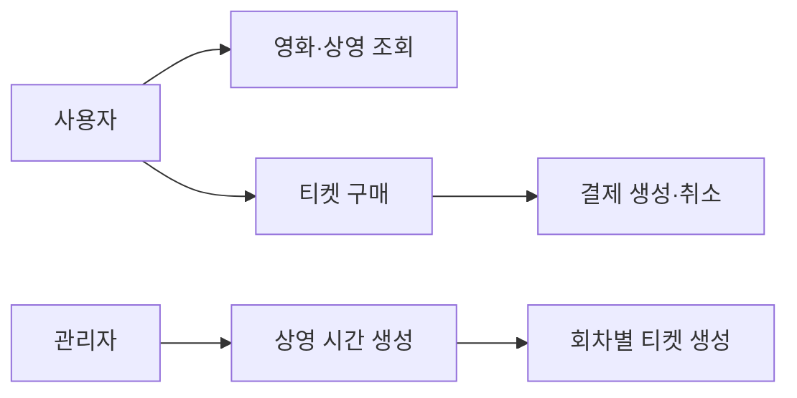
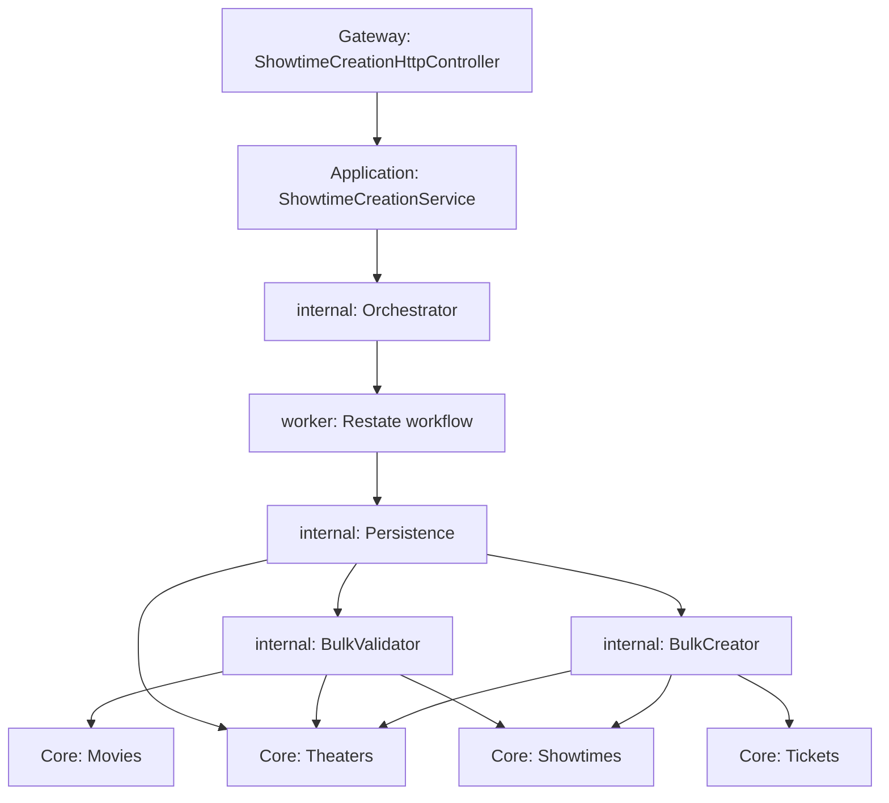

# 튜토리얼 — 유스케이스에서 테스트까지

영화 예매라는 요구사항이 API·모듈·데이터·테스트로 이어지는 과정을 따라간다. 코드를 그대로 설명하기보다 각 단계에서 무엇을 먼저 결정하고, 어떤 실패를 고려해야 하는지에 집중한다. 옆에 링크한 실제 구현과 테스트를 함께 읽는다.

## 1. 누가 무엇을 하는지부터 정한다

도메인 전문가가 “극장은 전국에 4,000개 정도이고 좌석이 중복 예약되면 안 된다”고 말했다고 하자. 개발자는 두 종류의 정보를 얻는다. 하나는 규모, 다른 하나는 깨지면 안 되는 규칙이다.

```text
가정한 목표 규모: 극장 4,000개
핵심 불변식: 같은 티켓을 두 구매에 판매하지 않는다
```

4,000은 대규모 상황에서 설계 결정을 연습하기 위한 가정이다. 현재 seed API의 단일 요청 처리량이나 실제 서비스의 규모를 뜻하지 않는다.

이어 “상영 시간 선택”, “좌석 선택”, “영화 예매”가 독립 작업인지 하나의 구매 흐름인지 묻는다. “관리”라는 넓은 이름을 작성·조회·취소처럼 사용자가 끝내려는 일로 나누면 필요한 계약이 드러난다.


```mermaid
flowchart LR
    U[사용자] --> Search[영화·상영 조회]
    U --> Purchase[티켓 구매]
    A[관리자] --> Create[상영 시간 생성]
    Create --> Tickets[회차별 티켓 생성]
    Purchase --> Payment[결제 생성·취소]
```

상영 생성은 티켓 생성을 함께 끝내야 한다. 구매는 결제 시스템에도 효과를 남긴다. 둘 다 여러 단계지만 실패를 되돌릴 수 있는 경계는 다르다. 이 차이를 뒤에서 transaction과 보상으로 나눈다.

도메인 전문가와 사용하는 용어를 합의하고 영어 코드 이름도 같은 의미로 맞춘다. 특히 사용자의 행동과 그 행동을 기록한 데이터를 구분한다.

| 용어                       | 의미                                                              |
| -------------------------- | ----------------------------------------------------------------- |
| 예매 `Booking`             | 상영·좌석을 선택하고 임시 선점하는 동선                           |
| 구매 `Purchase`            | 결제와 티켓 판매를 조율해 완료하거나 실패 시 보상하는 작업        |
| 구매 기록 `PurchaseRecord` | 구매의 진행·종결 상태를 저장해 재시도와 복구의 기준이 되는 데이터 |

따라서 구매 기록은 성공한 영수증만 뜻하지 않는다. 결제 전에 기록을 만들고 실패한 구매의 상태도 남겨야 한다.

## 2. 외부 계약을 먼저 그린다

상영 생성의 기본 동선은 영화 선택 → 극장 선택 → 기존 시간 확인 → 생성 요청이다. 특정 유스케이스에서만 쓰는 조합은 namespace로 드러낸다. 범용 영화 목록에 추천순·최신순 같은 옵션을 계속 더하면, 둘을 함께 요청했을 때의 우선순위까지 일반 조회 API가 책임져야 한다. 업무 흐름별로 묶으면 이런 옵션 조합의 영향을 제한할 수 있다.

| 사용자 동작             | 현재 HTTP 계약                                         |
| ----------------------- | ------------------------------------------------------ |
| 생성할 영화 선택        | `GET /showtime-creation/movies`                        |
| 극장 선택               | `GET /showtime-creation/theaters`                      |
| 선택한 극장의 상영 확인 | `POST /showtime-creation/showtimes/search`             |
| 생성 요청 접수          | `POST /showtime-creation/showtimes` → `202` + `sagaId` |
| 결과 다시 확인          | `GET /showtime-creation/showtimes/:sagaId/status`      |

조회인데 POST인 이유도 입력 계약에서 나온다. 선택한 극장 ID 목록은 길어질 수 있다. URL 길이나 프록시의 제약에 기대지 않고 본문에 검색 조건을 전달한다. 그렇다고 조회 요청에 구매와 같은 멱등성 키까지 요구하지는 않는다.

반면 생성 요청은 응답을 잃어도 같은 작업을 다시 찾을 수 있어야 한다. 인증 주체와 `Idempotency-Key`를 고정 `sagaId`에 연결한다. 같은 키·같은 본문은 기존 작업을 가리키고, 다른 본문은 충돌로 거부한다. 서로 다른 키가 같은 시간을 생성하려는 경쟁은 별도로 해결해야 한다.

[컨트롤러](../../apps/api/src/services/gateway/showtime-creation.http-controller.ts)에서 실제 경로·인증·DTO를, [HTTP 설계 규칙](../apps.md#33-rest-api-설계)에서 namespace·멱등성·`/me`의 기준을 확인한다. 단순 영화 조회처럼 독립적인 자원 API는 이 유스케이스 namespace 밖에 남긴다.

## 3. 협력하는 모듈을 배치한다

`MoviesController`와 `MoviesService`를 `MoviesModule`에 함께 둔다고 하자. Controller가 추천을 호출하고 추천 서비스가 영화를 조회하면 `MoviesModule → RecommendationModule → MoviesModule`의 순환이 생긴다. 서비스 호출은 Recommendation → Movies의 단방향이어도 Controller를 묶은 방식 때문에 모듈이 서로 의존한다.

이 시드는 Controller를 Gateway에 분리하고, 여러 Core의 협력은 상위 Application에서 조합한다. `forwardRef`로 서로 주입할 수 있게 만드는 것만으로는 이 책임의 결합이 사라지지 않는다. SoLA는 같은 계층의 서로 다른 모듈끼리도 직접 참조하지 못하게 한다.


```mermaid
flowchart TB
    Controller[Gateway: ShowtimeCreationHttpController]
    Service[Application: ShowtimeCreationService]
    Orchestrator[internal: Orchestrator]
    Workflow[worker: Restate workflow]
    Persistence[internal: Persistence]
    Validator[internal: BulkValidator]
    Creator[internal: BulkCreator]
    Movies[Core: Movies]
    Theaters[Core: Theaters]
    Showtimes[Core: Showtimes]
    Tickets[Core: Tickets]
    Controller --> Service --> Orchestrator --> Workflow
    Workflow --> Persistence
    Persistence --> Validator & Creator
    Persistence --> Theaters
    Validator --> Movies & Theaters & Showtimes
    Creator --> Theaters & Showtimes & Tickets
```

그림의 Core들 사이에는 호출 화살표가 없다. 검증·생성·workflow의 협력은 Application 모듈 안에서 끝낸다. `internal/`과 `worker/`로 나눈 구현은 모듈의 외부 소비자가 직접 가져다 쓰지 않는다. 실제 분해는 [showtime-creation](../../apps/api/src/services/application/showtime-creation/)에 있다.

Application을 모든 요청에 끼우지는 않는다. 극장 등록처럼 Core 하나로 끝나는 일은 controller가 그 Core를 바로 호출한다. 영화 삭제처럼 다른 도메인의 참조까지 확인해야 하면 상위 조합을 쓴다. 모든 유스케이스에 Application 클래스가 있어야 한다는 규칙이 아니다.

HTTP 라우팅과 인증 주체 추출은 Gateway에, 화면에 맞춘 읽기 조합은 View에 둔다. 도메인 서비스는 두 책임을 모르며, View는 도메인의 상태 변경을 소유하지 않는다.

이 구조는 모놀리스에서도 결합을 줄인다. 나중에 배포를 나눌 때 도움이 되지만 네트워크 실패나 분산 데이터 정합성까지 자동으로 해결하지는 않는다. 또한 SoLA의 모듈 배치와 SDK를 common으로 모으는 경계는 서로 다른 문제다([apps](../apps.md#1-sola-5계층), [libs](../libs.md)).

## 4. 규모·비동기·동시성을 나눠 생각한다

가정했던 극장 수에 상영일과 좌석 수를 곱해 보자.

```text
회차 = 4,000극장 × 60일 × 하루 8회 = 1,920,000개
티켓 = 1,920,000회차 × 500좌석 = 960,000,000개
```

이 계산은 동기 HTTP 요청 하나에 전체 완료를 약속하기 어렵다는 것을 보여 준다. 접수와 완료를 분리하면 사용자는 `202`와 작업 ID를 먼저 받고 이후 상태를 확인할 수 있다. 연결을 오래 유지하는 것과 작업을 끝까지 보존하는 것은 별개의 보장이다.

다만 `202`로 바꿨다고 한 transaction에 9억 건을 넣을 수 있는 것은 아니다. 현재 seed는 한 operation의 상영 수를 제한하며, persistence의 상한은 200회차다. 이보다 큰 범위의 분할·일정 관리·처리량은 이 예제가 구현했다고 주장하는 범위가 아니다. 숫자는 [persistence 구현](../../apps/api/src/services/application/showtime-creation/internal/showtime-creation-persistence.service.ts)이 소유한다.

### 접수, 실행 기록, 결과의 소유자

상영 생성에서는 세 종류의 상태를 구분한다.

| 상태                                | 맡는 곳                  | 필요한 이유                                   |
| ----------------------------------- | ------------------------ | --------------------------------------------- |
| 인증 주체·HTTP 키와 `sagaId`의 연결 | MongoDB submission       | 제출 응답을 잃어도 같은 작업을 다시 찾음      |
| 실행 중인 단계와 종결 출력          | Restate workflow journal | endpoint가 종료돼도 이어서 실행하고 결과 조회 |
| 생성한 상영·티켓과 operation 결과   | MongoDB transaction      | 부분 생성과 동일 operation의 중복 쓰기를 방지 |

SSE는 이 상태를 저장하는 네 번째 DB가 아니다. 현재 연결된 클라이언트에 진행을 알리고, 연결 전에 지나간 이벤트는 replay하지 않는다. 클라이언트는 `sagaId`로 자기 이벤트를 골라 읽고, 종결 이벤트를 놓치면 상태 API를 조회한다. workflow 출력의 보존 기간도 유한하다.

Restate는 완료한 durable step 결과를 재사용한다. 하지만 DB 커밋은 성공했고 journal 기록 전에 연결이 끊기면 step 함수가 다시 호출될 수 있다. 그래서 operation의 `sagaId` unique key와 입력 fingerprint를 확인하고 이미 완료된 결과를 재사용한다. durable execution을 외부 효과의 무조건적인 exactly-once로 해석하지 않는다.

### 같은 요청의 중복과 다른 요청의 경쟁

workflow key가 같은 제출을 합쳐도 서로 다른 `sagaId`의 시간 충돌은 남는다. A와 B가 각각 “겹치는 상영이 없다”고 읽고 삽입하면 읽기 검증만으로는 둘 다 성공할 수 있다.

상영 생성은 transaction 안에서 대상 극장의 guard를 **검증 조회보다 먼저** CAS로 갱신한다. 같은 극장의 동시 transaction이 같은 guard를 건드려 충돌하고, 재시도한 쪽은 변경된 상태에서 다시 검증한다. 상영·티켓·operation은 함께 커밋하거나 롤백한다.

티켓 판매도 “Available인지 읽은 뒤 Sold를 저장”하는 두 단계에 맡기지 않는다. 갱신 조건 자체에 Available을 넣어 승자 하나만 상태를 바꾸게 한다. `[A, B]`와 `[B, C]` 구매는 서로 다른 락을 얻어도 B를 둘 다 팔 수 없어야 한다. 이 경계는 [TicketsRepository](../../apps/api/src/services/core/tickets/tickets.repository.ts)와 [구매 overlap race](../../tests/api/race/purchase-overlap-race.js)가 함께 보여 준다.

### 상영 생성의 롤백과 구매의 보상이 다른 이유

상영 시간·티켓·operation은 같은 MongoDB transaction에 넣을 수 있다. 중간에 실패하면 전부 롤백한다. 시간 충돌은 자원 생성 없는 `failed`, 재시도로 해결되지 않은 시스템 오류는 `error`다.

구매는 [결제 생성·취소](../apps.md#23-구매-상태-머신과-재조정)와 Redis claim을 MongoDB의 완료 transaction 밖에서 처리한다. 구매는 외부 효과 전에 `pending` 기록을 남기고 완료·보상을 lease로 실행한다. 완료에는 티켓 판매와 구매 상태·응답 스냅샷을 함께 저장하고, 보상은 해당 구매가 소유한 효과만 해제한다. 프로세스가 종료되면 다른 복제본이 만료 lease를 인수한다. `catch` 안에서만 보상하면 프로세스가 사라진 뒤에는 실행할 코드도 복구 기준도 없다.

이 두 흐름의 순서와 보장은 [apps의 분산 협력](../apps.md#2-분산-협력--msa-준비형-모놀리스), 도구별 대안과 한계는 [설계 결정](decisions.md)에 있다.

### 값 객체와 중복 저장

극장의 좌석은 블록·행·번호가 의미를 가지며 독립적인 관리 ID를 두지 않는다. 관리할 lifecycle이 없는 대상에까지 ID를 붙이지 않는다.

반면 Ticket에는 `showtimeId`와 함께 `movieId`·`theaterId`도 저장한다. 상영을 따라가면 얻을 수 있는 값이지만 티켓 조회 때 다른 Core를 호출하지 않게 하는 선택이다. 중복 값의 변경 책임은 생기므로 어떤 값을 복제할지와 누가 함께 갱신할지 정해야 한다.

## 5. 동작을 기준으로 구현하고 검증한다

DB부터 구현하면서 함수마다 테스트를 붙이면 함수의 분해 방식이 테스트 계약이 되기 쉽다. 내부 메서드 인자만 바꿨는데 사용자가 보는 동작과 무관한 테스트들이 함께 깨진다면 무엇을 검증하려 했는지 다시 본다.

이 시드에서는 사용자가 관찰할 계약부터 정하고 그 계약을 통과하도록 내부를 구현한다.

1. 성공 응답과 실패·충돌·재시도 결과를 먼저 정한다.
2. HTTP 시나리오와 조건별 통합 테스트로 그 동작을 표현한다.
3. 필요한 계층을 구현하고 실제 저장 상태·외부 효과로 결과를 확인한다.

테스트를 먼저 쓴다고 결과를 하드코딩한 분기나 운영용 fallback을 남기지는 않는다. 내부 구현을 나누거나 합쳐도 외부 동작이 같으면 행동 테스트는 유지되어야 한다. 순수 계산 자체가 독립 계약인 경우에는 그 계산을 직접 테스트할 수 있다.

### 실제 인프라와 fixture

[상영 생성 통합 테스트](../../apps/api/src/__tests__/application/showtime-creation.spec.ts)는 `createAppTestContext({ enableRestate: true })`로 실제 Nest 앱과 임시 Restate endpoint를 준비한다. fixture는 실제 admin 인증·영화·극장 데이터를 만들고, 앱은 Dev Container의 MongoDB·Redis·NATS·Restate에 연결한다.

```ts
// 상영 생성 스위트의 준비 방식을 축약한 예시
beforeEach(async () => {
    fix = await createAppTestContext({ enableRestate: true })
    ;({ accessToken: adminAccessToken } = await createAndLoginAdmin(fix))
    movie = await createMovie(fix)
    theater = await createTheater(fix)
})
afterEach(() => fix.teardown())
```

fixture 종료는 연결만 닫는 문제가 아니다. 제출한 workflow의 완료와 임시 deployment 정리까지 기다려야 테스트 뒤의 작업이 다음 테스트 데이터를 건드리지 않는다. 소유한 resource와 teardown은 [fixture 수명](../apps.md#42-fixture와-비동기-작업의-수명)에 정리되어 있다.

### 정상 흐름은 서로 다른 결과를 드러낸다

상영 생성의 HTTP 성공은 접수 성공이다. 202만 받았다고 상영과 티켓이 생성됐다고 결론 내릴 수 없다. 테스트 문장도 그 차이를 드러낸다.

```text
POST /showtime-creation/showtimes
  정상 요청 흐름
    사가 식별자를 반환한다
    상영 시간을 생성한다
    티켓을 생성한다
```

뒤의 두 결과는 작업의 종결을 기다린 다음 `sagaId`로 DB의 상영·티켓을 재조회한다. 내부 creator가 호출됐다는 사실이나 응답에 적힌 수만으로 성공을 판단하지 않는다. 요청 하나가 실제로 남긴 결과를 확인한다.

SSE를 검증할 때는 이벤트를 놓치지 않도록 요청 전에 구독을 준비한다. `waitForCompletion`은 SSE 종결 이벤트를 기다리는 helper이며 상태 API를 대신 조회하지 않는다. 이벤트를 놓친 클라이언트의 복구는 별도의 상태 조회 계약으로 검증한다. 고정 sleep으로 “이쯤 끝났겠지”라고 가정하지 않는다.

### 도메인 충돌과 시간 경계

상영 시간 검증은 끝 시각을 포함하지 않는 구간을 사용한다. 기존 상영이 12:00~~13:30이면 12:00~~12:30은 충돌하지만 13:30부터 시작하는 상영은 충돌하지 않는다.

| 기존 상영   | 새 상영     | 결과            |
| ----------- | ----------- | --------------- |
| 12:00~13:30 | 12:00~12:30 | 겹침            |
| 16:30~18:00 | 16:00~16:30 | 인접하므로 허용 |
| 18:30~20:00 | 20:00~20:30 | 인접하므로 허용 |

이런 조건은 함수 이름보다 업무 규칙을 설명하는 테스트로 남긴다. 기존 데이터와 충돌한 요청은 접수 뒤 `failed` 결과를 내지만, 요청 본문 안에서 시작 시각끼리 이미 겹치는 오류는 접수 전에 거부할 수 있다. 두 실패 시점도 같은 것으로 취급하지 않는다.

### 실패를 주입해 실제 롤백을 확인한다

상영 저장 다음에 티켓 저장이 실패하는 순간을 외부 인프라에서 매번 정확히 만들기는 어렵다. 여기서는 spy로 실패 시점을 제어하되 실제 insert와 transaction 경로를 유지한다.

```ts
const realCreateMany = ticketsService.createMany.bind(ticketsService)
vi.spyOn(ticketsService, 'createMany').mockImplementation(
    async (createDtos, transaction, signal) => {
        await realCreateMany(createDtos, transaction, signal)
        throw new Error('ticket creation failed after insert')
    }
)
```

이후 생성 요청을 보내 `error`로 끝날 때까지 기다린 뒤 같은 `sagaId`의 상영과 티켓이 모두 없는지 조회한다. 처음부터 insert를 가짜로 성공시켰다면 실제 부분 쓰기를 롤백한다는 보장을 확인할 수 없다.

별도 시나리오는 첫 쓰기만 실패시켜 durable step 재시도 후 한 세트만 생기는지, 커밋 후 응답을 잃어도 operation 결과를 재사용하는지 확인한다. 실패 주입은 이런 관찰을 위한 수단이며 통합 경로 전체를 mock으로 바꾸기 위한 이유가 아니다.

### 실행 가능한 문서와 테스트의 역할

[API curl spec](../../apps/api/api-docs/showtime-creation.spec)은 프런트엔드가 직접 실행할 요청·응답 계약이다. `TEST`는 검증할 항목, `SETUP`은 준비 요청으로 구분한다. 상세 조건·실패 주입은 Vitest 통합 테스트가, 여러 복제본의 경쟁은 [외부 스택 테스트](../tests.md)가 담당한다.

커버리지 100%는 실행되지 않은 분기를 변경 시점에 드러내는 제약이다. 응답을 잘못 단언한 테스트도 코드는 실행하므로, 수치만으로 업무 보장을 판단하지 않는다. 조건형 `describe`와 `beforeEach`·`it`의 역할은 [개발 규칙](conventions.md#5-테스트-문장은-조건과-결과를-이어-읽게-쓴다)을 따른다.

처음 실행해 볼 도메인은 단순한 극장 CRUD가 적당하다. 개발 API가 준비됐다면 다음 두 경로를 비교한다.

```bash
bash apps/api/api-docs/run.sh theaters.spec
pnpm --filter './apps/api' test theaters.spec --coverage.enabled=false
```

두 번째는 특정 spec을 빠르게 확인하는 명령이며 전체 coverage 검증을 대체하지 않는다. 전체 실행과 결과 위치는 [tests/README.md](../../tests/README.md)에 있다.

## 6. 새 기능에도 같은 질문을 적용한다

“영화에 리뷰 남기기”를 추가한다면 리뷰 관리라는 이름부터 클래스로 옮기지 않는다. 작성·조회·수정 중 무엇을 제공할지, 작성자를 token subject로 정할지, 존재하는 영화인지 검증할지부터 결정한다.

한 도메인으로 끝나면 Core를 직접 사용한다. 영화 존재 확인처럼 다른 Core의 규칙까지 필요하면 상위에서 조합한다. 요청 안에 끝나는 작성에 workflow를 넣을 이유는 없고, 무거운 후속 계산이나 외부 효과가 추가되면 그때 실패·재시도 경계를 검토한다. 이 예시는 설계 연습이며 현재 리뷰 API가 있다는 뜻은 아니다.

| 결정할 것     | 확인할 질문                                  | 참고                                                        |
| ------------- | -------------------------------------------- | ----------------------------------------------------------- |
| 유스케이스    | 누가 무엇을 끝내고 어떤 규칙을 지켜야 하나?  | 이 문서의 요구사항·API 절                                   |
| 공개 계약     | 접수와 완료, 재시도와 실패가 어떻게 보이나?  | [HTTP 규칙](../apps.md#33-rest-api-설계)                    |
| 모듈 배치     | Core 하나로 끝나나, 여러 도메인의 조합인가?  | [SoLA](../apps.md#1-sola-5계층)                             |
| 정합성과 복구 | 어떤 쓰기를 원자적으로 묶고 무엇을 보상하나? | [설계 결정](decisions.md)                                   |
| 검증          | 결과와 실패를 어느 실제 경계에서 관찰하나?   | [apps 테스트](../apps.md#4-테스트)·[외부 스택](../tests.md) |

새 도메인의 작은 출발점은 [core/theaters](../../apps/api/src/services/core/theaters/)다. 그 구조 전체를 복제하기 전에 새 기능에 실제로 필요한 역할과 계약을 고른다.
