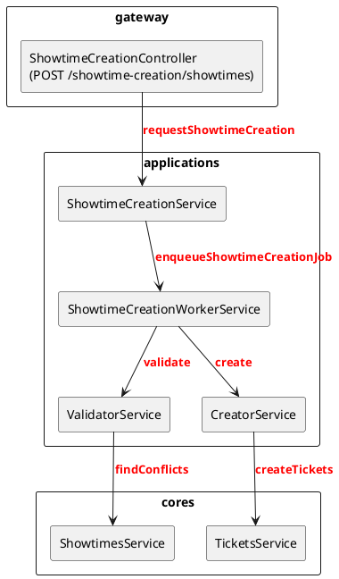

```plantuml
@startuml
skinparam componentStyle rectangle
skinparam packageStyle rectangle
skinparam shadowing false
top to bottom direction

package "gateway" {
  component "ShowtimeCreationController\n(POST /showtime-creation/showtimes)" as GController
}

package "applications" {
  component "ShowtimeCreationService" as AService
  component "ShowtimeCreationWorkerService" as AWorker
  component "ValidatorService" as AValidator
  component "CreatorService" as ACreator

  AService --> AWorker : <b><color:red>enqueueShowtimeCreationJob</color></b>
  AWorker --> AValidator : <b><color:red>validate</color></b>
  AWorker --> ACreator : <b><color:red>create</color></b>
}

package "cores" {
  component "ShowtimesService" as CShowtimes
  component "TicketsService" as CTickets
}

GController --> AService : <b><color:red>requestShowtimeCreation</color></b>
ACreator --> CTickets : <b><color:red>createTickets</color></b>
AValidator --> CShowtimes : <b><color:red>findConflicts</color></b>
@enduml
```
