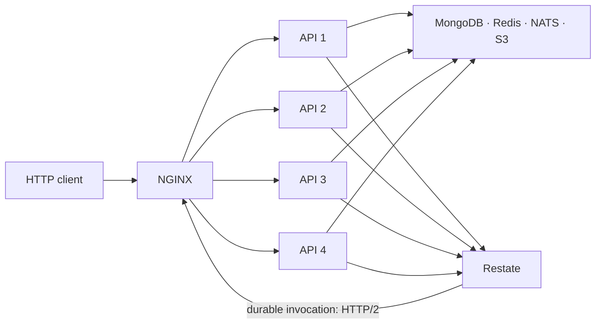

# tests/ — 외부 스택 테스트

앱·라이브러리의 단위·통합 테스트는 각 workspace에 둔다. `tests/`는 여러 프로세스·컨테이너를 밖에서 검증해야 의미가 있는 테스트를 모은다. 실행 명령과 산출물 위치는 [`tests/README.md`](../tests/README.md)가 소유한다.

## 1. api — 다중 복제본 검증 스택

`tests/api/compose.yml`은 실행 가능한 API 문서, race와 benchmark가 공유하는 API 복제본 4개와 NGINX 환경이다. 이미 실행 중인 개발 인프라에 연결한다. **운영 배포본은 아니다.** TLS, secret 관리, backup/restore, 관측 backend, frontend 배포, 무중단 revision 전환은 포함하지 않는다.



복제본 수는 프로세스 경계를 넘는 정확성을 검증하기 위한 정책이다. NATS fan-out, 분산 락, lease owner CAS, MongoDB write conflict, 원자 상태 전이는 복제본 하나만으로는 실제 프로세스 간 경쟁을 만들지 못한다. 복제본 수를 줄이면 테스트의 의미도 바뀐다.

실행기는 `.env.infra`의 고정 개발 admin을 사용하고, Compose는 API에 `.env.infra`와 `.env.api`를 주입한다. admin이 없으면 준비되지 않은 환경으로 실패하며 테스트가 임의의 계정으로 대체하지 않는다. 인프라와 같은 네트워크를 쓰되 스택 종료는 API·NGINX를 정리하는 범위다. 개발 인프라의 데이터 초기화는 별도 [infra reset](infra.md#2-시작과-reset의-범위)이다.

API 컨테이너에 자동 재시작 정책을 두지 않는다. 복제본 종료가 자동 복구에 가려지지 않게 하고, chaos 시나리오가 직접 kill·start를 제어하기 위해서다. 일반 HTTP health 통과와 Restate endpoint 등록 완료는 별개다.

### `x-replica-id`의 의미

API 응답의 `x-replica-id`는 처리한 컨테이너의 hostname이다. 문자열 형식은 외부 API 계약이 아니며, 테스트는 동시 요청에서 서로 다른 값이 관측됐는지 확인한다.

```text
요청 A → api-1, 요청 B → api-1 : 프로세스 간 경쟁을 증명하지 못함
요청 A → api-1, 요청 B → api-2 : 프로세스 간 경쟁을 검증할 조건을 충족
```

race client는 공유 keep-alive 연결에 요청이 묶이지 않게 하고, 헤더 관찰로 실제 분산도 확인한다. 이 조건이 없으면 한 프로세스에만 요청이 간 거짓 성공이 될 수 있다.

## 2. api/race — 동시 요청과 장애

앱 내부 클래스를 호출하지 않고 HTTP/SSE로 요청을 보내 보장을 관찰한다. 각 시나리오가 어떤 실패 경계를 다루는지 구분해서 읽는다.

| 시나리오                | 검증하는 보장                                                                     |
| ----------------------- | --------------------------------------------------------------------------------- |
| `user-signup-race`      | 같은 이메일의 동시 가입은 unique index가 승자 하나만 남김                         |
| `ticket-holding-race`   | 같은 좌석의 동시 선점은 Redis Lua의 원자 실행으로 하나만 성공                     |
| `showtime-overlap-race` | 서로 다른 workflow key의 겹치는 상영 생성도 guard CAS·transaction으로 하나만 성공 |
| `purchase-double-spend` | 같은 티켓 묶음의 동시 구매는 판매·결제를 하나만 남김                              |
| `purchase-overlap-race` | 락 키가 다른 겹친 티켓 묶음도 DB 상태 전이로 이중 판매를 막고 패자를 보상         |
| `sse-fanout-race`       | 한 복제본의 상태 이벤트가 다른 복제본의 SSE 연결에도 전달됨                       |
| `jwt-refresh-race`      | 같은 refresh token의 동시 회전은 승자 하나와 충돌 결과로 구분됨                   |
| `replica-chaos`         | 복제본 종료 중 NGINX의 우회와 서비스 가용성을 관찰                                |

특히 구매 overlap은 같은 락 키의 직렬화만 검증해서는 찾을 수 없는 문제를 다룬다. `[A, B]`와 `[B, C]`가 다른 락을 얻어도 티켓 B를 둘 다 팔 수 없어야 한다. Redis 락이 없어지거나 만료해도 유지할 보장은 DB가 담당한다.

실행기는 스택 준비·Restate 등록·인증·시나리오·정리를 묶는다. 실패하면 정리 전에 컨테이너 로그·자원 상태와 MongoDB 복제 상태를 남긴다. 구체적인 요청 수·허용 오류율·timeout은 각 시나리오가 소유한다. 오류를 숨기려고 반복 횟수나 timeout부터 바꾸지 않고, 같은 시각의 서버 로그와 runner 자원을 함께 본다.

이 계층의 HTTP 경합·fan-out과 Restate 서버 자체의 journal 복구는 다른 보장이다. 후자는 [`infra/tests/restate-journal-recovery.js`](../infra/tests/restate-journal-recovery.js)가 검증한다.

## 3. web — 브라우저 E2E

web 테스트는 개발 서버가 아닌 production build로 관리자·사용자 흐름과 세션 회전을 검증한다. 실행기는 API·console·user-app의 이미지를 빌드하고 healthy가 된 뒤 브라우저를 실행한다. 종료할 때는 `${COMPOSE_PROJECT_NAME}-web` project의 앱만 정리한다.

Playwright와 Chromium은 Dev Container에서 직접 실행한다. 검증 대상 앱만 Compose로 띄워 브라우저용 별도 이미지·패키지 설치 경로를 유지하지 않는다. 의존성은 pnpm workspace의 lockfile로 통일한다. 브라우저는 Docker service DNS로 앱에 접근하므로 일반 E2E를 위해 host port를 publish하지 않는다.

Node 타입은 Dev Container 런타임에 맞춘다. TypeScript는 이 workspace에서 타입 검사 CLI로만 쓰므로 앱의 compiler API 호환 제약과 별도로 버전을 정한다. Playwright 변경 시 browser binary와 OS 의존성을 맞추는 절차는 [Dev Container](devcontainer.md)가 설명한다.

검증 대상은 console 로그인·영화 관리와 user-app 가입·로그인·세션 회전이다. 상영 생성·구매 UI가 있다고 가정하지 않는다. 브라우저 실패의 trace·screenshot·HTML 결과는 `tests/web/_output/`에서 확인한다.

## 4. api/benchmark — 같은 조건의 회귀 비교

benchmark는 절대 성능 인증이 아니라 **같은 머신·이미지·데이터 조건의 이전 결과와 비교**하는 도구다. k6를 [tools의 Compose](tools.md#3-compose로-실행하는-도구)로 실행하고, 극장 조회·생성의 단독 부하와 혼합 부하를 비교한다. 같은 조건에서 gzip의 영향도 비교할 수 있다.

먼저 응답 상태를 확인한다. 연결 실패·5xx가 섞인 지연 시간은 정상 처리 경로의 성능이 아니다. 그다음 단독 실행과 혼합 실행의 처리량·p95·p99를 비교해 읽기와 쓰기가 서로 방해하는 정도를 본다. 서로 다른 머신이나 fixture 수의 결과를 직접 비교하지 않는다.

fixture는 개발 MongoDB에 남는다. 측정 결과는 실행 시각별 JSON과 HTML로 남기며, 초기화와 결과 경로는 [실행 안내](../tests/README.md#2-결과)를 따른다. 테스트 스택이 닫혔다고 fixture까지 삭제됐다고 가정하지 않는다.

## 5. 프런트엔드 BFF와 클라이언트 IP 경계

API 테스트 스택에는 frontend edge가 없다. console·user-app을 운영에 배포할 때는 두 Next.js origin을 신뢰할 수 있는 edge 뒤에 두고 브라우저의 직접 접근을 막아야 한다. edge는 외부 proxy IP 헤더를 그대로 신뢰하지 않고 실제 연결 주소를 기준으로 체인을 재구성해야 한다.

BFF는 기본적으로 proxy IP 헤더를 무시한다. 위 경계가 있는 배포에서만 `BFF_TRUST_PROXY_HEADERS=true`로 opt-in한다. 현재 BFF는 `X-Forwarded-For`의 오른쪽 끝 IP를 선택하므로 edge가 실제 연결 주소를 그 위치에 넣어야 한다. 이 헤더가 없을 때 쓰는 `X-Real-IP`도 edge가 덮어써야 한다. 끝값이 잘못됐다고 앞쪽 값을 신뢰하지 않는다.

API도 BFF/NGINX에서만 접근할 수 있는 사설 경계에 둔다. 이 조건 없이 opt-in하면 위조 IP가 rate limit을 우회할 수 있다. 기본값에서는 API가 BFF 주소를 보므로 여러 사용자가 로그인 IP 버킷 하나를 공유할 수 있다.

```text
인터넷 → 신뢰 edge(IP 헤더 재구성) → BFF → 사설 API
인터넷 ───────────────────────────╳→ origin 직접 접근
```

상태 변경 요청의 same-origin 판정은 브라우저의 `Origin`과 `Host`를 기준으로 한다. production cookie는 기본적으로 `Secure`다. 내부 HTTP로 실행하는 web 테스트의 `BFF_COOKIE_SECURE=false`는 그 환경에 한정하며 운영 기본값으로 복사하지 않는다.

web Compose는 proxy 신뢰를 켜고 테스트가 edge의 헤더를 모사한다. 이 검증은 BFF·API의 연결을 확인할 뿐 실제 public edge가 외부 헤더를 올바르게 덮어쓰는지까지 증명하지 않는다. API 내부의 인증 테스트 역시 실제 배포망의 접근 제한을 검증하는 것은 아니다.

## 6. Restate endpoint 등록과 운영 전환

각 API 복제본은 일반 HTTP와 별도로 Restate HTTP/2 endpoint를 연다. 검증 스택은 개별 복제본 대신 NGINX의 안정적인 `http://nginx:9080`을 등록해 한 복제본이 종료되어도 invocation을 다른 복제본으로 보낸다.

실행기는 API·NGINX가 healthy가 된 뒤 `restate-register` one-shot 서비스를 실행한다. 일반 HTTP `/health`는 Restate ingress의 health를 보지만 deployment 등록과 endpoint dispatch까지 보장하지 않는다. workflow가 실행되지 않으면 등록 상태와 HTTP/2 경로를 함께 확인한다.

고정 URI를 `force: false`로 등록하므로, 이미 알려진 URI 뒤의 workflow 코드나 manifest를 바꿨다고 새 정의가 발견되는 것은 아니다. 보존할 journal이 없는 개발 환경은 `infra/reset.sh`로 초기화할 수 있지만 이 명령은 실행 기록을 지운다. 단순 컨테이너 재시작과 다르며 운영 배포 방법이 아니다.

운영은 revision별 endpoint를 등록하고, 이전 revision의 invocation이 끝날 때까지 해당 revision을 유지한 뒤 제거해야 한다. 개발용 `force: true` 재등록과 검증용 고정 URI를 무중단 배포 절차로 복사하지 않는다.

```text
v1 실행 유지 → v2 endpoint 등록 → 새 invocation 전환 → v1 drain 확인 → v1 제거
```

## 7. 로그 계약

API와 NGINX는 구조화된 한 줄 로그를 stdout/stderr로 내보내고 요청·응답 본문과 query는 기록하지 않는다. 컨테이너 내부에 별도 로그 파일을 만들지 않는다. Compose의 로컬 로그 회전은 호스트 디스크를 위한 제한된 버퍼이며 backup·장기 보존이 아니다.

수집·저장·검색·보존·접근 제어는 실제 배포 환경의 로그 backend가 소유한다. API 문서가 남기는 fixture 응답 로그는 이 런타임 로그와 별개의 검증 산출물이다.

## 8. CI 반복 — test-stability, test-api-race

필수 AtoZ는 PR과 main 변경의 전체 회귀를 검증한다. Stability CI는 라이브러리·API·인프라 초기화를, API Race CI는 위 경합 시나리오를 반복해 간헐 실패를 찾는다. 한 번 통과했다고 race와 timing 문제가 없다고 결론 내리지 않는다.

Stability의 coverage 비활성 실행은 반복 동작을 관찰하기 위한 것이며 필수 AtoZ의 100% 게이트를 대신하지 않는다. 반복 횟수·스케줄·timeout은 [워크플로](../.github/workflows/)가 소유한다. 실패 회차는 `[Run i/N]`에서 찾고 정리 전 진단과 같은 시각의 runner 자원을 함께 확인한다.

테스트 CI는 checkout에 필요한 저장소 읽기 권한만 명시한다. 저장소·조직의 기본 token 권한이 바뀌어도 검증 작업의 권한이 따라 넓어지지 않게 하기 위한 것이다.
