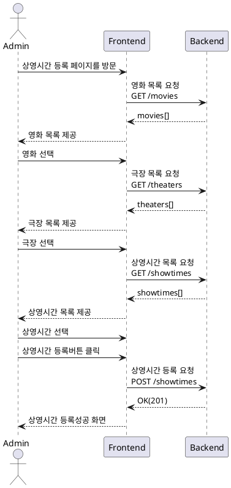

# Ticket Generation

## 1. 티켓 등록 유스케이스 명세서
목표: 하나의 영화를 여러 극장에 상영시간 등록하기

액터: 관리자

사전 조건:

-   관리자는 시스템에 로그인해야 합니다.
-   영화와 극장은 시스템에 등록되어 있어야 합니다.

트리거:

-   관리자가 영화 상영시간 등록 페이지를 방문합니다.

main flow :

1. 시스템은 현재 등록된 영화 목록을 보여줍니다.
1. 관리자는 상영시간을 등록하려는 영화를 선택합니다.
1. 시스템은 현재 등록된 극장 목록을 보여줍니다.
1. 관리자는 상영시간을 등록하려는 극장들을 선택합니다.
1. 관리자는 각 극장에 대한 상영시간을 입력합니다.
1. 관리자는 상영시간을 등록합니다.
1. 시스템은 등록한 상영시간이 기존의 상영시간과 겹치는지 검사합니다.
1. 만약 겹치지 않는다면, 시스템은 상영시간을 등록하고, 상영시간 등록이 완료되었다는 메시지를 보여줍니다.

Exception Flow :

-   만약 상영시간이 기존의 상영시간과 겹친다면
    1. 시스템은 상영시간 등록에 실패했다는 메시지와 함께 어떤 상영시간이 겹쳤는지 정보를 보여줍니다.
    1. 기본 흐름 5단계로 돌아갑니다.

Postconditions :

-   선택한 극장에서 선택한 영화의 상영시간이 성공적으로 등록되어야 합니다.
-   상영시간에 해당하는 티켓이 생성되어야 한다.

## 2. 티켓 등록 시퀀스 다이어그램

