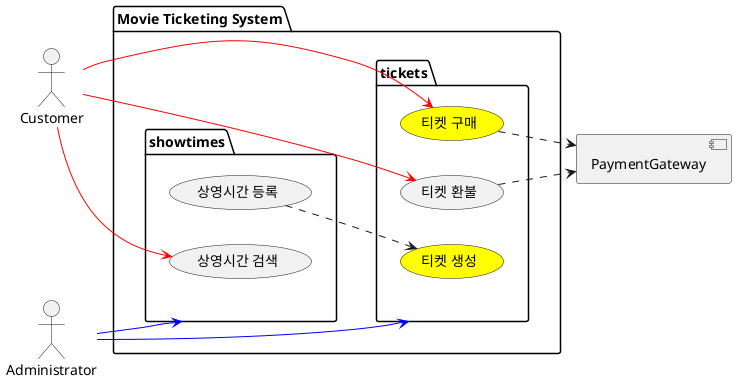
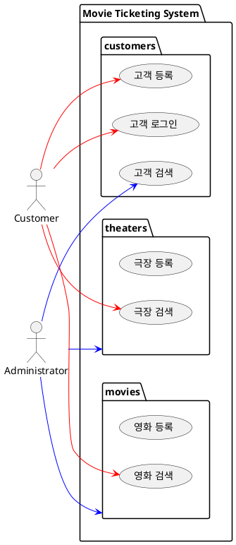

# Use Cases

영화 예매 시스템의 유스케이스다. 이것은 개념 검증을 위한 프로젝트이기 때문에 실제 영화 예매 시스템과 다소 다른 부분이 있다.

1. 극장에는 여러 개의 상영관이 있으나 편의상 생략한다.
1. 좌석에는 등급 개념이 있으나 편의상 생략한다.

## glossary

-   상영중 showing
-   상영시간 showtime
-   상영일 showdate
-   예매 booking
-   구매 purchase
-   환불 refund
-   상영관 room

## 영화 예매 시스템 유스케이스

