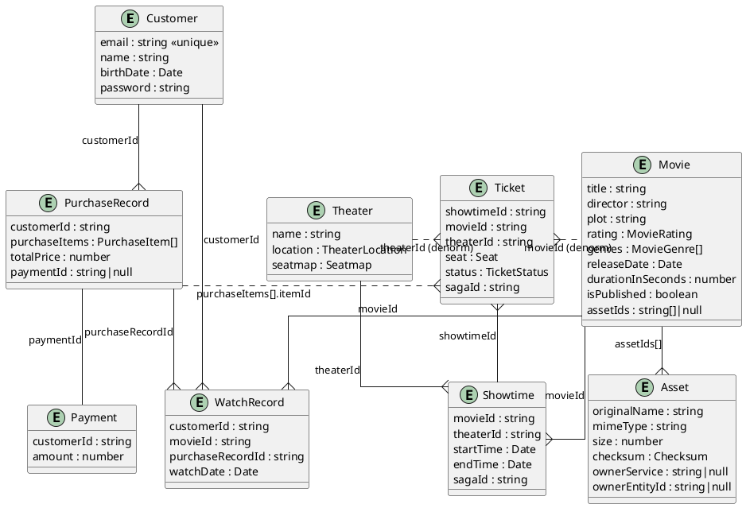

> **English** | [한국어](../../ko/designs/entities.md)

# Entity Design

All entities share the following common fields.

| Field       | Type   |
| ----------- | ------ |
| `id`        | string |
| `createdAt` | Date   |
| `updatedAt` | Date   |

`id` is a virtual field where Mongoose converts MongoDB's `_id: ObjectId` to `string`. All ID fields referencing other entities (`movieId`, `customerId`, etc.) are also stored as `string` type. Since each service in an MSA can have its own independent data store, IDs are exchanged between services as strings to avoid depending on specific DB ID implementations (MongoDB ObjectId, UUID, auto-increment, etc.).

## ER Diagram

## Notes

- Customer `password` — bcrypt hash, excluded from queries by default
- MovieRating — `G` `PG` `PG13` `R` `NC17` `Unrated`
- MovieGenre — `action` `comedy` `drama` `fantasy` `horror` `mystery` `romance` `thriller` `western`
- TicketStatus — `Available = 'available'` `Sold = 'sold'`
- PurchaseItemType — `tickets` `foods`
- TheaterLocation — `{ latitude, longitude }`
- Seatmap — `SeatBlock[] > SeatRow[]`, layout: `X` = empty space, others = seats
- Seat — `{ block, row, seatNumber }`
- PurchaseItem — `{ itemId, type: PurchaseItemType }`
- Checksum — `{ algorithm, base64 }`, algorithm: `sha1` | `sha256`
- Asset lifecycle — issue presigned URL → upload → finalize → assign owner (incomplete uploads are cleaned up every 10 minutes)
