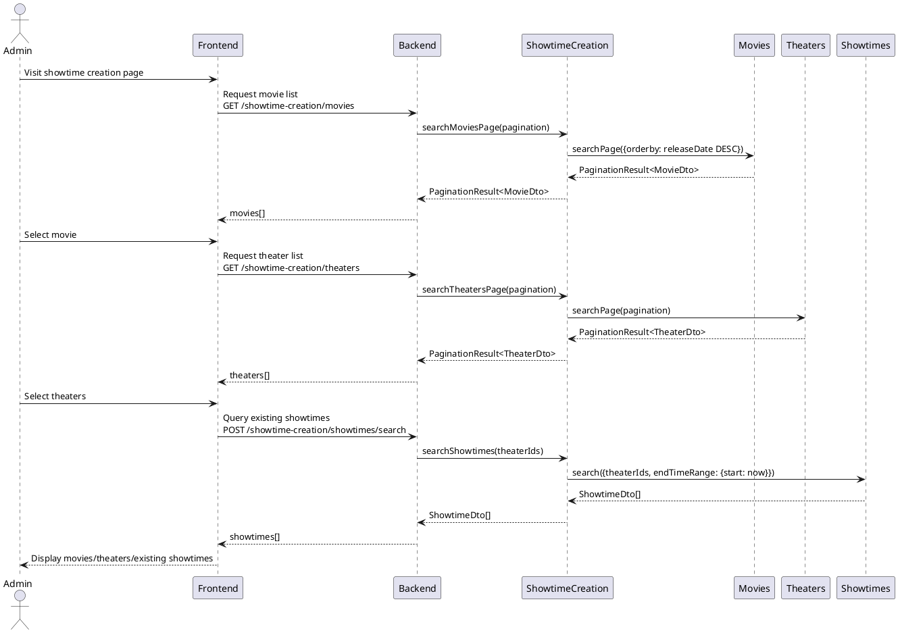
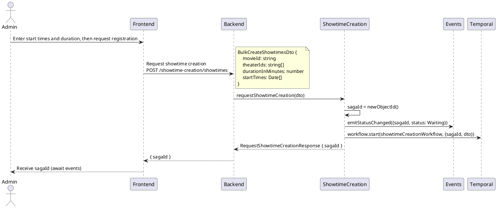
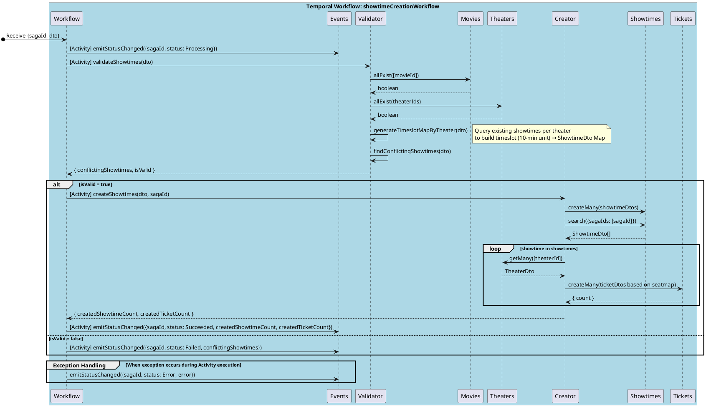

> **English** | [한국어](../../ko/designs/showtime-creation.md)

# Showtime Creation

## 1. Use Case Specification

**Goal**: Batch register showtimes for a single movie across multiple theaters

**Actor**: Administrator

**Preconditions**:

- The administrator must be logged into the system.
- The movie and theaters must be registered in the system.

**Main Flow**:

1. The system provides a list of currently registered movies.
1. The administrator selects a movie for which to register showtimes.
1. The system provides a list of currently registered theaters.
1. The administrator selects the theaters for showtime registration.
1. The administrator enters the showtime start times and duration for each theater.
1. The administrator requests registration.
1. The system immediately returns a sagaId and proceeds with validation and creation in the background.
1. If there are no conflicts with existing showtimes, the system creates showtimes and tickets, then emits a completion event.

**Alternative Flows**:

- If conflicts with existing showtimes are detected, the system emits a failure event with the list of conflicts.

**Postconditions**:

- Showtimes for the selected movie are created at each selected theater.
- For each created showtime, tickets are generated based on the theater's seatmap.

---

## 2. Sequence Diagrams

### 2.1. Screen Composition Phase

The phase where the administrator composes the showtime creation screen.



### 2.2. Creation Request Phase

The phase where the administrator enters showtime start times and duration, then requests registration. Upon receiving the request, a sagaId is generated, the Temporal workflow is started, and an immediate response is returned.



### 2.3. Background Processing Phase

The Temporal workflow (`showtimeCreationWorkflow`) performs validation and creation. Each step is executed as a Temporal Activity.



---

## 3. Showtime Conflict Detection Algorithm

### Principle

Existing showtimes are expanded into **10-minute timeslots** to build a `Map<timeslot, ShowtimeDto>`. New showtime intervals (`startTime` ~ `startTime + durationInMinutes`) are traversed in the same unit, and a conflict is detected if the timeslot exists in the Map.

### Timeslot Unit

`Rules.Showtime.timeslotInMinutes = 10` (minutes)

### Algorithm

```
timeslotsByTheater = {}

for each theaterId:
    existingShowtimes = Showtimes.search({theaterIds: [theaterId], startTimeRange: {start, end}})

    timeslots = Map<number(ms), ShowtimeDto>
    for each showtime in existingShowtimes:
        for timeslot in [showtime.startTime .. showtime.endTime] step 10m:
            timeslots.set(timeslot, showtime)

    timeslotsByTheater[theaterId] = timeslots

conflictingShowtimes = []

for each theaterId:
    timeslots = timeslotsByTheater[theaterId]
    for each startTime in dto.startTimes:
        endTime = startTime + durationInMinutes
        for timeslot in [startTime .. endTime] step 10m:
            if timeslots.has(timeslot):
                conflictingShowtimes.push(timeslots.get(timeslot))
                break
```

### Time Complexity

```
M = number of new showtimes (theaterIds × startTimes)
N = number of existing showtimes (per theater)
```

By pre-building the timeslot Map, conflict lookup becomes O(1), making the overall complexity **O(M + N)**.

A naive comparison approach (`startTime <= x <= endTime`) results in **O(M × N)** due to nested loops proportional to input size, so it was not adopted. Binary search could reduce constant factors compared to O(M + N), but the benefit was not significant enough relative to implementation complexity, so it was also not adopted.

### State Flow

```
Waiting → Processing → Succeeded
                     ↘ Failed   (conflict detected)
                     ↘ Error    (exception occurred)
```
