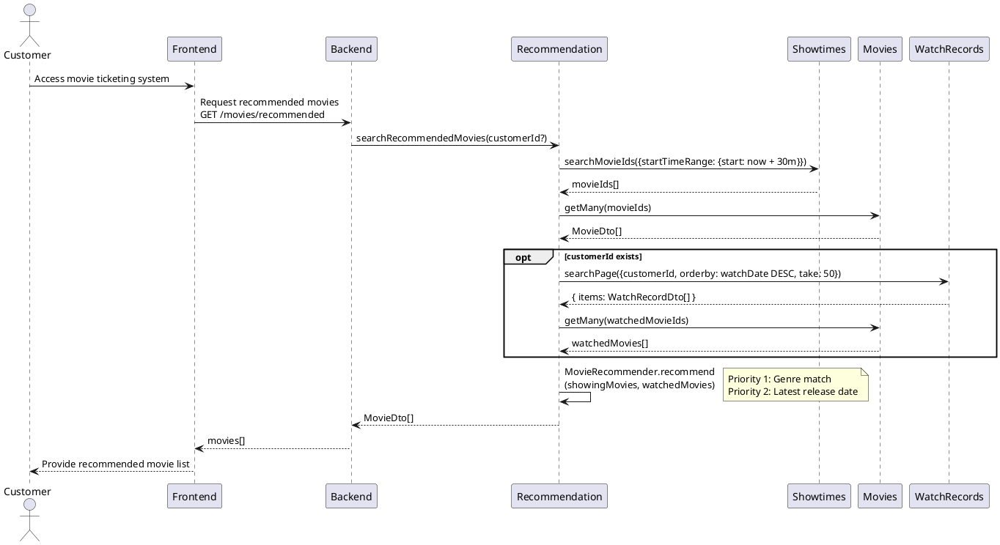
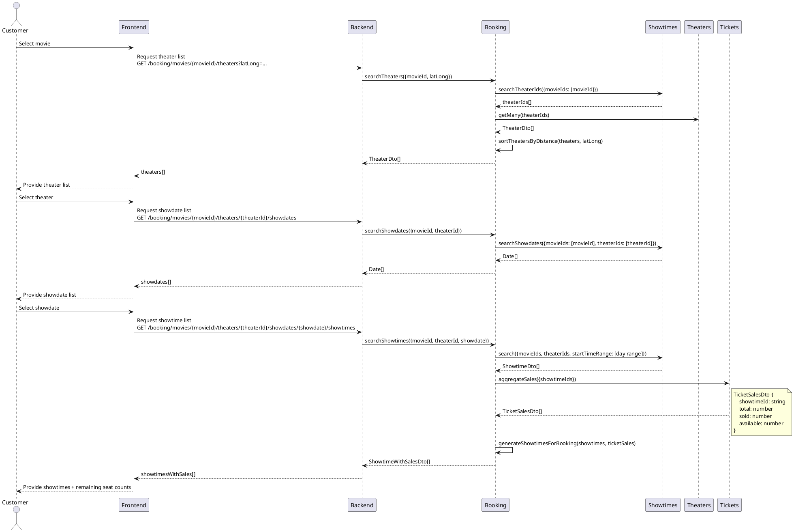
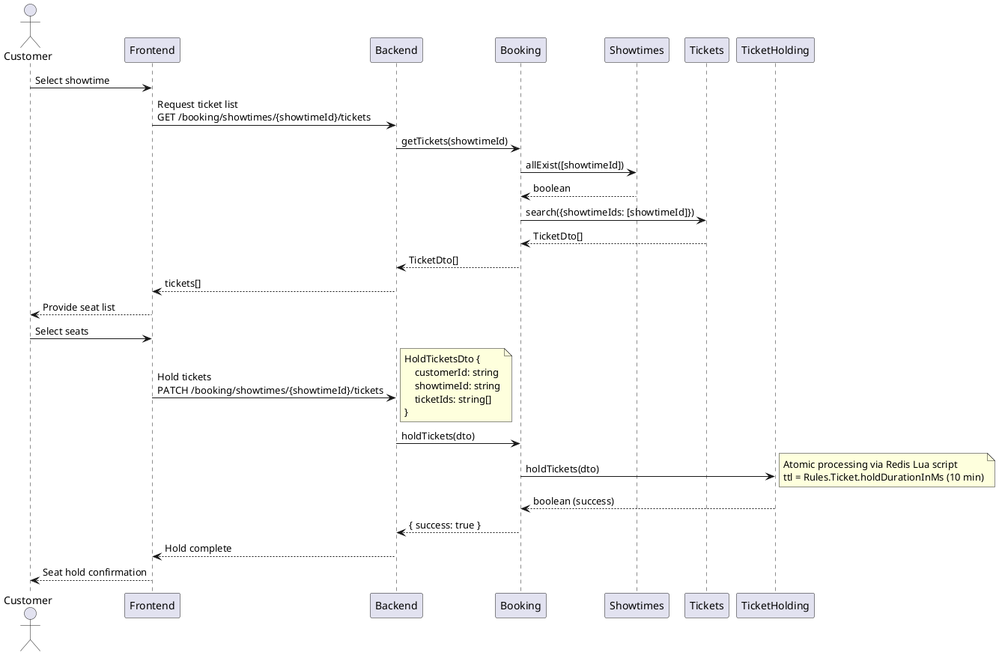
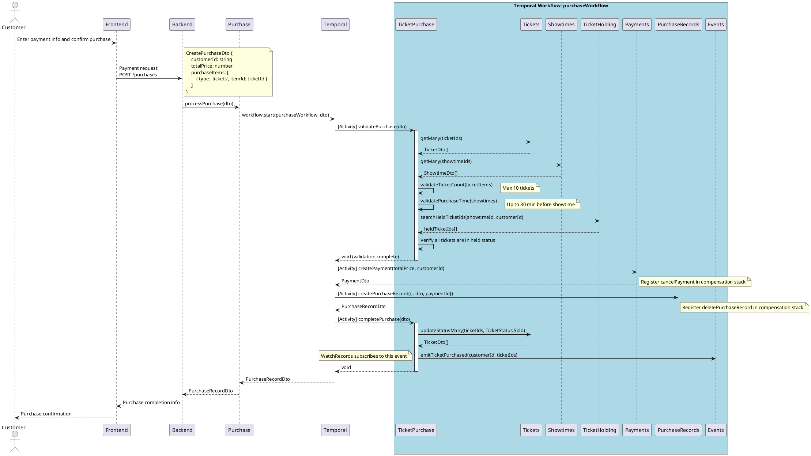
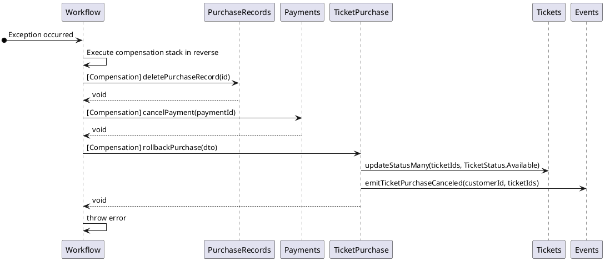

> **English** | [한국어](../../ko/designs/tickets-purchase.md)

# Tickets Purchase

## 1. Use Case Specification

**Goal**: Customer selects seats for a desired movie and purchases tickets

**Actor**: Customer

**Preconditions**:

- The customer must be logged into the system.
- The showtime and seats for the movie to purchase must be available.

**Main Flow**:

1. The system provides a list of currently showing movies sorted by recommendation.
1. The customer selects a desired movie.
1. The system provides a list of theaters showing the movie, sorted by distance.
1. The customer selects a theater.
1. The system provides a list of showdates for the selected theater.
1. The customer selects a desired showdate.
1. The system provides a list of showtimes for the selected date with remaining seat counts.
1. The customer selects a desired showtime.
1. The system provides a list of available seats.
1. The customer selects one or more seats. Selected seats are held for 10 minutes.
1. The customer enters payment information and confirms the purchase.
1. The system processes the payment and returns the completed purchase information.

**Alternative Flows**:

- If a ticket is already held: The system returns a hold failure.
- If ticket status update fails after payment processing: The system rolls back the ticket status and throws an exception.

**Business Rules**:

- A customer can purchase a maximum of 10 tickets at a time. (`Rules.Ticket.maxTicketsPerPurchase = 10`)
- Tickets can only be purchased online up to 30 minutes before showtime. (`Rules.Ticket.purchaseCutoffMinutes = 30`)
- Ticket hold duration is 10 minutes. (`Rules.Ticket.holdDurationInMs = 10m`)
- Tickets must be in held status at the time of purchase.

---

## 2. Sequence Diagrams

### 2.1. Movie Recommendation

### 2.2. Theater / Date / Showtime Selection

### 2.3. Seat Selection and Holding

### 2.4. Payment and Purchase Completion

The Temporal workflow (`purchaseWorkflow`) orchestrates the entire purchase flow. Each step executes as a Temporal Activity, and on failure, the compensation stack is executed in reverse order.

---

## 3. Rollback Handling (Temporal Compensation Stack)

When an exception occurs during workflow execution, the compensation stack is executed in reverse order.

> The compensation stack only cancels successfully completed Activities in reverse order. For example, if only `createPayment` succeeded, only `cancelPayment` is executed and `deletePurchaseRecord` is not.
